# 文件编辑、保存和读取功能设计

## 功能概述

本设计旨在为未知叙事编辑器添加完整的文件编辑、保存和读取功能,同时优化块的创建交互和支持块的并列布局。主要包括四个核心功能模块:

- 文件系统集成:通过 Electron IPC 实现文件的保存和读取
- 键盘交互优化:支持回车键创建新块和 Shift+Enter 块内换行
- 块并列布局:支持类似 Notion 的多列块布局
- 自动保存机制:提供可靠的内容持久化

## 设计目标

### 功能性目标

- 支持本地文件的打开、编辑、保存和另存为操作
- 实现回车键创建新段落块,Shift+Enter 实现块内软换行
- 支持块的水平并列排列,最多支持 3 列布局
- 提供自动保存功能,防止数据丢失
- 保持与现有 Markdown 导入导出功能的兼容性

### 用户体验目标

- 文件操作响应速度快,无明显延迟
- 键盘快捷键操作符合主流编辑器习惯
- 块布局操作简单直观,支持拖拽调整
- 自动保存不干扰用户正常编辑流程

## 核心功能设计

### 1. 文件系统集成

#### 1.1 文件操作流程

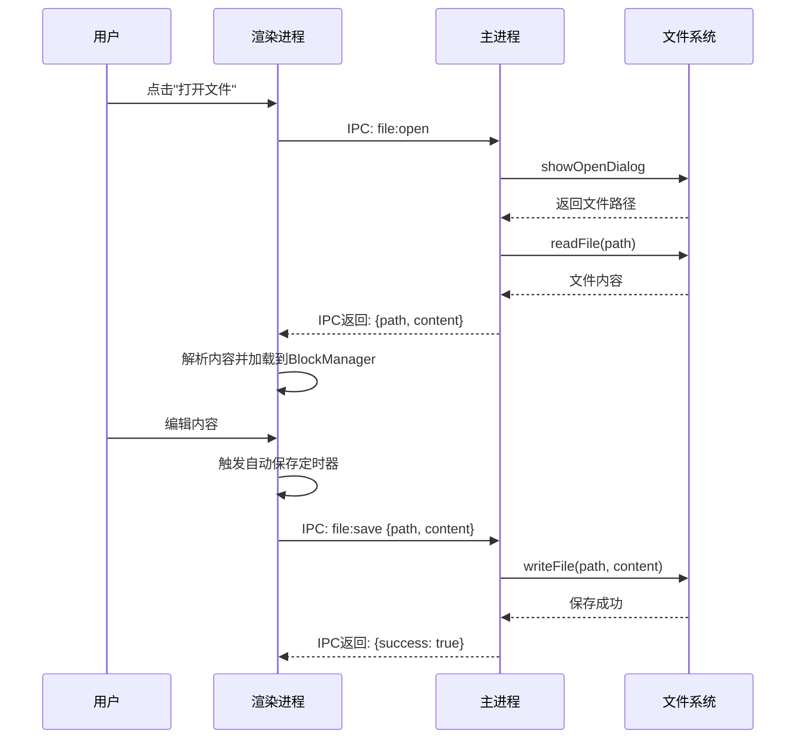

#### 1.2 文件格式支持

支持的文件格式及其处理策略:

| 文件格式 | 扩展名 | 读取策略 | 保存策略 | 优先级 |
|---------|--------|---------|---------|--------|
| Markdown | .md | 使用 BlockManager.fromMarkdown 解析 | 使用 BlockManager.toMarkdown 序列化 | 高 |
| 未知叙事专用格式 | .udn | JSON 格式存储完整块数据、布局信息和元数据 | 序列化包含块内容、布局、引用关系的完整 JSON | 高 |
| 纯文本 | .txt | 按段落创建块 | 导出纯文本内容 | 中 |
| JSON | .json | 解析块数据结构 | 导出块数据结构 | 低 |

#### 1.3 IPC 通信接口

主进程暴露的文件操作接口:

| 接口名称 | 参数 | 返回值 | 功能描述 |
|---------|------|--------|---------|
| file:open | 无 | {success, path, content, error} | 打开文件对话框并读取选中文件 |
| file:save | {path, content} | {success, error} | 保存内容到指定路径 |
| file:saveAs | {content} | {success, path, error} | 打开保存对话框并保存 |
| file:recent | 无 | {files: Array<{path, name, lastOpened}>} | 获取最近打开的文件列表 |
| file:exists | {path} | {exists: boolean} | 检查文件是否存在 |

#### 1.4 文件状态管理

文件状态模型:

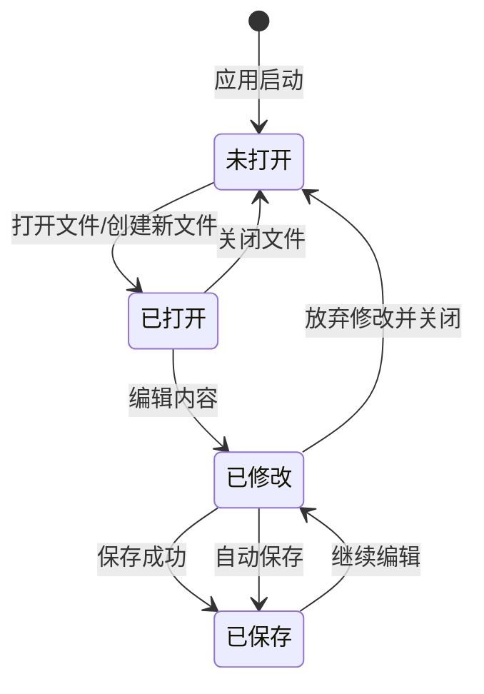

文件状态属性:

| 属性 | 类型 | 说明 |
|-----|------|------|
| currentFilePath | string 或 null | 当前打开文件的路径,null 表示未保存的新文件 |
| isModified | boolean | 是否有未保存的修改 |
| lastSavedTime | Date 或 null | 最后保存时间 |
| autoSaveEnabled | boolean | 是否启用自动保存 |
| fileFormat | 'md' 或 'udn' 或 'txt' | 当前文件格式 |

### 2. 键盘交互优化

#### 2.1 回车键创建新块

回车键行为策略:

| 场景 | 键盘输入 | 预期行为 | 说明 |
|-----|---------|---------|------|
| 编辑普通段落 | Enter | 在当前块后创建新段落块,光标移至新块 | 硬回车,分段 |
| 编辑标题块 | Enter | 在当前块后创建新段落块 | 标题后回车默认创建段落 |
| 编辑引用块 | Enter | 在当前块后创建新段落块 | 退出引用块 |
| 编辑列表项 | Enter | 创建新列表项 | 保持列表类型 |
| 空列表项 | Enter | 退出列表,创建段落块 | 两次回车退出列表 |
| 光标在块首 | Enter | 在当前块前插入空段落块 | 向上插入 |
| 光标在块中间 | Enter | 将当前块从光标处分割为两个块 | 拆分块 |

#### 2.2 Shift+Enter 软换行

软换行行为定义:

| 场景 | 键盘输入 | 预期行为 | 实现方式 |
|-----|---------|---------|---------|
| 任意块内编辑 | Shift+Enter | 在当前位置插入换行符,不创建新块 | 使用 Tiptap HardBreak 扩展 |
| 标题块内 | Shift+Enter | 插入软换行 | 允许多行标题 |
| 引用块内 | Shift+Enter | 插入软换行 | 支持多行引用 |

#### 2.3 Tiptap 键盘扩展配置

Tiptap 自定义键盘扩展策略:

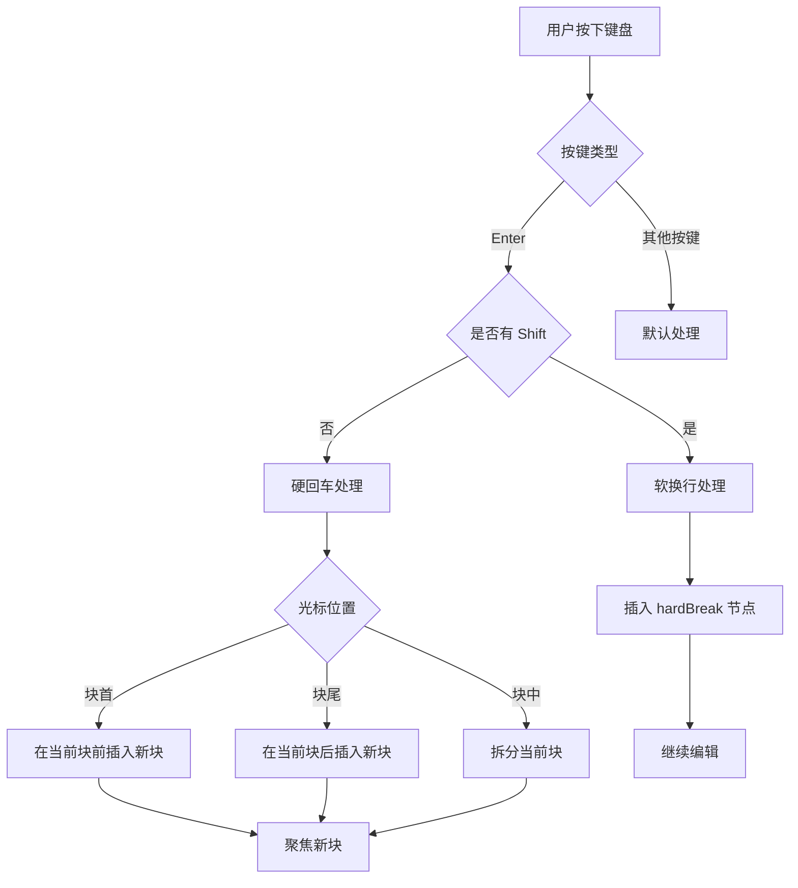

扩展功能需求:

- 拦截 Enter 键默认行为
- 检测 Shift 键是否按下
- 获取当前光标位置
- 调用渲染进程的块管理器创建新块
- 管理编辑器焦点状态

### 3. 块并列布局

#### 3.1 布局模型

块容器的布局结构:

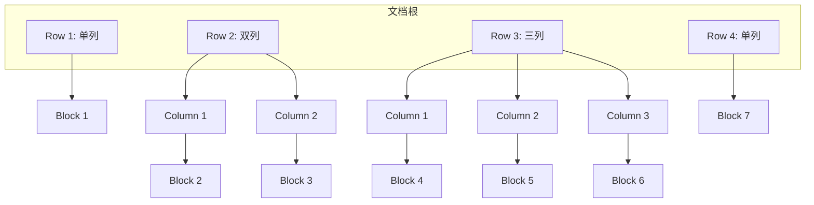

布局数据结构:

| 字段 | 类型 | 说明 |
|-----|------|------|
| id | string | 行唯一标识 |
| type | 'row' | 布局类型标记 |
| columns | Column[] | 列数组,长度 1-3 |
| columns[].width | number | 列宽度百分比,总和为 100 |
| columns[].blocks | Block[] | 该列包含的块列表 |

#### 3.2 布局操作交互

用户操作布局的方式:

| 操作 | 触发方式 | 行为描述 |
|-----|---------|---------|
| 创建并列块 | 点击块右侧"+"按钮 | 将当前块所在行转换为双列,新块置于右列 |
| 调整列宽 | 拖拽列分隔线 | 实时调整相邻两列的宽度比例 |
| 合并到单列 | 删除列中所有块 | 空列自动移除,若只剩一列则恢复为单列布局 |
| 块在列间移动 | 拖拽块到其他列 | 块移动到目标列,自动调整两列内容 |
| 添加新列 | 点击行右侧"添加列"按钮 | 在当前行末添加新列,最多支持 3 列 |

#### 3.3 布局约束规则

布局系统的限制规则:

| 约束项 | 规则 | 原因 |
|-------|------|------|
| 最大列数 | 3 列 | 保证内容可读性,避免过度拥挤 |
| 最小列宽 | 20% | 确保每列有足够空间显示内容 |
| 列宽调整步长 | 5% | 保持调整的精确性和流畅性 |
| 空列处理 | 自动移除 | 避免出现无意义的空白列 |
| 拖拽目标 | 同一行内或新行 | 简化拖拽逻辑,保持布局清晰 |

#### 3.4 响应式处理

不同屏幕尺寸下的布局适配:

| 屏幕宽度 | 布局策略 | 说明 |
|---------|---------|------|
| < 768px | 强制单列 | 移动设备或小窗口时自动堆叠 |
| 768px - 1024px | 最多 2 列 | 中等屏幕限制列数 |
| > 1024px | 最多 3 列 | 大屏幕支持完整布局 |

### 4. 自动保存机制

#### 4.1 自动保存策略

自动保存的触发条件和时机:

| 触发条件 | 延迟时间 | 行为 | 说明 |
|---------|---------|------|------|
| 内容修改后 | 3 秒 | 防抖保存 | 避免频繁保存 |
| 切换到其他应用 | 立即 | 监听窗口失焦事件 | 确保数据安全 |
| 定时保存 | 每 5 分钟 | 周期性保存 | 兜底机制 |
| 手动保存 | 立即 | 响应 Ctrl+S 快捷键 | 用户主动保存 |

#### 4.2 保存状态提示

向用户反馈保存状态的方式:

| 状态 | UI 提示 | 位置 | 说明 |
|-----|---------|------|------|
| 保存中 | "保存中..." 图标旋转 | 标题栏右侧 | 显示进度 |
| 已保存 | "所有更改已保存" + 时间戳 | 标题栏右侧 | 3 秒后淡出 |
| 保存失败 | "保存失败" 错误提示 | 顶部通知栏 | 显示重试按钮 |
| 未保存 | 文件名后显示 "*" | 标题栏 | 持续显示直到保存 |

#### 4.3 冲突处理

处理文件保存冲突的策略:

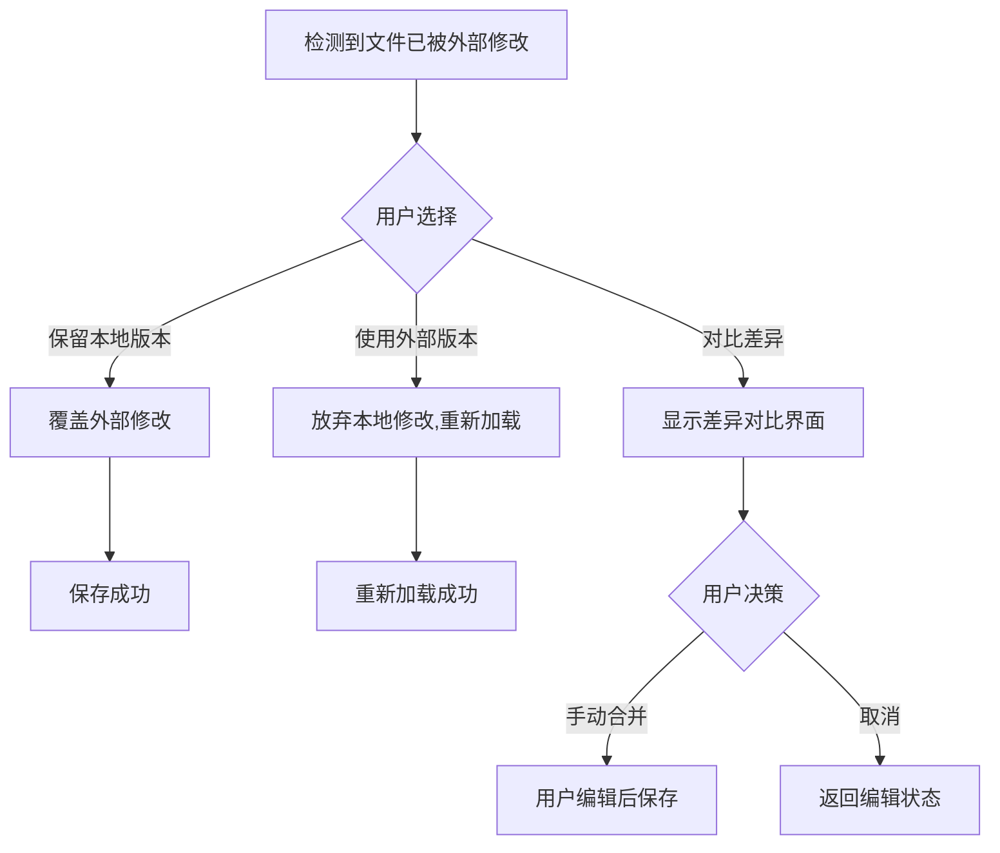

冲突检测机制:

- 在保存前检查文件的最后修改时间
- 对比内存中记录的文件时间戳
- 若不一致则触发冲突处理流程

## 数据模型扩展

### 文件元数据

扩展 Document 类型以支持文件信息:

| 字段 | 类型 | 说明 |
|-----|------|------|
| filePath | string 或 null | 文件路径 |
| fileName | string | 文件名 |
| fileFormat | 'md' 或 'udn' 或 'txt' | 文件格式 |
| lastSaved | Date 或 null | 最后保存时间 |
| isModified | boolean | 是否已修改 |

### 布局行数据

新增 LayoutRow 类型:

| 字段 | 类型 | 说明 |
|-----|------|------|
| id | string | 行唯一标识 |
| type | 'row' | 类型标记 |
| columns | LayoutColumn[] | 列数组 |

### 布局列数据

新增 LayoutColumn 类型:

| 字段 | 类型 | 说明 |
|-----|------|------|
| id | string | 列唯一标识 |
| width | number | 宽度百分比 |
| blockIds | string[] | 该列包含的块 ID 列表 |

### 块扩展属性

扩展 Block 类型:

| 字段 | 类型 | 说明 |
|-----|------|------|
| layoutRowId | string 或 undefined | 所属布局行 ID |
| layoutColumnId | string 或 undefined | 所属布局列 ID |

## 组件架构调整

### 新增组件

需要新增的 UI 组件:

| 组件名称 | 职责 | 主要属性 |
|---------|------|---------|
| FileMenu | 文件菜单,提供打开、保存、另存为等操作 | onOpen, onSave, onSaveAs, currentFile |
| SaveStatusIndicator | 显示保存状态 | status: 'saving' 或 'saved' 或 'error', lastSavedTime |
| LayoutRow | 渲染单个布局行及其列 | row: LayoutRow, onColumnResize, onAddColumn |
| ColumnDivider | 列分隔线,支持拖拽调整列宽 | onResize, minWidth, maxWidth |
| BlockLayoutControls | 块的布局操作按钮 | onCreateSibling, onMergeColumn |

### 组件层次结构

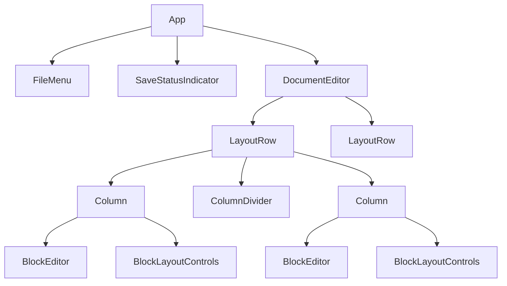

## 技术实现要点

### Electron IPC 通信

主进程需要实现的文件操作 handler:

| Handler 名称 | 功能 | 安全考虑 |
|-------------|------|---------|
| handleFileOpen | 打开文件对话框并读取文件 | 使用 dialog.showOpenDialog 限制文件类型 |
| handleFileSave | 保存文件到指定路径 | 验证路径合法性,防止路径遍历攻击 |
| handleFileSaveAs | 显示保存对话框并保存 | 使用 dialog.showSaveDialog |
| handleGetRecentFiles | 获取最近文件列表 | 从配置文件读取,限制返回数量 |

渲染进程通过 preload 脚本暴露的安全接口:

- 所有文件操作必须通过 IPC 调用主进程
- 不直接暴露 Node.js 的 fs 模块
- 文件路径由主进程的对话框返回,避免注入风险

### Tiptap 扩展开发

自定义键盘处理扩展的实现要点:

| 功能点 | 实现方式 |
|-------|---------|
| Enter 键拦截 | 使用 addKeyboardShortcuts 方法注册 Enter 处理函数 |
| Shift+Enter 处理 | 检测 event.shiftKey,返回 editor.commands.setHardBreak() |
| 块拆分逻辑 | 获取光标位置,提取光标前后内容,创建两个新块,删除原块 |
| 新块聚焦 | 通过回调通知 React 组件,组件设置 editingBlockId 并调用 editor.commands.focus() |

### 布局状态管理

布局数据的管理策略:

- BlockManager 扩展:新增 layoutRows 属性存储布局结构
- 布局操作方法:addRow, addColumn, removeColumn, resizeColumn, moveBlockToColumn
- 序列化:在保存为 .udn 格式时包含完整布局信息
- Markdown 导出:忽略布局信息,按块顺序线性导出

布局与块的关系维护:

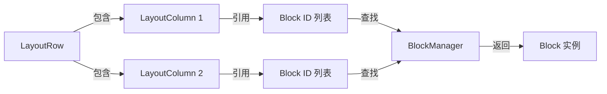

### 自动保存实现

自动保存的防抖和节流策略:

| 策略 | 应用场景 | 参数 |
|-----|---------|------|
| 防抖 | 内容修改后自动保存 | 延迟 3 秒,若期间有新修改则重置计时器 |
| 节流 | 定期保存 | 每 5 分钟执行一次,无论是否有修改 |
| 立即执行 | 窗口失焦、应用退出 | 无延迟,立即保存 |

保存队列管理:

- 维护一个保存任务队列,避免并发保存冲突
- 同一文件的保存请求合并,只保留最新的内容
- 保存失败时加入重试队列,最多重试 3 次

## 用户交互流程

### 打开文件流程

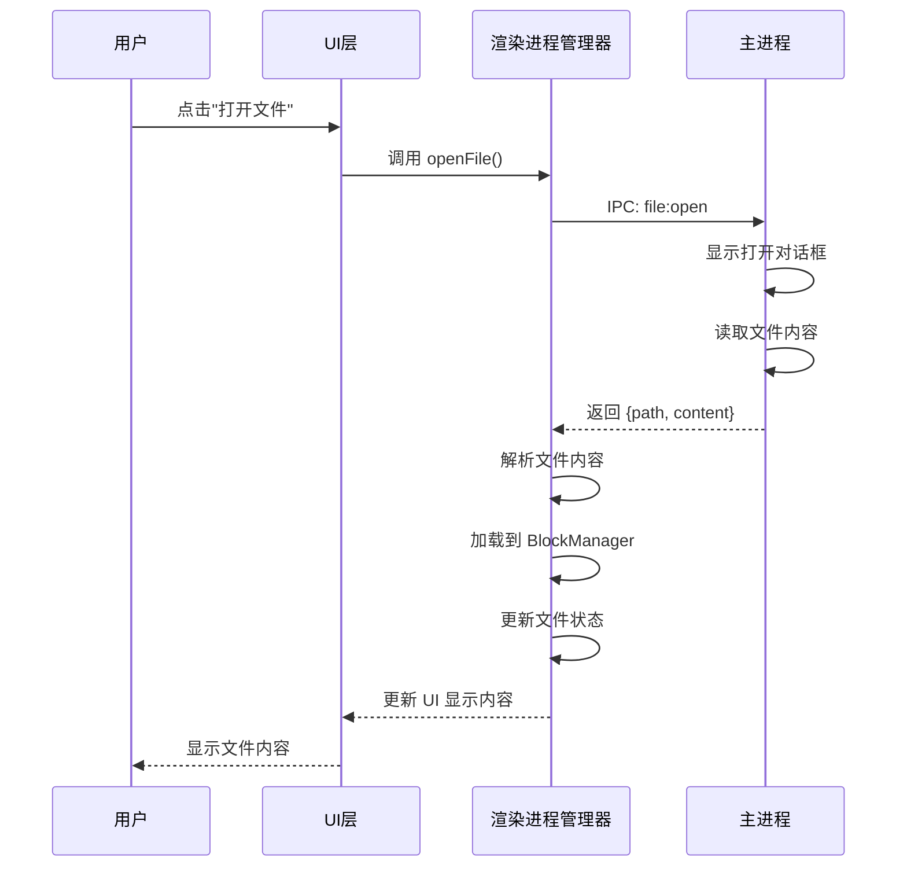

### 编辑并自动保存流程

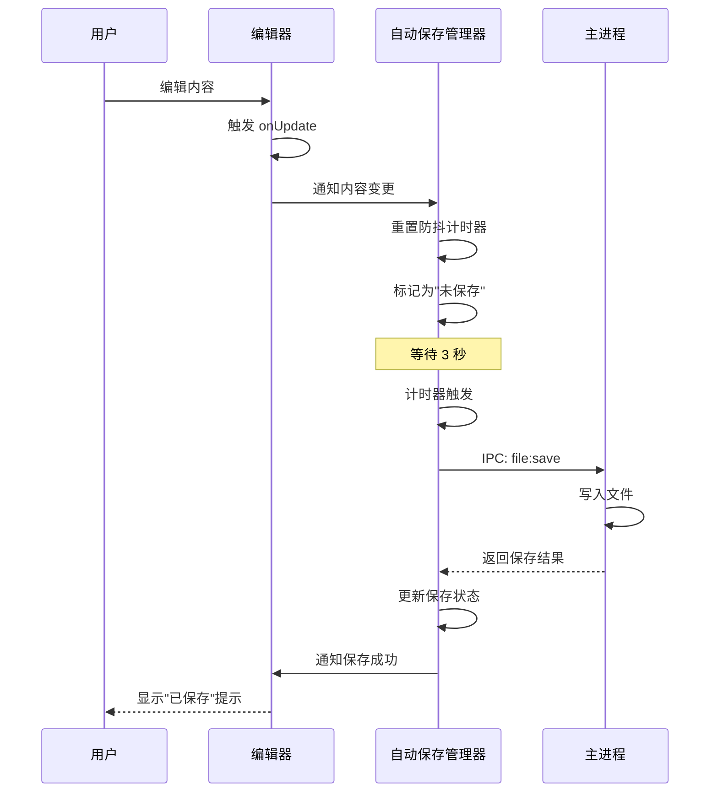

### 创建并列块流程

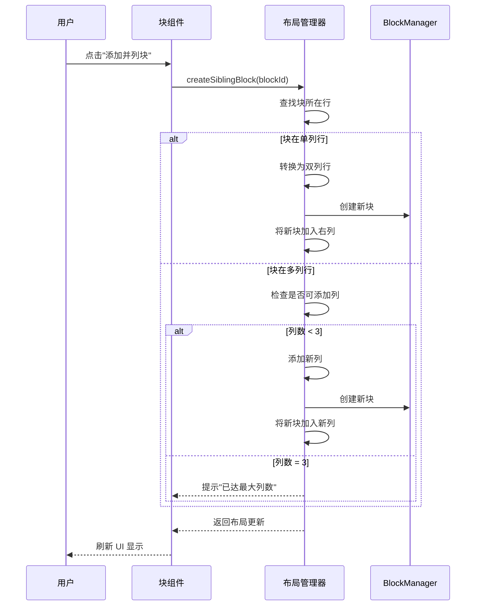

## 异常处理

### 文件操作异常

文件操作可能出现的异常及处理方式:

| 异常类型 | 触发条件 | 处理策略 |
|---------|---------|---------|
| 文件不存在 | 打开已删除的最近文件 | 提示用户文件已删除,从最近列表移除 |
| 权限不足 | 无读写权限的文件 | 提示用户权限错误,建议选择其他位置 |
| 磁盘空间不足 | 保存大文件时 | 提示用户清理磁盘空间,取消保存操作 |
| 文件被占用 | 其他程序锁定文件 | 提示用户关闭其他程序,提供重试选项 |
| 路径过长 | Windows 系统路径超过限制 | 提示用户选择较短路径 |

### 内容解析异常

解析文件内容时的异常处理:

| 异常类型 | 触发条件 | 处理策略 |
|---------|---------|---------|
| JSON 格式错误 | .udn 或 .json 文件格式不正确 | 提示用户文件损坏,询问是否尝试恢复或放弃 |
| 编码错误 | 非 UTF-8 编码文件 | 尝试自动检测编码,若失败则提示用户选择编码 |
| 不支持的块类型 | 文件包含未知块类型 | 降级为 paragraph 类型,记录警告日志 |
| 布局数据损坏 | 列宽总和不为 100%,块引用丢失 | 自动修复布局,若无法修复则恢复为单列 |

### 自动保存异常

自动保存失败的处理:

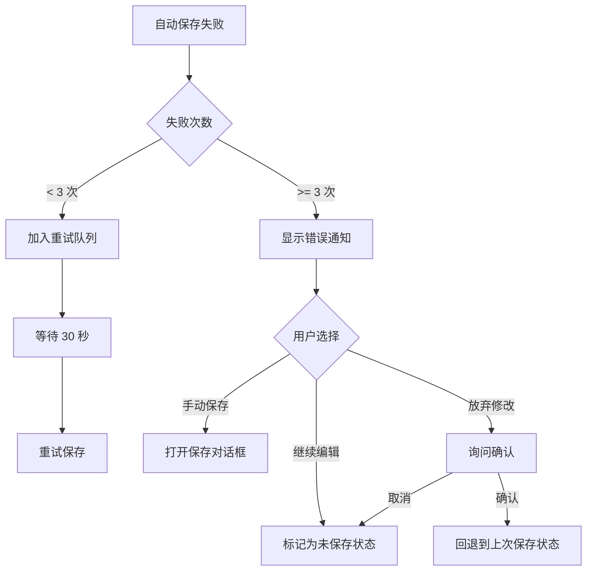

## 配置选项

用户可配置的功能选项:

| 配置项 | 类型 | 默认值 | 说明 |
|-------|------|--------|------|
| autoSaveEnabled | boolean | true | 是否启用自动保存 |
| autoSaveDelay | number | 3000 | 自动保存延迟时间(毫秒) |
| periodicSaveInterval | number | 300000 | 定期保存间隔(毫秒,5分钟) |
| maxRecentFiles | number | 10 | 最近文件列表最大数量 |
| defaultFileFormat | 'md' 或 'udn' | 'udn' | 新建文件默认格式 |
| enableLayoutFeature | boolean | true | 是否启用块并列布局 |
| maxColumns | number | 3 | 最大列数 |
| minColumnWidth | number | 20 | 最小列宽百分比 |
| confirmBeforeQuit | boolean | true | 退出前确认未保存修改 |

配置数据存储位置:

- 使用 Electron 的 app.getPath('userData') 获取配置目录
- 配置文件名: config.json
- 使用 JSON 格式存储
- 应用启动时加载,修改后立即保存

## 性能优化

### 大文件处理

针对大文件的优化策略:

| 优化点 | 策略 | 目标 |
|-------|------|------|
| 文件读取 | 流式读取,分块解析 | 避免一次性加载到内存 |
| 渲染优化 | 虚拟滚动,仅渲染可见块 | 减少 DOM 节点数量 |
| 保存优化 | 仅保存变更的块,不重写整个文件 | 减少 I/O 操作 |
| 布局计算 | 缓存布局计算结果,仅在变更时重算 | 避免重复计算 |

性能指标:

- 打开 1000 块的文件耗时 < 2 秒
- 保存 1000 块的文件耗时 < 1 秒
- 编辑操作响应时间 < 100 毫秒
- 自动保存不阻塞 UI 交互

### 内存管理

内存优化措施:

- 使用 WeakMap 存储临时数据,自动垃圾回收
- 限制撤销历史栈深度为 50 步
- 大文件时禁用实时 Markdown 预览
- 定期清理未使用的块引用

## 测试策略

### 单元测试

需要测试的核心模块:

| 模块 | 测试重点 |
|-----|---------|
| 文件操作服务 | 测试打开、保存、另存为、最近文件等功能 |
| 布局管理器 | 测试行列增删改、块移动、宽度调整等逻辑 |
| 自动保存管理器 | 测试防抖、节流、重试机制 |
| 键盘扩展 | 测试 Enter 和 Shift+Enter 行为 |

### 集成测试

端到端测试场景:

| 测试场景 | 验证点 |
|---------|--------|
| 打开文件并编辑 | 文件内容正确加载,编辑后自动保存 |
| 创建并列布局 | 布局结构正确,拖拽调整列宽生效 |
| 回车创建新块 | 在正确位置创建新块,光标正确移动 |
| 保存冲突处理 | 检测到外部修改时弹出冲突对话框 |
| 应用退出 | 未保存修改时提示用户 |

### 性能测试

性能基准测试:

| 测试项 | 数据规模 | 期望指标 |
|-------|---------|---------|
| 文件加载时间 | 1000 块 | < 2 秒 |
| 保存时间 | 1000 块 | < 1 秒 |
| 布局渲染时间 | 100 个 3 列行 | < 500 毫秒 |
| 内存占用 | 10000 块 | < 500 MB |

## 向后兼容性

与现有功能的兼容性保证:

| 现有功能 | 兼容策略 |
|---------|---------|
| Markdown 导入导出 | 保留现有实现,布局信息在导出时忽略 |
| 块的拖拽排序 | 扩展为支持跨列拖拽 |
| 块类型支持 | 所有现有块类型在布局中均可用 |
| 双链功能 | 布局不影响块引用关系 |

迁移策略:

- 旧版 .md 文件打开后自动转换为单列布局
- 提供"导出为旧版格式"选项,仅保存块内容
- 配置文件版本化,支持自动升级

## 未来扩展

后续可能的功能增强:

| 扩展功能 | 说明 | 优先级 |
|---------|------|--------|
| 云端同步 | 支持多设备同步 | 高 |
| 协同编辑 | 多人实时编辑 | 中 |
| 版本历史 | 文件版本管理和回滚 | 中 |
| 模板系统 | 预设布局模板 | 低 |
| 自定义列宽预设 | 快速应用常用列宽比例 | 低 |
| 块嵌套 | 支持块内嵌套子块 | 低 |
