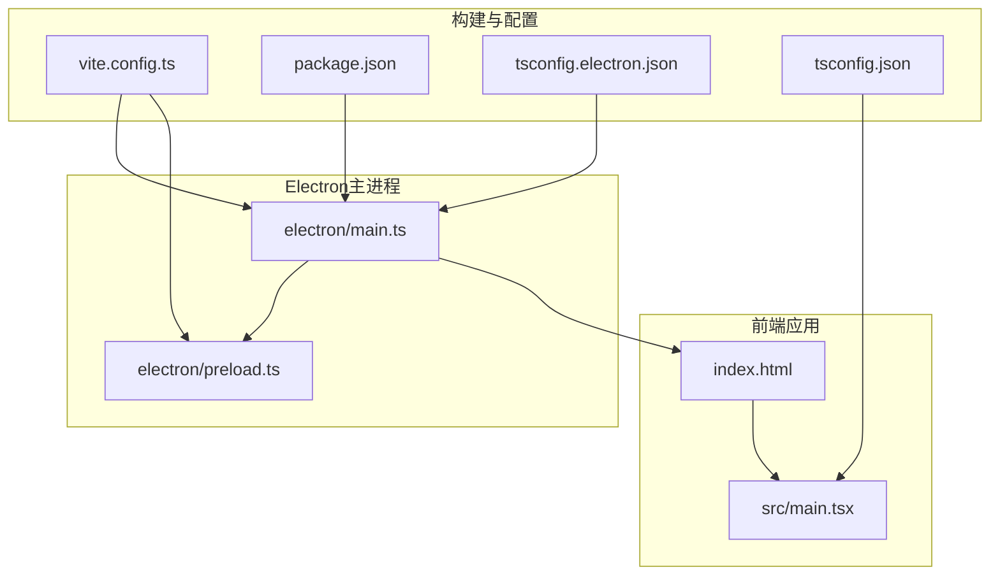
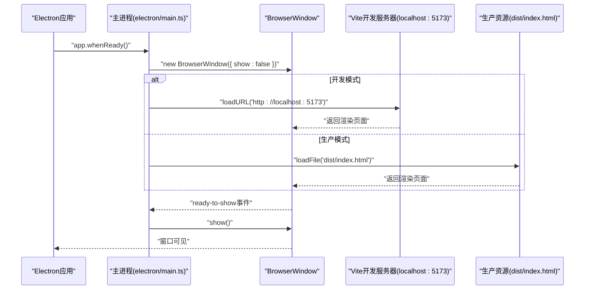
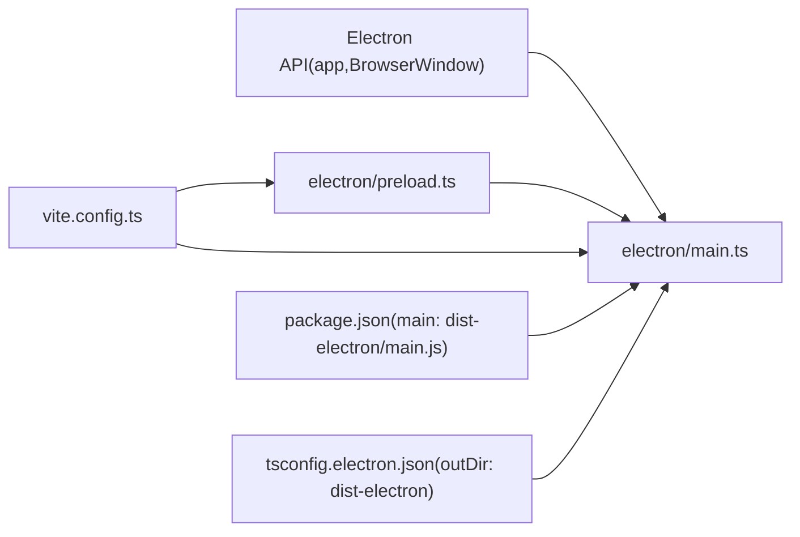

# Electron窗口不显示问题

<cite>
**本文引用的文件**
- [electron/main.ts](file://electron/main.ts)
- [electron/preload.ts](file://electron/preload.ts)
- [vite.config.ts](file://vite.config.ts)
- [package.json](file://package.json)
- [index.html](file://index.html)
- [src/main.tsx](file://src/main.tsx)
- [electron/main.test.js](file://electron/main.test.js)
- [tsconfig.electron.json](file://tsconfig.electron.json)
- [tsconfig.json](file://tsconfig.json)
- [README.md](file://README.md)
</cite>

## 目录
1. [简介](#简介)
2. [项目结构](#项目结构)
3. [核心组件](#核心组件)
4. [架构总览](#架构总览)
5. [详细组件分析](#详细组件分析)
6. [依赖关系分析](#依赖关系分析)
7. [性能考量](#性能考量)
8. [故障排查指南](#故障排查指南)
9. [结论](#结论)
10. [附录](#附录)

## 简介
本文件聚焦于排查Electron主窗口无法显示的问题，围绕以下关键点展开：
- 检查主进程BrowserWindow配置中的show: false与ready-to-show事件的配合是否正确
- 验证preload脚本路径是否指向编译后的JS文件
- 校验开发环境（localhost:5173）与生产环境（dist/index.html）加载URL是否正确
- 提供主进程异常退出的排查方法（在app.whenReady()前后添加日志）
- 指导开发者检查Vite开发服务器状态，确保Electron能成功连接
- 提供调试方案：在createWindow函数中添加console.log、使用DevTools查看渲染进程错误、检查主进程中未捕获异常

## 项目结构
该项目采用“前端React + Electron主进程 + Vite构建”的典型架构。主进程位于electron目录，预加载脚本也位于该目录；前端应用位于src目录；Vite配置定义了主进程与预加载脚本的打包位置以及开发服务器端口。

图表来源
- [electron/main.ts](file://electron/main.ts#L1-L68)
- [electron/preload.ts](file://electron/preload.ts#L1-L21)
- [vite.config.ts](file://vite.config.ts#L1-L61)
- [package.json](file://package.json#L1-L69)
- [index.html](file://index.html#L1-L13)
- [src/main.tsx](file://src/main.tsx#L1-L10)
- [tsconfig.electron.json](file://tsconfig.electron.json#L1-L21)
- [tsconfig.json](file://tsconfig.json#L1-L37)

章节来源
- [README.md](file://README.md#L56-L75)
- [vite.config.ts](file://vite.config.ts#L1-L61)
- [package.json](file://package.json#L1-L20)

## 核心组件
- 主进程入口：负责创建BrowserWindow、加载开发或生产资源、处理窗口生命周期事件
- 预加载脚本：通过contextBridge向渲染进程暴露受控API
- Vite配置：定义主进程与预加载脚本的打包输出目录、开发服务器端口等
- 前端入口：React应用挂载到index.html的root节点

章节来源
- [electron/main.ts](file://electron/main.ts#L1-L68)
- [electron/preload.ts](file://electron/preload.ts#L1-L21)
- [vite.config.ts](file://vite.config.ts#L1-L61)
- [index.html](file://index.html#L1-L13)
- [src/main.tsx](file://src/main.tsx#L1-L10)

## 架构总览
下图展示了从应用启动到窗口显示的关键流程，包括开发与生产两种加载路径。

图表来源
- [electron/main.ts](file://electron/main.ts#L1-L68)
- [vite.config.ts](file://vite.config.ts#L57-L61)
- [index.html](file://index.html#L1-L13)

## 详细组件分析

### 主进程窗口创建与加载逻辑
- 关键参数
  - show: false用于避免视觉闪烁，配合ready-to-show事件在内容就绪后再显示
  - webPreferences中禁用nodeIntegration、启用contextIsolation，并指定preload脚本路径
  - titleBarStyle设置为默认风格
- 开发与生产加载策略
  - 开发：加载http://localhost:5173
  - 生产：加载dist/index.html
- 生命周期事件
  - ready-to-show：显示窗口
  - closed：窗口关闭时的清理
  - window-all-closed：macOS平台保留活动状态，其他平台退出
  - web-contents-created：拦截新窗口打开，统一走外部浏览器

章节来源
- [electron/main.ts](file://electron/main.ts#L1-L68)

### 预加载脚本与安全桥接
- 使用contextBridge.exposeInMainWorld暴露受控API给渲染进程
- 类型声明确保在TypeScript环境下有良好体验
- 未暴露完整ipcRenderer对象，遵循最小权限原则

章节来源
- [electron/preload.ts](file://electron/preload.ts#L1-L21)

### Vite构建与开发服务器配置
- 主进程与预加载脚本打包输出至dist-electron
- 前端应用打包输出至dist
- 开发服务器端口固定为5173，严格端口模式
- 主进程入口为electron/main.ts，预加载入口为electron/preload.ts

章节来源
- [vite.config.ts](file://vite.config.ts#L1-L61)

### 前端入口与模板
- index.html包含挂载点root与入口脚本
- src/main.tsx负责将React应用挂载到root节点

章节来源
- [index.html](file://index.html#L1-L13)
- [src/main.tsx](file://src/main.tsx#L1-L10)

### TypeScript配置要点
- tsconfig.electron.json针对主进程使用CommonJS模块解析，输出到dist-electron
- tsconfig.json为前端应用配置，包含路径映射与严格模式

章节来源
- [tsconfig.electron.json](file://tsconfig.electron.json#L1-L21)
- [tsconfig.json](file://tsconfig.json#L1-L37)

## 依赖关系分析
- 主进程依赖Electron API（app、BrowserWindow、Menu、shell）
- 主进程依赖预加载脚本提供的安全桥接API
- Vite插件将主进程与预加载脚本分别打包，避免将electron作为外部依赖打入最终产物
- package.json定义主进程入口为dist-electron/main.js，与tsconfig.electron.json的输出一致

图表来源
- [electron/main.ts](file://electron/main.ts#L1-L68)
- [electron/preload.ts](file://electron/preload.ts#L1-L21)
- [vite.config.ts](file://vite.config.ts#L1-L61)
- [package.json](file://package.json#L1-L20)
- [tsconfig.electron.json](file://tsconfig.electron.json#L1-L21)

章节来源
- [package.json](file://package.json#L1-L20)
- [vite.config.ts](file://vite.config.ts#L1-L61)

## 性能考量
- 使用show: false与ready-to-show可以避免白屏或闪烁，提升用户体验
- 在开发模式下，Vite热更新与Electron主进程联动，减少重启成本
- 预加载脚本尽量保持轻量，避免阻塞主窗口显示

## 故障排查指南

### 一、确认show: false与ready-to-show的配合
- 现状：主进程已设置show: false并在ready-to-show事件中调用show()
- 排查要点
  - 确认ready-to-show事件确实触发（可在事件回调中添加日志）
  - 若事件未触发，检查渲染进程是否抛出未捕获异常导致页面未完成初始化
  - 确保开发或生产URL加载成功，避免因加载失败而无法进入ready-to-show

章节来源
- [electron/main.ts](file://electron/main.ts#L1-L68)

### 二、校验preload.js路径是否正确生成
- 现状：主进程通过join(__dirname, 'preload.js')加载预加载脚本
- 排查要点
  - 确认tsconfig.electron.json的outDir为dist-electron，且主进程入口main.js位于dist-electron目录
  - 运行构建后，dist-electron内应存在preload.js（由tsconfig.electron.json与vite配置共同决定）
  - 若路径不匹配，需调整主进程preload路径或修改打包输出目录

章节来源
- [electron/main.ts](file://electron/main.ts#L1-L68)
- [tsconfig.electron.json](file://tsconfig.electron.json#L1-L21)
- [vite.config.ts](file://vite.config.ts#L1-L61)

### 三、校验开发与生产加载URL
- 开发环境
  - 主进程加载http://localhost:5173
  - vite.config.ts server.port为5173，strictPort为true
  - 排查：确保Vite开发服务器已启动且端口未被占用
- 生产环境
  - 主进程加载dist/index.html
  - index.html中入口脚本为/src/main.tsx
  - 排查：构建后dist/index.html是否存在，且静态资源路径正确（vite.config.ts base为./）

章节来源
- [electron/main.ts](file://electron/main.ts#L1-L68)
- [vite.config.ts](file://vite.config.ts#L1-L61)
- [index.html](file://index.html#L1-L13)

### 四、主进程异常退出排查
- 建议在app.whenReady()前后添加日志输出，定位异常发生阶段
- 常见原因
  - 未捕获异常导致进程退出
  - 预加载脚本或渲染进程抛错，阻止ready-to-show触发
  - 开发服务器未启动导致loadURL失败
- 参考测试用例思路：electron/main.test.js展示了如何在whenReady后创建窗口并打开DevTools，便于快速定位问题

章节来源
- [electron/main.ts](file://electron/main.ts#L1-L68)
- [electron/main.test.js](file://electron/main.test.js#L1-L38)

### 五、调试方案
- 在createWindow函数中添加console.log，记录每个步骤（创建窗口、加载URL、打开DevTools、ready-to-show）
- 使用Electron内置DevTools查看渲染进程错误
- 检查主进程中是否存在未捕获的异常（如网络请求、文件读取、路径拼接等）
- 在开发模式下，先确认Vite开发服务器正常运行，再启动Electron

章节来源
- [electron/main.ts](file://electron/main.ts#L1-L68)
- [vite.config.ts](file://vite.config.ts#L57-L61)

## 结论
主窗口无法显示通常由以下因素导致：
- show: false与ready-to-show未正确配合
- preload.js路径与实际打包产物不一致
- 开发或生产加载URL错误
- 未捕获异常导致进程提前退出

通过在关键节点添加日志、使用DevTools、核对打包输出与加载路径，可快速定位并解决问题。

## 附录

### A. 关键配置与路径对照
- 主进程入口：dist-electron/main.js（由package.json main字段与tsconfig.electron.json outDir共同决定）
- 预加载脚本：dist-electron/preload.js（由tsconfig.electron.json与vite配置共同决定）
- 开发加载：http://localhost:5173（由vite.config.ts server.port与main.ts条件判断决定）
- 生产加载：dist/index.html（由main.ts条件判断与index.html入口脚本决定）

章节来源
- [package.json](file://package.json#L1-L20)
- [tsconfig.electron.json](file://tsconfig.electron.json#L1-L21)
- [vite.config.ts](file://vite.config.ts#L1-L61)
- [electron/main.ts](file://electron/main.ts#L1-L68)
- [index.html](file://index.html#L1-L13)