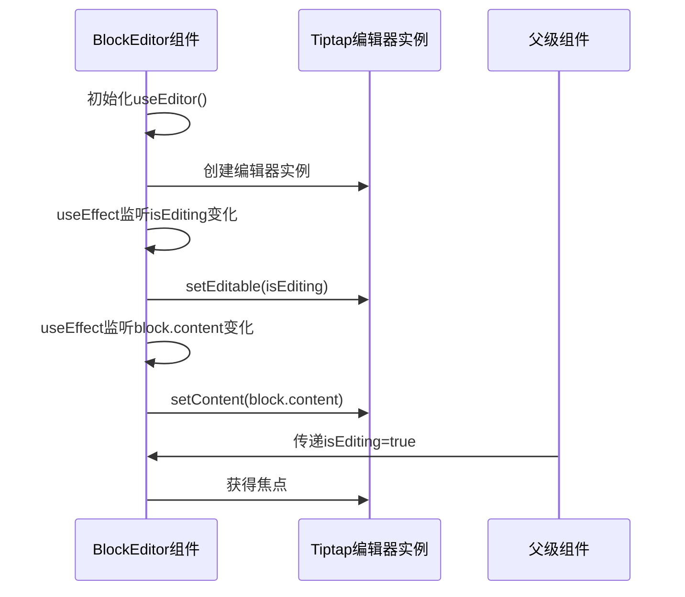
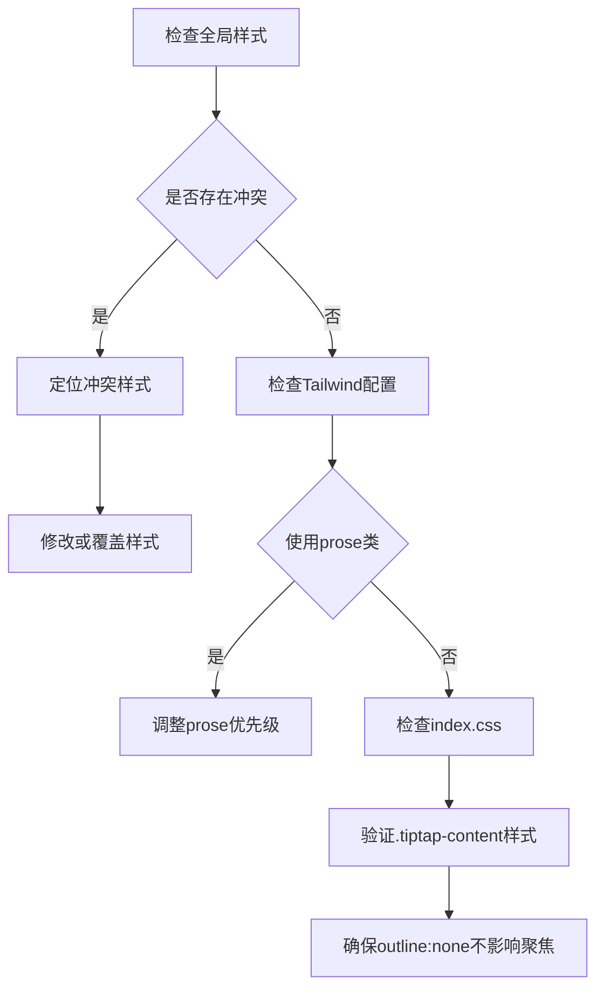

# Tiptap编辑器不响应问题

<cite>
**本文档引用文件**  
- [BlockEditor.tsx](file://src/components/BlockEditor.tsx)
- [preload.ts](file://electron/preload.ts)
- [vite.config.ts](file://vite.config.ts)
- [tailwind.config.js](file://tailwind.config.js)
- [index.css](file://src/index.css)
- [App.tsx](file://src/App.tsx)
- [BlockList.tsx](file://src/components/BlockList.tsx)
- [useBlockManager.ts](file://src/hooks/useBlockManager.ts)
- [BlockManager.ts](file://src/utils/BlockManager.ts)
- [MarkdownRenderer.tsx](file://src/components/MarkdownRenderer.tsx)
- [block.ts](file://src/types/block.ts)
</cite>

## 目录
1. [问题概述](#问题概述)
2. [Tiptap初始化配置分析](#tiptap初始化配置分析)
3. [React组件生命周期问题排查](#react组件生命周期问题排查)
4. [CSS样式冲突分析](#css样式冲突分析)
5. [Electron安全策略检查](#electron安全策略检查)
6. [最小化复现步骤](#最小化复现步骤)
7. [综合解决方案](#综合解决方案)

## 问题概述
Tiptap编辑器在项目中出现无响应或无法聚焦的问题，影响用户编辑体验。该问题可能由多个因素导致，包括编辑器初始化配置错误、React组件生命周期管理不当、CSS样式冲突、Electron安全策略限制等。本文档系统性分析各潜在原因并提供解决方案。

## Tiptap初始化配置分析
检查`BlockEditor.tsx`中Tiptap编辑器实例的初始化配置，确认所有扩展正确注册且无语法错误。

**Section sources**
- [BlockEditor.tsx](file://src/components/BlockEditor.tsx#L29-L63)

## React组件生命周期问题排查
分析`BlockEditor`组件的生命周期管理，确保编辑器在DOM挂载后正确初始化，避免因状态更新导致重复创建。



**Diagram sources**
- [BlockEditor.tsx](file://src/components/BlockEditor.tsx#L66-L77)
- [BlockList.tsx](file://src/components/BlockList.tsx#L89-L90)

**Section sources**
- [BlockEditor.tsx](file://src/components/BlockEditor.tsx#L66-L77)
- [BlockList.tsx](file://src/components/BlockList.tsx#L18-L24)

## CSS样式冲突分析
检查CSS样式对Tiptap编辑区域的影响，特别是Tailwind的prose类或全局样式可能导致的冲突。



**Diagram sources**
- [index.css](file://src/index.css#L6-L10)
- [tailwind.config.js](file://tailwind.config.js#L3-L6)

**Section sources**
- [index.css](file://src/index.css#L6-L111)
- [tailwind.config.js](file://tailwind.config.js#L3-L6)

## Electron安全策略检查
检查Electron安全策略，确认preload.ts是否正确暴露了必要的API，vite.config.ts中alias配置是否影响模块解析。

```mermaid
graph TB
A[Electron主进程] --> B[preload.ts]
B --> C{暴露API}
C --> D[contextBridge.exposeInMainWorld]
D --> E[electronAPI对象]
E --> F[空API接口]
G[vite.config.ts] --> H[alias配置]
H --> I[@别名映射]
I --> J[src目录映射]
K[安全策略] --> L[contextIsolation:true]
L --> M[防止原型污染]
M --> N[隔离渲染器与Node]
```

**Diagram sources**
- [preload.ts](file://electron/preload.ts#L5-L10)
- [vite.config.ts](file://vite.config.ts#L47-L55)
- [main.js](file://main.js#L15-L16)

**Section sources**
- [preload.ts](file://electron/preload.ts#L1-L21)
- [vite.config.ts](file://vite.config.ts#L46-L55)
- [main.js](file://main.js#L13-L17)

## 最小化复现步骤
提供最小化复现步骤，创建独立测试组件验证Tiptap基础功能，逐步添加项目特定配置以定位冲突点。


**Diagram sources**
- [BlockEditor.tsx](file://src/components/BlockEditor.tsx#L29-L63)
- [App.tsx](file://src/App.tsx#L47-L55)

## 综合解决方案
综合各项检查结果，提出系统性解决方案。

### 初始化配置修复
确保所有Tiptap扩展正确配置，移除无效配置项。在`BlockEditor.tsx`中，`DragHandle`扩展的配置包含注释说明已移除不存在的`dragHandleWidth`配置。

### 生命周期优化
通过`useEffect`正确管理编辑器状态更新，确保`editor`实例存在时才调用相关方法，避免空引用错误。

### 样式冲突解决
在`index.css`中，`.tiptap-content`类已设置`outline: none`，这可能影响视觉聚焦反馈，但不应阻止实际聚焦。建议添加`:focus-visible`样式以提供更好的可访问性反馈。

### Electron集成修正
当前`preload.ts`未暴露任何实际API，仅为模板结构。若需要在渲染器中使用Electron API，应通过`contextBridge`安全暴露必要方法。

### 推荐调试步骤
1. 使用浏览器开发者工具检查编辑区域元素
2. 验证`EditorContent`组件是否正确接收`editor`实例
3. 检查控制台是否有JavaScript错误
4. 确认`isEditing`状态正确传递
5. 验证`onBlur`事件处理器是否正常工作

**Section sources**
- [BlockEditor.tsx](file://src/components/BlockEditor.tsx#L1-L115)
- [index.css](file://src/index.css#L6-L111)
- [preload.ts](file://electron/preload.ts#L1-L21)