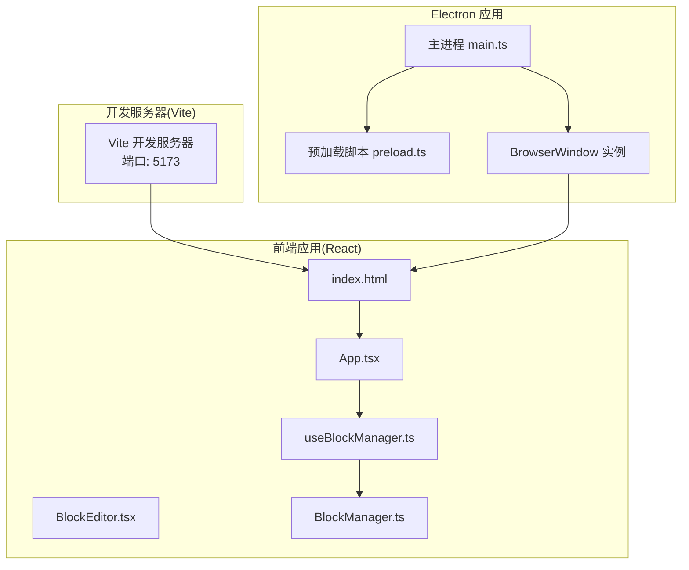
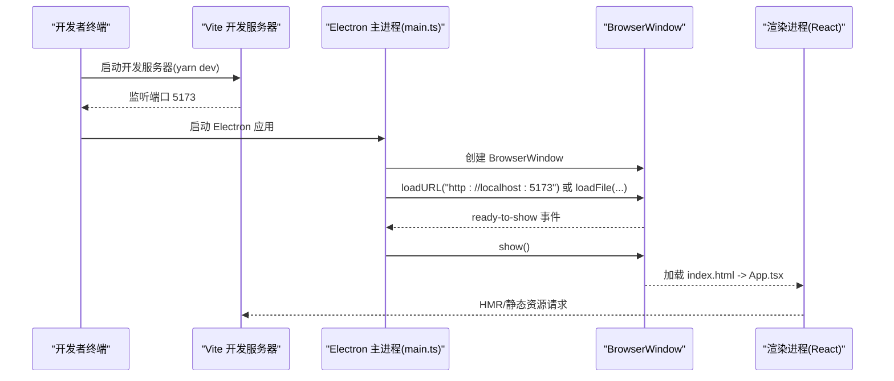
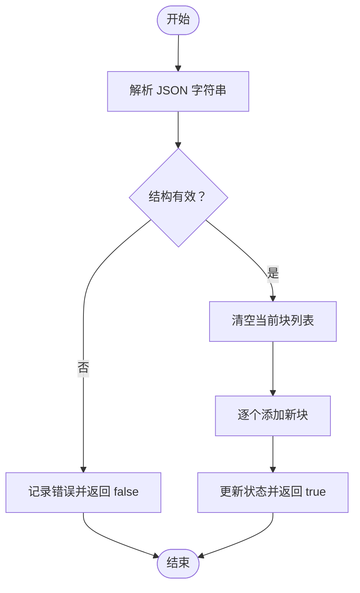

# 常见问题与故障排除

<cite>
**本文引用的文件**
- [package.json](file://package.json)
- [README.md](file://README.md)
- [vite.config.ts](file://vite.config.ts)
- [electron/main.ts](file://electron/main.ts)
- [electron/preload.ts](file://electron/preload.ts)
- [index.html](file://index.html)
- [src/App.tsx](file://src/App.tsx)
- [src/hooks/useBlockManager.ts](file://src/hooks/useBlockManager.ts)
- [src/components/BlockEditor.tsx](file://src/components/BlockEditor.tsx)
- [src/utils/BlockManager.ts](file://src/utils/BlockManager.ts)
- [electron/main.test.js](file://electron/main.test.js)
</cite>

## 目录
1. [简介](#简介)
2. [项目结构](#项目结构)
3. [核心组件](#核心组件)
4. [架构总览](#架构总览)
5. [详细组件分析](#详细组件分析)
6. [依赖关系分析](#依赖关系分析)
7. [性能注意事项](#性能注意事项)
8. [故障排除指南](#故障排除指南)
9. [结论](#结论)
10. [附录](#附录)

## 简介
本指南面向使用本项目的开发者，聚焦以下常见问题与排障路径：
- 开发服务器无法启动：Node.js 版本过低、Yarn 安装失败、端口占用等
- Electron 窗口不显示：主进程异常退出、preload.ts 配置错误、渲染进程报错等
- Tiptap 编辑器不响应：扩展配置、React 组件生命周期、CSS 样式冲突等
- 调试技巧：使用 Electron 内置开发者工具、查看控制台日志、启用 Vite 详细日志输出等

## 项目结构
该项目采用 React + Electron + Vite 的组合，前端源码位于 src，主进程与预加载脚本位于 electron，构建与开发服务器由 Vite 驱动。

图表来源
- [vite.config.ts](file://vite.config.ts#L57-L61)
- [electron/main.ts](file://electron/main.ts#L1-L68)
- [electron/preload.ts](file://electron/preload.ts#L1-L21)
- [index.html](file://index.html#L1-L13)
- [src/App.tsx](file://src/App.tsx#L1-L156)
- [src/components/BlockEditor.tsx](file://src/components/BlockEditor.tsx#L1-L116)
- [src/hooks/useBlockManager.ts](file://src/hooks/useBlockManager.ts#L1-L97)
- [src/utils/BlockManager.ts](file://src/utils/BlockManager.ts#L1-L227)

章节来源
- [README.md](file://README.md#L1-L90)
- [package.json](file://package.json#L1-L69)
- [vite.config.ts](file://vite.config.ts#L1-L61)
- [electron/main.ts](file://electron/main.ts#L1-L68)
- [electron/preload.ts](file://electron/preload.ts#L1-L21)
- [index.html](file://index.html#L1-L13)

## 核心组件
- 开发服务器与构建：Vite 配置包含 React 插件与 vite-plugin-electron，主进程与预加载脚本分别打包到 dist-electron，前端资源打包到 dist；开发模式下严格监听 5173 端口。
- Electron 主进程：创建 BrowserWindow，开发模式下加载 http://localhost:5173 并打开 DevTools；生产模式下加载 dist/index.html；窗口 ready-to-show 时再显示，防止闪屏。
- 预加载脚本：通过 contextBridge 暴露受控 API 至渲染进程，声明全局类型接口。
- 前端应用：App.tsx 作为根组件，使用 useBlockManager 管理块集合，BlockEditor.tsx 基于 @tiptap/react 使用 StarterKit 与多种扩展，支持占位符、任务列表、标题、列表、水平分隔线、拖拽句柄等。

章节来源
- [vite.config.ts](file://vite.config.ts#L1-L61)
- [electron/main.ts](file://electron/main.ts#L1-L68)
- [electron/preload.ts](file://electron/preload.ts#L1-L21)
- [src/App.tsx](file://src/App.tsx#L1-L156)
- [src/components/BlockEditor.tsx](file://src/components/BlockEditor.tsx#L1-L116)
- [src/hooks/useBlockManager.ts](file://src/hooks/useBlockManager.ts#L1-L97)
- [src/utils/BlockManager.ts](file://src/utils/BlockManager.ts#L1-L227)

## 架构总览
下面的序列图展示了开发模式下的启动流程与关键交互点。

图表来源
- [vite.config.ts](file://vite.config.ts#L57-L61)
- [electron/main.ts](file://electron/main.ts#L1-L68)
- [index.html](file://index.html#L1-L13)

## 详细组件分析

### 开发服务器与构建配置
- 端口与严格模式：开发服务器在 5173 端口，strictPort: true，若被占用会直接启动失败。
- 打包目录：主进程与预加载脚本输出至 dist-electron，前端资源输出至 dist。
- 外部化：Rollup 对 electron 进行 external，避免打包 Electron 主进程依赖。
- 别名：通过 resolve.alias 提供便捷路径别名，减少相对路径复杂度。

章节来源
- [vite.config.ts](file://vite.config.ts#L1-L61)

### Electron 主进程
- 窗口偏好：禁用 nodeIntegration，启用 contextIsolation，并指定 preload 路径。
- 开发模式：加载 http://localhost:5173，自动打开 DevTools。
- 生产模式：加载 dist/index.html。
- ready-to-show：延迟显示窗口，避免白屏/闪烁。
- 新窗口策略：拦截 web-contents-created，统一通过外部浏览器打开链接，拒绝新建窗口。

章节来源
- [electron/main.ts](file://electron/main.ts#L1-L68)

### 预加载脚本
- 通过 contextBridge.exposeInMainWorld 暴露受控 API，声明全局类型接口，确保渲染进程仅能访问受控方法。
- 若需新增 IPC 接口，应在此处扩展并补充类型声明。

章节来源
- [electron/preload.ts](file://electron/preload.ts#L1-L21)

### 前端应用与 Tiptap 编辑器
- App.tsx：提供导出 Markdown/JSON、导入文件等能力，内部通过 useBlockManager 管理块集合。
- useBlockManager.ts：封装 BlockManager 的增删改查、排序、导出/导入逻辑，导入时对 JSON 进行解析并捕获错误。
- BlockEditor.tsx：基于 @tiptap/react 初始化编辑器，启用 StarterKit 与 Placeholder、TaskList、TaskItem、Blockquote、Heading、BulletList、OrderedList、HorizontalRule、DragHandle 等扩展；根据 isEditing 控制可编辑性；在编辑态与渲染态之间切换。
- BlockManager.ts：负责块的生成、更新、删除、排序、文档创建与 Markdown 导出。

章节来源
- [src/App.tsx](file://src/App.tsx#L1-L156)
- [src/hooks/useBlockManager.ts](file://src/hooks/useBlockManager.ts#L1-L97)
- [src/components/BlockEditor.tsx](file://src/components/BlockEditor.tsx#L1-L116)
- [src/utils/BlockManager.ts](file://src/utils/BlockManager.ts#L1-L227)

## 依赖关系分析
- 包管理器：使用 Yarn，版本要求在 README 中明确为 Node.js >= 18.0.0，Yarn >= 1.22.0。
- Electron 版本：devDependencies 中指定 electron ^28.1.0。
- Vite 插件：vite-plugin-electron 用于同时构建主进程与预加载脚本。
- Tiptap 生态：@tiptap/react、@tiptap/starter-kit、Placeholder、TaskList、TaskItem、Blockquote、Heading、BulletList、OrderedList、HorizontalRule、DragHandle 等。

章节来源
- [package.json](file://package.json#L1-L69)
- [README.md](file://README.md#L1-L90)

## 性能注意事项
- 开发模式下启用 Electron DevTools 有助于快速定位渲染层问题，但请勿在生产构建中保留。
- 使用 ready-to-show 延迟显示窗口，避免首屏闪烁。
- 在导入 JSON 时进行一次性清空与批量添加，减少多次状态更新带来的重渲染成本。
- Tiptap 编辑器在大量内容时可通过合理拆分块与限制扩展数量提升性能。

[本节为通用指导，无需列出章节来源]

## 故障排除指南

### 一、开发服务器无法启动
常见原因与解决方案：
- Node.js 版本过低
  - 现象：安装或启动时报错，提示 Node 版本不满足要求。
  - 排查：确认 Node.js 版本是否满足 README 中的最低要求。
  - 解决：升级 Node.js 至 18+。
  - 参考来源
    - [README.md](file://README.md#L15-L20)

- Yarn 安装失败
  - 现象：yarn install 报错，依赖安装中断。
  - 排查：检查网络与缓存，尝试清理缓存后重试；确认 .yarnrc.yml 与 packageManager 字段一致。
  - 解决：使用 yarn install 或更换镜像源；确保 Yarn 版本满足要求。
  - 参考来源
    - [package.json](file://package.json#L67-L69)
    - [README.md](file://README.md#L15-L20)

- 端口占用
  - 现象：Vite 启动时报端口 5173 已被占用，启动失败。
  - 排查：使用 netstat 或 lsof 查找占用进程；或修改 vite.config.ts 中的 server.port。
  - 解决：释放端口或调整端口；确认 strictPort: true 下不会自动跳端口。
  - 参考来源
    - [vite.config.ts](file://vite.config.ts#L57-L61)

- 依赖缺失或版本冲突
  - 现象：构建时报错，找不到模块或类型定义错误。
  - 排查：执行 yarn install 清理并重装；检查 package.json 中依赖版本与 Electron/Vite/Tiptap 生态兼容性。
  - 解决：保持依赖版本稳定，必要时锁定版本或降级/升级到兼容版本。
  - 参考来源
    - [package.json](file://package.json#L25-L66)

### 二、Electron 窗口不显示
常见原因与排查步骤：
- 主进程异常退出
  - 现象：应用启动后无窗口，控制台无输出或提前退出。
  - 排查：查看主进程日志；确认 app.whenReady 是否触发；检查 main.ts 中的 window 生命周期事件。
  - 解决：修复主进程异常；确保在 ready-to-show 之后再 show。
  - 参考来源
    - [electron/main.ts](file://electron/main.ts#L1-L68)

- preload.ts 配置错误
  - 现象：渲染进程无法访问受控 API，或类型声明不匹配。
  - 排查：确认 contextBridge.exposeInMainWorld 的暴露对象与类型声明一致；检查 preload 路径与打包产物。
  - 解决：修正暴露方法与类型声明；确保 preload.js 存在且路径正确。
  - 参考来源
    - [electron/preload.ts](file://electron/preload.ts#L1-L21)

- 渲染进程报错
  - 现象：页面空白或控制台报错。
  - 排查：打开 Electron DevTools（开发模式已自动打开），查看 Console/Network/Source 面板；检查 index.html 与入口脚本加载路径。
  - 解决：修复渲染层错误；确认 index.html 中的入口脚本路径与实际打包产物一致。
  - 参考来源
    - [electron/main.ts](file://electron/main.ts#L23-L28)
    - [index.html](file://index.html#L1-L13)

- 新窗口策略导致链接无法打开
  - 现象：点击链接无反应或弹窗被拒绝。
  - 排查：确认 web-contents-created 的拦截逻辑是否正确；检查 openDevTools 的调用时机。
  - 解决：按设计统一走外部浏览器打开，避免新建窗口。
  - 参考来源
    - [electron/main.ts](file://electron/main.ts#L61-L68)

### 三、Tiptap 编辑器不响应
常见原因与排查步骤：
- 扩展配置问题
  - 现象：编辑器空白、功能缺失或报错。
  - 排查：确认已引入 StarterKit 与所需扩展；检查 Placeholder、TaskList、TaskItem、Heading、BulletList、OrderedList、HorizontalRule、DragHandle 等扩展是否正确配置。
  - 解决：按需启用扩展；移除无效或冲突的配置项。
  - 参考来源
    - [src/components/BlockEditor.tsx](file://src/components/BlockEditor.tsx#L23-L63)

- React 组件生命周期
  - 现象：切换编辑态/渲染态不生效、内容未同步。
  - 排查：确认 useEditor 返回的 editor 实例存在；在 isEditing 变化时调用 setEditable；在 block.content 变化时通过 commands.setContent 同步。
  - 解决：在 useEffect 中处理编辑态与内容变更；避免重复 setContent 导致的抖动。
  - 参考来源
    - [src/components/BlockEditor.tsx](file://src/components/BlockEditor.tsx#L66-L77)

- CSS 样式冲突
  - 现象：编辑器区域不可编辑、光标异常或 UI 错位。
  - 排查：检查全局样式与组件样式类名；确认 tiptap-content 类名未被覆盖。
  - 解决：隔离样式作用域；为编辑器容器增加明确的样式规则。
  - 参考来源
    - [src/components/BlockEditor.tsx](file://src/components/BlockEditor.tsx#L97-L112)

- 导入/导出与状态一致性
  - 现象：导入 JSON 后编辑器不响应或内容丢失。
  - 排查：确认 useBlockManager.importFromJSON 的 JSON 结构；检查 try/catch 捕获错误后的返回值。
  - 解决：修复导入逻辑；确保在导入成功后更新状态并重建编辑器实例。
  - 参考来源
    - [src/hooks/useBlockManager.ts](file://src/hooks/useBlockManager.ts#L62-L83)

### 四、调试技巧
- 使用 Electron 内置开发者工具
  - 开发模式下主进程会自动打开 DevTools；生产模式可通过代码手动开启。
  - 参考来源
    - [electron/main.ts](file://electron/main.ts#L23-L28)

- 查看控制台日志
  - 在渲染进程与主进程中打印关键信息，定位异常发生点。
  - 参考来源
    - [electron/main.test.js](file://electron/main.test.js#L1-L38)

- 启用 Vite 详细日志输出
  - 在启动命令中加入详细日志参数，观察 HMR 与构建过程中的错误信息。
  - 参考来源
    - [vite.config.ts](file://vite.config.ts#L1-L61)

- 分层验证
  - 先验证开发服务器是否正常（端口、静态资源加载）；
  - 再验证 Electron 主进程是否创建窗口并加载页面；
  - 最后验证渲染进程与 Tiptap 编辑器的交互。
  - 参考来源
    - [vite.config.ts](file://vite.config.ts#L57-L61)
    - [electron/main.ts](file://electron/main.ts#L1-L68)
    - [index.html](file://index.html#L1-L13)

## 结论
本指南围绕开发服务器、Electron 窗口与 Tiptap 编辑器三大核心问题提供了系统化的排查思路与解决方案。建议在日常开发中：
- 明确环境要求与依赖版本
- 严格遵循主进程/预加载脚本的安全配置
- 在渲染层关注生命周期与状态同步
- 善用 Electron DevTools 与 Vite 日志进行快速定位

[本节为总结，无需列出章节来源]

## 附录

### A. 关键流程图：导入 JSON 的处理逻辑

图表来源
- [src/hooks/useBlockManager.ts](file://src/hooks/useBlockManager.ts#L62-L83)