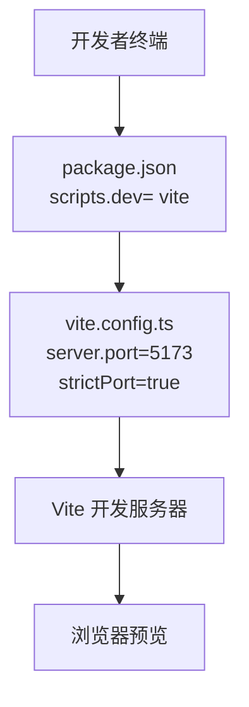
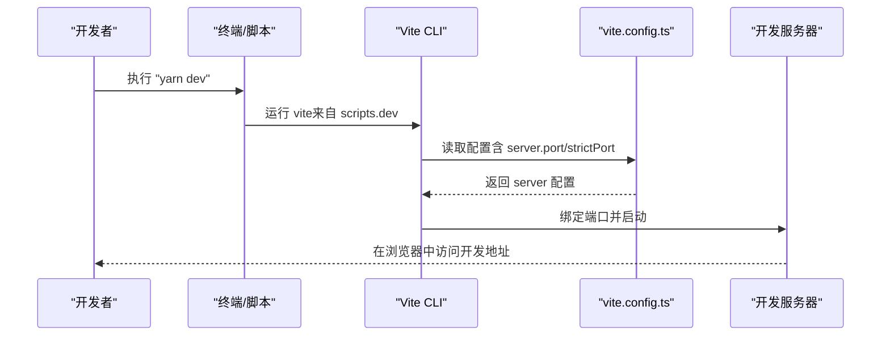
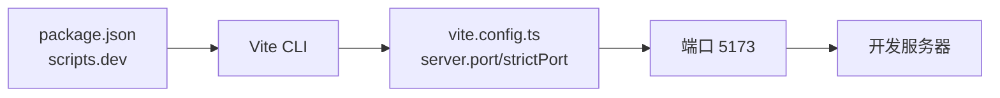
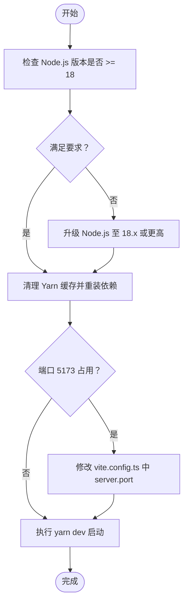

# 开发服务器启动问题

<cite>
**本文引用的文件**
- [package.json](file://package.json)
- [vite.config.ts](file://vite.config.ts)
- [README.md](file://README.md)
- [.yarnrc.yml](file://.yarnrc.yml)
</cite>

## 目录
1. [简介](#简介)
2. [项目结构与关键配置](#项目结构与关键配置)
3. [常见启动问题与排查清单](#常见启动问题与排查清单)
4. [架构概览与启动流程](#架构概览与启动流程)
5. [详细组件分析](#详细组件分析)
6. [依赖关系分析](#依赖关系分析)
7. [性能与稳定性建议](#性能与稳定性建议)
8. [故障排除指南](#故障排除指南)
9. [结论](#结论)

## 简介
本文件聚焦于开发服务器无法启动的常见原因与系统化解决方案，覆盖以下核心场景：
- Node.js 版本不兼容：当前项目要求 Node.js >= 18，若低于该版本将导致依赖或构建失败。
- Yarn 依赖安装失败：提供清理缓存与重装依赖的操作指引。
- Vite 开发服务器端口占用（默认 5173）：提供修改配置与查找并终止占用进程的方法。
- 结合 vite.config.ts 的 server 配置与 package.json 的 scripts 字段，给出完整修复流程与调试技巧。

## 项目结构与关键配置
- 启动命令由 package.json 中的 scripts 提供，开发模式使用 Vite。
- Vite 开发服务器端口在 vite.config.ts 的 server 配置中定义，默认为 5173，并开启严格端口模式。
- 包管理器使用 Yarn，且仓库内包含 Yarn Classic 的路径配置。

图表来源
- [package.json](file://package.json#L7-L13)
- [vite.config.ts](file://vite.config.ts#L57-L61)

章节来源
- [package.json](file://package.json#L7-L13)
- [vite.config.ts](file://vite.config.ts#L57-L61)
- [.yarnrc.yml](file://.yarnrc.yml#L1-L2)

## 常见启动问题与排查清单
- Node.js 版本过低
  - 现象：安装依赖或启动时报错，提示引擎版本不满足。
  - 检查方法：在终端执行 Node.js 版本查询命令，确认是否满足 >= 18 的要求。
  - 解决方法：升级到 18.x 或更高版本后再重试。
- Yarn 依赖安装失败
  - 现象：yarn install 失败、网络超时、缓存损坏等。
  - 解决方法：清理 Yarn 缓存后重装依赖。
- Vite 端口被占用（默认 5173）
  - 现象：启动时报端口冲突或无法绑定。
  - 解决方法：修改 vite.config.ts 中的 server.port，或释放占用端口的进程。

章节来源
- [README.md](file://README.md#L16-L17)
- [vite.config.ts](file://vite.config.ts#L57-L61)
- [package.json](file://package.json#L7-L13)

## 架构概览与启动流程
从“脚本 -> 配置 -> 服务”的单向调用链路如下：

图表来源
- [package.json](file://package.json#L7-L13)
- [vite.config.ts](file://vite.config.ts#L57-L61)

## 详细组件分析

### 组件一：启动脚本与包管理器
- package.json 中的 scripts.dev 指向 vite，是启动开发服务器的唯一入口。
- 项目声明使用 Yarn，并在 .yarnrc.yml 中指定 Yarn Classic 的实现路径，确保团队统一使用相同版本的包管理器。

章节来源
- [package.json](file://package.json#L7-L13)
- [.yarnrc.yml](file://.yarnrc.yml#L1-L2)

### 组件二：Vite 开发服务器配置
- server.port 默认为 5173，strictPort 为 true，表示若端口不可用则直接退出，不会自动寻找其他端口。
- 若需要自定义端口，请在 vite.config.ts 中调整 server.port 并重启开发服务器。

章节来源
- [vite.config.ts](file://vite.config.ts#L57-L61)

### 组件三：Node.js 版本要求
- README 明确要求 Node.js >= 18.0.0，低于该版本可能导致安装或运行失败。
- 若当前环境版本较低，应先升级 Node.js 再进行后续操作。

章节来源
- [README.md](file://README.md#L16-L17)

## 依赖关系分析
- 启动链路依赖
  - package.json 的 scripts.dev 依赖 Vite CLI。
  - Vite CLI 读取 vite.config.ts 的 server 配置。
  - 浏览器通过 Vite 开发服务器提供的地址访问应用。
- 端口策略
  - strictPort=true 时，端口冲突将直接导致启动失败；需修改端口或释放占用。

图表来源
- [package.json](file://package.json#L7-L13)
- [vite.config.ts](file://vite.config.ts#L57-L61)

章节来源
- [package.json](file://package.json#L7-L13)
- [vite.config.ts](file://vite.config.ts#L57-L61)

## 性能与稳定性建议
- 使用统一的 Node.js 版本（>= 18）以避免依赖兼容性问题。
- 使用 Yarn Classic（仓库已配置）以减少跨平台差异带来的安装波动。
- 在多人协作环境中，建议固定 Node.js 与 Yarn 版本，避免因版本漂移引发的构建不一致。

[本节为通用建议，无需特定文件引用]

## 故障排除指南

### 步骤一：检查 Node.js 版本
- 目标：确认当前 Node.js 是否满足 >= 18 的要求。
- 方法：在终端执行版本查询命令，核对输出。
- 影响：若版本过低，后续安装与运行均可能失败。

章节来源
- [README.md](file://README.md#L16-L17)

### 步骤二：清理 Yarn 缓存并重装依赖
- 目标：解决依赖安装失败、网络异常或缓存损坏等问题。
- 方法：
  - 清理 Yarn 缓存。
  - 删除 node_modules 与锁定文件后重新安装。
- 注意：仓库使用 Yarn Classic，相关命令在 Yarn Classic 环境下可用。

章节来源
- [.yarnrc.yml](file://.yarnrc.yml#L1-L2)
- [package.json](file://package.json#L7-L13)

### 步骤三：处理端口占用（默认 5173）
- 现象：启动时报端口冲突或无法绑定。
- 根因：vite.config.ts 中 server.port=5173 且 strictPort=true。
- 方案一：修改端口
  - 在 vite.config.ts 中将 server.port 修改为未被占用的端口。
  - 保存后重新执行启动命令。
- 方案二：释放占用进程
  - 查找占用 5173 端口的进程。
  - 终止该进程后重试启动。
- 验证：更换端口或释放占用后，再次执行启动命令，观察是否成功。

图表来源
- [README.md](file://README.md#L16-L17)
- [vite.config.ts](file://vite.config.ts#L57-L61)
- [package.json](file://package.json#L7-L13)

章节来源
- [vite.config.ts](file://vite.config.ts#L57-L61)
- [package.json](file://package.json#L7-L13)

### 调试技巧：启用更详细的日志
- Vite 支持通过命令行参数启用更详细的日志输出，便于定位启动阶段的问题。
- 建议在执行启动命令时添加详细日志参数，以便快速定位错误来源。

章节来源
- [package.json](file://package.json#L7-L13)

## 结论
- 开发服务器无法启动通常由三类因素导致：Node.js 版本过低、Yarn 依赖安装异常、Vite 端口被占用。
- 修复流程建议按顺序执行：先验证并升级 Node.js，再清理并重装依赖，最后处理端口占用或修改端口。
- 通过 vite.config.ts 的 server 配置与 package.json 的 scripts 字段，可以快速定位与修正启动问题。
- 如遇疑难，可启用 Vite 的详细日志模式辅助诊断。