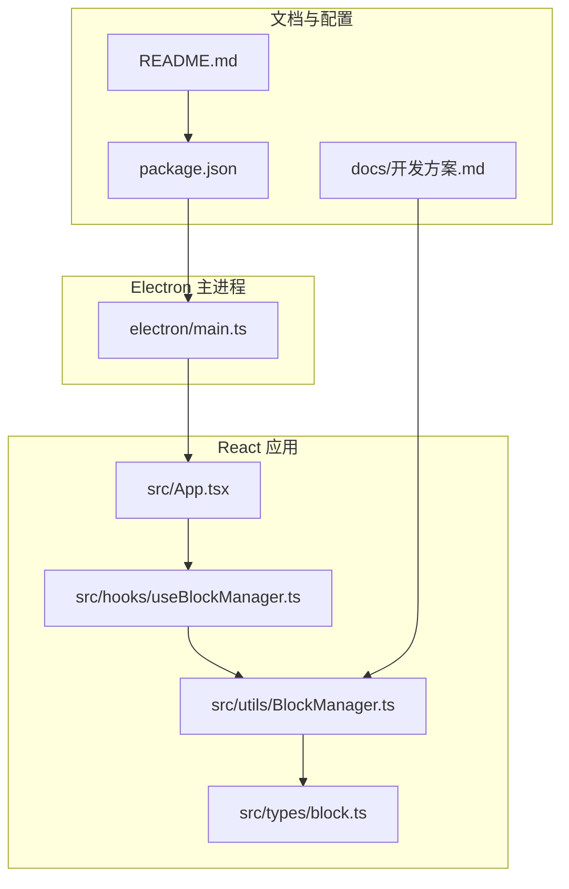
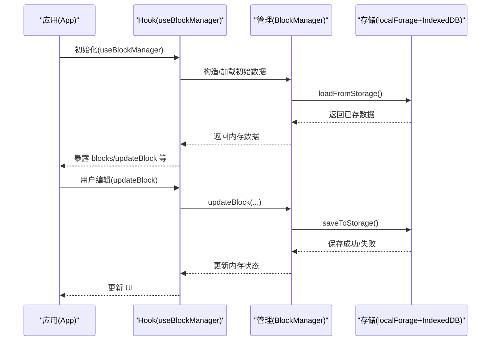
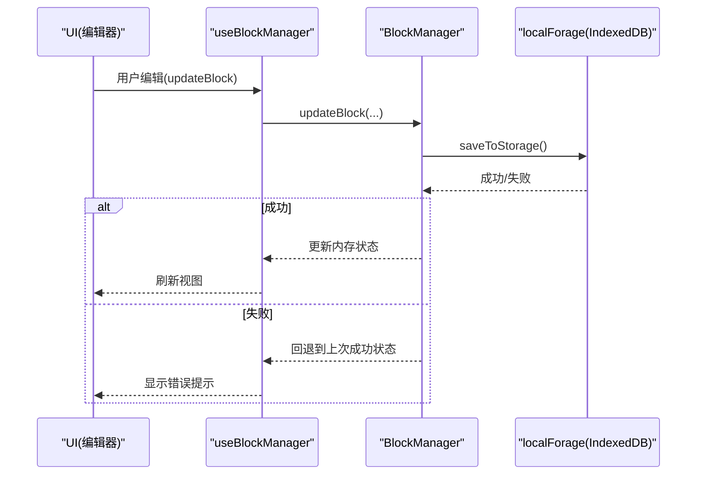
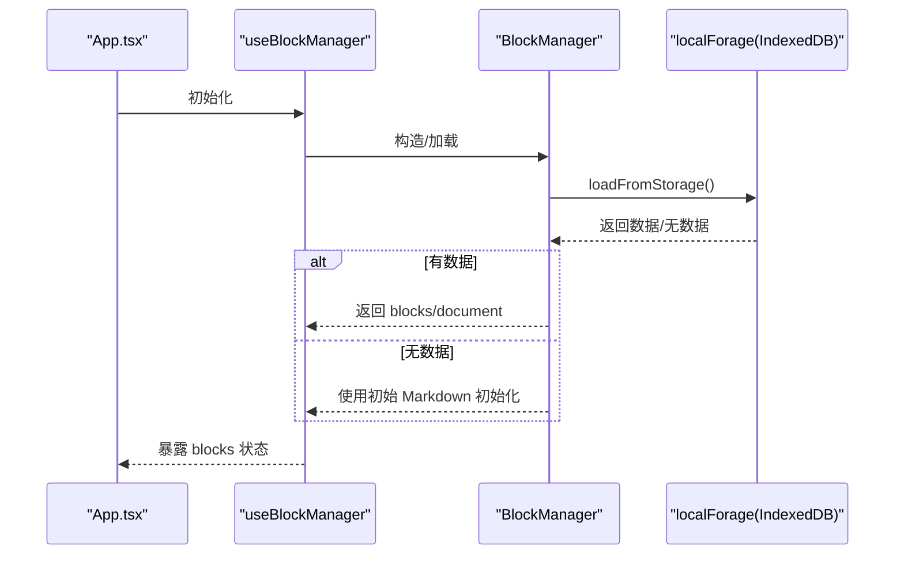
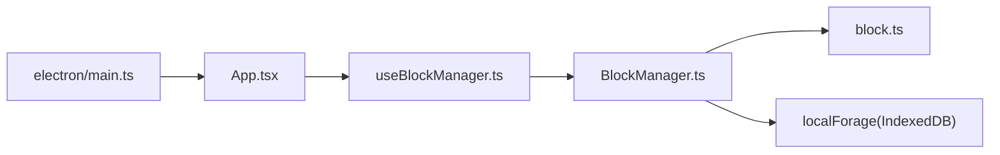

# 实现数据持久化存储

<cite>
**本文引用的文件**
- [开发方案.md](file://docs/开发方案.md)
- [BlockManager.ts](file://src/utils/BlockManager.ts)
- [useBlockManager.ts](file://src/hooks/useBlockManager.ts)
- [block.ts](file://src/types/block.ts)
- [App.tsx](file://src/App.tsx)
- [main.ts](file://electron/main.ts)
- [package.json](file://package.json)
- [README.md](file://README.md)
</cite>

## 目录
1. [引言](#引言)
2. [项目结构](#项目结构)
3. [核心组件](#核心组件)
4. [架构总览](#架构总览)
5. [详细组件分析](#详细组件分析)
6. [依赖关系分析](#依赖关系分析)
7. [性能考量](#性能考量)
8. [故障排查指南](#故障排查指南)
9. [结论](#结论)
10. [附录](#附录)

## 引言
本方案围绕“当前数据仅存在于内存”的问题，提出基于开发方案.md中提出的 localForage + IndexedDB 的本地存储方案，目标是在 Electron 应用中实现稳定、可靠的持久化存储。通过对 BlockManager 的扩展，新增 saveToStorage 与 loadFromStorage 方法，并结合 useBlockManager 在应用启动时自动加载数据，形成自动保存机制（如失焦保存、定时保存）。同时，结合 electron/main.ts 中的文件系统权限配置，确保存储路径与安全策略合理。文档还提供错误处理策略（如存储失败回退）与性能优化建议（如防抖保存），并给出完整的 TypeScript 实现思路与参考路径。

## 项目结构
项目采用 Electron + React + TypeScript 的桌面应用架构，核心逻辑集中在 src/utils/BlockManager.ts 与 src/hooks/useBlockManager.ts，UI 层由 App.tsx 驱动。开发方案.md 明确了本地存储采用 localForage + IndexedDB 的技术选型，为后续实现提供依据。



图表来源
- [main.ts](file://electron/main.ts#L1-L68)
- [App.tsx](file://src/App.tsx#L1-L156)
- [useBlockManager.ts](file://src/hooks/useBlockManager.ts#L1-L97)
- [BlockManager.ts](file://src/utils/BlockManager.ts#L1-L227)
- [block.ts](file://src/types/block.ts#L1-L30)
- [开发方案.md](file://docs/开发方案.md#L1-L120)
- [package.json](file://package.json#L1-L69)
- [README.md](file://README.md#L1-L90)

章节来源
- [README.md](file://README.md#L56-L75)
- [开发方案.md](file://docs/开发方案.md#L1-L120)
- [package.json](file://package.json#L1-L69)

## 核心组件
- BlockManager：负责块数据的增删改查、排序、文档创建与序列化/反序列化。
- useBlockManager：封装 BlockManager 的状态与回调，提供 React Hooks 形式的便捷接口。
- Electron 主进程：负责窗口创建、安全策略与外部链接处理，为本地存储提供安全边界。
- 开发方案文档：明确本地存储采用 localForage + IndexedDB 的技术路线。

章节来源
- [BlockManager.ts](file://src/utils/BlockManager.ts#L1-L227)
- [useBlockManager.ts](file://src/hooks/useBlockManager.ts#L1-L97)
- [main.ts](file://electron/main.ts#L1-L68)
- [开发方案.md](file://docs/开发方案.md#L1-L120)

## 架构总览
本方案将“应用层”与“存储层”解耦：应用层通过 useBlockManager 与 BlockManager 操作内存数据；存储层通过 localForage + IndexedDB 实现持久化。应用启动时自动加载，编辑过程中通过事件触发自动保存，异常时进行回退与提示。



图表来源
- [App.tsx](file://src/App.tsx#L1-L156)
- [useBlockManager.ts](file://src/hooks/useBlockManager.ts#L1-L97)
- [BlockManager.ts](file://src/utils/BlockManager.ts#L1-L227)
- [开发方案.md](file://docs/开发方案.md#L1-L120)

## 详细组件分析

### BlockManager 扩展：saveToStorage 与 loadFromStorage
目标：在 BlockManager 中新增两个方法，分别用于从 IndexedDB 加载数据与将内存数据写入 IndexedDB。结合 useBlockManager 在应用启动时调用 loadFromStorage，形成自动加载；在编辑事件中调用 saveToStorage，形成自动保存。

实现要点
- 数据模型：BlockManager 内部维护 blocks 与 document，对外提供 getBlocks/getDocument/toMarkdown 等方法。持久化应保存这些数据结构。
- 存储键：建议使用稳定的键名，如“blocks”，“document”，便于区分与迁移。
- IndexedDB：使用 localForage 作为 IndexedDB 的异步封装，提供 Promise 化的 API。
- 错误处理：读写失败时返回错误，以便上层进行回退或提示。
- 自动保存：在 useBlockManager 的 updateBlock/addBlock/deleteBlock/reorderBlocks 回调中触发 saveToStorage，结合防抖策略减少频繁写入。

```mermaid
classDiagram
class BlockManager {
- blocks : Block[]
- document : Document|null
+ getBlocks() Block[]
+ getBlock(id : string) Block|undefined
+ addBlock(type : BlockType, content : string) Block
+ updateBlock(id : string, updates : Partial<Block>) Block|null
+ deleteBlock(id : string) boolean
+ reorderBlocks(fromIndex : number, toIndex : number) boolean
+ createDocument(title : string) Document
+ getDocument() Document|null
+ toMarkdown() string
+ fromMarkdown(markdown : string) BlockManager
+ saveToStorage() Promise<void>
+ loadFromStorage() Promise<void>
}
class Block {
+ id : string
+ type : BlockType
+ content : string
+ references? : string[]
+ referencedBy? : string[]
+ metadata? : { tags? : string[], created? : Date, modified? : Date }
}
class Document {
+ id : string
+ title : string
+ blocks : Block[]
+ created : Date
+ modified : Date
}
BlockManager --> Block : "管理"
BlockManager --> Document : "管理"
```

图表来源
- [BlockManager.ts](file://src/utils/BlockManager.ts#L1-L227)
- [block.ts](file://src/types/block.ts#L1-L30)

章节来源
- [BlockManager.ts](file://src/utils/BlockManager.ts#L1-L227)
- [block.ts](file://src/types/block.ts#L1-L30)

### useBlockManager：自动加载与自动保存
目标：在应用启动时自动加载数据，在用户编辑时自动保存。通过 React Hooks 将 BlockManager 的状态与 UI 绑定，提供统一的编辑接口。

实现要点
- 启动加载：在 useBlockManager 初始化时，先尝试从 IndexedDB 加载数据，若无则使用 fromMarkdown 初始化。
- 自动保存：在 updateBlock/addBlock/deleteBlock/reorderBlocks 的回调中触发 saveToStorage，并结合防抖策略。
- 失焦保存：在 BlockList/BlockEditor 的失焦事件中触发保存。
- 定时保存：设置定时器周期性保存，避免长时间未保存导致的数据丢失风险。
- 错误回退：保存失败时回滚到最近一次成功状态，或提示用户并允许重试。



图表来源
- [useBlockManager.ts](file://src/hooks/useBlockManager.ts#L1-L97)
- [BlockManager.ts](file://src/utils/BlockManager.ts#L1-L227)

章节来源
- [useBlockManager.ts](file://src/hooks/useBlockManager.ts#L1-L97)

### 应用启动流程：自动加载
目标：在应用启动时自动加载已保存的数据，保证用户离开后再次打开仍能看到最新内容。

实现要点
- 在 App.tsx 中调用 useBlockManager 初始化钩子，内部完成从 IndexedDB 的加载。
- 若首次启动且无数据，则使用初始 Markdown 内容进行初始化。
- 加载完成后，UI 层根据 blocks 状态渲染 BlockList。



图表来源
- [App.tsx](file://src/App.tsx#L1-L156)
- [useBlockManager.ts](file://src/hooks/useBlockManager.ts#L1-L97)
- [BlockManager.ts](file://src/utils/BlockManager.ts#L1-L227)

章节来源
- [App.tsx](file://src/App.tsx#L1-L156)
- [useBlockManager.ts](file://src/hooks/useBlockManager.ts#L1-L97)

### Electron 主进程安全配置与存储路径
目标：结合 electron/main.ts 的安全策略，确保应用在受控环境下运行，避免不受信任的外部资源访问，同时为本地存储提供合理的安全边界。

实现要点
- 安全策略：主进程已启用 contextIsolation、禁用 nodeIntegration，并通过 setWindowOpenHandler 拦截新窗口创建，改为外部浏览器打开，降低 XSS 与钓鱼风险。
- 存储路径：本地存储位于 IndexedDB，无需额外文件系统权限；若将来扩展到文件系统写入，需在主进程中显式授权并限定目录范围。
- 外部链接：通过 shell.openExternal 控制外部链接，避免应用被恶意页面劫持。

章节来源
- [main.ts](file://electron/main.ts#L1-L68)

### 错误处理策略与回退机制
目标：在存储失败时提供稳健的回退与提示，保证用户体验与数据安全。

实现策略
- 读取失败：若 loadFromStorage 失败，使用默认初始化数据，同时提示用户稍后重试。
- 写入失败：若 saveToStorage 失败，回滚到最近一次成功状态，提示用户并允许手动导出备份。
- 网络/存储不可用：在 UI 中显示“离线模式”提示，限制部分功能，待恢复后自动同步。
- 日志与诊断：记录关键错误事件，便于定位问题与改进。

章节来源
- [开发方案.md](file://docs/开发方案.md#L1-L120)

### 性能优化建议
目标：在高频编辑场景下，减少存储压力与 UI 卡顿。

优化策略
- 防抖保存：对 updateBlock 等高频操作进行防抖，合并多次变更后再写入。
- 批量保存：在用户停止编辑一段时间后集中保存，避免频繁 I/O。
- 分片存储：对于超大文档，可按章节或块范围分片存储，提升加载速度。
- 增量更新：仅保存变更的块，而非全量覆盖。
- 缓存策略：在内存中维护最近一次成功状态，失败时快速回滚。

章节来源
- [开发方案.md](file://docs/开发方案.md#L118-L120)

## 依赖关系分析
- 应用层依赖：App.tsx 依赖 useBlockManager.ts；useBlockManager.ts 依赖 BlockManager.ts；BlockManager.ts 依赖 block.ts。
- 存储层依赖：BlockManager 通过 localForage 与 IndexedDB 交互，localForage 作为 IndexedDB 的异步封装。
- 主进程依赖：electron/main.ts 提供安全上下文与窗口生命周期管理，间接影响存储的安全边界。



图表来源
- [App.tsx](file://src/App.tsx#L1-L156)
- [useBlockManager.ts](file://src/hooks/useBlockManager.ts#L1-L97)
- [BlockManager.ts](file://src/utils/BlockManager.ts#L1-L227)
- [block.ts](file://src/types/block.ts#L1-L30)
- [main.ts](file://electron/main.ts#L1-L68)

章节来源
- [package.json](file://package.json#L46-L66)
- [开发方案.md](file://docs/开发方案.md#L1-L120)

## 性能考量
- 输入延迟：开发方案.md 提到在大文档场景下设置延迟解析以避免卡顿，持久化同样适用：对高频变更进行节流/防抖。
- 存储频率：避免每次编辑都写入，采用“失焦保存 + 定时保存”策略。
- 数据体积：对超大文档进行分片或增量保存，减少一次性写入的压力。
- 并发控制：避免多个保存任务并发执行，使用队列或锁机制保证一致性。

章节来源
- [开发方案.md](file://docs/开发方案.md#L118-L120)

## 故障排查指南
常见问题与处理
- 无法加载数据：检查 IndexedDB 是否可用，确认 localForage 初始化是否成功；若失败，回退到默认初始化并提示用户。
- 保存失败：检查磁盘空间与权限，查看是否有并发写入冲突；失败时回滚并提示重试。
- UI 不刷新：确认 useBlockManager 的状态更新是否正确触发，以及 BlockList 是否监听到 blocks 的变化。
- 外链安全：确认 electron/main.ts 的 setWindowOpenHandler 是否生效，避免外部链接被滥用。

章节来源
- [main.ts](file://electron/main.ts#L61-L68)
- [useBlockManager.ts](file://src/hooks/useBlockManager.ts#L1-L97)

## 结论
通过在 BlockManager 中新增 saveToStorage 与 loadFromStorage，并结合 useBlockManager 的自动加载与自动保存机制，可在 Electron 应用中实现稳定可靠的本地持久化。配合开发方案.md 中的 localForage + IndexedDB 技术选型与 electron/main.ts 的安全配置，既能满足功能需求，又能保障安全性与性能。建议在实际实现中优先完成自动加载与失焦保存，再逐步引入定时保存与防抖策略，最终形成完善的持久化闭环。

## 附录
- 参考实现路径
  - BlockManager 扩展：[BlockManager.ts](file://src/utils/BlockManager.ts#L1-L227)
  - Hook 封装与自动保存：[useBlockManager.ts](file://src/hooks/useBlockManager.ts#L1-L97)
  - 应用启动与状态暴露：[App.tsx](file://src/App.tsx#L1-L156)
  - 技术选型与性能建议：[开发方案.md](file://docs/开发方案.md#L1-L120)
  - 主进程安全配置：[main.ts](file://electron/main.ts#L1-L68)
  - 依赖声明与技术栈：[package.json](file://package.json#L46-L66)