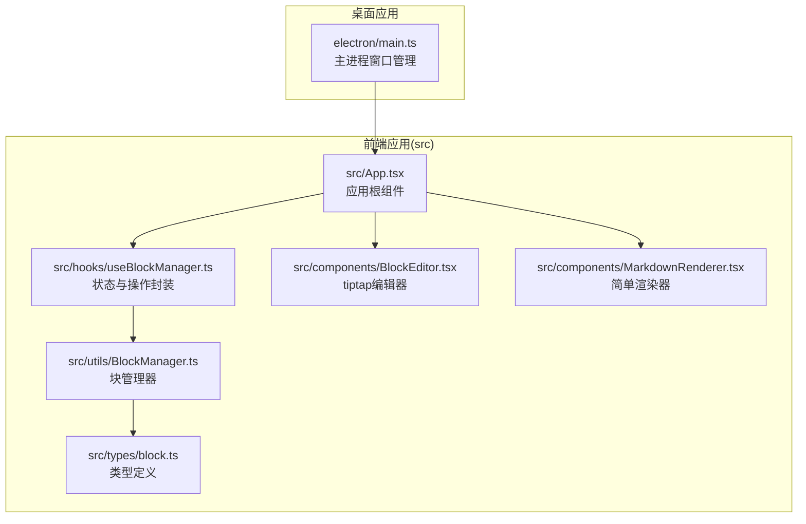
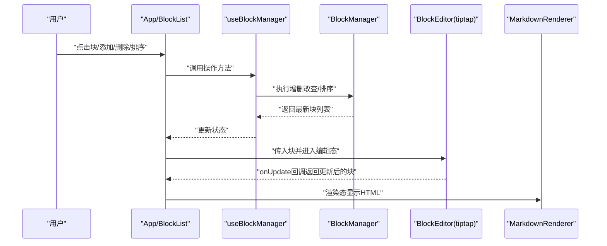
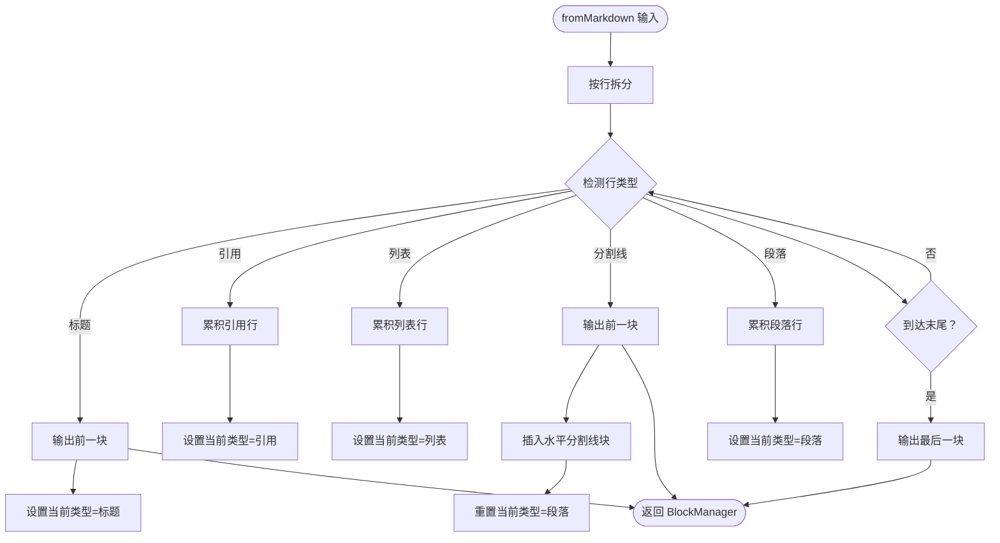
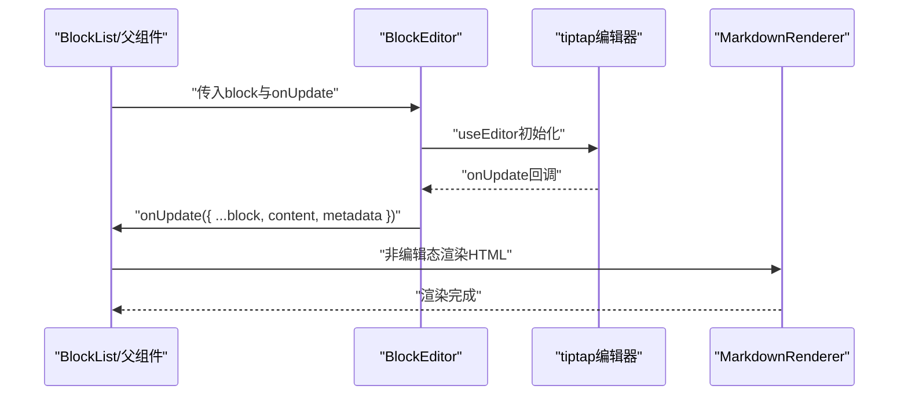
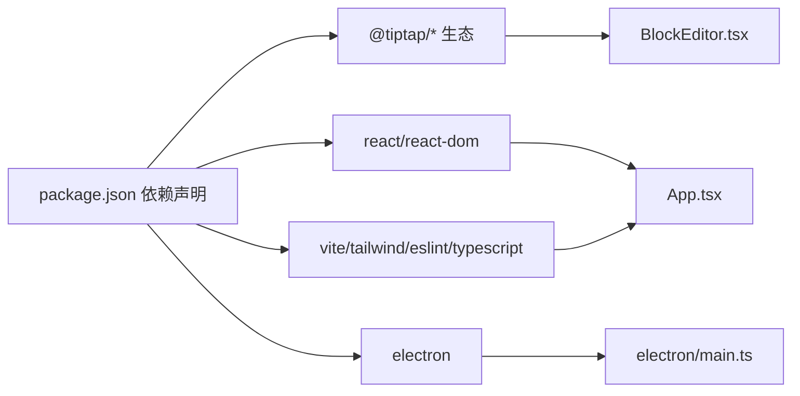

# 开发指南

<cite>
**本文引用的文件**
- [src/types/block.ts](file://src/types/block.ts)
- [src/utils/BlockManager.ts](file://src/utils/BlockManager.ts)
- [src/hooks/useBlockManager.ts](file://src/hooks/useBlockManager.ts)
- [src/components/BlockEditor.tsx](file://src/components/BlockEditor.tsx)
- [src/components/MarkdownRenderer.tsx](file://src/components/MarkdownRenderer.tsx)
- [src/App.tsx](file://src/App.tsx)
- [docs/开发方案.md](file://docs/开发方案.md)
- [docs/tiptap集成说明.md](file://docs/tiptap集成说明.md)
- [package.json](file://package.json)
- [electron/main.ts](file://electron/main.ts)
</cite>

## 目录
1. [简介](#简介)
2. [项目结构](#项目结构)
3. [核心组件](#核心组件)
4. [架构总览](#架构总览)
5. [详细组件分析](#详细组件分析)
6. [依赖关系分析](#依赖关系分析)
7. [性能考量](#性能考量)
8. [故障排查指南](#故障排查指南)
9. [结论](#结论)
10. [附录](#附录)

## 简介
本开发指南面向贡献者，帮助你快速理解并扩展“未知叙事”小说块编辑器。当前系统以 Electron + React + TypeScript 为基础，使用 tiptap 作为块编辑引擎，Markdown 内容以源码形式存储，编辑态与渲染态之间无缝切换。文档同时给出扩展新块类型、增强 Markdown 解析能力、实现本地持久化存储以及测试建议，并结合开发方案文档中的未来扩展方向进行规划。

## 项目结构
项目采用“桌面端优先”的结构，核心逻辑集中在 src 下，Electron 主进程负责窗口生命周期与安全策略，构建与打包由 Vite 驱动。



图表来源
- [electron/main.ts](file://electron/main.ts#L1-L68)
- [src/App.tsx](file://src/App.tsx#L1-L156)
- [src/hooks/useBlockManager.ts](file://src/hooks/useBlockManager.ts#L1-L97)
- [src/utils/BlockManager.ts](file://src/utils/BlockManager.ts#L1-L227)
- [src/types/block.ts](file://src/types/block.ts#L1-L30)
- [src/components/BlockEditor.tsx](file://src/components/BlockEditor.tsx#L1-L116)
- [src/components/MarkdownRenderer.tsx](file://src/components/MarkdownRenderer.tsx#L1-L125)

章节来源
- [package.json](file://package.json#L1-L69)
- [README.md](file://README.md#L56-L75)

## 核心组件
- 类型系统：定义块类型与文档结构，确保块内容以 Markdown 源码形式存储，便于与 tiptap 编辑态协同。
- 块管理器：提供增删改查、排序、文档创建、Markdown 导入/导出等能力；当前实现为内存态。
- Hook：对外暴露统一的状态与操作接口，供 UI 组件调用。
- 编辑器：基于 tiptap 的 BlockEditor，支持编辑态与渲染态切换、拖拽排序、占位符、任务列表等扩展。
- 渲染器：当前为简单解析器，未来将替换为 Lute 并支持富文本语法扩展。

章节来源
- [src/types/block.ts](file://src/types/block.ts#L1-L30)
- [src/utils/BlockManager.ts](file://src/utils/BlockManager.ts#L1-L227)
- [src/hooks/useBlockManager.ts](file://src/hooks/useBlockManager.ts#L1-L97)
- [src/components/BlockEditor.tsx](file://src/components/BlockEditor.tsx#L1-L116)
- [src/components/MarkdownRenderer.tsx](file://src/components/MarkdownRenderer.tsx#L1-L125)

## 架构总览
整体流程：用户在 BlockList 中操作块，通过 useBlockManager 调用 BlockManager，BlockManager 以 Markdown 源码形式存储内容；编辑态由 tiptap 管理，渲染态由 MarkdownRenderer 输出 HTML；Electron 主进程负责窗口生命周期与安全策略。



图表来源
- [src/App.tsx](file://src/App.tsx#L1-L156)
- [src/hooks/useBlockManager.ts](file://src/hooks/useBlockManager.ts#L1-L97)
- [src/utils/BlockManager.ts](file://src/utils/BlockManager.ts#L1-L227)
- [src/components/BlockEditor.tsx](file://src/components/BlockEditor.tsx#L1-L116)
- [src/components/MarkdownRenderer.tsx](file://src/components/MarkdownRenderer.tsx#L1-L125)

## 详细组件分析

### 类型系统与数据模型
- 块类型：包含标题、段落、引用、无序/有序/任务列表、水平分割线等。
- 块结构：包含 id、type、content（Markdown 源码）、引用关系数组、元数据等。
- 文档结构：包含 id、title、blocks、时间戳等。

```mermaid
classDiagram
class Block {
+string id
+BlockType type
+string content
+string[] references
+string[] referencedBy
+metadata
}
class Document {
+string id
+string title
+Block[] blocks
+Date created
+Date modified
}
class BlockType {
<<enumeration>>
"heading"
"paragraph"
"quote"
"bulletList"
"orderedList"
"taskList"
"horizontalRule"
}
Block --> Document : "属于"
```

图表来源
- [src/types/block.ts](file://src/types/block.ts#L1-L30)

章节来源
- [src/types/block.ts](file://src/types/block.ts#L1-L30)

### 块管理器（BlockManager）
- 能力范围：增删改查、排序、文档创建、Markdown 导入/导出。
- Markdown 解析：从 Markdown 文本拆分为块，识别标题、引用、列表、分割线等，生成对应块类型。
- 导出：将块列表拼接为 Markdown 文本。



图表来源
- [src/utils/BlockManager.ts](file://src/utils/BlockManager.ts#L101-L217)

章节来源
- [src/utils/BlockManager.ts](file://src/utils/BlockManager.ts#L1-L227)

### Hook：useBlockManager
- 负责将 BlockManager 的状态与 UI 绑定，提供 add/update/delete/reorder/getMarkdown/import/export 等方法。
- 支持从 Markdown 初始化 BlockManager。

章节来源
- [src/hooks/useBlockManager.ts](file://src/hooks/useBlockManager.ts#L1-L97)

### 编辑器：BlockEditor（tiptap）
- 集成 StarterKit、Placeholder、TaskList/TaskItem、Blockquote、Heading、BulletList、OrderedList、HorizontalRule、DragHandle 等扩展。
- 编辑态通过 editor.getHTML() 获取内容，失焦或切换状态时触发 onUpdate 回调。
- 支持 isEditing 控制编辑态与渲染态切换。



图表来源
- [src/components/BlockEditor.tsx](file://src/components/BlockEditor.tsx#L1-L116)
- [src/components/MarkdownRenderer.tsx](file://src/components/MarkdownRenderer.tsx#L1-L125)

章节来源
- [src/components/BlockEditor.tsx](file://src/components/BlockEditor.tsx#L1-L116)

### 渲染器：MarkdownRenderer（当前为简单解析器）
- 当前实现：根据行首字符判断块类型，对标题、引用、列表、分割线、段落进行基础转换。
- 未来规划：替换为 Lute，支持富文本语法扩展（如 {color}、{size}）与双链渲染。

章节来源
- [src/components/MarkdownRenderer.tsx](file://src/components/MarkdownRenderer.tsx#L1-L125)

### 应用入口：App
- 提供示例 Markdown 内容初始化，导出 Markdown/JSON、导入文件等基础功能。
- 通过 useBlockManager 管理块列表与操作。

章节来源
- [src/App.tsx](file://src/App.tsx#L1-L156)

### Electron 主进程
- 负责窗口创建、开发/生产加载、安全策略（阻止新建窗口、外部打开）。

章节来源
- [electron/main.ts](file://electron/main.ts#L1-L68)

## 依赖关系分析
- 前端依赖：tiptap 生态（react、starter-kit、各扩展）、react、react-dom。
- 构建与打包：Vite、Tailwind CSS、ESLint、TypeScript。
- Electron：主进程窗口管理与安全策略。



图表来源
- [package.json](file://package.json#L46-L66)
- [electron/main.ts](file://electron/main.ts#L1-L68)
- [src/components/BlockEditor.tsx](file://src/components/BlockEditor.tsx#L1-L116)
- [src/App.tsx](file://src/App.tsx#L1-L156)

章节来源
- [package.json](file://package.json#L1-L69)

## 性能考量
- 大文档渲染延迟：开发方案建议对 Markdown 解析设置延迟阈值，避免输入时卡顿。
- XSS 防护：开发方案建议对渲染 HTML 使用 DOMPurify 过滤。
- 本地存储：开发方案建议使用 localForage + IndexedDB，支持大体量离线数据。

章节来源
- [docs/开发方案.md](file://docs/开发方案.md#L118-L121)

## 故障排查指南
- 编辑态无法切换：检查 BlockEditor 的 isEditing 状态与 onToggleEdit 回调是否正确传递。
- 渲染态显示异常：确认 MarkdownRenderer 的解析分支与内容格式，必要时升级到 Lute。
- 导入/导出问题：检查 useBlockManager 的 importFromJSON 与 exportAsJSON 流程，确保 JSON 结构一致。
- Electron 窗口空白：确认主进程加载地址与开发/生产模式配置。

章节来源
- [src/components/BlockEditor.tsx](file://src/components/BlockEditor.tsx#L1-L116)
- [src/components/MarkdownRenderer.tsx](file://src/components/MarkdownRenderer.tsx#L1-L125)
- [src/hooks/useBlockManager.ts](file://src/hooks/useBlockManager.ts#L54-L93)
- [electron/main.ts](file://electron/main.ts#L23-L28)

## 结论
本项目已具备块编辑、Markdown 源码存储、编辑态/渲染态切换的基础能力。下一步建议：
- 扩展新块类型：在类型定义与 BlockManager 解析逻辑中新增类型，并在 BlockEditor 中配置 tiptap 扩展。
- 替换渲染器：集成 Lute 并扩展富文本语法，提升渲染质量与可读性。
- 实现本地持久化：基于 localForage + IndexedDB 设计自动保存与恢复机制。
- 补充测试：围绕 BlockManager 编写单元测试，覆盖增删改查与排序等核心行为。

## 附录

### 如何添加新的块类型
- 在类型定义中新增枚举值，确保与 Markdown 语义一致。
- 在 BlockManager 的 fromMarkdown 中识别新语法并生成对应块类型。
- 在 BlockEditor 中注册 tiptap 对应扩展，保证编辑态可用。
- 在渲染侧（MarkdownRenderer）补充渲染分支或在 Lute 中扩展解析规则。

章节来源
- [src/types/block.ts](file://src/types/block.ts#L1-L3)
- [src/utils/BlockManager.ts](file://src/utils/BlockManager.ts#L101-L217)
- [src/components/BlockEditor.tsx](file://src/components/BlockEditor.tsx#L29-L49)
- [src/components/MarkdownRenderer.tsx](file://src/components/MarkdownRenderer.tsx#L9-L74)

### 如何扩展 Markdown 解析能力
- 当前：简单解析器，适合演示与轻量场景。
- 未来：替换为 Lute，支持富文本语法（如 {color}、{size}）与双链渲染，提升可读性与表达力。
- 集成建议：在渲染器层替换解析器实现，保持 content 字段不变，UI 与交互不受影响。

章节来源
- [src/components/MarkdownRenderer.tsx](file://src/components/MarkdownRenderer.tsx#L9-L125)
- [docs/开发方案.md](file://docs/开发方案.md#L94-L104)

### 如何实现持久化存储
- 当前：数据仅存在于内存，重启丢失。
- 建议：使用 localForage + IndexedDB，提供 save/load/delete 接口，封装自动保存与恢复。
- 设计要点：以块 ID 为键，序列化块列表与文档元信息；提供增量保存与冲突合并策略。

章节来源
- [docs/开发方案.md](file://docs/开发方案.md#L12-L13)

### 如何测试核心逻辑
- 测试对象：BlockManager 的增删改查、排序、fromMarkdown、toMarkdown。
- 建议用例：
  - addBlock：校验 id 生成、默认字段、时间戳。
  - updateBlock：校验部分更新、metadata 修改时间。
  - deleteBlock：存在与不存在的删除行为。
  - reorderBlocks：边界索引与越界保护。
  - fromMarkdown：标题/引用/列表/分割线/段落的识别与合并。
  - toMarkdown：块内容拼接与空行处理。
- 工具：Jest + React Testing Library（如需 UI 层测试）。

章节来源
- [src/utils/BlockManager.ts](file://src/utils/BlockManager.ts#L1-L227)
- [src/hooks/useBlockManager.ts](file://src/hooks/useBlockManager.ts#L1-L97)

### 与开发方案的未来扩展对接
- 双链功能预留：已在类型中预留 references/referencedBy 字段，后续可在此基础上扩展解析与引用面板。
- 移动端适配：开发方案提出渐进式模块化设计，建议将核心逻辑抽取为可复用模块，未来在移动端项目中复用。
- 富文本语法：开发方案明确列出 {color}、{size} 等语法，可在 Lute 中扩展解析器实现。

章节来源
- [docs/开发方案.md](file://docs/开发方案.md#L124-L163)
- [docs/开发方案.md](file://docs/开发方案.md#L164-L243)
- [docs/开发方案.md](file://docs/开发方案.md#L245-L298)
- [docs/开发方案.md](file://docs/开发方案.md#L94-L104)