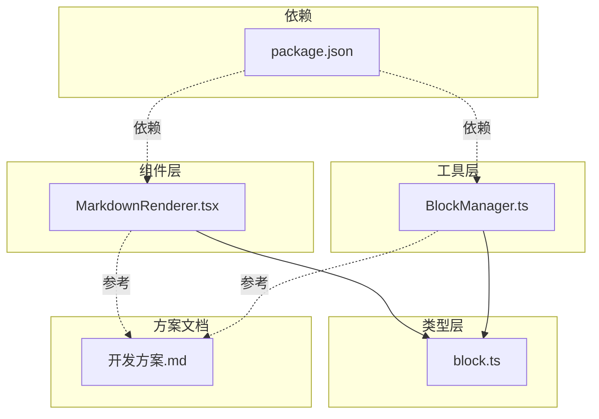
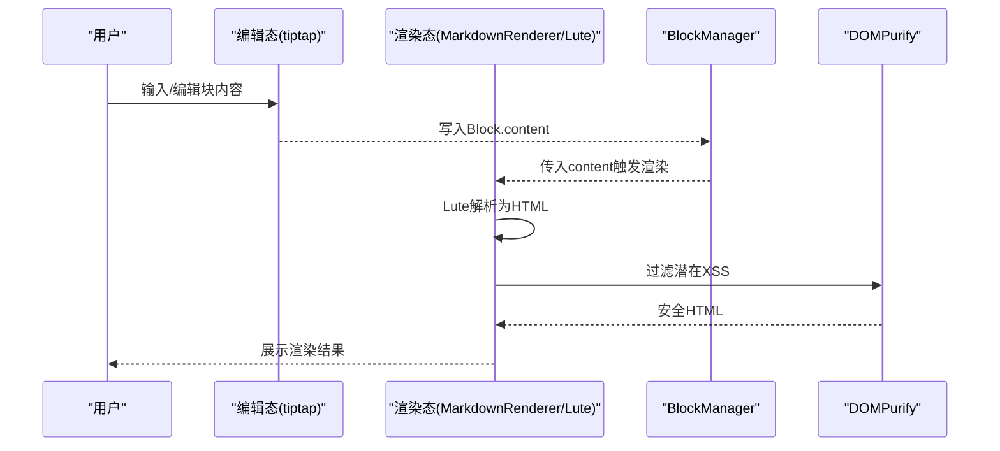
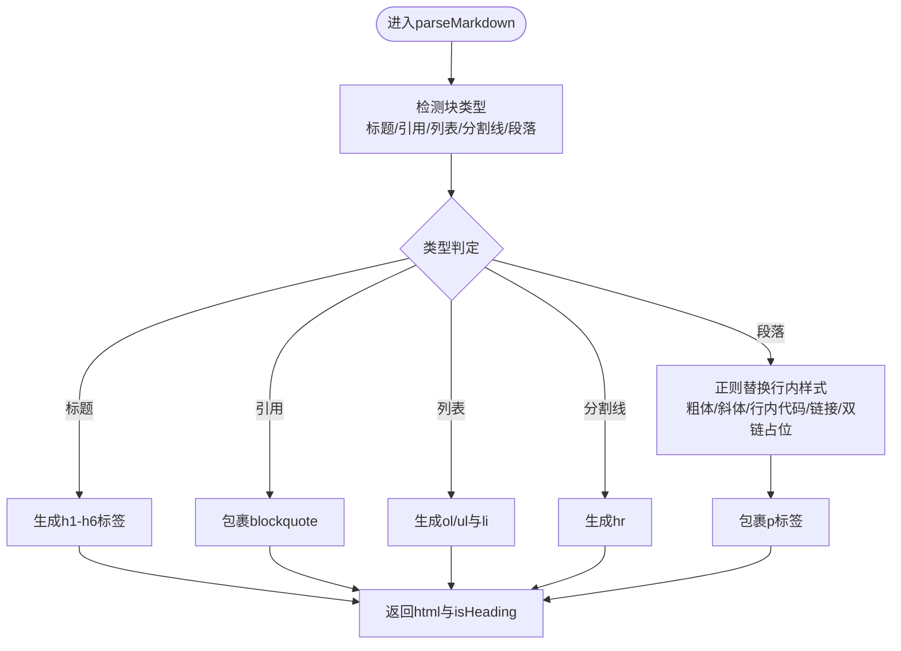
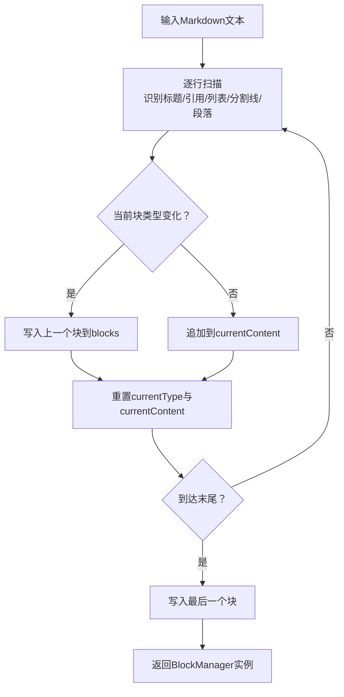
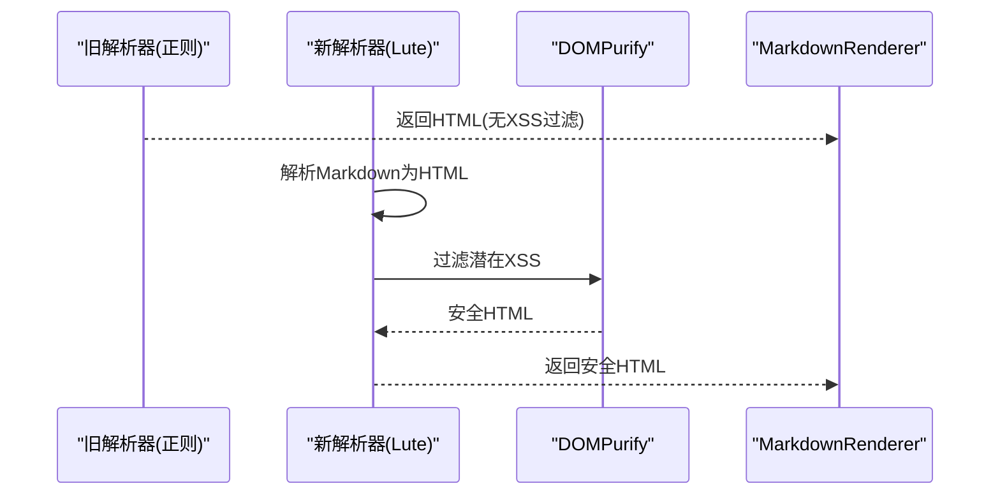
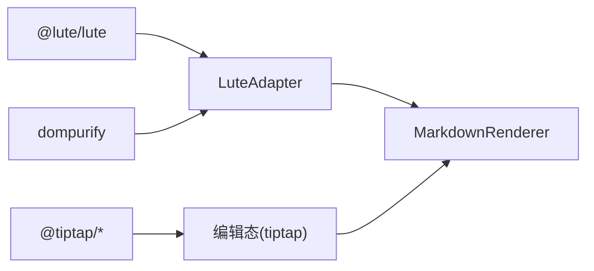

# 扩展Markdown解析能力

<cite>
**本文引用的文件**
- [MarkdownRenderer.tsx](file://src/components/MarkdownRenderer.tsx)
- [BlockManager.ts](file://src/utils/BlockManager.ts)
- [开发方案.md](file://docs/开发方案.md)
- [block.ts](file://src/types/block.ts)
- [package.json](file://package.json)
</cite>

## 目录
1. [引言](#引言)
2. [项目结构](#项目结构)
3. [核心组件](#核心组件)
4. [架构总览](#架构总览)
5. [详细组件分析](#详细组件分析)
6. [依赖分析](#依赖分析)
7. [性能考量](#性能考量)
8. [故障排查指南](#故障排查指南)
9. [结论](#结论)
10. [附录](#附录)

## 引言
本文件面向希望增强当前Markdown解析能力的开发者，围绕现有组件与方案文档，系统性说明从“正则解析”到“Lute集成”的迁移路径，重点覆盖以下方面：
- 分析现有MarkdownRenderer.tsx中的简易解析逻辑及其局限性
- 结合开发方案.md中的Lute集成计划，给出替换解析器的实施步骤
- 设计Lute解析适配层，扩展语法支持（如{color}、{size}等自定义标签）
- 确保与双链语法[[ ]]的兼容性
- 在BlockManager.ts中调整fromMarkdown与toMarkdown方法以适配新的解析流程
- 提供从正则解析到Lute迁移的代码对比示例思路
- 说明如何处理HTML安全（结合DOMPurify）

## 项目结构
本项目采用前端React + Electron的桌面应用架构，Markdown解析与块管理分别位于组件与工具层：
- 组件层：MarkdownRenderer.tsx负责将块内容渲染为HTML
- 工具层：BlockManager.ts负责块的序列化/反序列化（fromMarkdown/toMarkdown）
- 类型层：block.ts定义块的数据结构
- 方案文档：开发方案.md明确了Lute集成、富文本扩展与XSS防护等关键点



图表来源
- [MarkdownRenderer.tsx](file://src/components/MarkdownRenderer.tsx#L1-L125)
- [BlockManager.ts](file://src/utils/BlockManager.ts#L1-L227)
- [block.ts](file://src/types/block.ts#L1-L30)
- [开发方案.md](file://docs/开发方案.md#L1-L120)
- [package.json](file://package.json#L46-L66)

章节来源
- [MarkdownRenderer.tsx](file://src/components/MarkdownRenderer.tsx#L1-L125)
- [BlockManager.ts](file://src/utils/BlockManager.ts#L1-L227)
- [block.ts](file://src/types/block.ts#L1-L30)
- [开发方案.md](file://docs/开发方案.md#L1-L120)
- [package.json](file://package.json#L46-L66)

## 核心组件
- MarkdownRenderer.tsx：当前的简易解析器，包含标题、引用、列表、分割线、行内样式（粗体、斜体、行内代码、链接）以及双链占位符处理；最终通过dangerouslySetInnerHTML输出HTML。
- BlockManager.ts：提供fromMarkdown与toMarkdown静态方法，负责将Markdown字符串拆分为块集合，或将块集合还原为Markdown字符串。

章节来源
- [MarkdownRenderer.tsx](file://src/components/MarkdownRenderer.tsx#L9-L74)
- [BlockManager.ts](file://src/utils/BlockManager.ts#L101-L177)
- [BlockManager.ts](file://src/utils/BlockManager.ts#L219-L223)

## 架构总览
从“编辑态-渲染态”的视角看，当前渲染态由MarkdownRenderer.tsx承担，编辑态由tiptap驱动（见开发方案.md）。迁移至Lute后，渲染态将由Lute解析器接管，同时在BlockManager.ts中调整fromMarkdown与toMarkdown以适配Lute的块类型映射与导出兼容。



图表来源
- [开发方案.md](file://docs/开发方案.md#L32-L44)
- [MarkdownRenderer.tsx](file://src/components/MarkdownRenderer.tsx#L76-L122)
- [BlockManager.ts](file://src/utils/BlockManager.ts#L101-L177)

## 详细组件分析

### 现有解析器局限性分析（MarkdownRenderer.tsx）
- 语法覆盖有限：仅支持标题、引用、列表、分割线与少量行内样式，未覆盖富文本扩展语法（如{color}、{size}）与双链[[...]]的链接渲染。
- 正则解析易错：多行引用、列表项的识别依赖行首匹配，存在边界情况风险；行内样式替换顺序不当可能导致意外转义。
- 安全隐患：直接使用dangerouslySetInnerHTML，未进行XSS过滤。
- 可维护性：正则分支较多，扩展新语法需频繁改动，耦合度高。



图表来源
- [MarkdownRenderer.tsx](file://src/components/MarkdownRenderer.tsx#L9-L74)

章节来源
- [MarkdownRenderer.tsx](file://src/components/MarkdownRenderer.tsx#L9-L74)

### Lute集成适配层设计
- 解析器选择：依据开发方案.md，采用Lute（JS版）作为Markdown解析器，支持扩展语法与双链解析。
- 适配层职责：
  - 将Lute解析结果进行安全过滤（DOMPurify）
  - 将Lute块类型映射到BlockType（heading/paragraph/quote/bulletList/orderedList/horizontalRule）
  - 保留双链[[...]]的占位渲染，便于后续在编辑态中替换为可点击链接
- 与tiptap的协作：编辑态仍由tiptap负责，渲染态由Lute负责；两者通过Block.content字段衔接。

```mermaid
classDiagram
class LuteAdapter {
+parse(content : string) string
+sanitize(html : string) string
+mapToBlockType(luteType : string) BlockType
}
class MarkdownRenderer {
+parseMarkdown(content : string) {html,isHeading}
}
class BlockManager {
+fromMarkdown(markdown : string) BlockManager
+toMarkdown() : string
}
class DOMPurify {
+sanitize(html : string) string
}
MarkdownRenderer --> LuteAdapter : "调用"
LuteAdapter --> DOMPurify : "过滤"
BlockManager --> LuteAdapter : "块类型映射"
```

图表来源
- [开发方案.md](file://docs/开发方案.md#L10-L16)
- [开发方案.md](file://docs/开发方案.md#L94-L104)
- [开发方案.md](file://docs/开发方案.md#L118-L120)
- [MarkdownRenderer.tsx](file://src/components/MarkdownRenderer.tsx#L76-L122)
- [BlockManager.ts](file://src/utils/BlockManager.ts#L101-L177)

章节来源
- [开发方案.md](file://docs/开发方案.md#L10-L16)
- [开发方案.md](file://docs/开发方案.md#L94-L104)
- [开发方案.md](file://docs/开发方案.md#L118-L120)

### BlockManager适配（fromMarkdown与toMarkdown）
- fromMarkdown：将Markdown文本按块类型拆分，映射到BlockType；保留双链占位符，以便后续在渲染态中替换为可点击链接。
- toMarkdown：将块集合还原为Markdown字符串，保证导出兼容性。



图表来源
- [BlockManager.ts](file://src/utils/BlockManager.ts#L101-L177)
- [BlockManager.ts](file://src/utils/BlockManager.ts#L219-L223)

章节来源
- [BlockManager.ts](file://src/utils/BlockManager.ts#L101-L177)
- [BlockManager.ts](file://src/utils/BlockManager.ts#L219-L223)

### 富文本扩展语法（{color}、{size}、{style}）
- 开发方案.md明确支持富文本扩展语法，建议在Lute解析器中扩展自定义语法节点，渲染时生成带样式的元素。
- 实施建议：
  - 在Lute侧注册自定义语法解析器，将{color}/{size}/{style}转换为对应的HTML标签或内联样式
  - 渲染态输出前经DOMPurify过滤，确保属性白名单与协议校验
  - 编辑态保持原始Markdown，避免丢失扩展语法

章节来源
- [开发方案.md](file://docs/开发方案.md#L94-L104)
- [开发方案.md](file://docs/开发方案.md#L118-L120)

### 双链语法[[ ]]的兼容性
- 开发方案.md采用Obsidian式[[目标块ID]]标记双链，渲染时拦截该语法，替换为可点击链接（显示目标块标题），点击跳转至对应块。
- 实施建议：
  - 在Lute解析过程中拦截[[...]]，生成可点击链接节点
  - BlockManager保留references/referencedBy字段，便于后续引用面板与关系维护
  - 渲染态输出前经DOMPurify过滤，防止XSS

章节来源
- [开发方案.md](file://docs/开发方案.md#L38-L44)
- [开发方案.md](file://docs/开发方案.md#L118-L120)
- [block.ts](file://src/types/block.ts#L1-L17)

### 从正则解析到Lute迁移的代码对比示例思路
- 现状（正则解析）：在MarkdownRenderer.tsx中使用正则替换实现标题、引用、列表、行内样式与双链占位符。
- 迁移后（Lute解析）：在LuteAdapter中封装parse/sanitize/mapToBlockType；MarkdownRenderer调用LuteAdapter.parse并经DOMPurify过滤；BlockManager的fromMarkdown/toMarkdown保持块结构不变，仅映射类型与保留双链占位符。



图表来源
- [MarkdownRenderer.tsx](file://src/components/MarkdownRenderer.tsx#L76-L122)
- [开发方案.md](file://docs/开发方案.md#L118-L120)

## 依赖分析
- Lute与DOMPurify：开发方案.md明确使用Lute进行解析，并用DOMPurify过滤HTML以防止XSS。
- tiptap：开发方案.md明确tiptap负责编辑态，渲染态由Lute接管。
- 依赖声明：package.json中未包含Lute与DOMPurify，迁移前需补充依赖。



图表来源
- [开发方案.md](file://docs/开发方案.md#L10-L16)
- [开发方案.md](file://docs/开发方案.md#L118-L120)
- [package.json](file://package.json#L46-L66)

章节来源
- [开发方案.md](file://docs/开发方案.md#L10-L16)
- [开发方案.md](file://docs/开发方案.md#L118-L120)
- [package.json](file://package.json#L46-L66)

## 性能考量
- 开发方案.md建议在大文档场景下设置延迟解析（如300ms），避免输入时卡顿。
- 迁移到Lute后，建议：
  - 对高频输入事件进行节流/去抖
  - 仅对可见块进行实时解析
  - 对解析结果进行缓存，减少重复计算

章节来源
- [开发方案.md](file://docs/开发方案.md#L118-L120)

## 故障排查指南
- 渲染态出现XSS风险：确认已启用DOMPurify过滤；检查是否误用dangerouslySetInnerHTML。
- 双链无法点击：确认Lute解析器拦截了[[...]]并生成可点击链接；检查BlockManager是否正确保留references/referencedBy。
- 富文本扩展语法无效：确认Lute已注册{color}/{size}/{style}解析器；检查渲染态输出是否被DOMPurify过滤掉。
- 导出不兼容：确认BlockManager的toMarkdown输出与块类型映射一致；必要时在toMarkdown中保留扩展语法。

章节来源
- [开发方案.md](file://docs/开发方案.md#L118-L120)
- [MarkdownRenderer.tsx](file://src/components/MarkdownRenderer.tsx#L76-L122)
- [BlockManager.ts](file://src/utils/BlockManager.ts#L101-L177)
- [BlockManager.ts](file://src/utils/BlockManager.ts#L219-L223)

## 结论
通过引入Lute解析器与DOMPurify安全过滤，可以显著提升Markdown解析的准确性与安全性，并为富文本扩展语法与双链功能提供良好支撑。配合BlockManager的块类型映射与导出兼容，能够平滑完成从正则解析到Lute的迁移，同时满足开发方案.md中关于“编辑态-渲染态无缝切换”“双链功能”“富文本扩展”“XSS防护”等目标。

## 附录
- 迁移清单
  - 补充Lute与DOMPurify依赖
  - 实现LuteAdapter：parse/sanitize/mapToBlockType
  - 替换MarkdownRenderer.tsx中的解析逻辑为LuteAdapter
  - 在BlockManager.ts中完善fromMarkdown与toMarkdown的块类型映射
  - 保留双链占位符并在渲染态替换为可点击链接
  - 集成tiptap编辑态与Lute渲染态的协作流程
  - 加入延迟解析与缓存策略，优化大文档性能