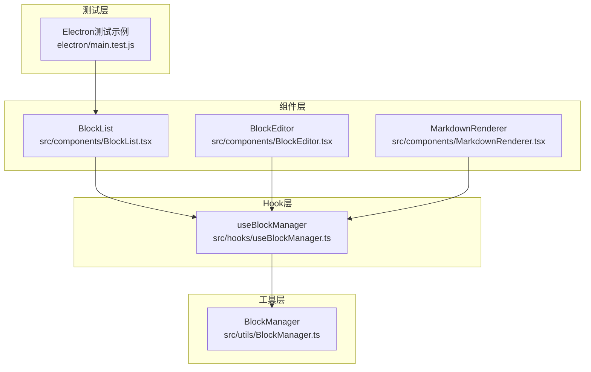
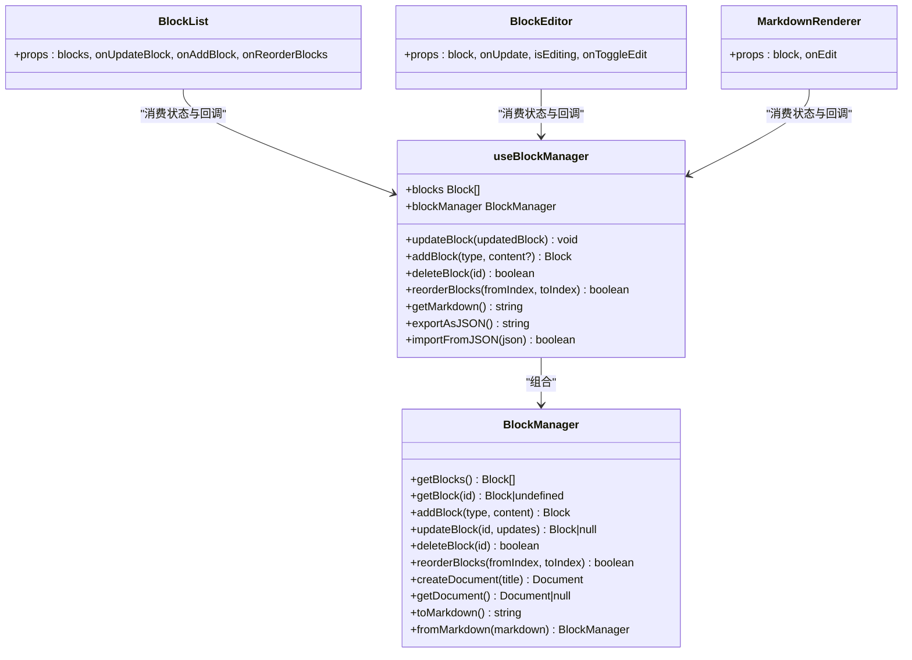
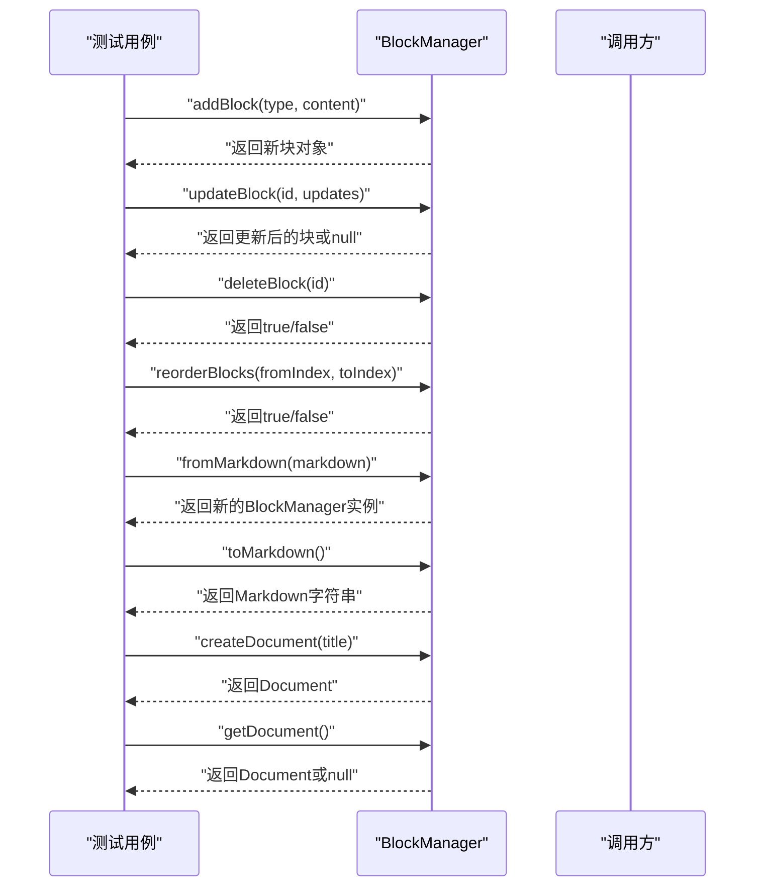
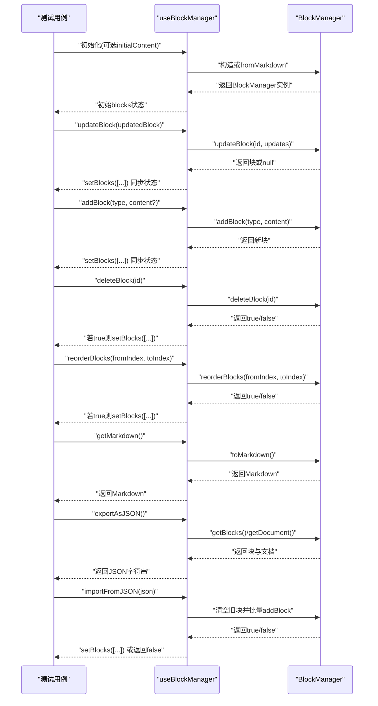
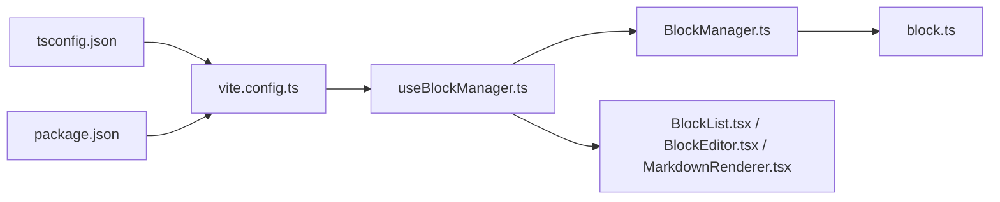

# 测试核心逻辑

<cite>
**本文引用的文件**
- [BlockManager.ts](file://src/utils/BlockManager.ts)
- [useBlockManager.ts](file://src/hooks/useBlockManager.ts)
- [block.ts](file://src/types/block.ts)
- [BlockList.tsx](file://src/components/BlockList.tsx)
- [BlockEditor.tsx](file://src/components/BlockEditor.tsx)
- [MarkdownRenderer.tsx](file://src/components/MarkdownRenderer.tsx)
- [main.test.js](file://electron/main.test.js)
- [vite.config.ts](file://vite.config.ts)
- [tsconfig.json](file://tsconfig.json)
- [package.json](file://package.json)
</cite>

## 目录
1. [简介](#简介)
2. [项目结构](#项目结构)
3. [核心组件](#核心组件)
4. [架构总览](#架构总览)
5. [详细组件分析](#详细组件分析)
6. [依赖关系分析](#依赖关系分析)
7. [性能考量](#性能考量)
8. [故障排查指南](#故障排查指南)
9. [结论](#结论)
10. [附录](#附录)

## 简介
本文件面向BlockManager与useBlockManager的单元测试最佳实践，结合现有测试框架（electron/main.test.js），给出覆盖addBlock、deleteBlock、reorderBlocks等关键方法的测试策略；同时为React侧的useBlockManager编写端到端测试，验证状态管理与回调行为。文档还提供Electron API的jest.mock隔离方案、测试覆盖率建议以及通过测试驱动方式验证新块类型的流程。

## 项目结构
- 工具层：BlockManager负责块集合的增删改查、重排、文档创建与序列化。
- Hook层：useBlockManager封装BlockManager，暴露React可调用的状态与回调。
- 组件层：BlockList、BlockEditor、MarkdownRenderer消费状态与回调，形成完整的编辑体验。
- 测试层：electron/main.test.js展示了Electron测试的基本骨架，可用于后续扩展为通用测试框架。

图表来源
- [BlockManager.ts](file://src/utils/BlockManager.ts#L1-L227)
- [useBlockManager.ts](file://src/hooks/useBlockManager.ts#L1-L97)
- [BlockList.tsx](file://src/components/BlockList.tsx#L1-L145)
- [BlockEditor.tsx](file://src/components/BlockEditor.tsx#L1-L116)
- [MarkdownRenderer.tsx](file://src/components/MarkdownRenderer.tsx#L1-L125)
- [main.test.js](file://electron/main.test.js#L1-L38)

章节来源
- [BlockManager.ts](file://src/utils/BlockManager.ts#L1-L227)
- [useBlockManager.ts](file://src/hooks/useBlockManager.ts#L1-L97)
- [BlockList.tsx](file://src/components/BlockList.tsx#L1-L145)
- [BlockEditor.tsx](file://src/components/BlockEditor.tsx#L1-L116)
- [MarkdownRenderer.tsx](file://src/components/MarkdownRenderer.tsx#L1-L125)
- [main.test.js](file://electron/main.test.js#L1-L38)

## 核心组件
- BlockManager
  - 提供块集合的增删改查、重排、文档创建、序列化与反序列化能力。
  - 关键方法：addBlock、updateBlock、deleteBlock、reorderBlocks、fromMarkdown、toMarkdown、createDocument、getDocument。
- useBlockManager
  - 将BlockManager与React状态绑定，暴露统一的回调接口，便于组件消费。
  - 关键导出：blocks、updateBlock、addBlock、deleteBlock、reorderBlocks、getMarkdown、exportAsJSON、importFromJSON、blockManager。

章节来源
- [BlockManager.ts](file://src/utils/BlockManager.ts#L1-L227)
- [useBlockManager.ts](file://src/hooks/useBlockManager.ts#L1-L97)
- [block.ts](file://src/types/block.ts#L1-L30)

## 架构总览
下图展示BlockManager与useBlockManager在应用中的角色与交互路径。

图表来源
- [BlockManager.ts](file://src/utils/BlockManager.ts#L1-L227)
- [useBlockManager.ts](file://src/hooks/useBlockManager.ts#L1-L97)
- [BlockList.tsx](file://src/components/BlockList.tsx#L1-L145)
- [BlockEditor.tsx](file://src/components/BlockEditor.tsx#L1-L116)
- [MarkdownRenderer.tsx](file://src/components/MarkdownRenderer.tsx#L1-L125)

## 详细组件分析

### BlockManager 单元测试策略
目标：验证addBlock、deleteBlock、reorderBlocks等方法的行为与边界条件（如无效索引）。

- 测试要点
  - addBlock：返回值包含唯一id、类型、内容、时间戳；追加到内部数组末尾。
  - updateBlock：存在id则合并更新并更新修改时间；不存在返回null。
  - deleteBlock：存在id删除并返回true；不存在返回false。
  - reorderBlocks：合法索引范围内移动成功返回true；越界返回false。
  - fromMarkdown：根据Markdown片段识别标题、引用、列表、分割线与段落，生成对应类型块。
  - toMarkdown：将块内容拼接为双换行分隔的Markdown文本。
  - createDocument/getDocument：创建文档快照并返回当前文档对象。

- 边界条件
  - 无效索引：fromIndex或toIndex越界时reorderBlocks返回false。
  - 不存在id：updateBlock/deleteBlock返回null/false。
  - 空内容：fromMarkdown处理空字符串与仅空白行。
  - 特殊字符：fromMarkdown对粗体、斜体、行内代码、链接、双链占位符的处理。

- 推荐测试文件命名
  - src/utils/__tests__/BlockManager.test.ts

- 示例测试流程（序列图）

图表来源
- [BlockManager.ts](file://src/utils/BlockManager.ts#L1-L227)

章节来源
- [BlockManager.ts](file://src/utils/BlockManager.ts#L1-L227)

### useBlockManager React 测试策略
目标：验证状态管理逻辑与回调行为，确保与BlockManager同步。

- 测试要点
  - 初始状态：当传入initialContent时，useBlockManager内部通过BlockManager.fromMarkdown初始化；否则为空。
  - updateBlock：调用blockManager.updateBlock后，本地blocks状态同步更新。
  - addBlock：调用blockManager.addBlock后，本地blocks状态同步更新并返回新块。
  - deleteBlock：成功删除后本地状态同步；失败返回false且状态不变。
  - reorderBlocks：成功重排后本地状态同步；失败返回false且状态不变。
  - getMarkdown：返回blockManager.toMarkdown的结果。
  - exportAsJSON/importFromJSON：导出为JSON字符串；导入时校验结构并清空旧块再批量添加，失败时返回false并打印错误。

- 推荐测试文件命名
  - src/hooks/__tests__/useBlockManager.test.ts

- 示例测试流程（序列图）

图表来源
- [useBlockManager.ts](file://src/hooks/useBlockManager.ts#L1-L97)
- [BlockManager.ts](file://src/utils/BlockManager.ts#L1-L227)

章节来源
- [useBlockManager.ts](file://src/hooks/useBlockManager.ts#L1-L97)

### Electron API 模拟与测试环境隔离
- 目标：在非Electron环境中运行测试，避免依赖真实Electron主进程API。
- 方案：
  - 使用jest.mock对Electron模块进行模拟，例如在测试前注入mock实现。
  - 在测试文件顶部引入并模拟app、BrowserWindow等常用API。
  - 对于需要Electron主进程行为的测试，可在单独的Electron测试文件中保留main.test.js的结构，但不与前端React测试耦合。

- 推荐做法
  - 在jest配置中设置globals或setupFilesAfterEnv，自动注入Electron mock。
  - 对于React测试，优先使用内存化的BlockManager与useBlockManager，避免直接依赖Electron。

章节来源
- [main.test.js](file://electron/main.test.js#L1-L38)
- [vite.config.ts](file://vite.config.ts#L1-L61)
- [tsconfig.json](file://tsconfig.json#L1-L37)
- [package.json](file://package.json#L1-L69)

### 测试覆盖率建议
- 行覆盖率：建议达到80%以上，关键分支（如reorderBlocks越界、updateBlock未命中id）必须覆盖。
- 函数覆盖率：建议达到90%以上，确保每个公共方法至少被调用一次。
- 圈复杂度：对复杂分支（如fromMarkdown解析）进行拆分测试，保证每条分支路径都有用例。
- 反馈循环：通过持续集成在PR中报告覆盖率，逐步提升。

### 通过测试驱动方式验证新块类型
- 步骤
  1) 在block.ts中新增BlockType枚举值与Block接口字段（如需要）。
  2) 在BlockManager中扩展fromMarkdown与toMarkdown对新类型的识别与序列化。
  3) 在useBlockManager中确认导出的回调能正确触发BlockManager的新类型处理。
  4) 编写BlockManager与useBlockManager的单元测试，覆盖新增类型的所有场景。
  5) 在BlockList中为新类型添加按钮或UI入口，确保回调能正确触发。
  6) 运行全量测试，观察覆盖率与失败用例，修复问题后提交。

- 新类型验证清单
  - fromMarkdown：输入Markdown片段是否正确识别为新类型。
  - toMarkdown：输出是否符合预期格式。
  - updateBlock：更新内容后是否保持类型一致。
  - reorderBlocks：重排后类型信息是否完整。
  - 导入/导出：JSON结构是否包含新类型字段，导入是否成功重建。

章节来源
- [block.ts](file://src/types/block.ts#L1-L30)
- [BlockManager.ts](file://src/utils/BlockManager.ts#L1-L227)
- [useBlockManager.ts](file://src/hooks/useBlockManager.ts#L1-L97)
- [BlockList.tsx](file://src/components/BlockList.tsx#L1-L145)

## 依赖关系分析
- BlockManager依赖Block与Document类型定义。
- useBlockManager依赖BlockManager与Block类型。
- 组件层依赖useBlockManager提供的状态与回调。
- 测试层依赖Vite与TypeScript配置，确保路径别名与模块解析正常。

图表来源
- [tsconfig.json](file://tsconfig.json#L1-L37)
- [vite.config.ts](file://vite.config.ts#L1-L61)
- [package.json](file://package.json#L1-L69)
- [useBlockManager.ts](file://src/hooks/useBlockManager.ts#L1-L97)
- [BlockManager.ts](file://src/utils/BlockManager.ts#L1-L227)
- [block.ts](file://src/types/block.ts#L1-L30)
- [BlockList.tsx](file://src/components/BlockList.tsx#L1-L145)
- [BlockEditor.tsx](file://src/components/BlockEditor.tsx#L1-L116)
- [MarkdownRenderer.tsx](file://src/components/MarkdownRenderer.tsx#L1-L125)

章节来源
- [tsconfig.json](file://tsconfig.json#L1-L37)
- [vite.config.ts](file://vite.config.ts#L1-L61)
- [package.json](file://package.json#L1-L69)

## 性能考量
- BlockManager内部操作为数组遍历与splice，时间复杂度O(n)；重排为O(n)。
- useBlockManager通过useState与useCallback缓存引用，减少不必要的重渲染。
- 导入/导出JSON时注意大文档的内存占用，必要时分批处理或延迟加载。

## 故障排查指南
- 常见问题
  - 重排越界：检查fromIndex与toIndex范围，确保在0..n-1之间。
  - 更新失败：确认id是否存在，updateBlock返回null表示未找到。
  - 导入失败：检查JSON结构是否包含blocks数组，异常时会返回false并打印错误。
- 定位手段
  - 在测试中断言返回值与状态变化，逐步缩小问题范围。
  - 使用console输出或调试器查看中间状态（如blocks数组长度、特定块的id/type）。

章节来源
- [BlockManager.ts](file://src/utils/BlockManager.ts#L1-L227)
- [useBlockManager.ts](file://src/hooks/useBlockManager.ts#L1-L97)

## 结论
通过为BlockManager与useBlockManager建立完善的单元测试与端到端测试，可以有效保障块编辑器的核心逻辑稳定。结合Electron API的mock隔离与覆盖率监控，能够快速迭代新功能（如新块类型），并在CI中持续验证质量。

## 附录
- 测试文件命名规范
  - 工具类：src/utils/__tests__/BlockManager.test.ts
  - Hook类：src/hooks/__tests__/useBlockManager.test.ts
- 依赖安装与脚本
  - 项目已包含Electron与React相关依赖，可直接运行测试脚本（如jest）。
- 路径别名
  - Vite与TS配置支持@/utils、@/hooks等路径别名，测试中可按需使用。