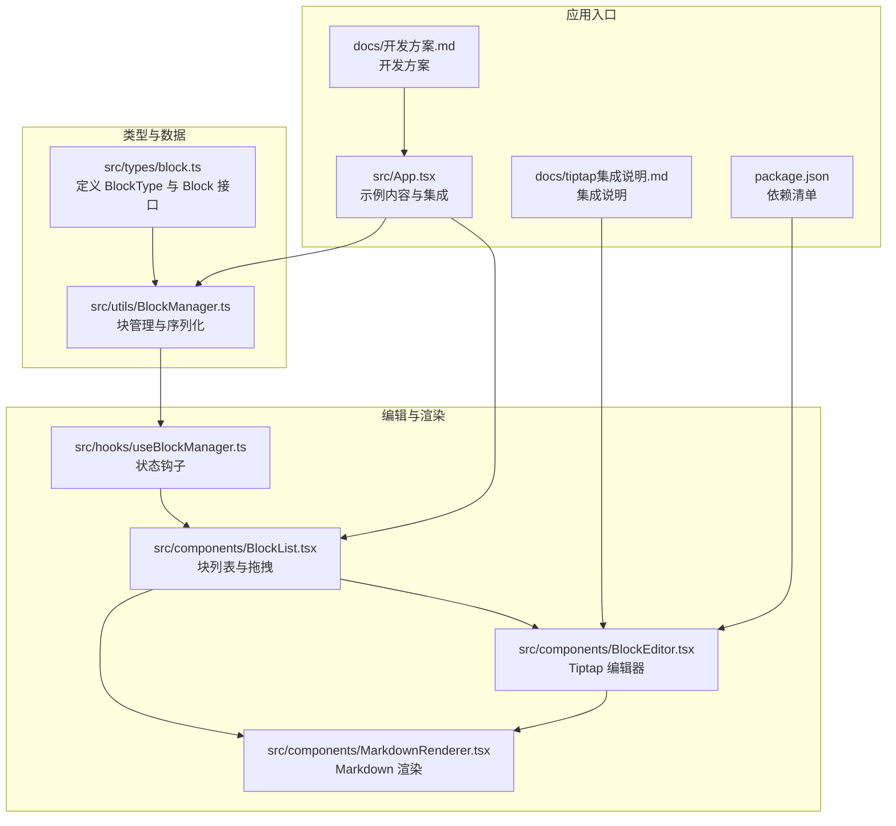
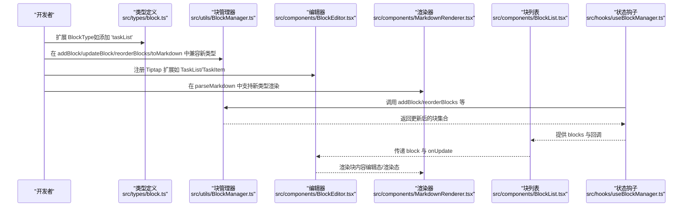
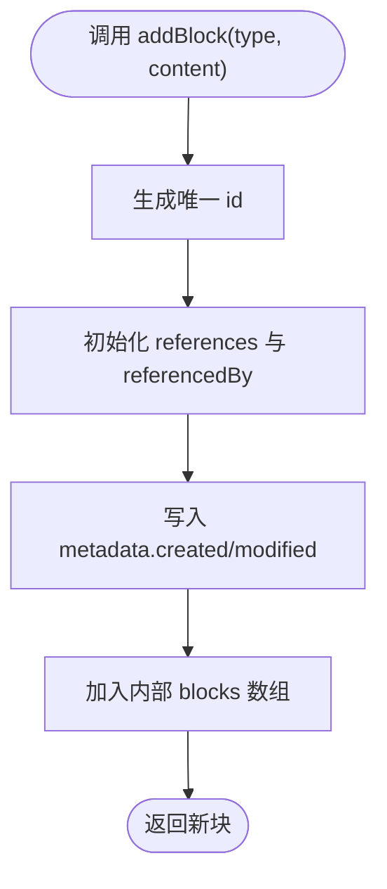
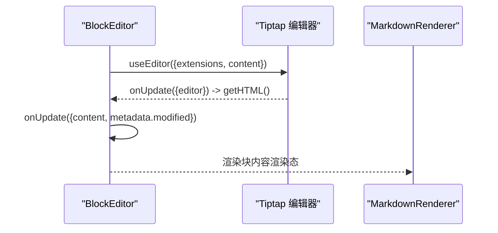
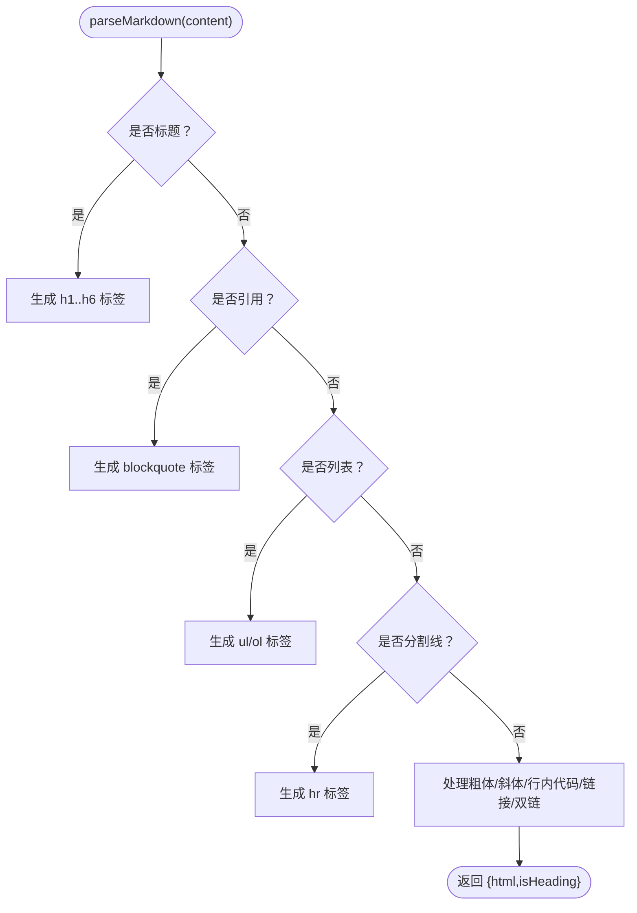
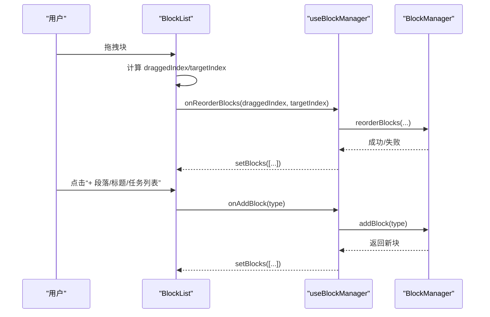
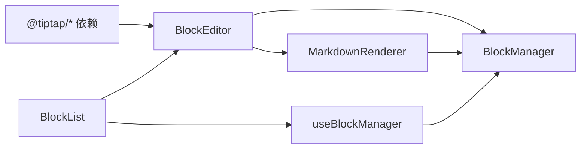

# 添加新块类型

<cite>
**本文引用的文件**
- [src/types/block.ts](file://src/types/block.ts)
- [src/utils/BlockManager.ts](file://src/utils/BlockManager.ts)
- [src/components/BlockEditor.tsx](file://src/components/BlockEditor.tsx)
- [src/components/MarkdownRenderer.tsx](file://src/components/MarkdownRenderer.tsx)
- [src/components/BlockList.tsx](file://src/components/BlockList.tsx)
- [src/hooks/useBlockManager.ts](file://src/hooks/useBlockManager.ts)
- [src/App.tsx](file://src/App.tsx)
- [docs/开发方案.md](file://docs/开发方案.md)
- [docs/tiptap集成说明.md](file://docs/tiptap集成说明.md)
- [package.json](file://package.json)
</cite>

## 目录
1. [简介](#简介)
2. [项目结构](#项目结构)
3. [核心组件](#核心组件)
4. [架构总览](#架构总览)
5. [详细组件分析](#详细组件分析)
6. [依赖关系分析](#依赖关系分析)
7. [性能考量](#性能考量)
8. [故障排查指南](#故障排查指南)
9. [结论](#结论)
10. [附录：完整示例（任务列表块）](#附录完整示例任务列表块)

## 简介
本文面向希望在系统中添加“新块类型”的开发者，提供从类型定义到编辑器扩展、再到渲染与序列化的全流程指导。我们将以“任务列表”为例，说明如何：
- 在类型定义中扩展 BlockType
- 在 BlockManager 中确保新类型被正确处理（添加、更新、序列化）
- 在 BlockEditor 中为新块类型注册 Tiptap 扩展
- 在 MarkdownRenderer 中支持新块类型的渲染
- 结合开发方案，确保与双链、拖拽等核心功能兼容

## 项目结构
系统采用“类型定义 + 数据管理 + UI 组件 + 渲染器”的分层组织方式：
- 类型定义：集中于 src/types/block.ts，统一约束 Block 的结构与 BlockType 的取值范围
- 数据管理：src/utils/BlockManager.ts 提供块的增删改查、重排序、Markdown 导入导出等能力
- 编辑器：src/components/BlockEditor.tsx 基于 Tiptap，负责块的编辑态与渲染态切换
- 渲染器：src/components/MarkdownRenderer.tsx 负责块内容的 Markdown 渲染
- 列表与交互：src/components/BlockList.tsx 负责块列表展示、拖拽排序与新增块
- 状态钩子：src/hooks/useBlockManager.ts 将 BlockManager 封装为 React Hook，便于组件使用
- 应用入口：src/App.tsx 展示示例内容并集成上述组件

图表来源
- [src/types/block.ts](file://src/types/block.ts#L1-L30)
- [src/utils/BlockManager.ts](file://src/utils/BlockManager.ts#L1-L227)
- [src/components/BlockEditor.tsx](file://src/components/BlockEditor.tsx#L1-L116)
- [src/components/MarkdownRenderer.tsx](file://src/components/MarkdownRenderer.tsx#L1-L125)
- [src/components/BlockList.tsx](file://src/components/BlockList.tsx#L1-L104)
- [src/hooks/useBlockManager.ts](file://src/hooks/useBlockManager.ts#L1-L97)
- [src/App.tsx](file://src/App.tsx#L1-L55)
- [docs/开发方案.md](file://docs/开发方案.md#L1-L366)
- [docs/tiptap集成说明.md](file://docs/tiptap集成说明.md#L1-L62)
- [package.json](file://package.json#L46-L66)

章节来源
- [src/types/block.ts](file://src/types/block.ts#L1-L30)
- [src/utils/BlockManager.ts](file://src/utils/BlockManager.ts#L1-L227)
- [src/components/BlockEditor.tsx](file://src/components/BlockEditor.tsx#L1-L116)
- [src/components/MarkdownRenderer.tsx](file://src/components/MarkdownRenderer.tsx#L1-L125)
- [src/components/BlockList.tsx](file://src/components/BlockList.tsx#L1-L104)
- [src/hooks/useBlockManager.ts](file://src/hooks/useBlockManager.ts#L1-L97)
- [src/App.tsx](file://src/App.tsx#L1-L55)
- [docs/开发方案.md](file://docs/开发方案.md#L1-L366)
- [docs/tiptap集成说明.md](file://docs/tiptap集成说明.md#L1-L62)
- [package.json](file://package.json#L46-L66)

## 核心组件
- 类型定义与数据模型
  - BlockType：当前已包含 heading、paragraph、quote、bulletList、orderedList、taskList、horizontalRule
  - Block：包含 id、type、content、references、referencedBy、metadata 等字段
- BlockManager：提供 addBlock、updateBlock、deleteBlock、reorderBlocks、fromMarkdown、toMarkdown 等方法
- BlockEditor：基于 Tiptap 的块编辑器，支持 Placeholder、TaskList、TaskItem、Blockquote、Heading、BulletList、OrderedList、HorizontalRule、DragHandle 等扩展
- MarkdownRenderer：将 Block.content 解析为 HTML，支持标题、引用、列表、分割线、粗体、斜体、行内代码、链接等；双链语法预留
- BlockList：块列表容器，负责拖拽排序与新增块按钮
- useBlockManager：封装 BlockManager，提供 React 组件可用的状态与操作方法

章节来源
- [src/types/block.ts](file://src/types/block.ts#L1-L30)
- [src/utils/BlockManager.ts](file://src/utils/BlockManager.ts#L1-L227)
- [src/components/BlockEditor.tsx](file://src/components/BlockEditor.tsx#L1-L116)
- [src/components/MarkdownRenderer.tsx](file://src/components/MarkdownRenderer.tsx#L1-L125)
- [src/components/BlockList.tsx](file://src/components/BlockList.tsx#L1-L104)
- [src/hooks/useBlockManager.ts](file://src/hooks/useBlockManager.ts#L1-L97)

## 架构总览
下面的序列图展示了“添加新块类型”的关键流程：从类型定义扩展，到 BlockManager 的处理，再到 BlockEditor 的 Tiptap 注册与 MarkdownRenderer 的渲染。

图表来源
- [src/types/block.ts](file://src/types/block.ts#L1-L30)
- [src/utils/BlockManager.ts](file://src/utils/BlockManager.ts#L1-L227)
- [src/components/BlockEditor.tsx](file://src/components/BlockEditor.tsx#L1-L116)
- [src/components/MarkdownRenderer.tsx](file://src/components/MarkdownRenderer.tsx#L1-L125)
- [src/components/BlockList.tsx](file://src/components/BlockList.tsx#L1-L104)
- [src/hooks/useBlockManager.ts](file://src/hooks/useBlockManager.ts#L1-L97)

## 详细组件分析

### 类型定义扩展（BlockType）
- 目标：在 src/types/block.ts 的 BlockType 联合类型中加入新类型（如 'taskList'）
- 影响范围：所有依赖 BlockType 的组件与管理器都会自动识别该类型
- 注意事项：确保 BlockManager、BlockEditor、MarkdownRenderer 对该类型进行相应处理

章节来源
- [src/types/block.ts](file://src/types/block.ts#L1-L30)

### BlockManager（添加/更新/序列化）
- 添加新块：addBlock(type, content) 会生成唯一 id、初始化 references 与 referencedBy，并写入 metadata.created/modified
- 更新块：updateBlock(id, updates) 合并更新并刷新 metadata.modified
- 删除块：deleteBlock(id) 从数组中移除
- 重排序：reorderBlocks(fromIndex, toIndex) 调整块顺序
- Markdown 导入：fromMarkdown(markdown) 会根据内容推断块类型（标题、引用、列表、分割线、段落），并生成对应块
- Markdown 导出：toMarkdown() 将各块 content 拼接为 Markdown 文本

图表来源
- [src/utils/BlockManager.ts](file://src/utils/BlockManager.ts#L21-L37)

章节来源
- [src/utils/BlockManager.ts](file://src/utils/BlockManager.ts#L1-L227)

### BlockEditor（Tiptap 扩展注册）
- 已注册扩展：Placeholder、TaskList、TaskItem（nested: true）、Blockquote、Heading(levels: [1..6])、BulletList、OrderedList、HorizontalRule、DragHandle
- 新类型注册：若新增 'taskList'，需在 BlockEditor 的 extensions 中添加相应的 Tiptap 扩展（如 @tiptap/extension-task-list 与 @tiptap/extension-task-item）
- 内容同步：editor.getHTML() 与 block.content 双向同步，onUpdate 回调触发更新

图表来源
- [src/components/BlockEditor.tsx](file://src/components/BlockEditor.tsx#L1-L116)

章节来源
- [src/components/BlockEditor.tsx](file://src/components/BlockEditor.tsx#L1-L116)
- [package.json](file://package.json#L46-L66)

### MarkdownRenderer（渲染逻辑）
- parseMarkdown(content) 支持标题、引用、列表（有序/无序）、分割线、段落及基础格式（粗体、斜体、行内代码、链接）
- 双链语法预留：content 中的 [[...]] 将被包裹为带样式的 span，便于后续扩展为可点击链接
- 渲染态点击：MarkdownRenderer 作为块的渲染态入口，点击后触发 onEdit 回调

图表来源
- [src/components/MarkdownRenderer.tsx](file://src/components/MarkdownRenderer.tsx#L1-L125)

章节来源
- [src/components/MarkdownRenderer.tsx](file://src/components/MarkdownRenderer.tsx#L1-L125)

### BlockList（拖拽与新增）
- 拖拽排序：通过 HTML5 拖拽事件 onDragStart/onDragOver/onDrop/onDragEnd，计算 draggedIndex 与 targetIndex，调用 onReorderBlocks
- 新增块：提供按钮触发 onAddBlock，传入块类型（如 paragraph、heading、taskList 等）

图表来源
- [src/components/BlockList.tsx](file://src/components/BlockList.tsx#L1-L104)
- [src/hooks/useBlockManager.ts](file://src/hooks/useBlockManager.ts#L1-L97)
- [src/utils/BlockManager.ts](file://src/utils/BlockManager.ts#L67-L76)

章节来源
- [src/components/BlockList.tsx](file://src/components/BlockList.tsx#L1-L104)
- [src/hooks/useBlockManager.ts](file://src/hooks/useBlockManager.ts#L1-L97)

## 依赖关系分析
- BlockEditor 依赖 Tiptap 生态（@tiptap/react、@tiptap/starter-kit、@tiptap/extension-* 等）
- MarkdownRenderer 为轻量解析器，不依赖外部 Markdown 库
- BlockManager 与 BlockEditor/MarkdownRenderer 解耦，通过 Block.content 与 BlockType 协作
- BlockList 与 useBlockManager 协作，实现拖拽与新增

图表来源
- [package.json](file://package.json#L46-L66)
- [src/components/BlockEditor.tsx](file://src/components/BlockEditor.tsx#L1-L116)
- [src/components/MarkdownRenderer.tsx](file://src/components/MarkdownRenderer.tsx#L1-L125)
- [src/utils/BlockManager.ts](file://src/utils/BlockManager.ts#L1-L227)
- [src/components/BlockList.tsx](file://src/components/BlockList.tsx#L1-L104)
- [src/hooks/useBlockManager.ts](file://src/hooks/useBlockManager.ts#L1-L97)

章节来源
- [package.json](file://package.json#L46-L66)
- [src/components/BlockEditor.tsx](file://src/components/BlockEditor.tsx#L1-L116)
- [src/components/MarkdownRenderer.tsx](file://src/components/MarkdownRenderer.tsx#L1-L125)
- [src/utils/BlockManager.ts](file://src/utils/BlockManager.ts#L1-L227)
- [src/components/BlockList.tsx](file://src/components/BlockList.tsx#L1-L104)
- [src/hooks/useBlockManager.ts](file://src/hooks/useBlockManager.ts#L1-L97)

## 性能考量
- 大文档场景：开发方案建议设置延迟解析，避免输入时卡顿
- XSS 防护：开发方案建议使用 DOMPurify 过滤渲染 HTML，防止恶意代码注入
- 渲染频率：在渲染器中可考虑节流/去抖策略，减少频繁重渲染

章节来源
- [docs/开发方案.md](file://docs/开发方案.md#L118-L121)

## 故障排查指南
- 新类型未生效
  - 检查 src/types/block.ts 是否已扩展 BlockType
  - 检查 BlockManager 的 addBlock/updateBlock 是否正确处理新类型
  - 检查 BlockEditor 是否注册了对应 Tiptap 扩展
  - 检查 MarkdownRenderer 是否在 parseMarkdown 中支持该类型
- 拖拽无效
  - 确认 BlockList 的拖拽事件绑定与 onReorderBlocks 回调正常
  - 确认 useBlockManager 的 reorderBlocks 调用成功并更新了 blocks
- 任务列表无法嵌套
  - 确认 TaskItem 已配置 nested: true
- 双链点击跳转
  - 确认 MarkdownRenderer 中的双链 span 已正确包裹，后续可扩展为可点击链接

章节来源
- [src/types/block.ts](file://src/types/block.ts#L1-L30)
- [src/utils/BlockManager.ts](file://src/utils/BlockManager.ts#L1-L227)
- [src/components/BlockEditor.tsx](file://src/components/BlockEditor.tsx#L1-L116)
- [src/components/MarkdownRenderer.tsx](file://src/components/MarkdownRenderer.tsx#L1-L125)
- [src/components/BlockList.tsx](file://src/components/BlockList.tsx#L1-L104)
- [src/hooks/useBlockManager.ts](file://src/hooks/useBlockManager.ts#L1-L97)

## 结论
添加新块类型的关键在于“类型定义 + 管理器 + 编辑器 + 渲染器”的一致性与扩展性。通过在 BlockType 中声明新类型，在 BlockManager 中保证 CRUD 与序列化逻辑兼容，在 BlockEditor 中注册 Tiptap 扩展，在 MarkdownRenderer 中支持渲染，即可实现与拖拽、双链等核心功能的平滑兼容。

## 附录：完整示例（任务列表块）
以下为“添加任务列表块”的完整步骤与路径指引（不直接展示代码内容，仅给出定位路径）：

1. 扩展类型定义
   - 在 src/types/block.ts 的 BlockType 中加入 'taskList'
   - 参考路径：[src/types/block.ts](file://src/types/block.ts#L1-L30)

2. 确保 BlockManager 兼容
   - addBlock、updateBlock、toMarkdown 等方法无需改动（因为 BlockManager 以 content 为准）
   - 若需要从 Markdown 导入任务列表，请确认 fromMarkdown 能正确识别任务列表语法
   - 参考路径：[src/utils/BlockManager.ts](file://src/utils/BlockManager.ts#L101-L217)

3. 注册 Tiptap 扩展
   - 在 BlockEditor.tsx 的 extensions 中启用 @tiptap/extension-task-list 与 @tiptap/extension-task-item（已存在）
   - 若新增其他块类型，需在此处添加对应扩展
   - 参考路径：[src/components/BlockEditor.tsx](file://src/components/BlockEditor.tsx#L1-L116)
   - 依赖清单参考：[package.json](file://package.json#L46-L66)

4. 支持渲染
   - 在 MarkdownRenderer.tsx 的 parseMarkdown 中为任务列表类型提供渲染逻辑（当前已支持段落、标题、引用、列表、分割线等）
   - 若需要特殊渲染，可在 parseMarkdown 中新增分支
   - 参考路径：[src/components/MarkdownRenderer.tsx](file://src/components/MarkdownRenderer.tsx#L1-L125)

5. 与拖拽兼容
   - BlockList.tsx 已实现拖拽排序，新增块类型不影响拖拽行为
   - 参考路径：[src/components/BlockList.tsx](file://src/components/BlockList.tsx#L1-L104)

6. 与双链兼容
   - Block.content 为 Markdown 源码，双链语法 [[...]] 将被保留并在渲染时以 span 包裹
   - 参考路径：[src/components/MarkdownRenderer.tsx](file://src/components/MarkdownRenderer.tsx#L64-L74)
   - Block 数据结构预留 references 与 referencedBy 字段，便于后续扩展
   - 参考路径：[src/types/block.ts](file://src/types/block.ts#L5-L17)

7. 示例内容与集成
   - App.tsx 提供示例内容，可参考其结构添加任务列表示例
   - 参考路径：[src/App.tsx](file://src/App.tsx#L1-L55)

8. 开发方案与集成说明
   - 参考开发方案与 tiptap 集成说明，确保新类型与整体架构一致
   - 参考路径：
     - [docs/开发方案.md](file://docs/开发方案.md#L1-L366)
     - [docs/tiptap集成说明.md](file://docs/tiptap集成说明.md#L1-L62)