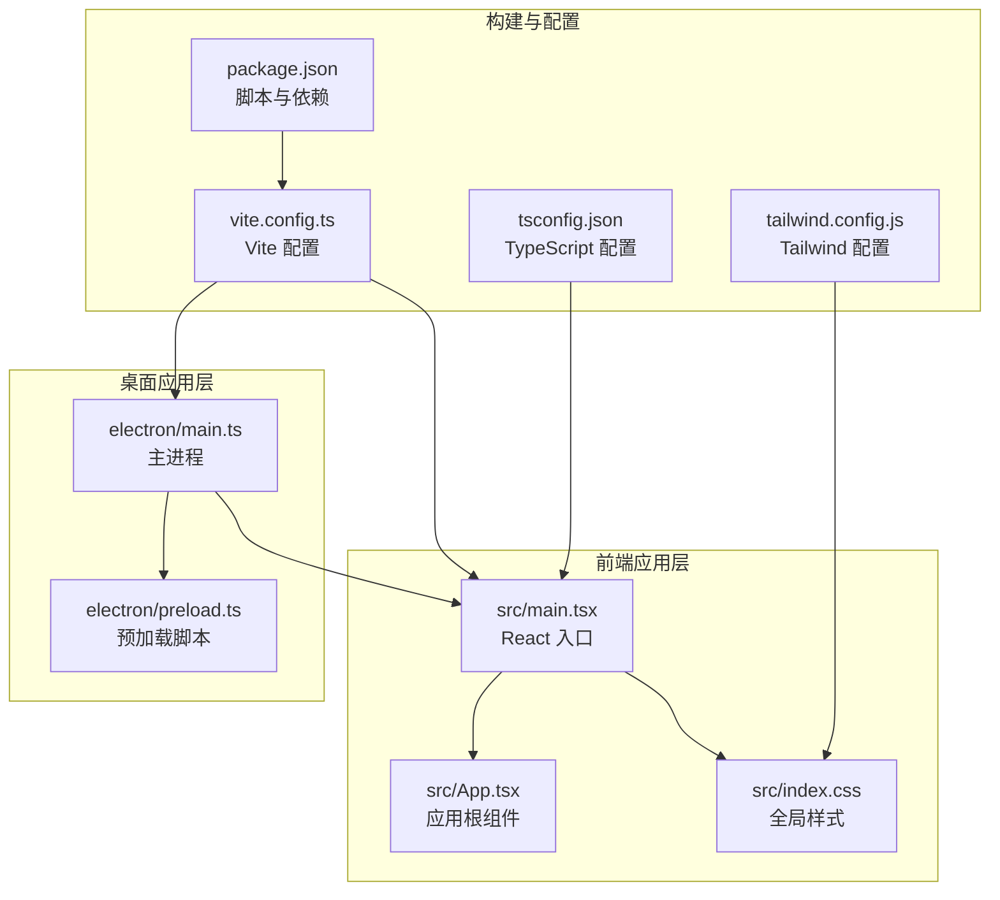
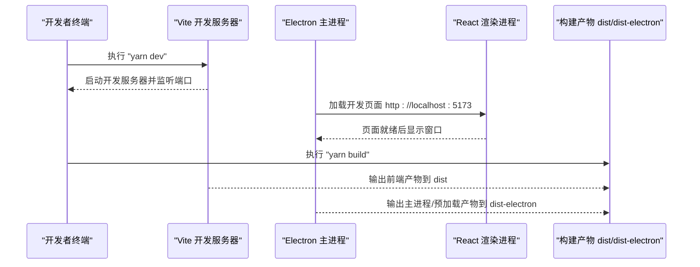
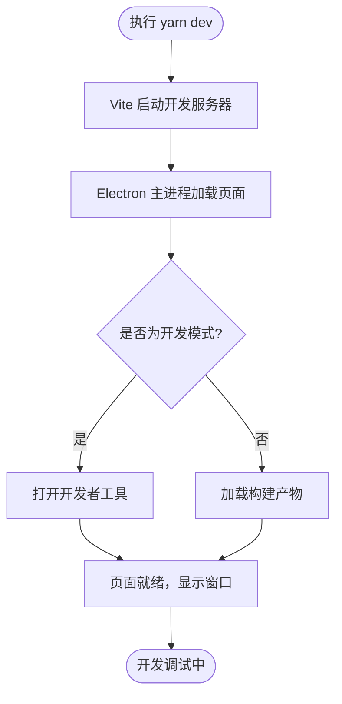
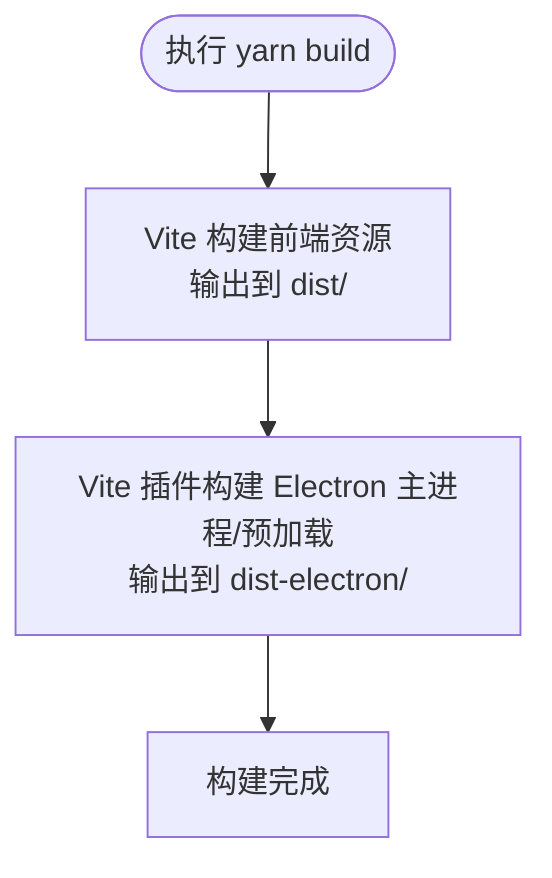
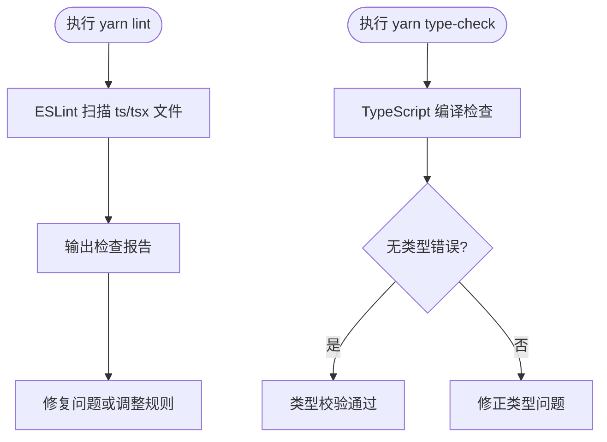
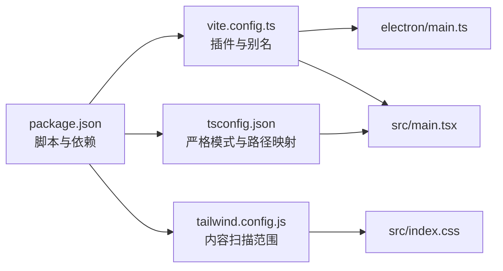

# 快速开始

<cite>
**本文引用的文件**
- [README.md](file://README.md)
- [package.json](file://package.json)
- [vite.config.ts](file://vite.config.ts)
- [electron/main.ts](file://electron/main.ts)
- [electron/preload.ts](file://electron/preload.ts)
- [src/main.tsx](file://src/main.tsx)
- [tsconfig.json](file://tsconfig.json)
- [tailwind.config.js](file://tailwind.config.js)
</cite>

## 目录
1. [简介](#简介)
2. [项目结构](#项目结构)
3. [核心组件](#核心组件)
4. [架构总览](#架构总览)
5. [详细组件分析](#详细组件分析)
6. [依赖关系分析](#依赖关系分析)
7. [性能与运行建议](#性能与运行建议)
8. [故障排查指南](#故障排查指南)
9. [结论](#结论)

## 简介
本指南面向初学者，帮助你在本地环境中快速搭建并运行本项目。项目采用 React + TypeScript + Vite + Electron 的技术栈，结合 Tailwind CSS 实现桌面端小说编辑器的开发与构建。你将学会如何满足环境要求、安装依赖、启动开发服务器、构建生产版本，以及进行代码检查与类型校验。

## 项目结构
项目采用“前端应用 + Electron 主进程 + 预加载脚本”的分层组织方式，配合 Vite 进行开发时的热更新与打包。主要目录与职责如下：
- electron/：Electron 主进程与预加载脚本
- src/：React 应用源码（入口、组件、样式、工具等）
- docs/：项目文档
- 根目录配置文件：构建、脚本、类型与样式相关配置

图表来源
- [vite.config.ts](file://vite.config.ts#L1-L61)
- [electron/main.ts](file://electron/main.ts#L1-L68)
- [electron/preload.ts](file://electron/preload.ts#L1-L21)
- [src/main.tsx](file://src/main.tsx#L1-L10)
- [package.json](file://package.json#L1-L69)
- [tsconfig.json](file://tsconfig.json#L1-L37)
- [tailwind.config.js](file://tailwind.config.js#L1-L38)

章节来源
- [README.md](file://README.md#L56-L75)

## 核心组件
- 开发服务器与构建工具：Vite
- 桌面应用框架：Electron
- 前端框架与语言：React + TypeScript
- 样式框架：Tailwind CSS
- 包管理：Yarn

章节来源
- [README.md](file://README.md#L5-L12)
- [package.json](file://package.json#L1-L69)

## 架构总览
下图展示了从命令到实际运行的端到端流程，包括开发服务器启动、Electron 加载前端页面、以及生产构建输出。

图表来源
- [vite.config.ts](file://vite.config.ts#L1-L61)
- [electron/main.ts](file://electron/main.ts#L1-L68)
- [package.json](file://package.json#L7-L13)

## 详细组件分析

### 环境要求与安装
- 环境要求
  - Node.js >= 18.0.0
  - Yarn >= 1.22.0
- 安装依赖
  - 使用 Yarn 安装项目依赖
- 常见问题
  - 权限问题：在部分系统上需要以管理员权限或调整目录权限
  - 网络代理：若因代理导致安装失败，请配置 Yarn 或 npm 的代理设置后再重试

章节来源
- [README.md](file://README.md#L15-L25)

### 启动开发服务器（Vite + Electron）
- 命令
  - 在项目根目录执行：yarn dev
- 行为说明
  - Vite 启动开发服务器并监听端口
  - Electron 主进程在开发模式下加载本地开发页面
  - 预加载脚本通过安全桥暴露有限 API 给渲染进程
- 注意事项
  - 开发模式下会自动打开开发者工具
  - 若端口被占用，Vite 会严格端口模式并报错

图表来源
- [vite.config.ts](file://vite.config.ts#L57-L61)
- [electron/main.ts](file://electron/main.ts#L23-L33)

章节来源
- [README.md](file://README.md#L26-L33)
- [vite.config.ts](file://vite.config.ts#L57-L61)
- [electron/main.ts](file://electron/main.ts#L1-L68)

### 构建生产版本
- 命令
  - 在项目根目录执行：yarn build
- 行为说明
  - Vite 将前端资源打包至 dist 目录
  - Electron 的主进程与预加载脚本被打包至 dist-electron 目录
- 输出位置
  - 前端产物：dist/
  - 桌面端产物：dist-electron/

图表来源
- [vite.config.ts](file://vite.config.ts#L41-L61)
- [package.json](file://package.json#L7-L13)

章节来源
- [README.md](file://README.md#L34-L41)
- [vite.config.ts](file://vite.config.ts#L41-L61)
- [package.json](file://package.json#L7-L13)

### 代码检查（ESLint）与类型校验（TypeScript）
- 代码检查（ESLint）
  - 命令：yarn lint
  - 作用：对 TypeScript/TSX 文件执行 ESLint 规则检查
- 类型校验（TypeScript）
  - 命令：yarn type-check
  - 作用：执行 TypeScript 编译检查，不输出 JS 文件
- 配置要点
  - TypeScript 严格模式开启，包含未使用变量/参数等规则
  - 路径别名映射统一指向 src 下各子目录

图表来源
- [package.json](file://package.json#L11-L12)
- [tsconfig.json](file://tsconfig.json#L18-L22)

章节来源
- [README.md](file://README.md#L42-L55)
- [package.json](file://package.json#L11-L12)
- [tsconfig.json](file://tsconfig.json#L18-L22)

### 项目入口与关键配置
- React 入口
  - src/main.tsx：创建根节点并渲染 App
- Electron 主进程
  - electron/main.ts：创建窗口、加载页面、处理生命周期事件
- 预加载脚本
  - electron/preload.ts：通过安全桥暴露受控 API
- 构建与路径别名
  - vite.config.ts：配置插件、输出目录、路径别名、开发服务器端口
- 样式与主题
  - tailwind.config.js：定义内容范围、颜色与字体族

章节来源
- [src/main.tsx](file://src/main.tsx#L1-L10)
- [electron/main.ts](file://electron/main.ts#L1-L68)
- [electron/preload.ts](file://electron/preload.ts#L1-L21)
- [vite.config.ts](file://vite.config.ts#L1-L61)
- [tailwind.config.js](file://tailwind.config.js#L1-L38)

## 依赖关系分析
- 脚本与依赖
  - package.json 中定义了 dev/build/preview/lint/type-check 等脚本
  - vite.config.ts 通过插件集成 Electron 支持
- 类型与路径映射
  - tsconfig.json 启用严格模式并配置路径别名，便于模块导入
- 样式与内容扫描
  - tailwind.config.js 指定内容扫描范围，确保按需生成样式

图表来源
- [package.json](file://package.json#L1-L69)
- [vite.config.ts](file://vite.config.ts#L1-L61)
- [tsconfig.json](file://tsconfig.json#L1-L37)
- [tailwind.config.js](file://tailwind.config.js#L1-L38)

章节来源
- [package.json](file://package.json#L1-L69)
- [vite.config.ts](file://vite.config.ts#L1-L61)
- [tsconfig.json](file://tsconfig.json#L1-L37)
- [tailwind.config.js](file://tailwind.config.js#L1-L38)

## 性能与运行建议
- 开发阶段
  - 使用 Vite 的热更新能力提升开发体验
  - Electron 主进程在开发模式下加载本地页面，避免额外网络请求
- 生产构建
  - 构建前确保清理输出目录，避免残留文件影响产物
  - Tailwind 内容扫描范围应覆盖所有使用样式的文件，减少未使用样式体积
- 资源与端口
  - 开发服务器默认端口固定，避免与其他服务冲突
  - 如需更改端口，请同步修改 Electron 加载地址与 Vite 配置

章节来源
- [vite.config.ts](file://vite.config.ts#L57-L61)
- [electron/main.ts](file://electron/main.ts#L23-L28)
- [tailwind.config.js](file://tailwind.config.js#L1-L6)

## 故障排查指南
- 安装失败
  - 权限问题：尝试以管理员权限运行或调整目录权限
  - 网络代理：配置 Yarn 或 npm 的代理后再重试
- 端口占用
  - Vite 在严格端口模式下启动，若端口被占用会报错
  - 修改 vite.config.ts 中的端口配置或释放占用端口
- Electron 页面空白
  - 确认 Vite 已启动且可访问 http://localhost:5173
  - 检查开发工具是否正常打开，确认前端资源已正确编译
- 类型错误
  - 执行 yarn type-check 排查并修复类型问题
  - 检查 tsconfig.json 的严格模式与路径映射是否正确
- ESLint 报错
  - 执行 yarn lint 并根据报告逐项修复
  - 如需临时忽略，仅在必要时调整规则而非长期放宽

章节来源
- [README.md](file://README.md#L15-L25)
- [vite.config.ts](file://vite.config.ts#L57-L61)
- [electron/main.ts](file://electron/main.ts#L23-L33)
- [package.json](file://package.json#L11-L12)
- [tsconfig.json](file://tsconfig.json#L18-L22)

## 结论
通过本指南，你可以顺利完成环境准备、依赖安装、开发调试与生产构建，并掌握代码检查与类型校验的基本方法。遇到问题时，优先检查端口占用、代理配置与类型/规则问题。祝你开发顺利！