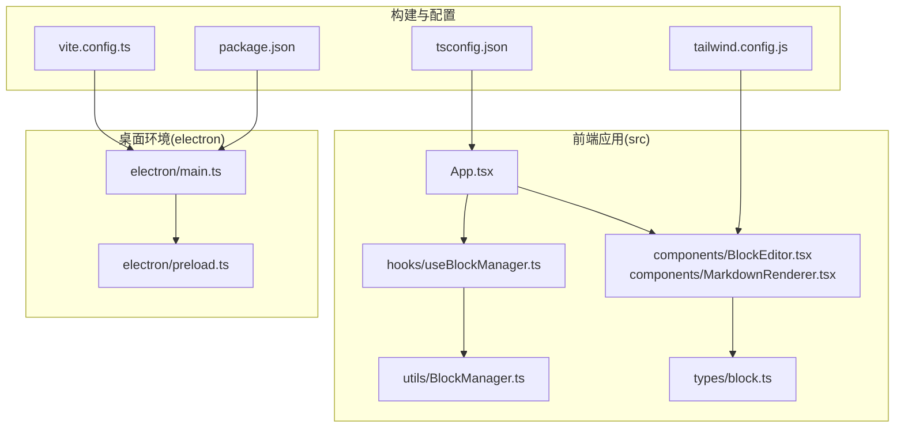
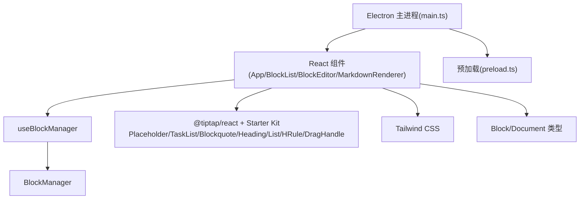
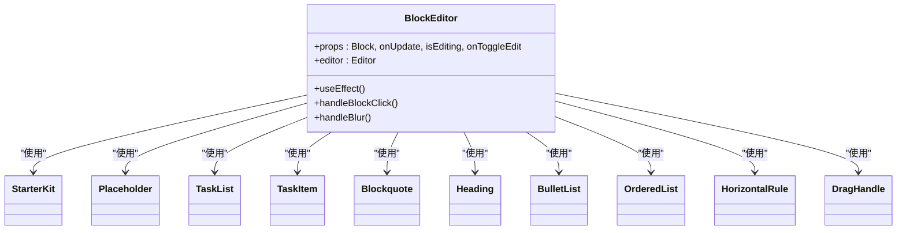
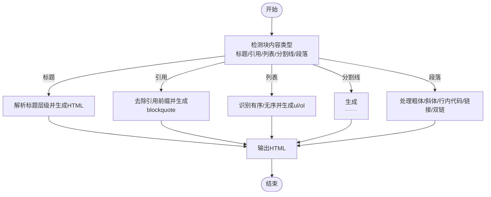
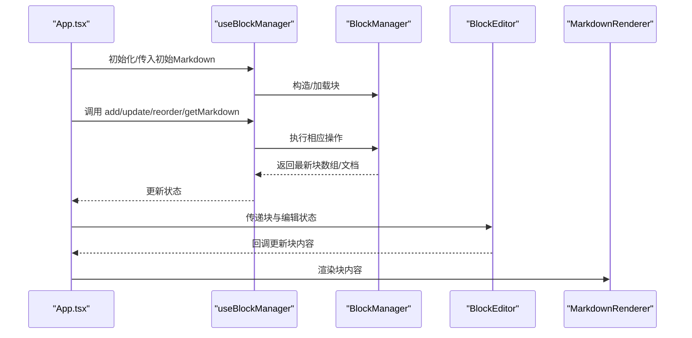
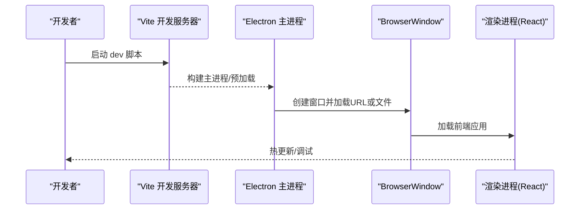
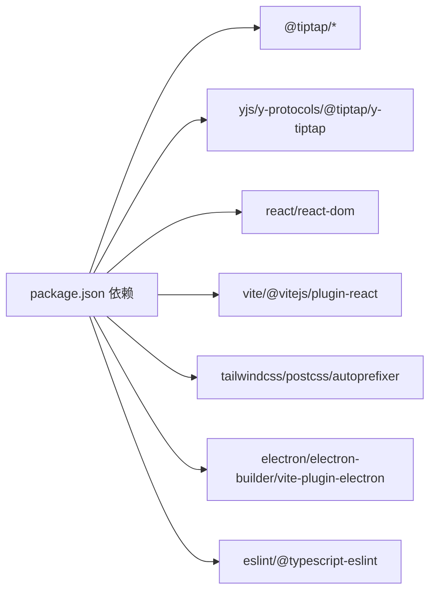

# 技术栈与依赖

<cite>
**本文引用的文件**
- [package.json](file://package.json)
- [vite.config.ts](file://vite.config.ts)
- [tsconfig.json](file://tsconfig.json)
- [tailwind.config.js](file://tailwind.config.js)
- [electron/main.ts](file://electron/main.ts)
- [electron/preload.ts](file://electron/preload.ts)
- [src/App.tsx](file://src/App.tsx)
- [src/hooks/useBlockManager.ts](file://src/hooks/useBlockManager.ts)
- [src/utils/BlockManager.ts](file://src/utils/BlockManager.ts)
- [src/components/BlockEditor.tsx](file://src/components/BlockEditor.tsx)
- [src/components/MarkdownRenderer.tsx](file://src/components/MarkdownRenderer.tsx)
- [src/types/block.ts](file://src/types/block.ts)
- [docs/tiptap集成说明.md](file://docs/tiptap集成说明.md)
- [docs/开发方案.md](file://docs/开发方案.md)
</cite>

## 目录
1. [引言](#引言)
2. [项目结构](#项目结构)
3. [核心组件](#核心组件)
4. [架构总览](#架构总览)
5. [详细组件分析](#详细组件分析)
6. [依赖关系分析](#依赖关系分析)
7. [性能考量](#性能考量)
8. [故障排查指南](#故障排查指南)
9. [结论](#结论)
10. [附录](#附录)

## 引言
本项目旨在构建一款桌面端小说块编辑器，融合“块编辑器灵活性”“Markdown即时渲染”“双链功能”，并具备本地优先存储与未来云端同步扩展能力。技术栈围绕 Electron + React + TypeScript 构建，前端使用 Vite 提供开发与构建体验，富文本编辑采用 Tiptap（基于 ProseMirror），样式使用 Tailwind CSS，协作能力通过 yjs 与 @tiptap/y-tiptap 实现，打包使用 electron-builder。项目已明确未来将集成 Lute 解析器以提升 Markdown 渲染精度与扩展性。

## 项目结构
项目采用前后端一体化的桌面应用结构：
- 前端应用位于 src 目录，包含组件、Hooks、工具类、类型定义与入口文件
- 构建与开发工具位于根目录，包括 Vite 配置、TypeScript 配置、Tailwind 配置、Electron 主进程与预加载脚本
- 文档位于 docs 目录，包含 tiptap 集成说明与整体开发方案

图表来源
- [vite.config.ts](file://vite.config.ts#L1-L61)
- [tsconfig.json](file://tsconfig.json#L1-L37)
- [tailwind.config.js](file://tailwind.config.js#L1-L38)
- [electron/main.ts](file://electron/main.ts#L1-L68)
- [electron/preload.ts](file://electron/preload.ts#L1-L21)
- [src/App.tsx](file://src/App.tsx#L1-L156)
- [src/hooks/useBlockManager.ts](file://src/hooks/useBlockManager.ts#L1-L97)
- [src/utils/BlockManager.ts](file://src/utils/BlockManager.ts#L1-L227)
- [src/components/BlockEditor.tsx](file://src/components/BlockEditor.tsx#L1-L116)
- [src/components/MarkdownRenderer.tsx](file://src/components/MarkdownRenderer.tsx#L1-L125)
- [src/types/block.ts](file://src/types/block.ts#L1-L30)

章节来源
- [vite.config.ts](file://vite.config.ts#L1-L61)
- [tsconfig.json](file://tsconfig.json#L1-L37)
- [tailwind.config.js](file://tailwind.config.js#L1-L38)
- [electron/main.ts](file://electron/main.ts#L1-L68)
- [electron/preload.ts](file://electron/preload.ts#L1-L21)
- [src/App.tsx](file://src/App.tsx#L1-L156)

## 核心组件
- 应用入口与状态管理
  - App.tsx：负责页面头部、工具栏、导入导出与 BlockList 的组合，调用 useBlockManager 提供的块集合与操作方法
  - useBlockManager.ts：封装 BlockManager 的状态与操作，提供增删改查、排序、导出/导入等方法
  - BlockManager.ts：核心数据结构与算法，负责块的创建、更新、删除、排序、Markdown 导入导出
- 富文本编辑与渲染
  - BlockEditor.tsx：基于 @tiptap/react 与 Starter Kit，集成 Placeholder、TaskList、Blockquote、Heading、BulletList、OrderedList、HorizontalRule、DragHandle 等扩展，支持编辑态与渲染态切换
  - MarkdownRenderer.tsx：对块内容进行简易 Markdown 解析与渲染，支持标题、引用、列表、分割线与基础格式，预留双链语法支持
- 类型系统
  - block.ts：定义 Block 与 Document 的类型与元数据字段，支撑块编辑器的数据模型

章节来源
- [src/App.tsx](file://src/App.tsx#L1-L156)
- [src/hooks/useBlockManager.ts](file://src/hooks/useBlockManager.ts#L1-L97)
- [src/utils/BlockManager.ts](file://src/utils/BlockManager.ts#L1-L227)
- [src/components/BlockEditor.tsx](file://src/components/BlockEditor.tsx#L1-L116)
- [src/components/MarkdownRenderer.tsx](file://src/components/MarkdownRenderer.tsx#L1-L125)
- [src/types/block.ts](file://src/types/block.ts#L1-L30)

## 架构总览
整体架构分为三层：
- 前端渲染层：React + Tiptap + Tailwind CSS，负责编辑态富文本与渲染态 Markdown 渲染
- 数据管理层：BlockManager + useBlockManager，负责块数据的增删改查、排序与序列化
- 桌面运行时层：Electron 主进程与预加载脚本，负责窗口生命周期、开发/生产加载策略与安全隔离

图表来源
- [src/App.tsx](file://src/App.tsx#L1-L156)
- [src/hooks/useBlockManager.ts](file://src/hooks/useBlockManager.ts#L1-L97)
- [src/utils/BlockManager.ts](file://src/utils/BlockManager.ts#L1-L227)
- [src/components/BlockEditor.tsx](file://src/components/BlockEditor.tsx#L1-L116)
- [src/components/MarkdownRenderer.tsx](file://src/components/MarkdownRenderer.tsx#L1-L125)
- [src/types/block.ts](file://src/types/block.ts#L1-L30)
- [electron/main.ts](file://electron/main.ts#L1-L68)
- [electron/preload.ts](file://electron/preload.ts#L1-L21)

## 详细组件分析

### 富文本编辑器组件 BlockEditor 分析
- 设计要点
  - 基于 @tiptap/react 的 useEditor 初始化编辑器实例，启用 Starter Kit 与 Placeholder、TaskList、Blockquote、Heading、BulletList、OrderedList、HorizontalRule、DragHandle 等扩展
  - 通过 isEditing 控制编辑器可编辑性，实现编辑态与渲染态切换
  - 监听编辑器内容变化，将 HTML 内容回写到块对象并更新元数据
  - 通过 EditorContent 渲染编辑器内容，提供拖拽手柄与点击编辑交互
- 协作与扩展
  - 项目已引入 @tiptap/extension-collaboration 与 @tiptap/y-tiptap、yjs、y-protocols，为后续协作编辑奠定基础
- 复杂度与性能
  - 编辑器初始化与扩展加载存在一次性开销，但编辑态切换与内容更新为 O(1) 级别的 DOM 操作

图表来源
- [src/components/BlockEditor.tsx](file://src/components/BlockEditor.tsx#L1-L116)

章节来源
- [src/components/BlockEditor.tsx](file://src/components/BlockEditor.tsx#L1-L116)
- [package.json](file://package.json#L46-L66)

### Markdown 渲染器组件 MarkdownRenderer 分析
- 设计要点
  - 对块内容进行简易 Markdown 解析，支持标题、引用、列表、分割线与基础格式（粗体、斜体、行内代码、链接）
  - 预留双链语法支持，便于后续接入 Lute 解析器
  - 通过 dangerouslySetInnerHTML 输出 HTML，配合 Tailwind 样式美化渲染效果
- 复杂度与性能
  - 解析逻辑为线性扫描，时间复杂度 O(n)，适合小到中等规模块内容
  - 建议在大文档场景下引入节流/去抖与缓存策略

图表来源
- [src/components/MarkdownRenderer.tsx](file://src/components/MarkdownRenderer.tsx#L1-L125)

章节来源
- [src/components/MarkdownRenderer.tsx](file://src/components/MarkdownRenderer.tsx#L1-L125)

### 数据管理与状态流转分析
- 状态来源与流向
  - App.tsx 通过 useBlockManager 获取 blocks 与操作方法
  - useBlockManager 调用 BlockManager 执行增删改查与排序
  - BlockManager 提供 fromMarkdown 与 toMarkdown，支撑导入导出
- 数据结构
  - Block：包含 id、type、content、references、referencedBy、metadata
  - Document：包含 id、title、blocks、created、modified

图表来源
- [src/App.tsx](file://src/App.tsx#L1-L156)
- [src/hooks/useBlockManager.ts](file://src/hooks/useBlockManager.ts#L1-L97)
- [src/utils/BlockManager.ts](file://src/utils/BlockManager.ts#L1-L227)
- [src/components/BlockEditor.tsx](file://src/components/BlockEditor.tsx#L1-L116)
- [src/components/MarkdownRenderer.tsx](file://src/components/MarkdownRenderer.tsx#L1-L125)
- [src/types/block.ts](file://src/types/block.ts#L1-L30)

章节来源
- [src/App.tsx](file://src/App.tsx#L1-L156)
- [src/hooks/useBlockManager.ts](file://src/hooks/useBlockManager.ts#L1-L97)
- [src/utils/BlockManager.ts](file://src/utils/BlockManager.ts#L1-L227)
- [src/types/block.ts](file://src/types/block.ts#L1-L30)

### 桌面运行时与开发流程分析
- Electron 主进程
  - 创建窗口、设置 webPreferences、开发/生产加载策略、窗口生命周期事件处理
  - 安全策略：禁用 nodeIntegration，启用 contextIsolation，并通过 preload 暴露受控 API
- 预加载脚本
  - 使用 contextBridge 暴露受控 API 至渲染进程，声明全局类型
- Vite 集成
  - 通过 vite-plugin-electron 同时构建主进程与预加载脚本，开发时自动热更新

图表来源
- [vite.config.ts](file://vite.config.ts#L1-L61)
- [electron/main.ts](file://electron/main.ts#L1-L68)
- [electron/preload.ts](file://electron/preload.ts#L1-L21)

章节来源
- [electron/main.ts](file://electron/main.ts#L1-L68)
- [electron/preload.ts](file://electron/preload.ts#L1-L21)
- [vite.config.ts](file://vite.config.ts#L1-L61)

## 依赖关系分析
- 前端核心依赖
  - @tiptap/react、@tiptap/starter-kit、@tiptap/pm：富文本编辑核心
  - @tiptap/extension-* 系列：Placeholder、TaskList、Blockquote、Heading、BulletList、OrderedList、HorizontalRule、DragHandle
  - @tiptap/y-tiptap、yjs、y-protocols：协作编辑基础
  - react、react-dom：组件化与渲染
- 构建与工具
  - vite、@vitejs/plugin-react：开发与构建
  - tailwindcss、postcss、autoprefixer：原子化样式
  - concurrently、wait-on：开发时并行启动
  - eslint、@typescript-eslint：代码质量
- 桌面端
  - electron、electron-builder：打包与运行时
  - vite-plugin-electron：主进程/预加载脚本构建集成

图表来源
- [package.json](file://package.json#L25-L66)

章节来源
- [package.json](file://package.json#L25-L66)

## 性能考量
- 富文本编辑
  - Tiptap 基于 ProseMirror，具备良好性能；建议在大量块场景下限制实时协作与频繁重渲染
- Markdown 渲染
  - 当前渲染器为简易解析，建议在大文档场景引入节流/去抖与缓存策略；未来接入 Lute 后可显著提升解析效率与准确性
- 构建与开发
  - Vite 提供快速冷启动与热更新；开发时注意避免不必要的重打包
- 桌面端
  - Electron 主进程与渲染进程分离，预加载脚本通过 contextBridge 暴露受控 API，兼顾安全与性能

[本节为通用指导，无需列出章节来源]

## 故障排查指南
- 开发服务器无法访问
  - 检查 vite.config.ts 中 server.port 与严格端口配置
  - 确认开发模式下主进程加载 http://localhost:5173
- 窗口空白或白屏
  - 检查 Electron 主进程加载逻辑与 ready-to-show 显示时机
  - 确认生产模式下加载 dist/index.html
- 预加载 API 未生效
  - 确认 preload.ts 中 contextBridge.exposeInMainWorld 的暴露方法与类型声明
- 富文本编辑异常
  - 检查 BlockEditor 的 isEditing 状态同步与 editor.setEditable 调用
  - 确认编辑器扩展安装与配置正确
- Markdown 渲染不一致
  - 简易渲染器对复杂语法支持有限，建议逐步迁移至 Lute

章节来源
- [vite.config.ts](file://vite.config.ts#L1-L61)
- [electron/main.ts](file://electron/main.ts#L1-L68)
- [electron/preload.ts](file://electron/preload.ts#L1-L21)
- [src/components/BlockEditor.tsx](file://src/components/BlockEditor.tsx#L1-L116)
- [src/components/MarkdownRenderer.tsx](file://src/components/MarkdownRenderer.tsx#L1-L125)

## 结论
本项目以 Electron + React + TypeScript 为基础，结合 Vite 提供高效开发体验，使用 Tiptap 作为富文本核心，Tailwind CSS 实现原子化样式，具备良好的扩展性与协作潜力。当前已具备块编辑、Markdown 渲染与导入导出能力，未来将通过 Lute 解析器进一步提升渲染精度与扩展性，并可基于 yjs 与 @tiptap/y-tiptap 实现协作编辑。

[本节为总结性内容，无需列出章节来源]

## 附录

### 关键依赖与角色
- @tiptap/react、@tiptap/starter-kit、@tiptap/pm：富文本编辑核心，提供块编辑、扩展生态与类型支持
- @tiptap/extension-* 系列：Placeholder、TaskList、Blockquote、Heading、BulletList、OrderedList、HorizontalRule、DragHandle，满足块编辑与富文本需求
- @tiptap/y-tiptap、yjs、y-protocols：协作编辑基础，为多人协作提供数据结构与协议支持
- vite、@vitejs/plugin-react：开发与构建工具，提供快速热更新与打包能力
- tailwindcss、postcss、autoprefixer：原子化样式开发，提升 UI 一致性与可维护性
- electron、electron-builder、vite-plugin-electron：桌面端运行时与打包工具，集成开发流程
- eslint、@typescript-eslint：代码质量保障，提升可维护性

章节来源
- [package.json](file://package.json#L25-L66)
- [docs/开发方案.md](file://docs/开发方案.md#L1-L120)

### 未来集成建议
- Lute 解析器：用于更精确的 Markdown 渲染与语法扩展，建议在渲染器层替换简易解析逻辑
- 协作编辑：基于 yjs 与 @tiptap/y-tiptap 实现多人协作，需评估网络与冲突解决策略
- 本地存储：结合 localForage 与 IndexedDB 实现大文档本地持久化
- 导出与导入：扩展 docx、txt 等格式导出，完善 JSON 结构与版本兼容

章节来源
- [docs/开发方案.md](file://docs/开发方案.md#L1-L120)
- [docs/tiptap集成说明.md](file://docs/tiptap集成说明.md#L1-L92)