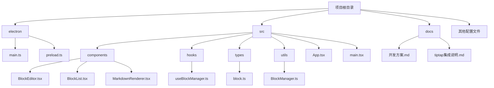
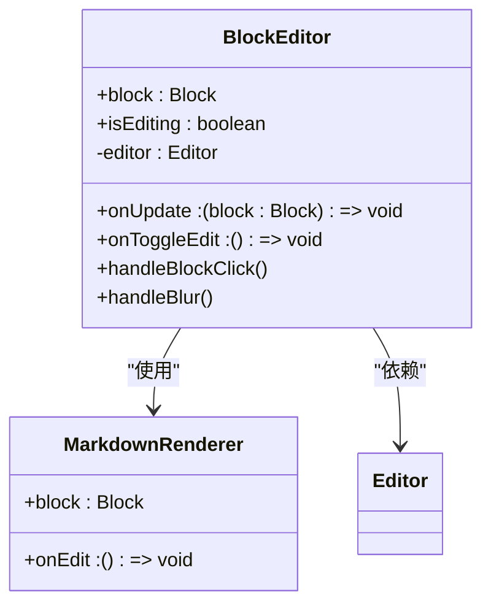
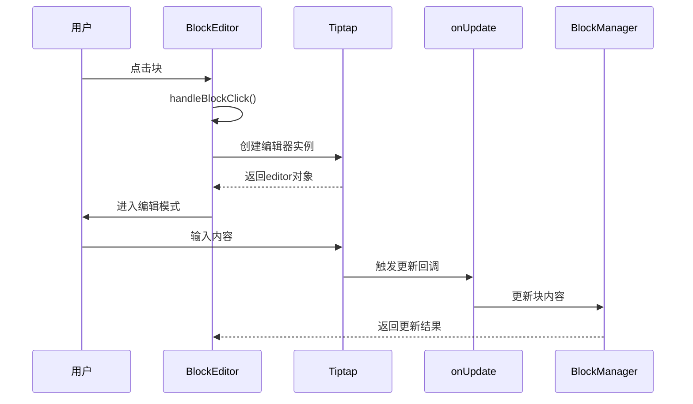
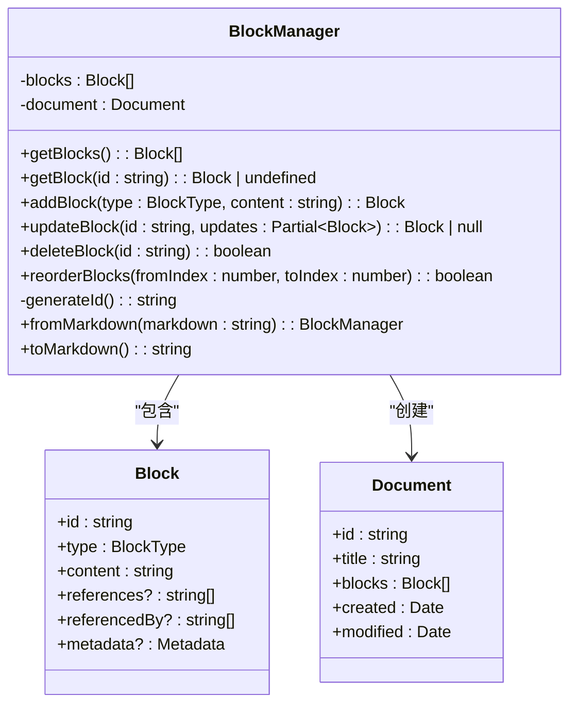
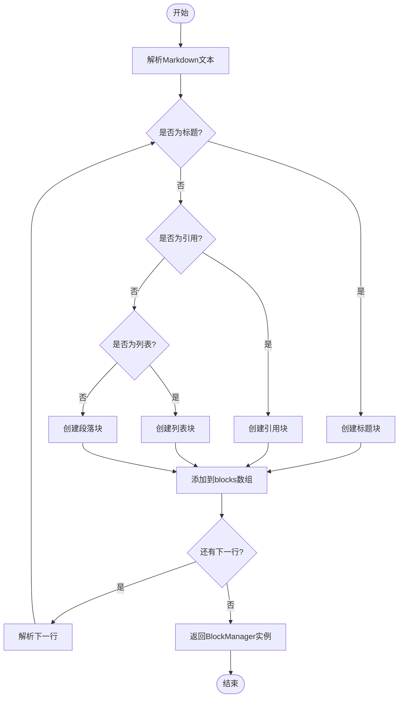
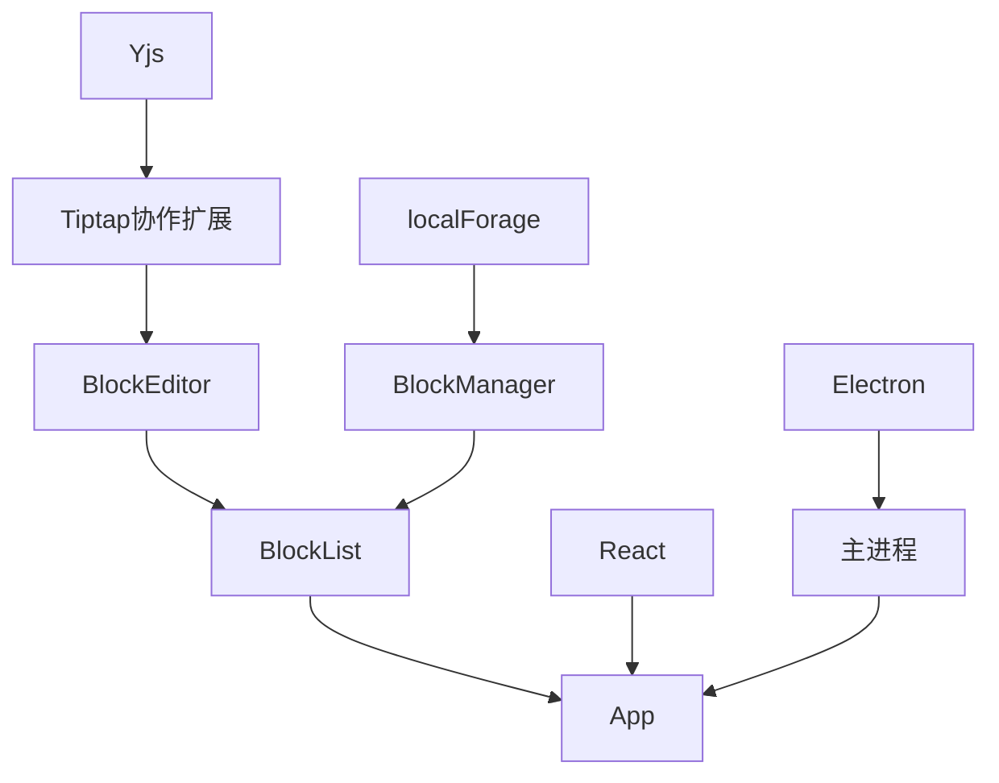

# 协同编辑实现

<cite>
**本文档引用的文件**  
- [package.json](file://package.json#L47-L65)
- [BlockEditor.tsx](file://src/components/BlockEditor.tsx#L1-L116)
- [BlockManager.ts](file://src/utils/BlockManager.ts#L1-L227)
- [useBlockManager.ts](file://src/hooks/useBlockManager.ts#L1-L97)
- [block.ts](file://src/types/block.ts#L1-L30)
- [开发方案.md](file://docs/开发方案.md#L1-L366)
- [tiptap集成说明.md](file://docs/tiptap集成说明.md#L1-L92)
</cite>

## 目录
1. [引言](#引言)
2. [项目结构](#项目结构)
3. [核心组件](#核心组件)
4. [架构概述](#架构概述)
5. [详细组件分析](#详细组件分析)
6. [依赖分析](#依赖分析)
7. [性能考虑](#性能考虑)
8. [故障排除指南](#故障排除指南)
9. [结论](#结论)

## 引言
本文档旨在基于开发方案中预留的 Yjs 依赖和协同编辑基础，设计实时协同编辑功能的技术架构。说明如何将当前单机状态升级为基于 CRDT（无冲突复制数据类型）的分布式状态同步系统。描述 Yjs 与 Tiptap 的集成方式，通过 y-websocket 实现客户端间操作广播，利用 Yjs 提供的 Text 类型同步块内容。解释如何处理网络延迟、冲突解决和用户光标位置共享。建议设计轻量级服务器用于消息中转，并考虑权限控制与会话管理。为开发者提供从本地存储迁移到实时数据库的过渡方案，确保现有功能不受影响。

## 项目结构
本项目采用 Electron + React + TypeScript 技术栈构建桌面端小说编辑器，支持 Markdown + 块编辑 + 双链功能。项目结构清晰，分为 Electron 主进程代码、React 应用代码和项目文档三大部分。

**图示来源**  
- [开发方案.md](file://docs/开发方案.md#L1-L366)
- [tiptap集成说明.md](file://docs/tiptap集成说明.md#L1-L92)

**本节来源**  
- [README.md](file://README.md#L56-L74)

## 核心组件
项目的核心组件包括 BlockEditor、BlockList、BlockManager 和 useBlockManager。这些组件共同实现了块编辑、拖拽排序、状态管理和数据持久化等功能。

**本节来源**  
- [BlockEditor.tsx](file://src/components/BlockEditor.tsx#L1-L116)
- [BlockList.tsx](file://src/components/BlockList.tsx#L1-L145)
- [BlockManager.ts](file://src/utils/BlockManager.ts#L1-L227)
- [useBlockManager.ts](file://src/hooks/useBlockManager.ts#L1-L97)

## 架构概述
系统架构采用分层设计，前端使用 React 组件化开发，通过 Tiptap 实现富文本编辑功能，后端使用 Electron 提供桌面应用能力。数据流从用户交互开始，经过组件状态管理，最终持久化到本地存储。

**图示来源**  
- [App.tsx](file://src/App.tsx#L1-L156)
- [useBlockManager.ts](file://src/hooks/useBlockManager.ts#L1-L97)

## 详细组件分析

### BlockEditor 分析
BlockEditor 组件是编辑器的核心UI组件，负责渲染单个块的编辑和查看状态。

#### 对象导向组件

**图示来源**  
- [BlockEditor.tsx](file://src/components/BlockEditor.tsx#L1-L116)

#### API/服务组件

**图示来源**  
- [BlockEditor.tsx](file://src/components/BlockEditor.tsx#L29-L63)

**本节来源**  
- [BlockEditor.tsx](file://src/components/BlockEditor.tsx#L1-L116)

### BlockManager 分析
BlockManager 类负责管理所有块的数据操作，包括增删改查和重新排序。

#### 对象导向组件

**图示来源**  
- [BlockManager.ts](file://src/utils/BlockManager.ts#L3-L227)
- [block.ts](file://src/types/block.ts#L5-L30)

#### 复杂逻辑组件

**图示来源**  
- [BlockManager.ts](file://src/utils/BlockManager.ts#L101-L217)

**本节来源**  
- [BlockManager.ts](file://src/utils/BlockManager.ts#L1-L227)

## 依赖分析
项目依赖关系清晰，主要依赖包括 Tiptap 系列扩展、Yjs 协同编辑库和 React 生态。

**图示来源**  
- [package.json](file://package.json#L47-L65)
- [App.tsx](file://src/App.tsx#L1-L156)

**本节来源**  
- [package.json](file://package.json#L47-L65)

## 性能考虑
在大文档场景下，需要设置 300ms 延迟解析 Markdown，避免输入时卡顿。同时使用 DOMPurify 过滤 Lute 生成的 HTML，防止恶意代码注入。核心逻辑（块处理/双链解析）已抽离为独立工具库，预留云端同步接口和移动端适配层。

## 故障排除指南
当遇到协同编辑问题时，首先检查 Yjs 连接状态，确认 WebSocket 服务器正常运行。检查客户端是否正确配置了文档 ID 和用户身份信息。对于数据不一致问题，验证 Yjs 的 CRDT 算法是否正确应用，确保所有客户端都基于相同的初始状态。

**本节来源**  
- [开发方案.md](file://docs/开发方案.md#L117-L120)

## 结论
通过分析项目结构和代码实现，我们已经明确了如何基于现有架构实现协同编辑功能。利用 Yjs 和 Tiptap 的集成能力，可以轻松实现基于 CRDT 的分布式状态同步。建议按照渐进式模块化设计原则，逐步引入协同编辑功能，确保现有功能不受影响。