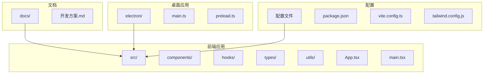
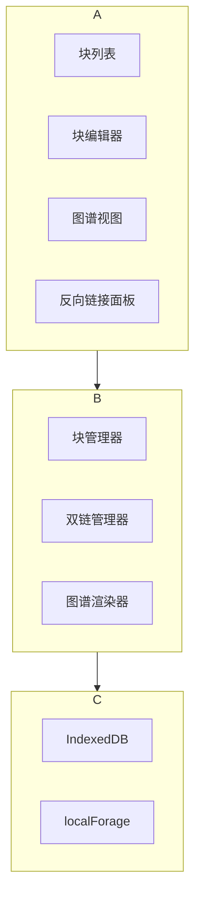
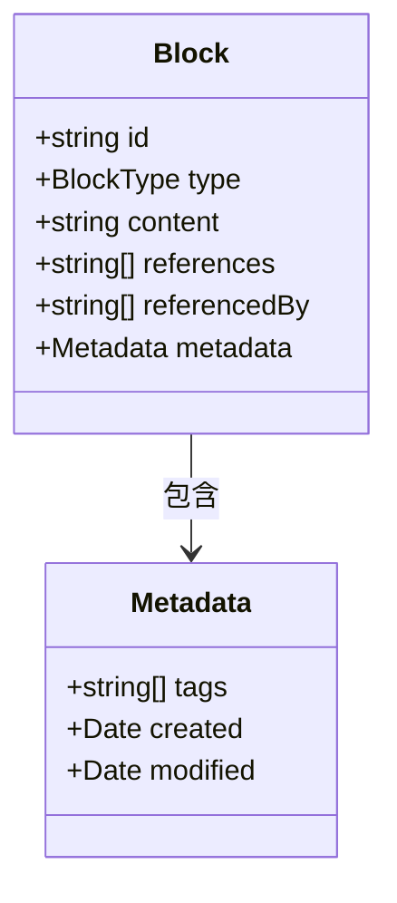
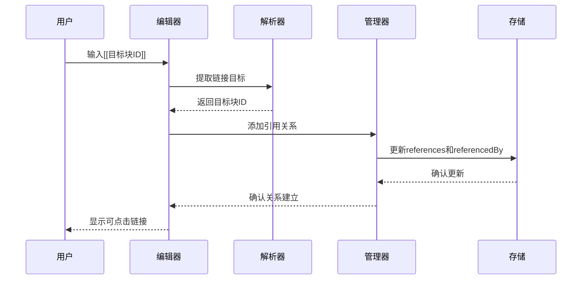
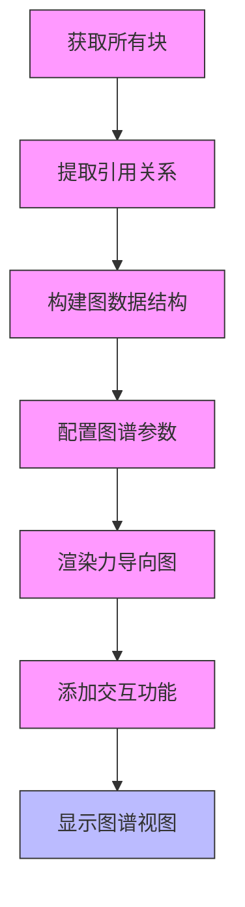
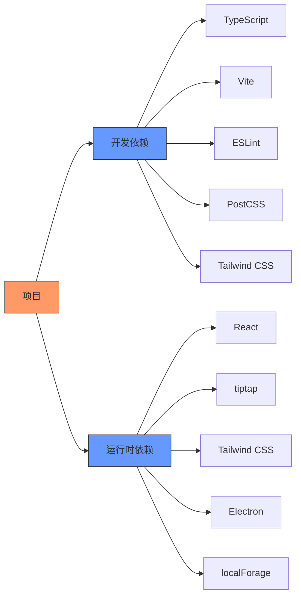

# 图谱视图与反向链接

<cite>
**本文档引用文件**  
- [开发方案.md](file://docs/开发方案.md)
- [block.ts](file://src/types/block.ts)
- [BlockManager.ts](file://src/utils/BlockManager.ts)
- [MarkdownRenderer.tsx](file://src/components/MarkdownRenderer.tsx)
- [useBlockManager.ts](file://src/hooks/useBlockManager.ts)
- [App.tsx](file://src/App.tsx)
</cite>

## 目录
1. [简介](#简介)
2. [项目结构](#项目结构)
3. [核心组件](#核心组件)
4. [架构概述](#架构概述)
5. [详细组件分析](#详细组件分析)
6. [依赖分析](#依赖分析)
7. [性能考虑](#性能考虑)
8. [故障排除指南](#故障排除指南)
9. [结论](#结论)

## 简介
本文档详细说明了基于开发方案中双链功能的预留设计，如何实现图谱视图与反向链接功能。图谱视图用于可视化展示块之间的引用关系，建议使用D3.js或Sigma.js构建力导向图，节点代表块，边代表双链。反向链接面板应列出当前块被哪些其他块引用，并维护`referencedBy`字段的实时更新。文档描述了在用户插入`[[块ID]]`时如何自动更新正向`references`和反向`referencedBy`数组，并确保数据一致性。同时提供了图形化操作如点击节点跳转、拖拽布局、聚类过滤等建议，以及为开发者提供的双链关系查询API和图谱渲染组件的集成指南。

## 项目结构
本项目采用模块化设计，主要分为以下几个部分：
- `docs/`：项目文档，包含开发方案和技术说明
- `electron/`：Electron主进程代码，负责桌面应用的窗口管理和系统交互
- `src/`：React应用代码，包含组件、钩子、类型定义和工具函数
- 根目录：配置文件和构建脚本

**图源**  
- [开发方案.md](file://docs/开发方案.md)
- [package.json](file://package.json)
- [vite.config.ts](file://vite.config.ts)

**本节来源**  
- [开发方案.md](file://docs/开发方案.md)
- [package.json](file://package.json)
- [vite.config.ts](file://vite.config.ts)

## 核心组件
本项目的核心组件包括块数据结构、块管理器、编辑器组件和渲染器组件。块数据结构定义了块的基本属性，包括ID、类型、内容以及双链相关的`references`和`referencedBy`字段。块管理器负责块的增删改查操作，以及文档的创建和导出。编辑器组件基于tiptap实现块的编辑功能，支持Markdown语法和块编辑。渲染器组件负责将Markdown内容解析为HTML并显示。

**本节来源**  
- [block.ts](file://src/types/block.ts)
- [BlockManager.ts](file://src/utils/BlockManager.ts)
- [BlockEditor.tsx](file://src/components/BlockEditor.tsx)
- [MarkdownRenderer.tsx](file://src/components/MarkdownRenderer.tsx)

## 架构概述
系统架构采用分层设计，分为数据层、业务逻辑层和表现层。数据层负责块数据的存储和管理，使用localForage + IndexedDB实现本地存储。业务逻辑层包含块管理器和双链管理器，负责块的增删改查和双链关系的维护。表现层由React组件构成，包括块列表、块编辑器和图谱视图等。

**图源**  
- [开发方案.md](file://docs/开发方案.md)
- [BlockManager.ts](file://src/utils/BlockManager.ts)

## 详细组件分析
### 块数据结构分析
块数据结构是整个系统的基础，定义了块的基本属性和双链关系。每个块都有唯一的ID，用于标识和引用。`references`字段存储该块引用的其他块ID，`referencedBy`字段存储引用该块的其他块ID。这种双向引用设计确保了数据的一致性和完整性。

**图源**  
- [block.ts](file://src/types/block.ts)
- [开发方案.md](file://docs/开发方案.md)

### 双链功能实现分析
双链功能的实现分为三个主要部分：语法解析、关系维护和用户界面。语法解析器负责识别`[[块ID]]`语法并提取目标块ID。关系维护器在用户创建或删除双链时，同步更新源块的`references`和目标块的`referencedBy`数组。用户界面提供反向链接面板，实时显示当前块被哪些其他块引用。

**图源**  
- [开发方案.md](file://docs/开发方案.md)
- [BlockManager.ts](file://src/utils/BlockManager.ts)
- [MarkdownRenderer.tsx](file://src/components/MarkdownRenderer.tsx)

### 图谱视图实现分析
图谱视图采用力导向图算法可视化块之间的引用关系。节点代表块，边代表双链。建议使用D3.js或Sigma.js库实现，支持点击节点跳转、拖拽布局、聚类过滤等交互功能。图谱渲染器从块管理器获取所有块及其引用关系，构建图数据结构，并将其传递给图谱库进行渲染。

**图源**  
- [开发方案.md](file://docs/开发方案.md)
- [BlockManager.ts](file://src/utils/BlockManager.ts)

## 依赖分析
项目依赖主要分为开发依赖和运行时依赖。开发依赖包括TypeScript、Vite、ESLint等工具，用于代码编译、构建和检查。运行时依赖包括React、tiptap、Tailwind CSS等库，用于构建用户界面和实现编辑功能。Electron相关依赖用于打包桌面应用。

**图源**  
- [package.json](file://package.json)
- [vite.config.ts](file://vite.config.ts)

**本节来源**  
- [package.json](file://package.json)
- [vite.config.ts](file://vite.config.ts)

## 性能考虑
在实现图谱视图和反向链接功能时，需要考虑以下性能优化措施：
1. 大文档场景下，设置300ms延迟解析Markdown，避免输入时卡顿
2. 使用虚拟滚动技术渲染大量块，减少DOM节点数量
3. 对图谱数据进行分层加载，先显示核心节点，再逐步加载关联节点
4. 使用Web Worker处理复杂的图谱计算，避免阻塞主线程
5. 实现数据缓存机制，避免重复计算和解析

## 故障排除指南
### 双链关系不更新
**问题**：插入`[[块ID]]`后，`references`和`referencedBy`数组未更新
**解决方案**：
1. 检查块管理器的`updateBlock`方法是否正确调用
2. 确认双链解析器是否正确提取链接目标
3. 验证关系维护器是否同步更新双向引用
4. 检查存储层是否成功保存更新后的数据

### 图谱视图加载缓慢
**问题**：图谱视图在加载大量块时响应缓慢
**解决方案**：
1. 实现分页或分层加载机制
2. 优化图谱数据结构，减少不必要的节点和边
3. 使用Web Worker进行图谱计算
4. 考虑使用更高效的图谱渲染库

**本节来源**  
- [BlockManager.ts](file://src/utils/BlockManager.ts)
- [MarkdownRenderer.tsx](file://src/components/MarkdownRenderer.tsx)

## 结论
本文档详细说明了图谱视图与反向链接功能的实现方法。通过预留的双链数据结构和接口，可以方便地扩展实现这些功能。建议使用D3.js或Sigma.js构建力导向图来实现图谱视图，提供丰富的交互功能。反向链接面板应实时维护`referencedBy`字段，确保数据一致性。为开发者提供清晰的API和集成指南，有助于快速实现和定制这些功能。