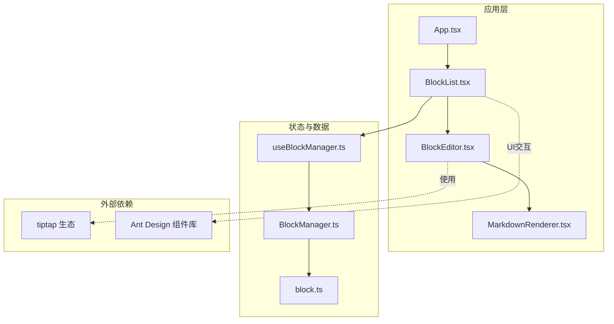
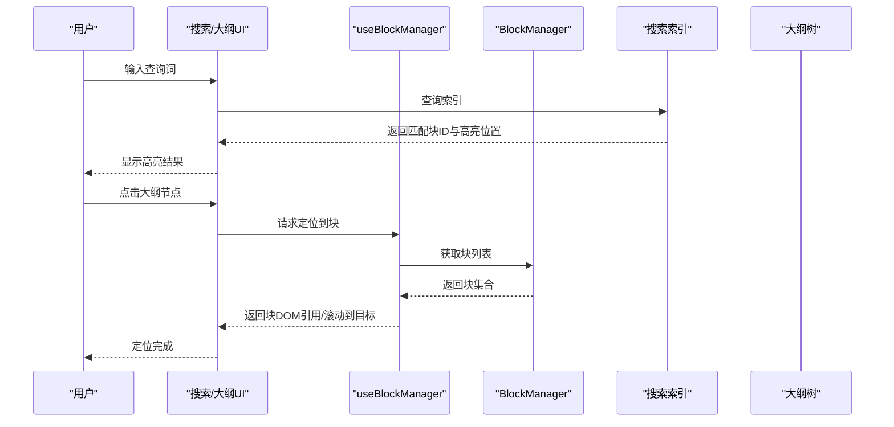
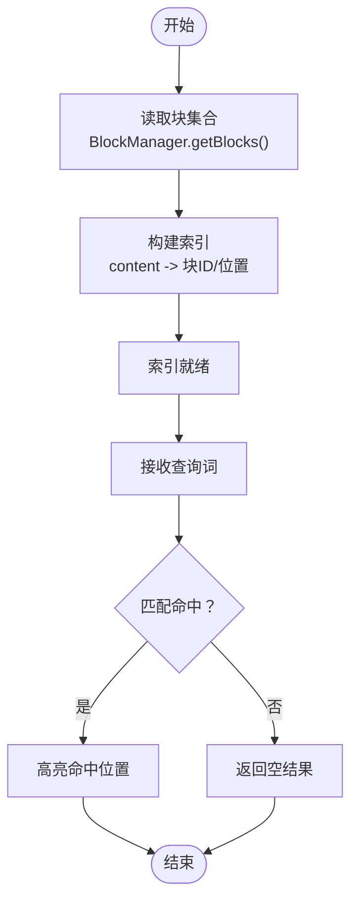
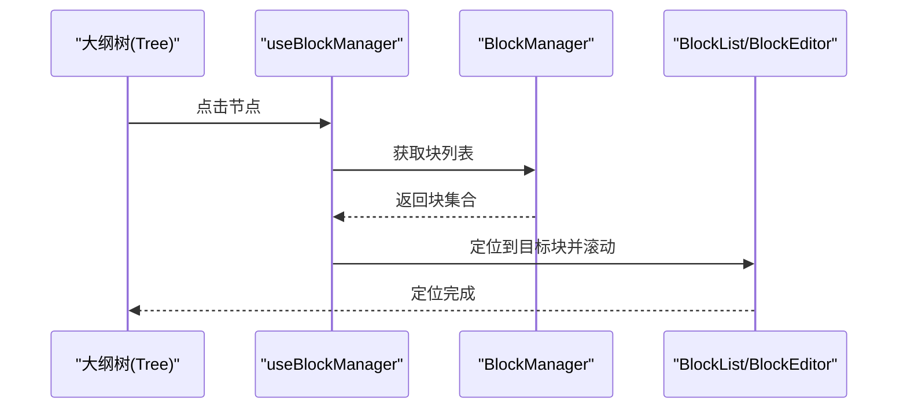
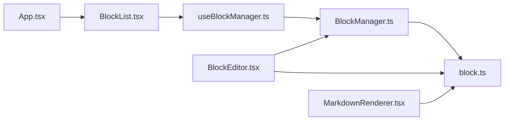

# 搜索与大纲视图

<cite>
**本文引用的文件**
- [开发方案.md](file://docs/开发方案.md)
- [block.ts](file://src/types/block.ts)
- [BlockManager.ts](file://src/utils/BlockManager.ts)
- [useBlockManager.ts](file://src/hooks/useBlockManager.ts)
- [BlockList.tsx](file://src/components/BlockList.tsx)
- [BlockEditor.tsx](file://src/components/BlockEditor.tsx)
- [MarkdownRenderer.tsx](file://src/components/MarkdownRenderer.tsx)
- [App.tsx](file://src/App.tsx)
- [package.json](file://package.json)
</cite>

## 目录
1. [简介](#简介)
2. [项目结构](#项目结构)
3. [核心组件](#核心组件)
4. [架构总览](#架构总览)
5. [详细组件分析](#详细组件分析)
6. [依赖分析](#依赖分析)
7. [性能考量](#性能考量)
8. [故障排查指南](#故障排查指南)
9. [结论](#结论)
10. [附录](#附录)

## 简介
本方案围绕“搜索功能”与“大纲视图”的实现进行系统化设计，目标如下：
- 搜索功能：支持全文检索，解析所有块的 content 字段，高亮匹配结果；建议使用 Web Worker 避免阻塞主线程；提供可扩展的索引构建接口，便于未来支持标签、分类等高级筛选。
- 大纲视图：自动提取标题块（heading 类型）生成层级结构，支持点击跳转与折叠展开；通过监听块内容变化维护搜索索引与大纲树的实时性；引入 debounce 机制优化性能；结合 Ant Design 的 Tree 与 Input 组件实现 UI 交互。

该方案严格基于仓库现有代码结构与类型定义，确保实现与现有架构一致且可演进。

## 项目结构
项目采用 Electron + React + TypeScript 技术栈，块编辑器基于 tiptap，Markdown 渲染由自研解析器负责。核心数据结构与块管理逻辑集中在 types 与 utils 目录，UI 层通过 hooks/useBlockManager.ts 与组件协作。

图表来源
- [App.tsx](file://src/App.tsx#L1-L156)
- [BlockList.tsx](file://src/components/BlockList.tsx#L1-L145)
- [BlockEditor.tsx](file://src/components/BlockEditor.tsx#L1-L116)
- [MarkdownRenderer.tsx](file://src/components/MarkdownRenderer.tsx#L1-L125)
- [useBlockManager.ts](file://src/hooks/useBlockManager.ts#L1-L97)
- [BlockManager.ts](file://src/utils/BlockManager.ts#L1-L227)
- [block.ts](file://src/types/block.ts#L1-L30)
- [package.json](file://package.json#L46-L66)

章节来源
- [App.tsx](file://src/App.tsx#L1-L156)
- [BlockList.tsx](file://src/components/BlockList.tsx#L1-L145)
- [BlockEditor.tsx](file://src/components/BlockEditor.tsx#L1-L116)
- [MarkdownRenderer.tsx](file://src/components/MarkdownRenderer.tsx#L1-L125)
- [useBlockManager.ts](file://src/hooks/useBlockManager.ts#L1-L97)
- [BlockManager.ts](file://src/utils/BlockManager.ts#L1-L227)
- [block.ts](file://src/types/block.ts#L1-L30)
- [package.json](file://package.json#L46-L66)

## 核心组件
- 数据模型与类型
  - 块类型与文档结构定义见 [block.ts](file://src/types/block.ts#L1-L30)，包含 id、type、content、references、referencedBy、metadata 等字段。
- 块管理器
  - 提供增删改查、拖拽排序、文档创建、Markdown 导入导出等能力，详见 [BlockManager.ts](file://src/utils/BlockManager.ts#L1-L227)。
- React Hook
  - useBlockManager.ts 将 BlockManager 与 React 状态绑定，暴露 blocks 与操作方法，详见 [useBlockManager.ts](file://src/hooks/useBlockManager.ts#L1-L97)。
- 编辑与渲染
  - BlockEditor.tsx 基于 tiptap 实现块编辑态与渲染态切换，详见 [BlockEditor.tsx](file://src/components/BlockEditor.tsx#L1-L116)。
  - MarkdownRenderer.tsx 负责渲染 Markdown 内容，包含标题识别与基础语法处理，详见 [MarkdownRenderer.tsx](file://src/components/MarkdownRenderer.tsx#L1-L125)。
- 列表容器
  - BlockList.tsx 负责块列表渲染、拖拽排序、添加新块等交互，详见 [BlockList.tsx](file://src/components/BlockList.tsx#L1-L145)。

章节来源
- [block.ts](file://src/types/block.ts#L1-L30)
- [BlockManager.ts](file://src/utils/BlockManager.ts#L1-L227)
- [useBlockManager.ts](file://src/hooks/useBlockManager.ts#L1-L97)
- [BlockEditor.tsx](file://src/components/BlockEditor.tsx#L1-L116)
- [MarkdownRenderer.tsx](file://src/components/MarkdownRenderer.tsx#L1-L125)
- [BlockList.tsx](file://src/components/BlockList.tsx#L1-L145)

## 架构总览
搜索与大纲视图的实现将与现有编辑器架构解耦，通过以下方式接入：
- 搜索索引：以 BlockManager.getBlocks() 产出的块集合为输入，构建内存索引（可选 Web Worker）。索引条目包含块 id、content、类型、层级（标题级别）等。
- 大纲树：从索引中筛选 heading 类型，按标题级别构建层级树，支持折叠展开与点击跳转。
- 实时性：通过 useBlockManager 的更新回调与 BlockEditor 的内容变更事件，触发索引重建与大纲树刷新，配合 debounce 降低频繁更新带来的性能压力。
- UI：使用 Ant Design 的 Input 作为搜索框，Tree 作为大纲视图容器，实现高亮与跳转。

图表来源
- [useBlockManager.ts](file://src/hooks/useBlockManager.ts#L1-L97)
- [BlockManager.ts](file://src/utils/BlockManager.ts#L1-L227)
- [BlockEditor.tsx](file://src/components/BlockEditor.tsx#L1-L116)
- [BlockList.tsx](file://src/components/BlockList.tsx#L1-L145)

## 详细组件分析

### 搜索功能实现方案
- 全文检索与高亮
  - 输入：BlockManager.getBlocks() 返回的 Block[]。
  - 索引构建：遍历块集合，将每个块的 content 字段加入索引，记录块 id、原始内容、类型、标题级别（如适用）。
  - 查询：对查询词进行分词与模糊匹配，返回命中块 id 与匹配位置区间，用于 UI 高亮。
  - 高亮：在渲染层对命中位置进行包裹标记，或在编辑态通过 tiptap 的富文本能力插入高亮标记。
- 线程模型
  - 建议使用 Web Worker 执行索引构建与查询，避免阻塞主线程，保证编辑体验流畅。
- 实时性与性能
  - 监听块内容变化：在 BlockEditor.onUpdate 中调用 useBlockManager.updateBlock，随后触发索引重建与大纲树刷新。
  - debounce：对搜索输入与索引重建进行去抖，减少高频输入导致的重复计算。
- 可扩展接口
  - 索引条目可扩展包含 tags、created、modified 等元数据，便于未来支持标签、分类等高级筛选。

图表来源
- [BlockManager.ts](file://src/utils/BlockManager.ts#L1-L227)
- [useBlockManager.ts](file://src/hooks/useBlockManager.ts#L1-L97)
- [BlockEditor.tsx](file://src/components/BlockEditor.tsx#L1-L116)

章节来源
- [BlockManager.ts](file://src/utils/BlockManager.ts#L1-L227)
- [useBlockManager.ts](file://src/hooks/useBlockManager.ts#L1-L97)
- [BlockEditor.tsx](file://src/components/BlockEditor.tsx#L1-L116)

### 大纲视图实现方案
- 标题提取与层级
  - 从索引中筛选 heading 类型块，按标题级别（h1-h6）构建层级树。
  - 支持折叠展开：每级节点可折叠，点击节点展开/收起子节点。
- 跳转与定位
  - 点击大纲节点时，通过 useBlockManager 获取块列表，定位到对应块并滚动到可视区域。
  - 可在 BlockEditor 中提供锚点定位能力，或通过 BlockList 的 DOM 结构进行滚动定位。
- 实时性维护
  - 监听块内容变化与类型变化，动态更新大纲树；对频繁更新进行 debounce。
- UI 交互
  - 使用 Ant Design 的 Tree 作为大纲容器，Input 作为搜索框；Tree 节点包含标题文本、层级、块ID等信息，点击事件触发跳转。

图表来源
- [BlockList.tsx](file://src/components/BlockList.tsx#L1-L145)
- [useBlockManager.ts](file://src/hooks/useBlockManager.ts#L1-L97)
- [BlockManager.ts](file://src/utils/BlockManager.ts#L1-L227)

章节来源
- [BlockList.tsx](file://src/components/BlockList.tsx#L1-L145)
- [useBlockManager.ts](file://src/hooks/useBlockManager.ts#L1-L97)
- [BlockManager.ts](file://src/utils/BlockManager.ts#L1-L227)

### 监听块内容变化以维护索引与大纲树
- 内容变更来源
  - BlockEditor.onUpdate：编辑态保存时触发，更新 BlockManager 并触发 UI 重渲染。
  - BlockList.onReorderBlocks：拖拽排序时更新块顺序，间接影响大纲层级展示。
- 维护策略
  - 在 onUpdate 回调中，先调用 useBlockManager.updateBlock，再执行索引重建与大纲树刷新。
  - 对重建过程进行 debounce，避免高频输入导致的重复计算。
- 可靠性
  - 对 BlockManager 的增删改查操作进行边界校验，确保索引一致性。
  - 对标题类型变化（如从 paragraph 切换到 heading）及时更新索引与大纲树。

章节来源
- [BlockEditor.tsx](file://src/components/BlockEditor.tsx#L1-L116)
- [BlockList.tsx](file://src/components/BlockList.tsx#L1-L145)
- [useBlockManager.ts](file://src/hooks/useBlockManager.ts#L1-L97)
- [BlockManager.ts](file://src/utils/BlockManager.ts#L1-L227)

### 可扩展的索引构建接口
- 接口设计
  - 索引条目包含：块ID、内容、类型、标题级别、元数据（tags、created、modified）。
  - 查询接口：支持关键词匹配、范围过滤（时间、标签）、排序（匹配度、时间）。
- 未来扩展
  - 标签与分类：在 metadata.tags 中扩展标签体系，查询时支持 AND/OR 条件组合。
  - 双链支持：在索引中记录 references/referencedBy，支持双向链接的搜索与跳转。
- 与现有结构的契合
  - 现有 Block 接口已预留 metadata.tags、references、referencedBy 字段，便于直接复用。

章节来源
- [block.ts](file://src/types/block.ts#L1-L30)
- [BlockManager.ts](file://src/utils/BlockManager.ts#L1-L227)
- [开发方案.md](file://docs/开发方案.md#L124-L163)

## 依赖分析
- tiptap 生态：用于块编辑态与富文本渲染，提供 Placeholder、Heading、Lists、Blockquote、HorizontalRule、DragHandle 等扩展。
- Ant Design：用于 Tree 与 Input 等 UI 组件，提升交互体验。
- 本地存储：项目采用 localForage + IndexedDB（开发方案中提及），可用于持久化块数据与索引快照（可选）。

图表来源
- [BlockManager.ts](file://src/utils/BlockManager.ts#L1-L227)
- [block.ts](file://src/types/block.ts#L1-L30)
- [useBlockManager.ts](file://src/hooks/useBlockManager.ts#L1-L97)
- [BlockList.tsx](file://src/components/BlockList.tsx#L1-L145)
- [BlockEditor.tsx](file://src/components/BlockEditor.tsx#L1-L116)
- [MarkdownRenderer.tsx](file://src/components/MarkdownRenderer.tsx#L1-L125)
- [App.tsx](file://src/App.tsx#L1-L156)

章节来源
- [package.json](file://package.json#L46-L66)
- [开发方案.md](file://docs/开发方案.md#L1-L121)

## 性能考量
- 避免阻塞主线程
  - 使用 Web Worker 执行索引构建与查询，主线程只负责 UI 与事件调度。
- 去抖与节流
  - 对搜索输入与索引重建进行 debounce；对滚动定位与 UI 刷新进行 throttle，降低频繁重排与重绘。
- 懒加载与增量更新
  - 仅在块内容发生显著变化时重建索引；对未变化的块采用增量更新策略。
- 渲染优化
  - 大纲树使用虚拟滚动（如 Ant Design Tree 的虚拟化能力）处理大量节点；高亮采用最小化 DOM 修改策略。

[本节为通用性能建议，不直接分析具体文件]

## 故障排查指南
- 搜索无结果
  - 检查索引是否已构建完成；确认 BlockManager.getBlocks() 是否返回预期块集合。
  - 核对查询词是否为空或过短；确认去抖阈值是否过长导致延迟过高。
- 高亮不生效
  - 确认渲染层对命中位置的包裹逻辑；在编辑态下使用 tiptap 的富文本能力插入高亮标记。
- 大纲树不更新
  - 检查 onUpdate 回调是否被正确触发；确认 BlockManager.updateBlock 是否成功更新块内容。
  - 对频繁拖拽排序场景，确认去抖策略不会导致更新被抑制。
- 滚动定位异常
  - 确认 BlockList 的 DOM 结构与滚动目标一致；必要时通过 ref 获取块元素并调用 scrollIntoView。

章节来源
- [BlockEditor.tsx](file://src/components/BlockEditor.tsx#L1-L116)
- [BlockList.tsx](file://src/components/BlockList.tsx#L1-L145)
- [useBlockManager.ts](file://src/hooks/useBlockManager.ts#L1-L97)
- [BlockManager.ts](file://src/utils/BlockManager.ts#L1-L227)

## 结论
本方案在不破坏现有架构的前提下，提供了可扩展的搜索与大纲视图实现路径。通过 Web Worker、debounce 与增量更新等手段，兼顾性能与实时性；通过 Ant Design 的 Tree 与 Input 组件，快速实现高可用的 UI 交互。未来可在 metadata 中扩展标签与分类，进一步增强检索能力。

[本节为总结性内容，不直接分析具体文件]

## 附录
- 关键实现参考路径
  - 搜索索引构建与查询：[BlockManager.ts](file://src/utils/BlockManager.ts#L1-L227)、[useBlockManager.ts](file://src/hooks/useBlockManager.ts#L1-L97)
  - 大纲树构建与跳转：[BlockList.tsx](file://src/components/BlockList.tsx#L1-L145)、[BlockEditor.tsx](file://src/components/BlockEditor.tsx#L1-L116)
  - 数据模型与类型：[block.ts](file://src/types/block.ts#L1-L30)
  - 依赖与技术栈：[package.json](file://package.json#L46-L66)
  - 开发方案与扩展预留：[开发方案.md](file://docs/开发方案.md#L1-L121)