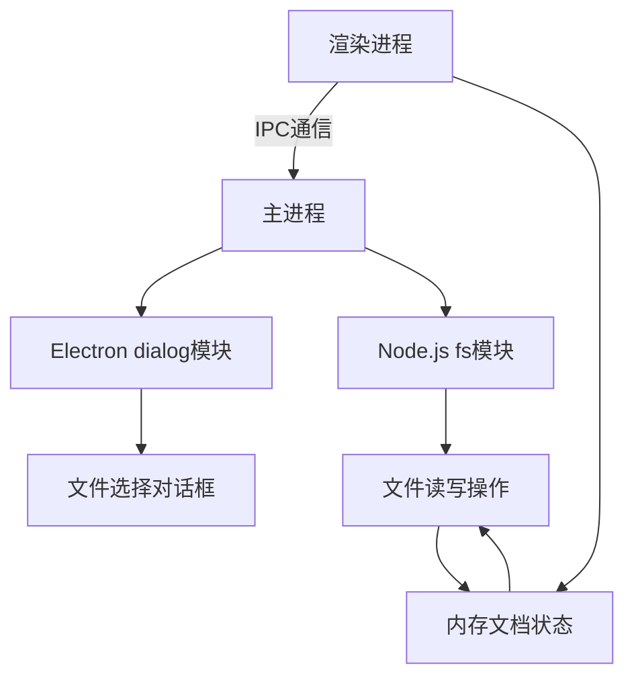
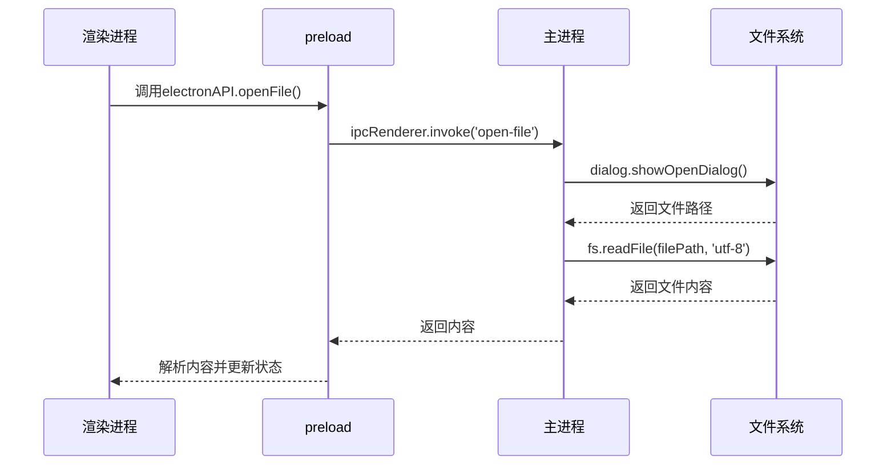
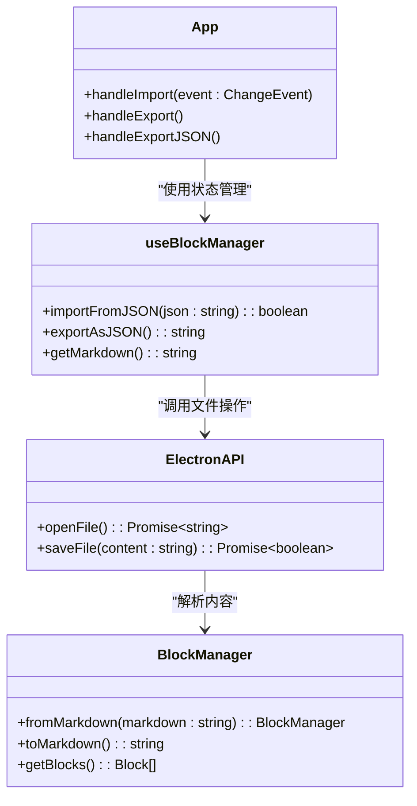
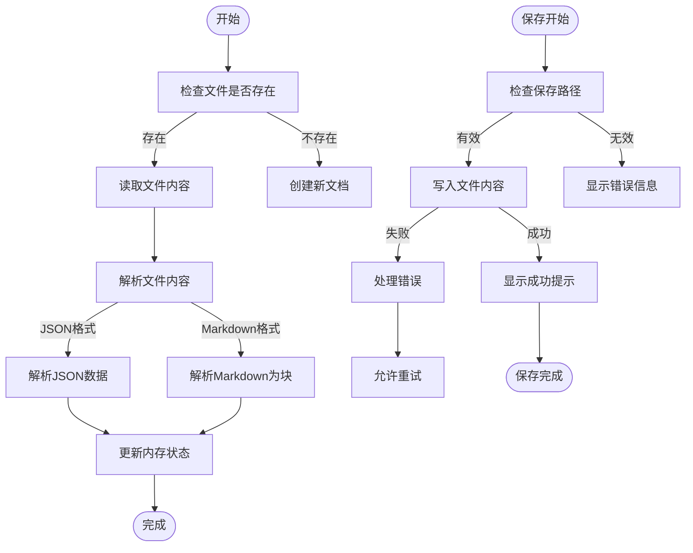
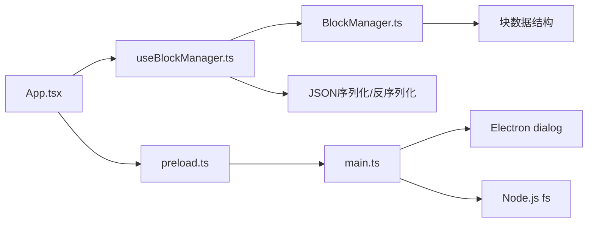

# 文件系统集成

<cite>
**本文档引用的文件**
- [README.md](file://README.md)
- [开发方案.md](file://docs/开发方案.md)
- [main.ts](file://electron/main.ts)
- [preload.ts](file://electron/preload.ts)
- [App.tsx](file://src/App.tsx)
- [useBlockManager.ts](file://src/hooks/useBlockManager.ts)
- [BlockManager.ts](file://src/utils/BlockManager.ts)
</cite>

## 目录
1. [简介](#简介)
2. [项目结构与文件系统集成概述](#项目结构与文件系统集成概述)
3. [核心组件分析](#核心组件分析)
4. [文件操作流程架构](#文件操作流程架构)
5. [详细组件分析](#详细组件分析)
6. [依赖关系分析](#依赖关系分析)
7. [性能与错误处理考虑](#性能与错误处理考虑)
8. [故障排除指南](#故障排除指南)
9. [结论](#结论)

## 简介
本项目是一个基于 Markdown、块编辑和双链功能的桌面端小说编辑器，采用 Electron + React + TypeScript 技术栈构建。本文档重点阐述如何实现文件系统集成，支持打开和保存本地文件，通过 Electron 的主进程与渲染进程安全通信机制完成文件操作，并与内存中的文档状态进行同步。

## 项目结构与文件系统集成概述

**图表来源**
- [main.ts](file://electron/main.ts#L1-L68)
- [preload.ts](file://electron/preload.ts#L1-L21)
- [App.tsx](file://src/App.tsx#L1-L156)

**本节来源**
- [README.md](file://README.md#L1-L90)
- [开发方案.md](file://docs/开发方案.md#L1-L366)

## 核心组件分析

文件系统集成的核心在于 Electron 的进程间通信（IPC）机制，通过预加载脚本（preload.ts）暴露安全的 API 接口，使渲染进程能够调用主进程的文件系统功能。主进程使用 dialog 模块显示文件选择对话框，fs 模块执行实际的文件读写操作。

**本节来源**
- [preload.ts](file://electron/preload.ts#L1-L21)
- [main.ts](file://electron/main.ts#L1-L68)
- [App.tsx](file://src/App.tsx#L1-L156)

## 文件操作流程架构

**图表来源**
- [preload.ts](file://electron/preload.ts#L1-L21)
- [main.ts](file://electron/main.ts#L1-L68)
- [useBlockManager.ts](file://src/hooks/useBlockManager.ts#L1-L97)

## 详细组件分析

### 文件打开与保存功能分析

#### 对象关系图

**图表来源**
- [preload.ts](file://electron/preload.ts#L1-L21)
- [BlockManager.ts](file://src/utils/BlockManager.ts#L1-L227)
- [useBlockManager.ts](file://src/hooks/useBlockManager.ts#L1-L97)
- [App.tsx](file://src/App.tsx#L1-L156)

#### 文件操作流程

**图表来源**
- [App.tsx](file://src/App.tsx#L57-L156)
- [BlockManager.ts](file://src/utils/BlockManager.ts#L101-L222)
- [useBlockManager.ts](file://src/hooks/useBlockManager.ts#L61-L83)

**本节来源**
- [App.tsx](file://src/App.tsx#L1-L156)
- [useBlockManager.ts](file://src/hooks/useBlockManager.ts#L1-L97)
- [BlockManager.ts](file://src/utils/BlockManager.ts#L1-L227)

## 依赖关系分析

**图表来源**
- [App.tsx](file://src/App.tsx#L1-L156)
- [useBlockManager.ts](file://src/hooks/useBlockManager.ts#L1-L97)
- [BlockManager.ts](file://src/utils/BlockManager.ts#L1-L227)
- [preload.ts](file://electron/preload.ts#L1-L21)
- [main.ts](file://electron/main.ts#L1-L68)

**本节来源**
- [App.tsx](file://src/App.tsx#L1-L156)
- [useBlockManager.ts](file://src/hooks/useBlockManager.ts#L1-L97)
- [BlockManager.ts](file://src/utils/BlockManager.ts#L1-L227)

## 性能与错误处理考虑

文件系统操作涉及异步 I/O 操作，需要考虑错误边界情况，如文件不存在、权限不足、编码问题等。建议在文件读取时指定 UTF-8 编码，在写入时确保路径兼容性，并对可能的异常情况进行捕获和处理。

**本节来源**
- [App.tsx](file://src/App.tsx#L83-L98)
- [useBlockManager.ts](file://src/hooks/useBlockManager.ts#L61-L82)

## 故障排除指南

当文件操作失败时，应检查以下方面：
1. 文件路径是否有效且可访问
2. 应用程序是否有足够的文件系统权限
3. 文件编码是否为 UTF-8
4. 磁盘空间是否充足
5. 文件是否被其他程序占用

**本节来源**
- [App.tsx](file://src/App.tsx#L83-L98)
- [useBlockManager.ts](file://src/hooks/useBlockManager.ts#L61-L82)

## 结论
通过 Electron 的 IPC 机制和预加载脚本，实现了渲染进程与主进程之间的安全通信，完成了文件系统的集成。利用 dialog 模块实现文件选择，fs 模块进行文件读写，结合内存中的文档状态管理，实现了完整的本地文件持久化存储方案。该方案支持 Markdown 和 JSON 两种格式的解析与序列化，为后续功能扩展奠定了基础。