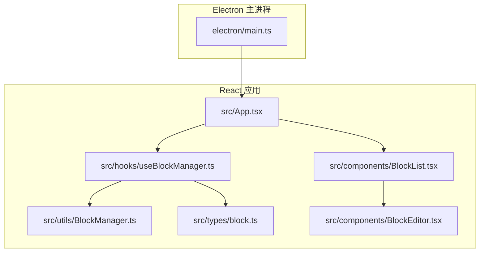
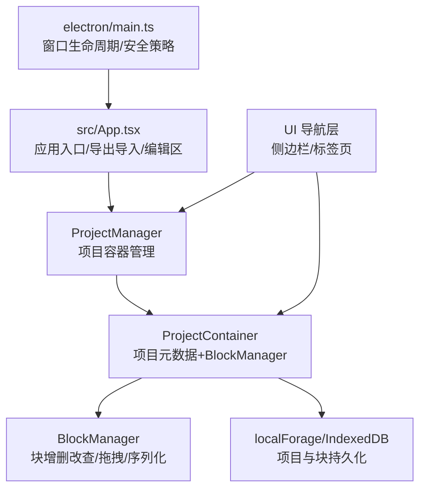
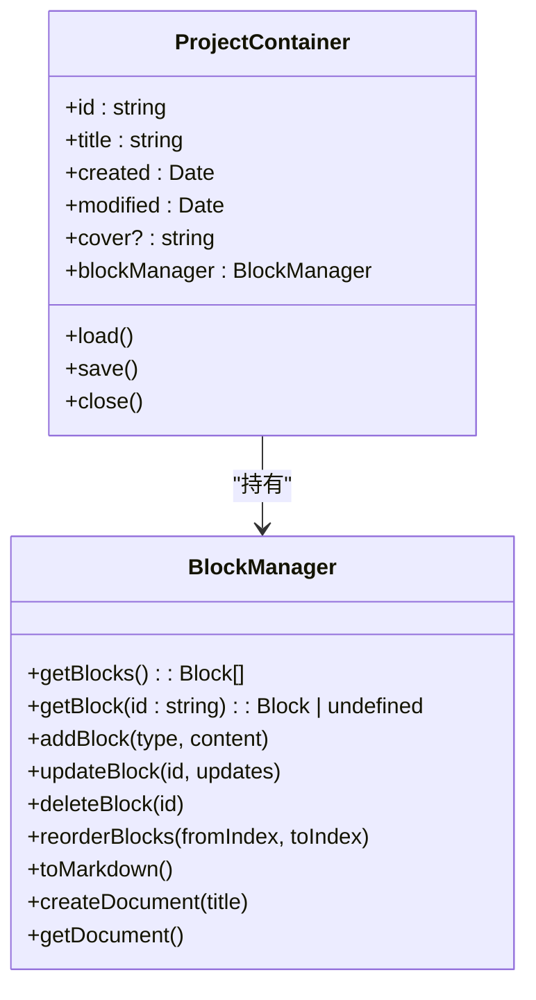
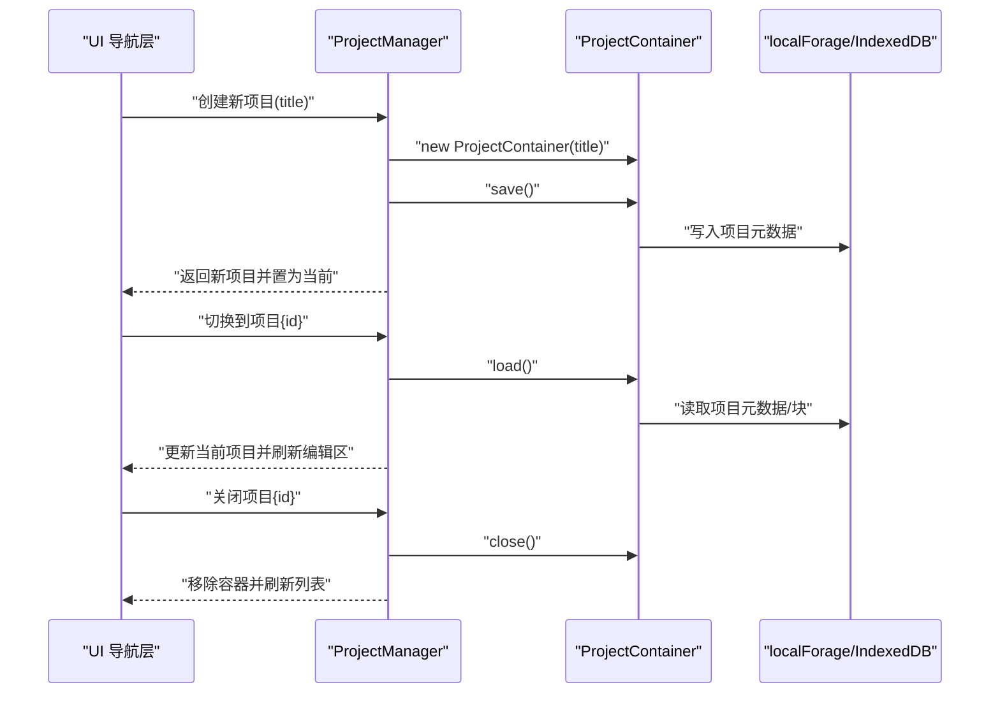
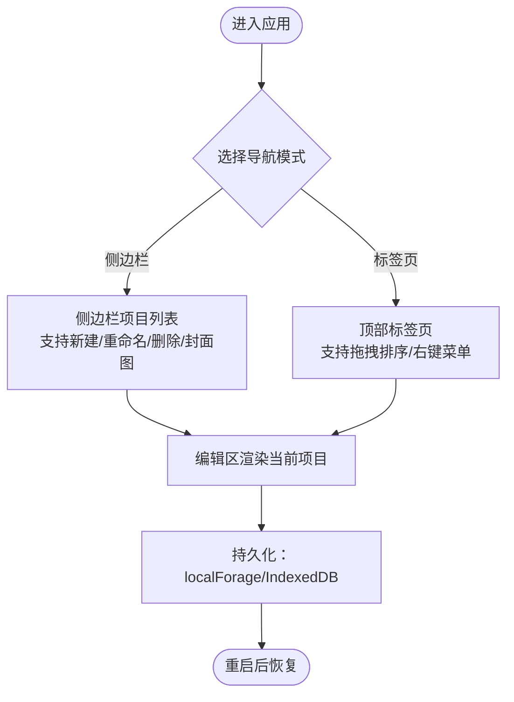
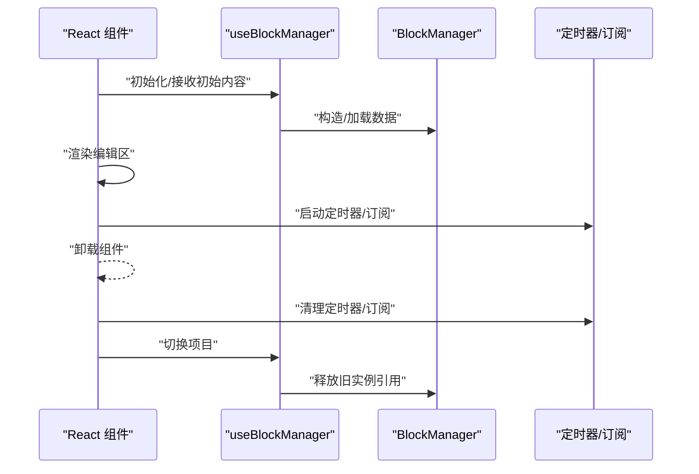
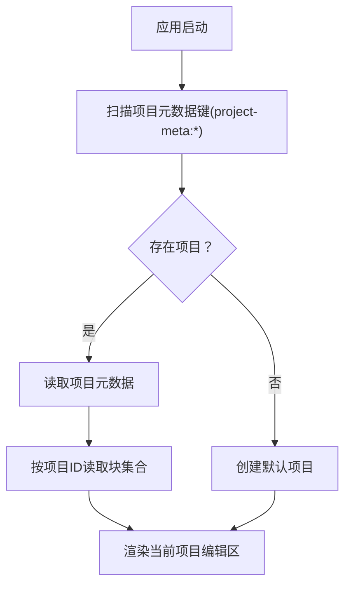
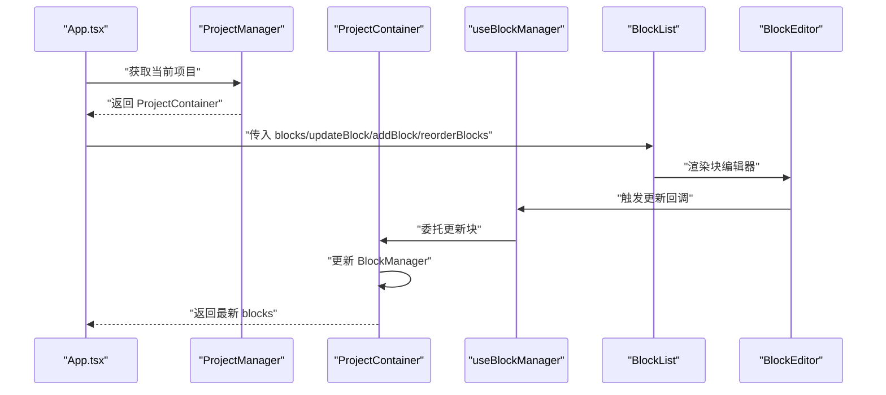
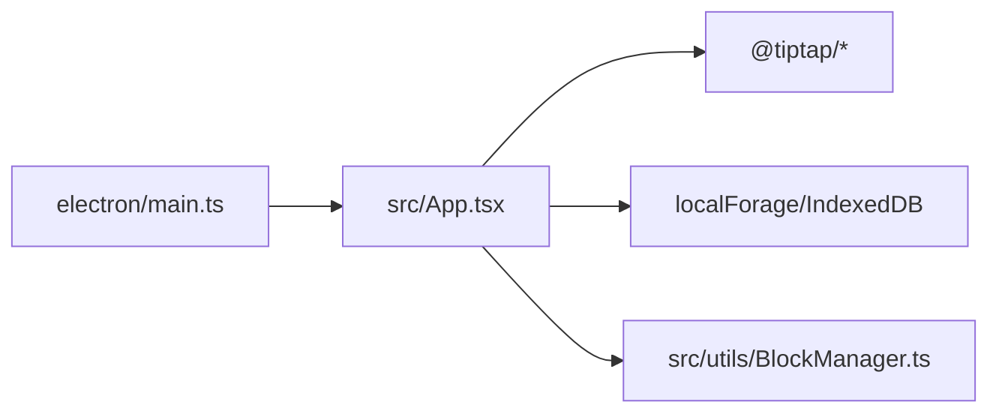

# 项目管理

<cite>
**本文引用的文件**
- [开发方案.md](file://docs/开发方案.md)
- [App.tsx](file://src/App.tsx)
- [BlockManager.ts](file://src/utils/BlockManager.ts)
- [useBlockManager.ts](file://src/hooks/useBlockManager.ts)
- [block.ts](file://src/types/block.ts)
- [BlockList.tsx](file://src/components/BlockList.tsx)
- [BlockEditor.tsx](file://src/components/BlockEditor.tsx)
- [main.ts](file://electron/main.ts)
- [package.json](file://package.json)
</cite>

## 目录
1. [引言](#引言)
2. [项目结构](#项目结构)
3. [核心组件](#核心组件)
4. [架构总览](#架构总览)
5. [详细组件分析](#详细组件分析)
6. [依赖分析](#依赖分析)
7. [性能考量](#性能考量)
8. [故障排查指南](#故障排查指南)
9. [结论](#结论)
10. [附录](#附录)

## 引言
本文件围绕“多文档管理”的开发设想，给出在现有单文档架构基础上扩展为多项目（小说）容器的技术实现方案。目标是支持多个项目的创建、切换与关闭；明确项目元数据（标题、创建时间、封面图等）的存储结构；在UI上呈现项目列表与当前工作区；建议使用标签页或侧边栏导航实现多文档界面；讨论状态管理策略以避免内存泄漏；结合 localForage/IndexedDB 提出持久化方案，确保项目状态在重启后可恢复；并为开发者提供清晰的架构升级路径，使其能在现有 BlockManager 基础上构建项目容器系统。

## 项目结构
当前仓库采用 Electron + React + TypeScript 架构，前端通过 Vite 构建，主进程负责窗口生命周期与安全策略。核心编辑能力由 BlockManager 与 useBlockManager 提供，UI 层通过 BlockList/BlockEditor 组合完成块编辑与拖拽排序。

图表来源
- [main.ts](file://electron/main.ts#L1-L68)
- [App.tsx](file://src/App.tsx#L1-L156)
- [useBlockManager.ts](file://src/hooks/useBlockManager.ts#L1-L96)
- [BlockManager.ts](file://src/utils/BlockManager.ts#L1-L227)
- [block.ts](file://src/types/block.ts#L1-L30)
- [BlockList.tsx](file://src/components/BlockList.tsx#L1-L145)
- [BlockEditor.tsx](file://src/components/BlockEditor.tsx#L16-L77)

章节来源
- [main.ts](file://electron/main.ts#L1-L68)
- [App.tsx](file://src/App.tsx#L1-L156)
- [useBlockManager.ts](file://src/hooks/useBlockManager.ts#L1-L96)
- [BlockManager.ts](file://src/utils/BlockManager.ts#L1-L227)
- [block.ts](file://src/types/block.ts#L1-L30)
- [BlockList.tsx](file://src/components/BlockList.tsx#L1-L145)
- [BlockEditor.tsx](file://src/components/BlockEditor.tsx#L16-L77)

## 核心组件
- 项目容器（ProjectContainer）：封装“项目”概念，包含项目元数据与对应的 BlockManager 实例，负责项目级 CRUD、切换与持久化。
- 项目管理器（ProjectManager）：集中管理多个项目容器，提供创建、切换、关闭、列表查询、当前项目指针等能力。
- UI 导航层：提供侧边栏或标签页两种多文档界面方案，承载项目列表与当前工作区。
- 状态与持久化：基于 localForage/IndexedDB 对项目元数据与文档块进行持久化，保证重启后可恢复。

章节来源
- [开发方案.md](file://docs/开发方案.md#L1-L120)
- [block.ts](file://src/types/block.ts#L1-L30)
- [BlockManager.ts](file://src/utils/BlockManager.ts#L1-L227)
- [useBlockManager.ts](file://src/hooks/useBlockManager.ts#L1-L96)

## 架构总览
下图展示了从 Electron 主进程到 React 应用、再到项目容器与持久化的整体关系。

图表来源
- [main.ts](file://electron/main.ts#L1-L68)
- [App.tsx](file://src/App.tsx#L1-L156)
- [BlockManager.ts](file://src/utils/BlockManager.ts#L1-L227)
- [block.ts](file://src/types/block.ts#L1-L30)

## 详细组件分析

### 项目容器（ProjectContainer）
职责
- 封装单个项目的元数据（标题、创建时间、修改时间、封面图等）与文档块集合。
- 持有该项目的 BlockManager 实例，提供项目级的块操作与序列化。
- 负责项目数据的加载、保存与清理。

数据模型
- 项目元数据：包含 id、title、created、modified、cover 等字段。
- 文档块：沿用 Block 结构，支持 references/referencedBy 与 metadata 扩展。

持久化策略
- 使用 localForage/IndexedDB 以“项目键空间”形式存储：项目元数据键前缀为“project-meta:{id}”，文档块键前缀为“project-block:{projectId}:{blockId}”。

图表来源
- [block.ts](file://src/types/block.ts#L1-L30)
- [BlockManager.ts](file://src/utils/BlockManager.ts#L1-L227)

章节来源
- [block.ts](file://src/types/block.ts#L1-L30)
- [BlockManager.ts](file://src/utils/BlockManager.ts#L1-L227)

### 项目管理器（ProjectManager）
职责
- 维护项目容器列表与当前激活项目指针。
- 提供创建、切换、关闭、删除、查询等操作。
- 与 UI 导航层解耦，通过事件/回调驱动 UI 更新。

图表来源
- [useBlockManager.ts](file://src/hooks/useBlockManager.ts#L1-L96)
- [BlockManager.ts](file://src/utils/BlockManager.ts#L1-L227)

章节来源
- [useBlockManager.ts](file://src/hooks/useBlockManager.ts#L1-L96)
- [BlockManager.ts](file://src/utils/BlockManager.ts#L1-L227)

### UI 导航层（侧边栏/标签页）
建议两种方案：
- 侧边栏导航：适合项目较多、需要快速检索与上下文切换的场景。侧边栏展示项目列表，支持新建、重命名、删除、封面图预览等操作。
- 标签页导航：适合项目数量较少、频繁在多个项目间切换的场景。顶部标签页展示项目标题，支持拖拽排序与右键菜单。

（此图为概念流程图，无需图表来源）

### 状态管理与内存安全
现状
- 当前 App 通过 useBlockManager 持有 BlockManager 实例与 blocks 状态，编辑态切换由 BlockEditor 控制。
- 导入/导出逻辑在 App 中直接调用 useBlockManager 的方法。

潜在风险
- 若未正确清理副作用（如定时器、订阅、DOM 事件），可能导致内存泄漏。
- 多项目场景下，若未及时释放旧项目容器的引用，也会造成内存占用上升。

改进建议
- 在项目切换时，显式调用旧项目容器的 close 方法，释放内部资源与引用。
- 在 React 组件卸载时，确保取消所有异步任务与订阅。
- 使用 React 的 useEffect 返回清理函数，避免悬挂引用。

图表来源
- [useBlockManager.ts](file://src/hooks/useBlockManager.ts#L1-L96)
- [BlockEditor.tsx](file://src/components/BlockEditor.tsx#L16-L77)

章节来源
- [useBlockManager.ts](file://src/hooks/useBlockManager.ts#L1-L96)
- [BlockEditor.tsx](file://src/components/BlockEditor.tsx#L16-L77)

### 持久化方案（localForage + IndexedDB）
- 键空间设计
  - 项目元数据：键前缀“project-meta:{id}”
  - 项目块：键前缀“project-block:{projectId}:{blockId}”
- 写入策略
  - 新建项目：先写入项目元数据，再写入块集合。
  - 更新项目：增量更新元数据与受影响块。
- 读取策略
  - 启动时扫描“project-meta:*”键，构建项目列表。
  - 切换项目时按“project-block:{id}:*”批量读取块集合。
- 错误处理
  - 写入失败时回滚或提示用户重试。
  - 读取失败时降级到默认项目或空项目。

图表来源
- [开发方案.md](file://docs/开发方案.md#L1-L120)
- [BlockManager.ts](file://src/utils/BlockManager.ts#L1-L227)

章节来源
- [开发方案.md](file://docs/开发方案.md#L1-L120)
- [BlockManager.ts](file://src/utils/BlockManager.ts#L1-L227)

### 与现有 BlockManager 的集成路径
- 在现有 BlockManager 基础上，新增 ProjectContainer 包装其能力，对外暴露项目级 API。
- useBlockManager 仍可作为单项目编辑的便捷入口；多项目场景下，由 ProjectManager 选择并委派给对应 ProjectContainer。
- App 层不再直接持有全局 BlockManager，而是通过 ProjectManager 获取当前项目容器，再渲染 BlockList/BlockEditor。

图表来源
- [App.tsx](file://src/App.tsx#L1-L156)
- [useBlockManager.ts](file://src/hooks/useBlockManager.ts#L1-L96)
- [BlockList.tsx](file://src/components/BlockList.tsx#L1-L145)
- [BlockEditor.tsx](file://src/components/BlockEditor.tsx#L16-L77)

章节来源
- [App.tsx](file://src/App.tsx#L1-L156)
- [useBlockManager.ts](file://src/hooks/useBlockManager.ts#L1-L96)
- [BlockList.tsx](file://src/components/BlockList.tsx#L1-L145)
- [BlockEditor.tsx](file://src/components/BlockEditor.tsx#L16-L77)

## 依赖分析
- Electron 主进程负责窗口生命周期与安全策略，应用入口由 Vite 构建后加载。
- React 应用依赖 tiptap 生态完成块编辑与拖拽排序。
- 本地存储依赖 localForage/IndexedDB，用于项目与块的持久化。

图表来源
- [main.ts](file://electron/main.ts#L1-L68)
- [package.json](file://package.json#L46-L66)
- [BlockManager.ts](file://src/utils/BlockManager.ts#L1-L227)

章节来源
- [main.ts](file://electron/main.ts#L1-L68)
- [package.json](file://package.json#L46-L66)
- [BlockManager.ts](file://src/utils/BlockManager.ts#L1-L227)

## 性能考量
- 大文档场景下的解析节流：参考开发方案中的性能优化建议，对 Markdown 解析设置延迟阈值，避免输入卡顿。
- UI 渲染优化：在多项目场景下，仅渲染当前项目编辑区，减少不必要的重渲染。
- 存储访问：批量读取块集合，避免频繁小粒度 IO；对热点项目使用内存缓存。

（本节为通用指导，无需章节来源）

## 故障排查指南
- 无法切换项目
  - 检查 ProjectManager 是否正确加载项目元数据与块集合。
  - 确认 localForage/IndexedDB 写入是否成功。
- 导入/导出异常
  - 导入 JSON 时注意 blocks 数组校验与错误捕获。
  - 导出时确认 BlockManager 的序列化方法可用。
- 内存泄漏
  - 确保组件卸载时清理定时器与订阅。
  - 切换项目时调用 ProjectContainer.close 释放资源。

章节来源
- [useBlockManager.ts](file://src/hooks/useBlockManager.ts#L1-L96)
- [BlockManager.ts](file://src/utils/BlockManager.ts#L1-L227)

## 结论
通过在现有 BlockManager 基础上引入 ProjectContainer 与 ProjectManager，可平滑扩展为多项目容器系统。结合 localForage/IndexedDB 的键空间设计，能够可靠持久化项目元数据与块集合。UI 层可采用侧边栏或标签页两种导航模式，满足不同使用习惯。通过严格的清理与状态管理策略，可有效避免内存泄漏，提升用户体验与系统稳定性。

## 附录
- 项目元数据字段建议
  - id、title、created、modified、cover（可选）
- 块元数据字段建议
  - references、referencedBy、metadata.tags、metadata.created、metadata.modified
- 本地存储键空间建议
  - 项目元数据：project-meta:{id}
  - 项目块：project-block:{projectId}:{blockId}

章节来源
- [开发方案.md](file://docs/开发方案.md#L1-L120)
- [block.ts](file://src/types/block.ts#L1-L30)
- [BlockManager.ts](file://src/utils/BlockManager.ts#L1-L227)