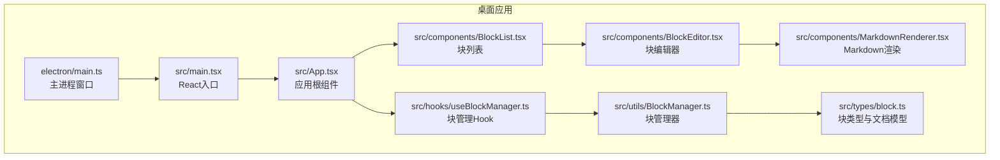
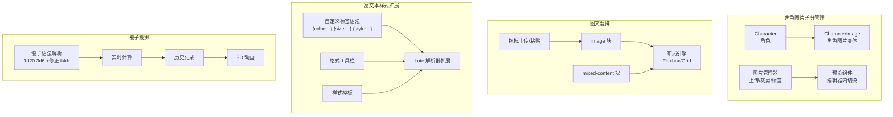
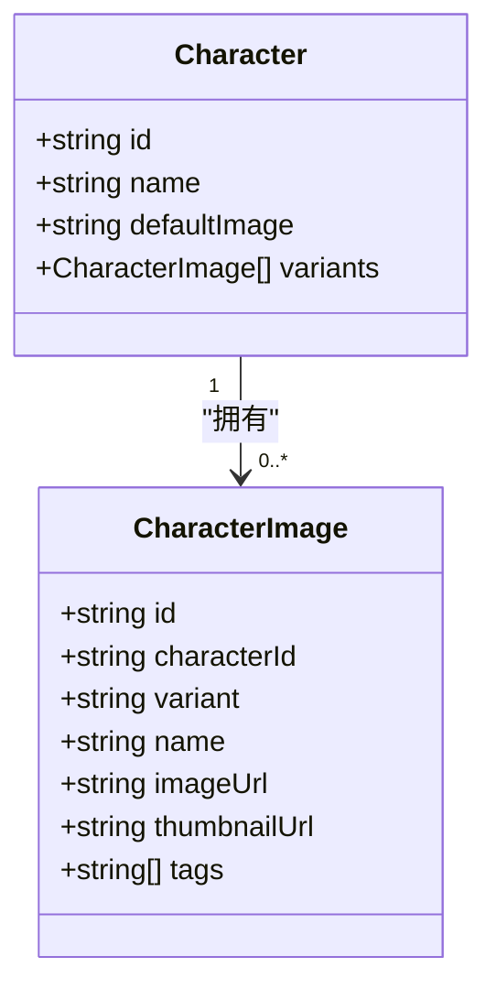
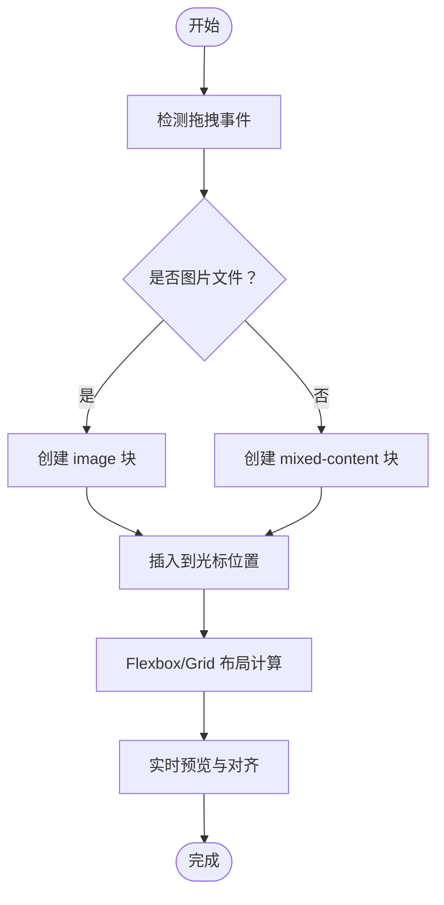
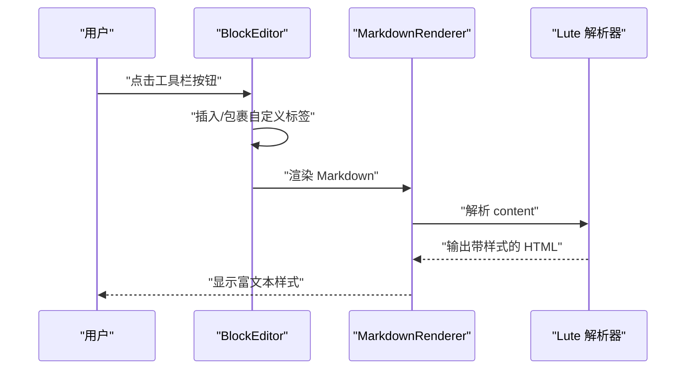
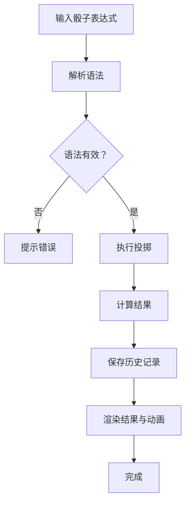
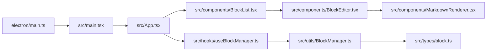

# 高级功能扩展

<cite>
**本文引用的文件**
- [README.md](file://README.md)
- [开发方案.md](file://docs/开发方案.md)
- [package.json](file://package.json)
- [main.ts](file://electron/main.ts)
- [main.tsx](file://src/main.tsx)
- [App.tsx](file://src/App.tsx)
- [BlockList.tsx](file://src/components/BlockList.tsx)
- [BlockEditor.tsx](file://src/components/BlockEditor.tsx)
- [MarkdownRenderer.tsx](file://src/components/MarkdownRenderer.tsx)
- [block.ts](file://src/types/block.ts)
- [useBlockManager.ts](file://src/hooks/useBlockManager.ts)
- [BlockManager.ts](file://src/utils/BlockManager.ts)
</cite>

## 目录
1. [引言](#引言)
2. [项目结构](#项目结构)
3. [核心组件](#核心组件)
4. [架构总览](#架构总览)
5. [详细组件分析](#详细组件分析)
6. [依赖分析](#依赖分析)
7. [性能考量](#性能考量)
8. [故障排查指南](#故障排查指南)
9. [结论](#结论)
10. [附录](#附录)

## 引言
本文件面向“角色图片差分管理”“图文混排”“富文本样式扩展”“骰子投掷”四项后期扩展功能，基于现有代码库与开发方案中的技术选型，系统性给出数据模型、核心逻辑与UI交互的设计建议。目标是帮助开发者评估实现复杂度与技术选型，确保扩展与现有架构（Electron + React + tiptap + Lute）保持一致性和可演进性。

## 项目结构
当前项目采用 Electron + React + TypeScript + Vite 构建，前端通过 tiptap 管理块编辑，Markdown 内容由 Lute 解析渲染，块数据结构与块管理器负责持久化与序列化。开发方案中已明确 Lute 作为 JS 版解析器，tiptap 作为块编辑引擎，为后续富文本扩展与骰子解析提供良好基础。

图表来源
- [main.ts](file://electron/main.ts#L1-L68)
- [main.tsx](file://src/main.tsx#L1-L10)
- [App.tsx](file://src/App.tsx#L1-L156)
- [BlockList.tsx](file://src/components/BlockList.tsx#L1-L145)
- [BlockEditor.tsx](file://src/components/BlockEditor.tsx#L1-L116)
- [MarkdownRenderer.tsx](file://src/components/MarkdownRenderer.tsx#L1-L125)
- [block.ts](file://src/types/block.ts#L1-L30)
- [useBlockManager.ts](file://src/hooks/useBlockManager.ts#L1-L97)
- [BlockManager.ts](file://src/utils/BlockManager.ts#L1-L227)

章节来源
- [README.md](file://README.md#L1-L90)
- [package.json](file://package.json#L1-L69)

## 核心组件
- 块类型与文档模型：定义了块的基本属性与文档容器，支撑后续扩展块类型与元数据字段。
- 块管理器：负责块的增删改查、排序、序列化与从 Markdown 初始化。
- 块编辑器：基于 tiptap 的块组件，支持编辑态/渲染态切换与拖拽排序。
- Markdown 渲染器：当前为简化实现，开发方案中明确将使用 Lute 替代以支持双链与富文本扩展。

章节来源
- [block.ts](file://src/types/block.ts#L1-L30)
- [BlockManager.ts](file://src/utils/BlockManager.ts#L1-L227)
- [BlockEditor.tsx](file://src/components/BlockEditor.tsx#L1-L116)
- [MarkdownRenderer.tsx](file://src/components/MarkdownRenderer.tsx#L1-L125)
- [useBlockManager.ts](file://src/hooks/useBlockManager.ts#L1-L97)

## 架构总览
扩展功能将围绕以下路径演进：
- 角色图片差分管理：新增 Character 与 CharacterImage 数据结构，配合图片上传、标签管理与实时预览组件。
- 图文混排：扩展 image 与 mixed-content 块类型，结合 CSS Flexbox/Grid 实现响应式布局与拖拽上传。
- 富文本样式扩展：在 Lute 解析器基础上扩展自定义标签语法，提供可视化格式工具栏与样式模板。
- 骰子投掷：解析 d20、d6 等投掷语法，提供实时计算、历史记录与 3D 动画效果。

图表来源
- [开发方案.md](file://docs/开发方案.md#L58-L117)
- [MarkdownRenderer.tsx](file://src/components/MarkdownRenderer.tsx#L1-L125)

## 详细组件分析

### 角色图片差分管理
- 数据模型
  - Character：包含角色基本信息与默认图片，以及变体集合。
  - CharacterImage：包含变体类型（默认/表情/服装/姿态）、名称、图片地址、缩略图、标签等。
- 核心逻辑
  - 图片上传：支持本地上传、批量导入与自动分类；提供裁剪与缩略图生成。
  - 标签管理：为图片打标签，支持搜索与筛选。
  - 实时预览：在编辑器中快速切换角色图片变体，支持预览与占位提示。
- UI 交互
  - 角色卡片面板：展示角色与变体列表，支持拖拽排序与批量操作。
  - 图片选择器：在块编辑器中弹出图片选择器，支持标签过滤与搜索。
- 复杂度与选型
  - 采用现有块编辑器与 Markdown 渲染器作为承载层，无需大幅重构。
  - 图片处理建议使用浏览器端 Canvas 与 Web Worker，避免阻塞主线程。

图表来源
- [开发方案.md](file://docs/开发方案.md#L60-L84)

章节来源
- [开发方案.md](file://docs/开发方案.md#L60-L84)

### 图文混排
- 数据模型
  - image 块：存储图片 URL、对齐方式、尺寸与描述。
  - mixed-content 块：组合多个子块（文本、image、列表等），通过 Flexbox/Grid 控制布局。
- 核心逻辑
  - 布局引擎：基于 CSS Flexbox/Grid 实现响应式布局，支持左对齐、右对齐、居中、环绕等。
  - 拖拽上传：支持拖拽图片到编辑区域，自动创建 image 块；支持剪贴板粘贴与 URL 引入。
  - 基础编辑：内置裁剪、缩放、滤镜等基础图片处理能力。
- UI 交互
  - 图片占位符：拖拽悬停时显示插入位置指示器。
  - 对齐工具栏：提供对齐与环绕选项，实时预览布局效果。
- 复杂度与选型
  - 与现有 BlockEditor/BlockList 结合，扩展块类型即可复用拖拽与排序能力。
  - 布局样式建议使用 Tailwind CSS 的 Flex/Grid 工具类，减少自定义样式开销。

图表来源
- [开发方案.md](file://docs/开发方案.md#L85-L93)
- [BlockList.tsx](file://src/components/BlockList.tsx#L1-L145)
- [BlockEditor.tsx](file://src/components/BlockEditor.tsx#L1-L116)

章节来源
- [开发方案.md](file://docs/开发方案.md#L85-L93)
- [BlockList.tsx](file://src/components/BlockList.tsx#L1-L145)
- [BlockEditor.tsx](file://src/components/BlockEditor.tsx#L1-L116)

### 富文本样式扩展
- 数据模型
  - 在 Block.content 中使用自定义标签语法，如 {color:red}、{size:18px}、{style:font-family:楷体}。
- 核心逻辑
  - Lute 扩展：在解析阶段拦截自定义标签，将其转换为合法 HTML 标签或内联样式。
  - 可视化工具栏：提供颜色、字号、字体族等按钮，点击时插入或包裹自定义标签。
  - 样式模板：预设常用样式组合，一键应用到选中文本。
- UI 交互
  - 工具栏悬浮定位：跟随光标或选区显示，支持快捷键触发。
  - 实时预览：编辑态下即时渲染样式变化，渲染态下保持一致外观。
- 复杂度与选型
  - 基于现有 MarkdownRenderer/BlockEditor 与 Lute 集成，扩展成本较低。
  - 注意 XSS 防护，确保自定义标签不会注入危险样式。

图表来源
- [开发方案.md](file://docs/开发方案.md#L94-L104)
- [MarkdownRenderer.tsx](file://src/components/MarkdownRenderer.tsx#L1-L125)
- [BlockEditor.tsx](file://src/components/BlockEditor.tsx#L1-L116)

章节来源
- [开发方案.md](file://docs/开发方案.md#L94-L104)
- [MarkdownRenderer.tsx](file://src/components/MarkdownRenderer.tsx#L1-L125)
- [BlockEditor.tsx](file://src/components/BlockEditor.tsx#L1-L116)

### 骰子投掷功能
- 数据模型
  - 骰子表达式：支持 1d20、3d6、1d20+5、2d6-2、1d20k1、4d6kh3 等。
  - 历史记录：存储每次投掷的表达式、结果与时间戳。
- 核心逻辑
  - 语法解析：识别骰子表达式与修正值、保留规则等。
  - 实时计算：输入时即时计算并显示结果，支持错误提示。
  - 历史记录：本地存储投掷历史，支持重新计算与导出。
  - 3D 动画：使用 CSS 3D 变换与动画库实现骰子旋转与落地效果。
- UI 交互
  - 表达式输入框：支持快捷键触发与自动补全。
  - 结果面板：显示计算过程与最终结果，支持复制与分享。
  - 历史面板：列表展示历史记录，支持筛选与重算。
- 复杂度与选型
  - 与现有块编辑器结合，可在编辑器中插入骰子块或内联表达式。
  - 动画建议使用轻量库或原生 CSS，避免影响编辑器性能。

图表来源
- [开发方案.md](file://docs/开发方案.md#L105-L117)

章节来源
- [开发方案.md](file://docs/开发方案.md#L105-L117)

## 依赖分析
- Electron 主进程负责窗口生命周期与安全策略，React 入口负责渲染应用。
- tiptap 作为块编辑引擎，Starter Kit 提供基础块类型与扩展。
- Lute 作为 Markdown 解析器，承担富文本与自定义语法扩展。
- 本地存储与文档序列化由 BlockManager 与 useBlockManager 管理。

图表来源
- [main.ts](file://electron/main.ts#L1-L68)
- [main.tsx](file://src/main.tsx#L1-L10)
- [App.tsx](file://src/App.tsx#L1-L156)
- [BlockList.tsx](file://src/components/BlockList.tsx#L1-L145)
- [BlockEditor.tsx](file://src/components/BlockEditor.tsx#L1-L116)
- [MarkdownRenderer.tsx](file://src/components/MarkdownRenderer.tsx#L1-L125)
- [useBlockManager.ts](file://src/hooks/useBlockManager.ts#L1-L97)
- [BlockManager.ts](file://src/utils/BlockManager.ts#L1-L227)
- [block.ts](file://src/types/block.ts#L1-L30)

章节来源
- [package.json](file://package.json#L1-L69)

## 性能考量
- 大文档场景下，建议对 Markdown 解析进行节流或延迟处理，避免输入时卡顿。
- 图片处理与 3D 动画应在后台线程或使用硬件加速，减少主线程阻塞。
- 本地存储采用分页读写与增量更新，降低内存占用。

## 故障排查指南
- Markdown 渲染异常：确认 Lute 解析器已正确集成，且自定义标签被正确拦截与转换。
- 拖拽排序失效：检查 BlockList 的 drag/drop 事件绑定与 isEditing 状态切换。
- 导入/导出失败：核对 JSON 结构与 BlockManager 的序列化/反序列化流程。
- Electron 安全问题：确保 webPreferences 配置与外部链接打开策略符合安全规范。

章节来源
- [BlockList.tsx](file://src/components/BlockList.tsx#L1-L145)
- [BlockEditor.tsx](file://src/components/BlockEditor.tsx#L1-L116)
- [BlockManager.ts](file://src/utils/BlockManager.ts#L1-L227)
- [main.ts](file://electron/main.ts#L1-L68)

## 结论
四项扩展功能均能在现有架构上平滑落地：角色图片差分管理与图文混排复用块编辑与渲染体系；富文本样式扩展依托 Lute 解析器与可视化工具栏；骰子投掷通过表达式解析与历史记录实现。建议优先实现角色图片与图文混排，再推进富文本样式扩展，最后完成骰子功能，以逐步提升编辑体验与创作表现力。

## 附录
- 开发方案中对 Lute、tiptap、Ant Design React + Tailwind CSS 的技术选型与扩展性设计已有明确规划，可作为后续实现的参考依据。

章节来源
- [开发方案.md](file://docs/开发方案.md#L1-L121)