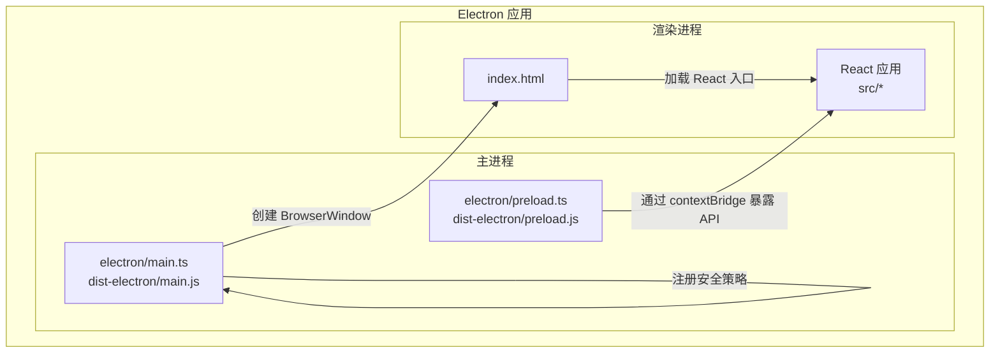
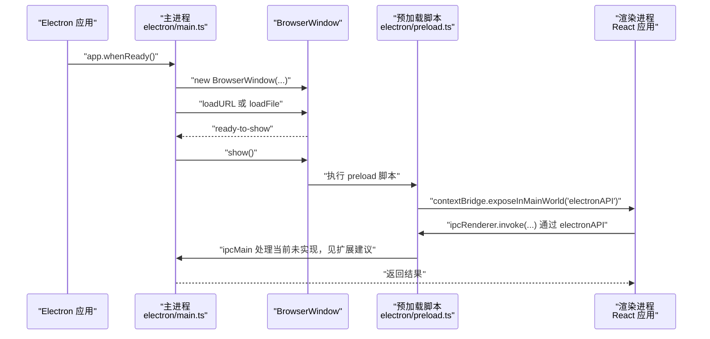
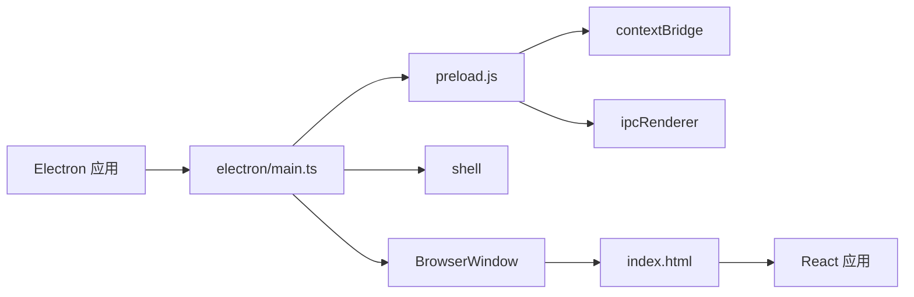
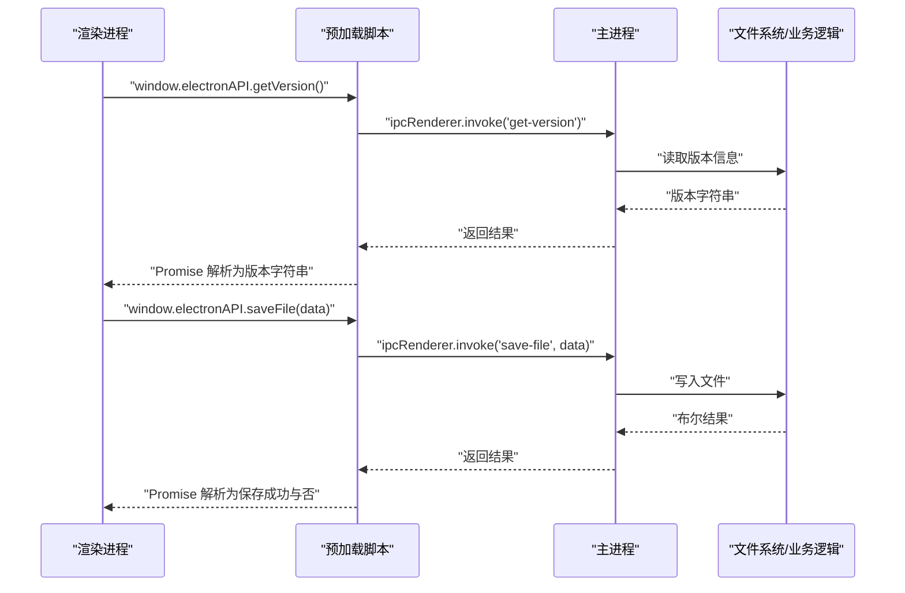

# Electron 架构与进程通信

<cite>
**本文引用的文件**
- [electron/main.ts](file://electron/main.ts)
- [electron/preload.ts](file://electron/preload.ts)
- [dist-electron/main.js](file://dist-electron/main.js)
- [dist-electron/preload.js](file://dist-electron/preload.js)
- [package.json](file://package.json)
- [index.html](file://index.html)
- [README.md](file://README.md)
</cite>

## 目录
1. [简介](#简介)
2. [项目结构](#项目结构)
3. [核心组件](#核心组件)
4. [架构总览](#架构总览)
5. [详细组件分析](#详细组件分析)
6. [依赖关系分析](#依赖关系分析)
7. [性能与体验特性](#性能与体验特性)
8. [故障排查指南](#故障排查指南)
9. [结论](#结论)
10. [附录：主进程与渲染进程通信扩展建议](#附录主进程与渲染进程通信扩展建议)

## 简介
本项目采用 Electron 框架构建桌面应用，前端为 React + TypeScript，通过 Vite 进行开发与打包。Electron 的主进程负责应用生命周期、窗口创建与安全策略，渲染进程承载 React 应用界面。本文档聚焦于主进程与渲染进程的职责划分、BrowserWindow 创建与配置、开发/生产环境加载逻辑、ready-to-show 防闪烁机制、preload 中通过 contextBridge 安全暴露 API、web-contents-created 事件的安全处理（外部浏览器打开链接），以及跨平台生命周期事件（app.whenReady、activate、window-all-closed）的差异处理。

## 项目结构
- electron/：主进程与预加载脚本目录
  - main.ts：主进程入口，负责窗口创建、生命周期与安全策略
  - preload.ts：预加载脚本，通过 contextBridge 向渲染进程暴露受控 API
- dist-electron/：构建产物（已编译的 JS）
- src/：React 前端应用源码
- index.html：前端入口页面，由主进程加载
- package.json：应用元信息与构建脚本，声明 Electron 主入口为 dist-electron/main.js

图表来源
- [electron/main.ts](file://electron/main.ts#L1-L68)
- [dist-electron/main.js](file://dist-electron/main.js#L1-L51)
- [electron/preload.ts](file://electron/preload.ts#L1-L21)
- [dist-electron/preload.js](file://dist-electron/preload.js#L1-L9)
- [index.html](file://index.html#L1-L13)

章节来源
- [README.md](file://README.md#L56-L75)
- [package.json](file://package.json#L1-L20)

## 核心组件
- 主进程（electron/main.ts）：应用初始化、窗口创建、生命周期事件监听、安全策略（web-contents-created）、开发/生产加载逻辑
- 预加载脚本（electron/preload.ts）：通过 contextBridge 在渲染进程上下文中暴露受控 API，避免直接注入整个 ipcRenderer
- 渲染进程（React 应用）：由 index.html 加载，通过 window.electronAPI 使用主进程能力

章节来源
- [electron/main.ts](file://electron/main.ts#L1-L68)
- [electron/preload.ts](file://electron/preload.ts#L1-L21)
- [dist-electron/main.js](file://dist-electron/main.js#L1-L51)
- [dist-electron/preload.js](file://dist-electron/preload.js#L1-L9)
- [index.html](file://index.html#L1-L13)

## 架构总览
下图展示主进程与渲染进程之间的交互路径，以及关键事件流：

图表来源
- [electron/main.ts](file://electron/main.ts#L1-L68)
- [dist-electron/main.js](file://dist-electron/main.js#L1-L51)
- [electron/preload.ts](file://electron/preload.ts#L1-L21)
- [dist-electron/preload.js](file://dist-electron/preload.js#L1-L9)

## 详细组件分析

### 主进程：BrowserWindow 创建与配置
- 窗口尺寸与最小尺寸：固定宽高与最小宽高，确保界面布局稳定
- webPreferences 关键项：
  - nodeIntegration: false（禁用 Node 集成，降低风险）
  - contextIsolation: true（启用上下文隔离，隔离渲染进程与 Node 环境）
  - preload: 指向预加载脚本路径（开发与生产分别定位到对应产物）
- 标题栏样式与首次显示：默认标题栏样式；show: false，配合 ready-to-show 避免界面闪烁
- 开发/生产加载逻辑：
  - 开发环境：加载 http://localhost:5173（Vite 开发服务器）
  - 生产环境：加载 ../dist/index.html（构建产物）
- 生命周期事件：
  - app.whenReady：应用就绪后创建窗口并注册 activate 事件（macOS 下点击 Dock 图标时重建窗口）
  - window-all-closed：除 macOS 外，关闭最后一个窗口时退出应用

章节来源
- [electron/main.ts](file://electron/main.ts#L6-L39)
- [dist-electron/main.js](file://dist-electron/main.js#L5-L29)
- [package.json](file://package.json#L1-L20)

### 预加载脚本：通过 contextBridge 安全暴露 API
- 作用：在渲染进程全局对象上暴露受控 API（window.electronAPI），仅包含必要的方法，避免直接访问 ipcRenderer
- 类型声明：通过 declare global 扩展 Window 接口，为暴露的方法提供类型提示
- 当前占位：预留了版本查询与文件保存等方法签名，便于后续扩展

章节来源
- [electron/preload.ts](file://electron/preload.ts#L1-L21)
- [dist-electron/preload.js](file://dist-electron/preload.js#L1-L9)

### 安全策略：web-contents-created 事件与外部浏览器打开
- 目标：阻止渲染进程通过 window.open 等方式在应用内创建新窗口，降低钓鱼与恶意弹窗风险
- 实现：监听 web-contents-created 事件，为每个 WebContents 设置 setWindowOpenHandler，统一将链接通过 shell.openExternal 在系统默认浏览器打开，并拒绝在应用内新建窗口

章节来源
- [electron/main.ts](file://electron/main.ts#L61-L68)
- [dist-electron/main.js](file://dist-electron/main.js#L45-L50)

### 生命周期与跨平台差异
- app.whenReady：应用初始化完成后触发，用于创建主窗口
- activate：macOS 下当应用成为活动状态且没有可见窗口时重建窗口
- window-all-closed：关闭最后一个窗口时，非 macOS 平台直接退出应用，macOS 保持菜单栏常驻

章节来源
- [electron/main.ts](file://electron/main.ts#L41-L60)
- [dist-electron/main.js](file://dist-electron/main.js#L32-L44)

### ready-to-show 防闪烁机制
- 机制：创建窗口时设置 show: false，等待 ready-to-show 事件后再显示，避免白屏或内容闪烁
- 适用场景：首屏资源较多或需要预渲染时，提升用户体验

章节来源
- [electron/main.ts](file://electron/main.ts#L19-L33)
- [dist-electron/main.js](file://dist-electron/main.js#L17-L28)

### 开发环境与生产环境加载逻辑
- 开发环境：主进程加载 http://localhost:5173，同时打开 DevTools，便于调试
- 生产环境：主进程加载 ../dist/index.html，渲染进程从构建产物启动

章节来源
- [electron/main.ts](file://electron/main.ts#L22-L28)
- [dist-electron/main.js](file://dist-electron/main.js#L20-L25)
- [index.html](file://index.html#L1-L13)

## 依赖关系分析
- 主进程依赖 Electron 的 app、BrowserWindow、shell 等模块
- 预加载脚本依赖 Electron 的 contextBridge、ipcRenderer
- React 应用通过 index.html 的 script 引入，由主进程加载
- package.json 指定 Electron 主入口为 dist-electron/main.js

图表来源
- [electron/main.ts](file://electron/main.ts#L1-L68)
- [dist-electron/main.js](file://dist-electron/main.js#L1-L51)
- [electron/preload.ts](file://electron/preload.ts#L1-L21)
- [dist-electron/preload.js](file://dist-electron/preload.js#L1-L9)
- [index.html](file://index.html#L1-L13)
- [package.json](file://package.json#L1-L20)

章节来源
- [package.json](file://package.json#L1-L20)

## 性能与体验特性
- ready-to-show 防闪烁：在资源加载完成后再显示窗口，减少视觉跳变
- 最小尺寸限制：保证界面在小屏设备上的可用性
- 开发时自动打开 DevTools：提升调试效率
- 预加载脚本与上下文隔离：在保证功能的前提下，尽量降低安全风险

章节来源
- [electron/main.ts](file://electron/main.ts#L19-L33)
- [dist-electron/main.js](file://dist-electron/main.js#L17-L28)

## 故障排查指南
- 窗口不显示或白屏
  - 检查是否正确使用 ready-to-show 显示窗口
  - 确认开发/生产加载路径是否正确
- 开发时无法打开 DevTools
  - 确认开发环境分支已执行打开 DevTools 的逻辑
- 新窗口被拦截
  - 若期望在应用内打开新窗口，请在 web-contents-created 中调整 setWindowOpenHandler 的行为
- macOS 无法退出
  - 确认 window-all-closed 事件在非 macOS 平台才调用 app.quit()

章节来源
- [electron/main.ts](file://electron/main.ts#L22-L39)
- [dist-electron/main.js](file://dist-electron/main.js#L20-L31)
- [electron/main.ts](file://electron/main.ts#L53-L60)
- [dist-electron/main.js](file://dist-electron/main.js#L40-L44)

## 结论
本项目在 Electron 架构上遵循安全优先原则：禁用 nodeIntegration、启用 contextIsolation、通过预加载脚本受控暴露 API，并在 web-contents-created 事件中统一处理新窗口打开的安全策略。主进程负责窗口生命周期与安全控制，渲染进程承载 React 应用并通过 window.electronAPI 与主进程进行有限的 IPC 通信。ready-to-show 与最小尺寸等细节提升了用户体验。后续可在主进程中实现具体的 IPC 处理逻辑，完善版本查询与文件保存等功能。

## 附录：主进程与渲染进程通信扩展建议
以下为基于现有 preload 占位符的扩展思路，便于在渲染进程中调用主进程能力（无需直接注入 ipcRenderer）：

- 在渲染进程中通过 window.electronAPI 调用主进程方法（例如版本查询、文件保存）
- 在主进程中注册对应的 ipcMain 处理器，响应渲染进程的 invoke 请求
- 通过 setWindowOpenHandler 统一处理外部链接，避免在应用内创建新窗口

图表来源
- [electron/preload.ts](file://electron/preload.ts#L1-L21)
- [dist-electron/preload.js](file://dist-electron/preload.js#L1-L9)
- [electron/main.ts](file://electron/main.ts#L61-L68)
- [dist-electron/main.js](file://dist-electron/main.js#L45-L50)