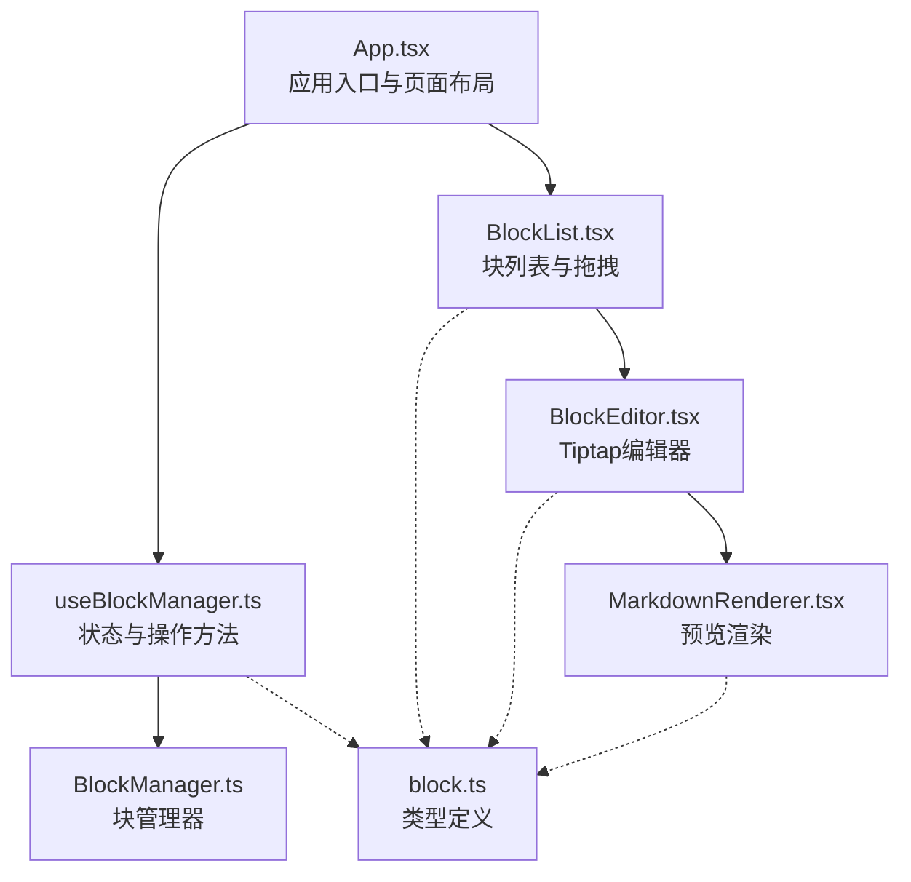
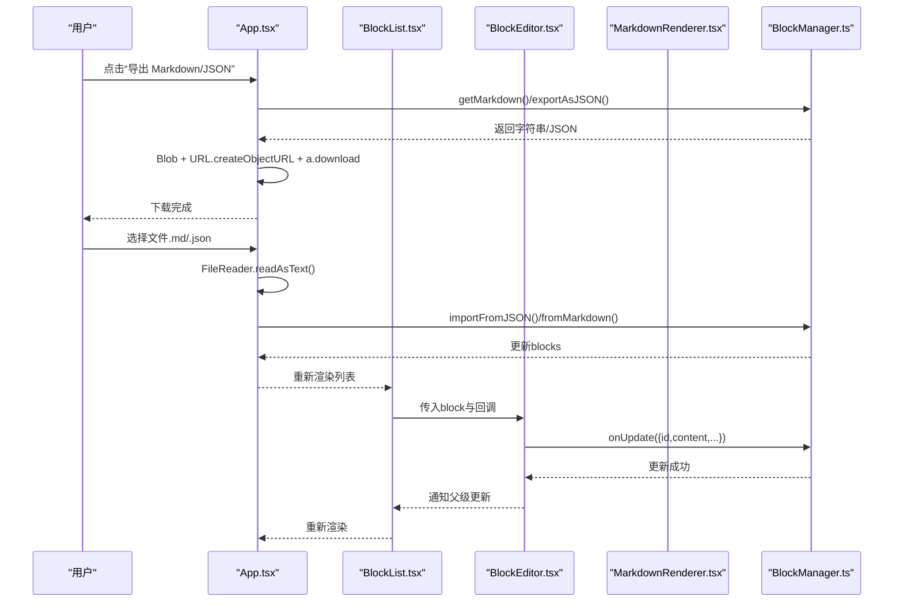
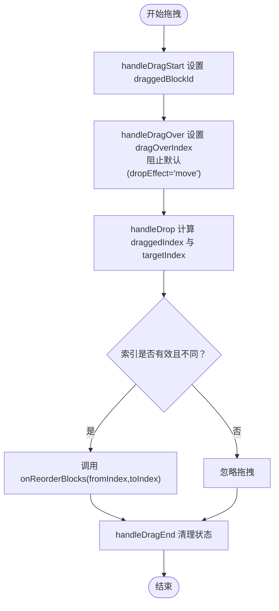
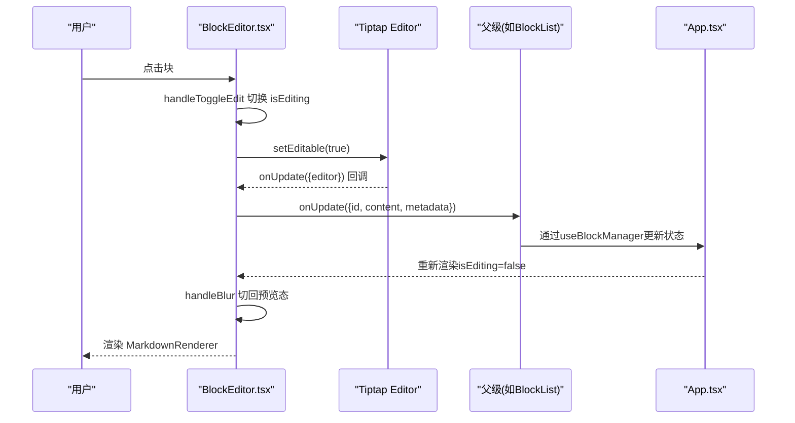
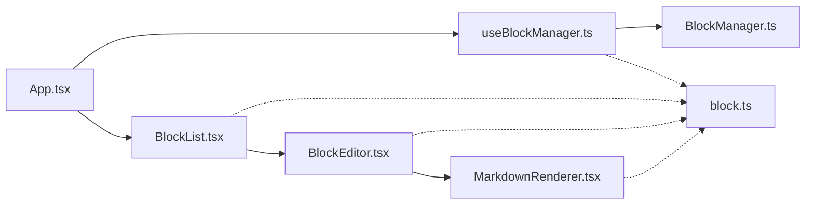

# UI组件架构与数据流

<cite>
**本文引用的文件**
- [src/App.tsx](file://src/App.tsx)
- [src/hooks/useBlockManager.ts](file://src/hooks/useBlockManager.ts)
- [src/utils/BlockManager.ts](file://src/utils/BlockManager.ts)
- [src/components/BlockList.tsx](file://src/components/BlockList.tsx)
- [src/components/BlockEditor.tsx](file://src/components/BlockEditor.tsx)
- [src/components/MarkdownRenderer.tsx](file://src/components/MarkdownRenderer.tsx)
- [src/types/block.ts](file://src/types/block.ts)
- [docs/tiptap集成说明.md](file://docs/tiptap集成说明.md)
</cite>

## 目录
1. [引言](#引言)
2. [项目结构](#项目结构)
3. [核心组件](#核心组件)
4. [架构总览](#架构总览)
5. [详细组件分析](#详细组件分析)
6. [依赖关系分析](#依赖关系分析)
7. [性能考量](#性能考量)
8. [故障排查指南](#故障排查指南)
9. [结论](#结论)
10. [附录](#附录)

## 引言
本文件聚焦于UI层的组件架构与数据流，围绕App.tsx作为入口，系统阐述：
- 如何通过useBlockManager初始化示例内容并获取状态与操作方法
- 导出（Markdown与JSON）与导入（文件选择）的实现机制（含FileReader、Blob、URL.createObjectURL与资源释放）
- BlockList如何接收blocks数组并渲染多个BlockEditor，以及onUpdateBlock、onAddBlock、onReorderBlocks的回调与上层逻辑通信
- 拖拽排序事件的传递路径
- 结合Tiptap集成，解释BlockEditor在编辑态与预览态之间的切换，以及MarkdownRenderer的渲染逻辑
- 单向数据流与关注点分离原则在UI层的体现
- 组件复用与扩展建议（支持更多块类型）

## 项目结构
UI层主要由以下层次构成：
- 入口与容器：App.tsx负责组织页面布局、调用useBlockManager并提供导入导出能力
- 状态与业务逻辑：useBlockManager封装BlockManager，暴露blocks与一系列操作方法；BlockManager负责块的增删改查、排序、Markdown导入导出
- 视图组件：BlockList负责块列表渲染与拖拽交互；BlockEditor基于Tiptap实现编辑态与预览态切换；MarkdownRenderer负责预览态的Markdown渲染
- 类型定义：block.ts定义块类型与文档结构

图表来源
- [src/App.tsx](file://src/App.tsx#L1-L156)
- [src/hooks/useBlockManager.ts](file://src/hooks/useBlockManager.ts#L1-L97)
- [src/utils/BlockManager.ts](file://src/utils/BlockManager.ts#L1-L227)
- [src/components/BlockList.tsx](file://src/components/BlockList.tsx#L1-L145)
- [src/components/BlockEditor.tsx](file://src/components/BlockEditor.tsx#L1-L116)
- [src/components/MarkdownRenderer.tsx](file://src/components/MarkdownRenderer.tsx#L1-L125)
- [src/types/block.ts](file://src/types/block.ts#L1-L30)

章节来源
- [src/App.tsx](file://src/App.tsx#L1-L156)
- [src/hooks/useBlockManager.ts](file://src/hooks/useBlockManager.ts#L1-L97)
- [src/utils/BlockManager.ts](file://src/utils/BlockManager.ts#L1-L227)
- [src/components/BlockList.tsx](file://src/components/BlockList.tsx#L1-L145)
- [src/components/BlockEditor.tsx](file://src/components/BlockEditor.tsx#L1-L116)
- [src/components/MarkdownRenderer.tsx](file://src/components/MarkdownRenderer.tsx#L1-L125)
- [src/types/block.ts](file://src/types/block.ts#L1-L30)

## 核心组件
- App.tsx：页面入口，负责初始化示例内容，注入useBlockManager返回的状态与操作方法，并提供导出（Markdown/JSON）、导入（文件选择）按钮与处理函数
- useBlockManager.ts：封装BlockManager，提供blocks状态与updateBlock/addBlock/deleteBlock/reorderBlocks/getMarkdown/exportAsJSON/importFromJSON等方法
- BlockManager.ts：面向块的业务逻辑，包含增删改查、排序、从Markdown导入、转为Markdown等
- BlockList.tsx：渲染块列表，维护当前编辑块ID、拖拽状态，处理拖拽事件并向父级回调排序
- BlockEditor.tsx：基于Tiptap的编辑器，根据isEditing在编辑态与预览态之间切换；编辑态下通过useEditor监听内容变更并向上游更新
- MarkdownRenderer.tsx：预览态的Markdown渲染器，将块内容转换为HTML片段
- block.ts：定义Block与Document的数据结构与块类型枚举

章节来源
- [src/App.tsx](file://src/App.tsx#L1-L156)
- [src/hooks/useBlockManager.ts](file://src/hooks/useBlockManager.ts#L1-L97)
- [src/utils/BlockManager.ts](file://src/utils/BlockManager.ts#L1-L227)
- [src/components/BlockList.tsx](file://src/components/BlockList.tsx#L1-L145)
- [src/components/BlockEditor.tsx](file://src/components/BlockEditor.tsx#L1-L116)
- [src/components/MarkdownRenderer.tsx](file://src/components/MarkdownRenderer.tsx#L1-L125)
- [src/types/block.ts](file://src/types/block.ts#L1-L30)

## 架构总览
UI层采用“容器组件 + 展示组件”的分层设计：
- 容器层：App.tsx与useBlockManager.ts，负责状态与业务逻辑
- 展示层：BlockList.tsx、BlockEditor.tsx、MarkdownRenderer.tsx，负责视图渲染与用户交互
- 数据单向流动：App -> BlockList -> BlockEditor/MarkdownRenderer；事件向上冒泡：BlockEditor/BlockList -> App

图表来源
- [src/App.tsx](file://src/App.tsx#L57-L98)
- [src/hooks/useBlockManager.ts](file://src/hooks/useBlockManager.ts#L48-L93)
- [src/utils/BlockManager.ts](file://src/utils/BlockManager.ts#L101-L223)
- [src/components/BlockList.tsx](file://src/components/BlockList.tsx#L64-L103)
- [src/components/BlockEditor.tsx](file://src/components/BlockEditor.tsx#L23-L63)

## 详细组件分析

### App.tsx：入口与数据流控制
- 初始化示例内容：通过initialContent构造初始Markdown，交由useBlockManager进行解析与状态初始化
- 状态与操作方法：解构得到blocks、updateBlock、addBlock、reorderBlocks、getMarkdown、exportAsJSON、importFromJSON
- 导出功能：
  - handleExport：调用getMarkdown生成Markdown字符串，new Blob创建二进制对象，URL.createObjectURL生成临时下载链接，创建a元素触发下载，最后URL.revokeObjectURL释放内存
  - handleExportJSON：同上，但类型为application/json
- 导入功能：
  - handleImport：通过FileReader读取文件文本，若为.json则调用importFromJSON；否则简单刷新以重新初始化（便于演示）
- 与BlockList通信：将blocks与三个回调onUpdateBlock/onAddBlock/onReorderBlocks传入，形成单向数据流

章节来源
- [src/App.tsx](file://src/App.tsx#L47-L154)
- [docs/tiptap集成说明.md](file://docs/tiptap集成说明.md#L45-L71)

### useBlockManager.ts：状态与操作方法封装
- 初始化：根据initialContent调用BlockManager.fromMarkdown或直接实例化BlockManager
- 状态：内部以useState维护blocks，每次操作均通过BlockManager计算最新状态并setBlocks
- 操作方法：
  - updateBlock：更新指定块并刷新状态
  - addBlock：新增块并返回新块
  - deleteBlock：删除指定块
  - reorderBlocks：根据索引移动块位置
  - getMarkdown：导出为Markdown
  - exportAsJSON：导出为JSON字符串
  - importFromJSON：解析JSON并重建块列表，随后刷新状态

章节来源
- [src/hooks/useBlockManager.ts](file://src/hooks/useBlockManager.ts#L1-L97)
- [src/utils/BlockManager.ts](file://src/utils/BlockManager.ts#L1-L227)

### BlockList.tsx：块列表与拖拽排序
- 接收参数：blocks、onUpdateBlock、onAddBlock、onReorderBlocks
- 内部状态：
  - editingBlockId：当前处于编辑态的块ID
  - draggedBlockId/dragOverIndex：拖拽过程中的状态
- 交互逻辑：
  - handleToggleEdit：点击块时切换编辑态
  - 拖拽事件：handleDragStart/handleDragOver/handleDrop/handleDragEnd，计算拖拽起止索引并调用onReorderBlocks
  - 拖拽指示器：在目标位置上方绘制蓝色条带
  - 新增块：提供多种类型按钮，统一通过onAddBlock触发
- 渲染：遍历blocks，为每个块渲染BlockEditor，并传入isEditing与onToggleEdit

图表来源
- [src/components/BlockList.tsx](file://src/components/BlockList.tsx#L26-L62)

章节来源
- [src/components/BlockList.tsx](file://src/components/BlockList.tsx#L1-L145)

### BlockEditor.tsx：编辑态与预览态切换（Tiptap集成）
- Tiptap配置：StarterKit、Placeholder、TaskList/TaskItem、Blockquote、Heading(levels)、BulletList、OrderedList、HorizontalRule、DragHandle
- 编辑态：
  - useEditor初始化，editable由isEditing控制
  - onUpdate中读取HTML并通过onUpdate将完整Block对象回传给父级
  - blur时触发onToggleEdit回到预览态
- 预览态：
  - 若非编辑态，渲染MarkdownRenderer，点击触发onEdit
- 内容同步：
  - useEffect根据isEditing设置编辑器可编辑性
  - useEffect在block.content变化时同步到编辑器内容

图表来源
- [src/components/BlockEditor.tsx](file://src/components/BlockEditor.tsx#L23-L113)
- [src/components/MarkdownRenderer.tsx](file://src/components/MarkdownRenderer.tsx#L76-L122)
- [src/components/BlockList.tsx](file://src/components/BlockList.tsx#L86-L93)
- [src/hooks/useBlockManager.ts](file://src/hooks/useBlockManager.ts#L18-L28)

章节来源
- [src/components/BlockEditor.tsx](file://src/components/BlockEditor.tsx#L1-L116)
- [src/components/MarkdownRenderer.tsx](file://src/components/MarkdownRenderer.tsx#L1-L125)

### MarkdownRenderer.tsx：预览态渲染
- 解析策略：根据块内容前缀判断类型（标题、引用、列表、分割线），否则作为段落处理
- 样式：内置CSS规则，覆盖标题字号、段落间距、引用边框、列表缩进、水平线、代码背景、链接颜色等
- 交互：点击触发onEdit，使能编辑态

章节来源
- [src/components/MarkdownRenderer.tsx](file://src/components/MarkdownRenderer.tsx#L1-L125)

### BlockManager.ts：块管理器（业务逻辑）
- 增删改查：addBlock/updateBlock/deleteBlock/getBlock/getBlocks
- 排序：reorderBlocks支持原地交换
- 文档：createDocument/getDocument
- 导入导出：
  - fromMarkdown：按行扫描，识别标题、引用、列表、分割线与段落，生成对应块
  - toMarkdown：拼接各块content，以空行分隔
- ID生成：generateId保证唯一性

章节来源
- [src/utils/BlockManager.ts](file://src/utils/BlockManager.ts#L1-L227)

### 类型定义：block.ts
- BlockType：'heading' | 'paragraph' | 'quote' | 'bulletList' | 'orderedList' | 'taskList' | 'horizontalRule'
- Block：包含id、type、content、references、referencedBy、metadata
- Document：包含id、title、blocks、created、modified

章节来源
- [src/types/block.ts](file://src/types/block.ts#L1-L30)

## 依赖关系分析
- 组件依赖：
  - App依赖useBlockManager与BlockList
  - BlockList依赖BlockEditor与自身内部状态
  - BlockEditor依赖Tiptap与MarkdownRenderer
  - MarkdownRenderer为纯展示组件，无外部依赖
- 业务依赖：
  - useBlockManager依赖BlockManager
  - BlockManager依赖BlockType与Document类型定义

图表来源
- [src/App.tsx](file://src/App.tsx#L1-L156)
- [src/hooks/useBlockManager.ts](file://src/hooks/useBlockManager.ts#L1-L97)
- [src/utils/BlockManager.ts](file://src/utils/BlockManager.ts#L1-L227)
- [src/components/BlockList.tsx](file://src/components/BlockList.tsx#L1-L145)
- [src/components/BlockEditor.tsx](file://src/components/BlockEditor.tsx#L1-L116)
- [src/components/MarkdownRenderer.tsx](file://src/components/MarkdownRenderer.tsx#L1-L125)
- [src/types/block.ts](file://src/types/block.ts#L1-L30)

章节来源
- [src/App.tsx](file://src/App.tsx#L1-L156)
- [src/hooks/useBlockManager.ts](file://src/hooks/useBlockManager.ts#L1-L97)
- [src/utils/BlockManager.ts](file://src/utils/BlockManager.ts#L1-L227)
- [src/components/BlockList.tsx](file://src/components/BlockList.tsx#L1-L145)
- [src/components/BlockEditor.tsx](file://src/components/BlockEditor.tsx#L1-L116)
- [src/components/MarkdownRenderer.tsx](file://src/components/MarkdownRenderer.tsx#L1-L125)
- [src/types/block.ts](file://src/types/block.ts#L1-L30)

## 性能考量
- 状态更新粒度：useBlockManager在每次操作后整体替换blocks数组，适合中小规模文档；大规模文档建议使用更细粒度的更新策略（如仅替换受影响块）
- 渲染优化：BlockEditor在编辑态与预览态切换时避免不必要的重渲染；MarkdownRenderer仅在点击时触发onEdit
- 拖拽性能：BlockList使用索引计算与一次性回调onReorderBlocks，减少多次重排
- 导出/导入：导出为Blob与URL.createObjectURL的使用合理；导入时JSON解析与批量重建块列表可能成为瓶颈，建议在大文档场景增加节流/批处理与进度提示

## 故障排查指南
- 导出无效或无法下载
  - 检查handleExport/handleExportJSON中Blob类型与URL.createObjectURL流程是否执行
  - 确认a元素点击与URL.revokeObjectURL是否被调用
  - 参考路径：[src/App.tsx](file://src/App.tsx#L57-L81)
- 导入失败
  - JSON导入需确保数据包含blocks字段且为数组；异常时会打印错误并返回false
  - 简单的Markdown导入会刷新页面以重新初始化
  - 参考路径：[src/App.tsx](file://src/App.tsx#L83-L98)，[src/hooks/useBlockManager.ts](file://src/hooks/useBlockManager.ts#L62-L83)
- 拖拽排序不生效
  - 确认handleDragStart设置draggedBlockId与effectAllowed；handleDragOver阻止默认并设置dropEffect
  - 确认handleDrop计算索引并调用onReorderBlocks
  - 参考路径：[src/components/BlockList.tsx](file://src/components/BlockList.tsx#L26-L57)
- 编辑态无法切换
  - 检查BlockEditor的isEditing状态与useEffect同步逻辑
  - 确认onBlur触发onToggleEdit
  - 参考路径：[src/components/BlockEditor.tsx](file://src/components/BlockEditor.tsx#L65-L89)

章节来源
- [src/App.tsx](file://src/App.tsx#L57-L98)
- [src/hooks/useBlockManager.ts](file://src/hooks/useBlockManager.ts#L62-L83)
- [src/components/BlockList.tsx](file://src/components/BlockList.tsx#L26-L57)
- [src/components/BlockEditor.tsx](file://src/components/BlockEditor.tsx#L65-L89)

## 结论
本UI层以App.tsx为入口，通过useBlockManager将业务逻辑与视图解耦，形成清晰的单向数据流与关注点分离：
- App负责页面布局与导入导出
- BlockList负责块列表与拖拽交互
- BlockEditor基于Tiptap实现编辑态与预览态切换
- MarkdownRenderer提供轻量预览
- BlockManager承担块的增删改查与序列化
该架构具备良好的可扩展性，便于后续引入更多块类型与高级功能。

## 附录

### 组件复用与扩展建议
- 支持更多块类型
  - 在BlockType中新增类型并在BlockManager与BlockEditor中补充对应扩展
  - 在BlockList的新增按钮区加入对应按钮
  - 参考类型定义与现有扩展：[src/types/block.ts](file://src/types/block.ts#L1-L30)，[src/components/BlockEditor.tsx](file://src/components/BlockEditor.tsx#L23-L49)
- 双链功能
  - 预留了双链语法的标记位，可在MarkdownRenderer中增强解析与渲染
  - 参考说明：[docs/tiptap集成说明.md](file://docs/tiptap集成说明.md#L72-L78)
- 富文本扩展
  - 基于Tiptap生态继续扩展，如表格、代码块高亮、图片上传等
  - 参考说明：[docs/tiptap集成说明.md](file://docs/tiptap集成说明.md#L74-L77)
- 本地存储与协同
  - 可集成localForage/IndexedDB实现持久化；或基于Tiptap协同编辑能力扩展多人协作
  - 参考说明：[docs/tiptap集成说明.md](file://docs/tiptap集成说明.md#L74-L77)