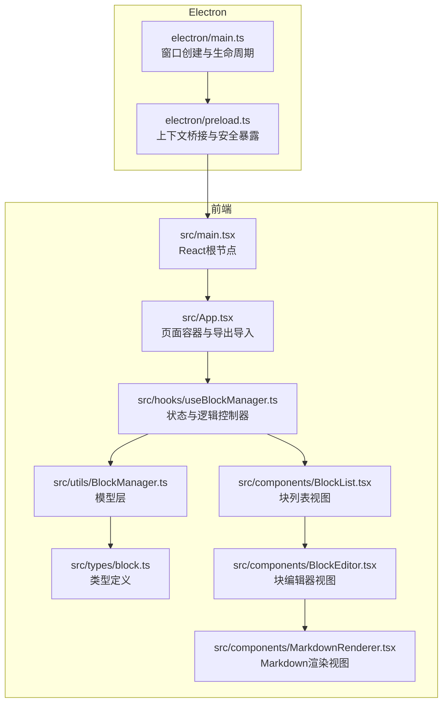
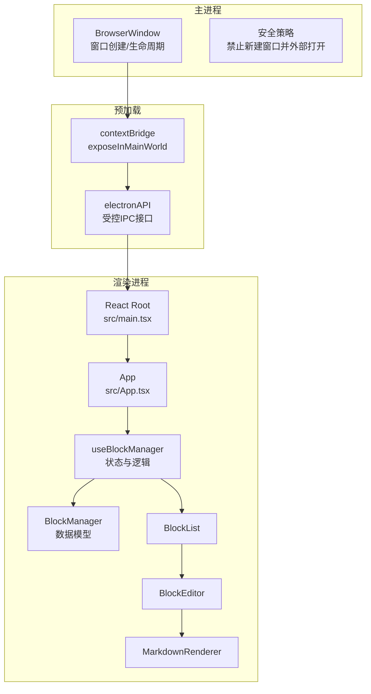
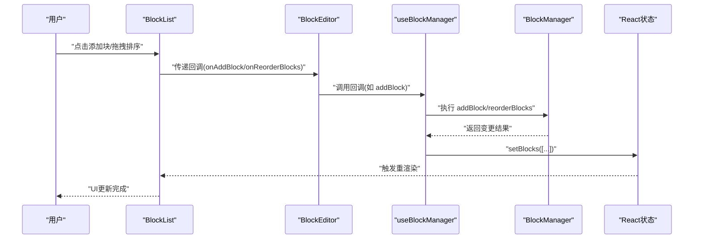
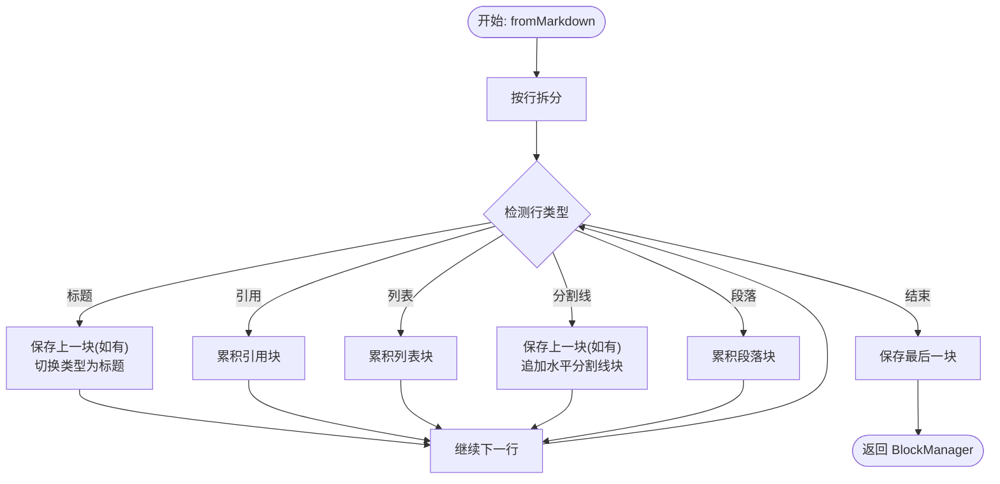
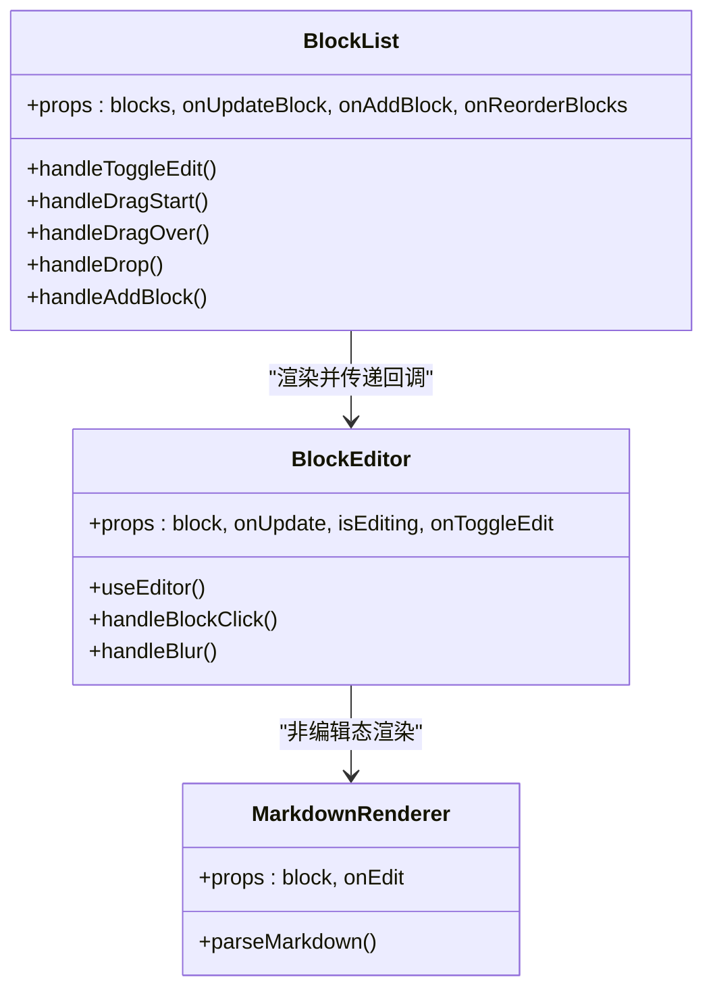
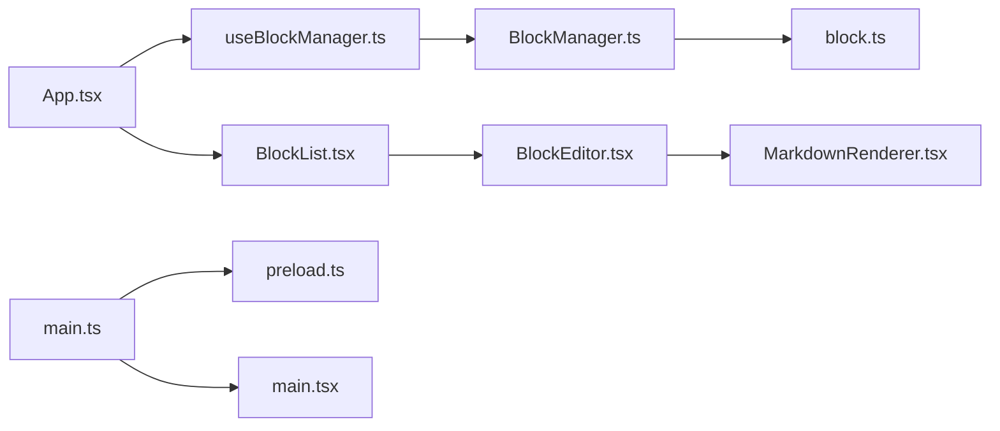

# 架构设计

<cite>
**本文引用的文件**
- [electron/main.ts](file://electron/main.ts)
- [electron/preload.ts](file://electron/preload.ts)
- [src/main.tsx](file://src/main.tsx)
- [src/App.tsx](file://src/App.tsx)
- [src/hooks/useBlockManager.ts](file://src/hooks/useBlockManager.ts)
- [src/utils/BlockManager.ts](file://src/utils/BlockManager.ts)
- [src/types/block.ts](file://src/types/block.ts)
- [src/components/BlockList.tsx](file://src/components/BlockList.tsx)
- [src/components/BlockEditor.tsx](file://src/components/BlockEditor.tsx)
- [src/components/MarkdownRenderer.tsx](file://src/components/MarkdownRenderer.tsx)
- [package.json](file://package.json)
</cite>

## 目录
1. [引言](#引言)
2. [项目结构](#项目结构)
3. [核心组件](#核心组件)
4. [架构总览](#架构总览)
5. [详细组件分析](#详细组件分析)
6. [依赖关系分析](#依赖关系分析)
7. [性能考量](#性能考量)
8. [故障排查指南](#故障排查指南)
9. [结论](#结论)
10. [附录](#附录)

## 引言
本架构设计文档聚焦于本项目的整体结构与数据流动机制，明确 Electron 主进程与渲染进程的职责边界：主进程负责窗口生命周期与系统级交互，渲染进程承载 UI 与业务逻辑。同时，本文深入解析前端“MVC-like”架构：
- Model 层：由 BlockManager 类实现，负责块数据的增删改查、序列化与文档抽象。
- View 层：由 BlockList、BlockEditor、MarkdownRenderer 等组件构成，承担渲染与交互。
- Controller 层：通过 useBlockManager 自定义 Hook 连接 Model 与 View，集中管理状态逻辑。

本文还绘制了“用户操作 → 组件事件 → useBlockManager 调用 → BlockManager 处理 → 状态更新 → UI 重渲染”的数据流路径，并强调关注点分离与单向数据流的设计优势。

## 项目结构
项目采用分层清晰的组织方式：
- Electron 层：主进程入口与预加载脚本，负责窗口创建、安全桥接与外部链接处理。
- 前端层：React 应用入口、页面容器、自定义 Hook、工具类与 UI 组件。
- 类型定义：统一的块与文档类型接口，确保跨模块契约一致。

图表来源
- [electron/main.ts](file://electron/main.ts#L1-L68)
- [electron/preload.ts](file://electron/preload.ts#L1-L21)
- [src/main.tsx](file://src/main.tsx#L1-L10)
- [src/App.tsx](file://src/App.tsx#L1-L156)
- [src/hooks/useBlockManager.ts](file://src/hooks/useBlockManager.ts#L1-L97)
- [src/utils/BlockManager.ts](file://src/utils/BlockManager.ts#L1-L227)
- [src/types/block.ts](file://src/types/block.ts#L1-L30)
- [src/components/BlockList.tsx](file://src/components/BlockList.tsx#L1-L145)
- [src/components/BlockEditor.tsx](file://src/components/BlockEditor.tsx#L1-L116)
- [src/components/MarkdownRenderer.tsx](file://src/components/MarkdownRenderer.tsx#L1-L125)

章节来源
- [electron/main.ts](file://electron/main.ts#L1-L68)
- [electron/preload.ts](file://electron/preload.ts#L1-L21)
- [src/main.tsx](file://src/main.tsx#L1-L10)
- [src/App.tsx](file://src/App.tsx#L1-L156)
- [src/hooks/useBlockManager.ts](file://src/hooks/useBlockManager.ts#L1-L97)
- [src/utils/BlockManager.ts](file://src/utils/BlockManager.ts#L1-L227)
- [src/types/block.ts](file://src/types/block.ts#L1-L30)
- [src/components/BlockList.tsx](file://src/components/BlockList.tsx#L1-L145)
- [src/components/BlockEditor.tsx](file://src/components/BlockEditor.tsx#L1-L116)
- [src/components/MarkdownRenderer.tsx](file://src/components/MarkdownRenderer.tsx#L1-L125)

## 核心组件
- 主进程（electron/main.ts）
  - 负责创建 BrowserWindow、加载开发/生产资源、窗口生命周期管理、安全策略（禁止新建窗口并转交外部打开）。
- 预加载脚本（electron/preload.ts）
  - 通过 contextBridge.exposeInMainWorld 安全暴露受控的 IPC 接口到渲染进程，避免直接暴露整个 ipcRenderer。
- React 根入口（src/main.tsx）
  - 渲染 <App /> 根组件，挂载到 DOM。
- 页面容器（src/App.tsx）
  - 使用 useBlockManager 初始化状态，提供导出 Markdown/JSON 与导入能力。
- 自定义 Hook（src/hooks/useBlockManager.ts）
  - 将 BlockManager 与 React 状态绑定，提供统一的 CRUD、排序、序列化与导入导出 API。
- 模型层（src/utils/BlockManager.ts）
  - 实现块集合的增删改查、重排、文档创建、Markdown 解析与导出。
- 视图层
  - BlockList：块列表渲染、拖拽排序、新增块按钮。
  - BlockEditor：基于 tiptap 的富文本编辑器，支持占位符、任务列表、引用、标题、列表、水平分割线与拖拽句柄。
  - MarkdownRenderer：将块内容转换为 HTML 并渲染，支持标题、引用、列表、分割线与基础格式。
- 类型定义（src/types/block.ts）
  - 统一 Block 与 Document 结构，包含元数据与双向链接预留字段。

章节来源
- [electron/main.ts](file://electron/main.ts#L1-L68)
- [electron/preload.ts](file://electron/preload.ts#L1-L21)
- [src/main.tsx](file://src/main.tsx#L1-L10)
- [src/App.tsx](file://src/App.tsx#L1-L156)
- [src/hooks/useBlockManager.ts](file://src/hooks/useBlockManager.ts#L1-L97)
- [src/utils/BlockManager.ts](file://src/utils/BlockManager.ts#L1-L227)
- [src/types/block.ts](file://src/types/block.ts#L1-L30)
- [src/components/BlockList.tsx](file://src/components/BlockList.tsx#L1-L145)
- [src/components/BlockEditor.tsx](file://src/components/BlockEditor.tsx#L1-L116)
- [src/components/MarkdownRenderer.tsx](file://src/components/MarkdownRenderer.tsx#L1-L125)

## 架构总览
本系统采用“主进程 + 渲染进程”的经典 Electron 架构，结合 React 的函数式组件与自定义 Hook，形成清晰的 MVC-like 分层：
- 主进程：窗口与系统交互（菜单、关闭策略、外部链接处理）。
- 预加载脚本：安全桥接，仅暴露必要 API。
- 渲染进程：React 应用，页面容器负责业务编排，自定义 Hook 聚合状态与逻辑，组件负责视图与交互。

图表来源
- [electron/main.ts](file://electron/main.ts#L1-L68)
- [electron/preload.ts](file://electron/preload.ts#L1-L21)
- [src/main.tsx](file://src/main.tsx#L1-L10)
- [src/App.tsx](file://src/App.tsx#L1-L156)
- [src/hooks/useBlockManager.ts](file://src/hooks/useBlockManager.ts#L1-L97)
- [src/utils/BlockManager.ts](file://src/utils/BlockManager.ts#L1-L227)
- [src/components/BlockList.tsx](file://src/components/BlockList.tsx#L1-L145)
- [src/components/BlockEditor.tsx](file://src/components/BlockEditor.tsx#L1-L116)
- [src/components/MarkdownRenderer.tsx](file://src/components/MarkdownRenderer.tsx#L1-L125)

## 详细组件分析

### 主进程与预加载脚本
- 主进程职责
  - 创建 BrowserWindow，设置 webPreferences（禁用 nodeIntegration、启用 contextIsolation、指定 preload），开发模式下加载本地 Vite 服务，生产模式加载打包后的 index.html。
  - 窗口 ready-to-show 后再显示，防止白屏。
  - macOS 下 dock 激活时重建窗口；所有窗口关闭时退出应用（macOS 例外）。
  - 新窗口创建拦截：将外部链接通过 shell 打开，拒绝在应用内创建新窗口。
- 预加载脚本职责
  - 使用 contextBridge.exposeInMainWorld 暴露受控 API（例如 electronAPI），避免渲染进程直接访问 ipcRenderer。
  - 提供全局类型声明，确保类型安全。

章节来源
- [electron/main.ts](file://electron/main.ts#L1-L68)
- [electron/preload.ts](file://electron/preload.ts#L1-L21)

### React 应用入口与页面容器
- React 根入口
  - 在 src/main.tsx 中创建根节点并渲染 <App />。
- 页面容器（App）
  - 使用 useBlockManager 初始化初始 Markdown 内容，提供导出 Markdown/JSON 与导入能力（文件读取、JSON 导入、简单 Markdown 重载）。
  - 将 blocks 与 CRUD、排序、序列化方法传递给 BlockList。

章节来源
- [src/main.tsx](file://src/main.tsx#L1-L10)
- [src/App.tsx](file://src/App.tsx#L1-L156)

### 自定义 Hook：useBlockManager
- 设计要点
  - 通过 useState 初始化 BlockManager（可从 Markdown 快速构建）。
  - 维护本地 blocks 状态，所有变更均通过 BlockManager 方法执行，保证数据一致性。
  - 暴露统一 API：updateBlock、addBlock、deleteBlock、reorderBlocks、getMarkdown、exportAsJSON、importFromJSON。
  - 导入流程：解析 JSON，清空当前块，逐个重建新块，最后同步本地状态。
- 数据流
  - 用户在 BlockList/BlockEditor 中触发事件 → useBlockManager 回调 → BlockManager 执行变更 → 更新本地 blocks → 触发重渲染。

图表来源
- [src/components/BlockList.tsx](file://src/components/BlockList.tsx#L1-L145)
- [src/components/BlockEditor.tsx](file://src/components/BlockEditor.tsx#L1-L116)
- [src/hooks/useBlockManager.ts](file://src/hooks/useBlockManager.ts#L1-L97)
- [src/utils/BlockManager.ts](file://src/utils/BlockManager.ts#L1-L227)

章节来源
- [src/hooks/useBlockManager.ts](file://src/hooks/useBlockManager.ts#L1-L97)

### 模型层：BlockManager
- 能力范围
  - 块集合管理：getBlocks、getBlock、addBlock、updateBlock、deleteBlock、reorderBlocks。
  - 文档抽象：createDocument、getDocument。
  - 序列化：toMarkdown；fromMarkdown（根据 Markdown 行为解析为块集合）。
  - 元数据：统一记录 created/modified。
- 关键算法
  - fromMarkdown：按行扫描，识别标题、引用、列表、分割线与段落，合并相邻同类块，最终生成 BlockManager 实例。
  - reorderBlocks：边界校验后进行数组切片与插入，保持 O(n) 时间复杂度。
- 复杂度分析
  - getBlocks/getBlock/updateBlock/deleteBlock：O(n)。
  - reorderBlocks：O(n)（splice 操作）。
  - fromMarkdown：O(m)，m 为行数。
  - toMarkdown：O(k)，k 为块数量。

图表来源
- [src/utils/BlockManager.ts](file://src/utils/BlockManager.ts#L1-L227)

章节来源
- [src/utils/BlockManager.ts](file://src/utils/BlockManager.ts#L1-L227)

### 视图层：BlockList、BlockEditor、MarkdownRenderer
- BlockList
  - 负责渲染块列表、处理拖拽排序（dragStart/dragOver/drop）、新增块按钮组。
  - 与 BlockEditor 协作，控制编辑态切换与内容更新。
- BlockEditor
  - 基于 @tiptap/react，启用占位符、任务列表、引用、标题、列表、水平分割线与拖拽句柄。
  - 监听编辑器更新，将 HTML 内容回传给父组件，同时维护 isEditing 状态。
- MarkdownRenderer
  - 将块内容解析为 HTML 并渲染，支持标题、引用、列表、分割线与基础格式；点击触发编辑态。

图表来源
- [src/components/BlockList.tsx](file://src/components/BlockList.tsx#L1-L145)
- [src/components/BlockEditor.tsx](file://src/components/BlockEditor.tsx#L1-L116)
- [src/components/MarkdownRenderer.tsx](file://src/components/MarkdownRenderer.tsx#L1-L125)

章节来源
- [src/components/BlockList.tsx](file://src/components/BlockList.tsx#L1-L145)
- [src/components/BlockEditor.tsx](file://src/components/BlockEditor.tsx#L1-L116)
- [src/components/MarkdownRenderer.tsx](file://src/components/MarkdownRenderer.tsx#L1-L125)

### 类型系统：Block 与 Document
- Block
  - 包含 id、type、content、references/referencedBy（预留双链）、metadata（created/modified 等）。
- Document
  - 包含 id、title、blocks、created/modified。
- 作用
  - 统一数据契约，便于序列化与导入导出，保障跨模块一致性。

章节来源
- [src/types/block.ts](file://src/types/block.ts#L1-L30)

## 依赖关系分析
- 模块耦合
  - App 依赖 useBlockManager；useBlockManager 依赖 BlockManager；BlockManager 依赖 Block/Document 类型。
  - BlockList 依赖 BlockEditor；BlockEditor 依赖 MarkdownRenderer。
- 外部依赖
  - Electron 主进程与预加载脚本提供运行时环境与安全桥接。
  - React 生态（React、React-DOM）与 tiptap 生态（@tiptap/*）提供 UI 与富文本能力。
- 可能的循环依赖
  - 未发现直接循环依赖；各层职责清晰，数据单向流动。

图表来源
- [src/App.tsx](file://src/App.tsx#L1-L156)
- [src/hooks/useBlockManager.ts](file://src/hooks/useBlockManager.ts#L1-L97)
- [src/utils/BlockManager.ts](file://src/utils/BlockManager.ts#L1-L227)
- [src/types/block.ts](file://src/types/block.ts#L1-L30)
- [src/components/BlockList.tsx](file://src/components/BlockList.tsx#L1-L145)
- [src/components/BlockEditor.tsx](file://src/components/BlockEditor.tsx#L1-L116)
- [src/components/MarkdownRenderer.tsx](file://src/components/MarkdownRenderer.tsx#L1-L125)
- [electron/main.ts](file://electron/main.ts#L1-L68)
- [electron/preload.ts](file://electron/preload.ts#L1-L21)
- [src/main.tsx](file://src/main.tsx#L1-L10)

章节来源
- [package.json](file://package.json#L1-L69)

## 性能考量
- 渲染性能
  - BlockList 使用局部状态 setBlocks 同步 BlockManager 的变更，建议在批量操作时合并多次更新，减少重渲染次数。
  - BlockEditor 使用 tiptap，建议在高频编辑场景下避免不必要的命令重放与内容同步。
- 数据结构
  - BlockManager 内部使用数组存储块，查询与更新为 O(n)；若块数量较大，可考虑引入索引映射以优化 getBlock/updateBlock。
- 导入导出
  - importFromJSON 会先删除旧块再重建，建议在大文档场景下增加“增量导入/合并”策略，降低抖动与内存峰值。
- 序列化
  - toMarkdown 与 fromMarkdown 均为线性复杂度，适合中等规模文档；超大文档建议分页或懒加载。

## 故障排查指南
- 预加载 API 未生效
  - 确认 contextBridge.exposeInMainWorld 是否正确暴露 electronAPI，且渲染进程通过 window.electronAPI 访问。
- 外部链接无法打开
  - 检查主进程 web-contents-created 事件处理器是否正确设置 windowOpenHandler 并返回 deny。
- 导入 JSON 失败
  - 检查 JSON 结构是否包含 blocks 数组；importFromJSON 对异常有日志输出，可在控制台查看错误信息。
- 拖拽排序无效
  - 确认 BlockList 的 drag 事件处理逻辑与 BlockEditor 的 isEditing 状态配合正常；注意 Firefox 的默认行为需通过 dataTransfer 设置规避。
- tiptap 编辑器不可编辑
  - 确认 BlockEditor 的 editable 与 useEditor 的配置一致；isEditing 变化时及时调用 setEditable。

章节来源
- [electron/preload.ts](file://electron/preload.ts#L1-L21)
- [electron/main.ts](file://electron/main.ts#L61-L68)
- [src/hooks/useBlockManager.ts](file://src/hooks/useBlockManager.ts#L62-L83)
- [src/components/BlockList.tsx](file://src/components/BlockList.tsx#L26-L57)
- [src/components/BlockEditor.tsx](file://src/components/BlockEditor.tsx#L49-L70)

## 结论
本项目通过 Electron 主进程与渲染进程的清晰分工，结合 React 的函数式组件与自定义 Hook，实现了“关注点分离 + 单向数据流”的 MVC-like 架构。Model 层（BlockManager）负责数据与业务规则，View 层（BlockList/BlockEditor/MarkdownRenderer）专注渲染与交互，Controller 层（useBlockManager）集中管理状态与逻辑。该设计具备良好的可扩展性与可维护性，适合进一步引入持久化、协作编辑与双链功能。

## 附录
- 术语
  - Block：块实体，包含类型、内容与元数据。
  - Document：文档实体，包含标题、块集合与时间戳。
  - MVC-like：以 Model-View-Controller 为核心思想的前端架构风格，但不严格限定为传统 MVC 模式。
- 参考实现位置
  - 主进程窗口与安全策略：[electron/main.ts](file://electron/main.ts#L1-L68)
  - 预加载脚本安全桥接：[electron/preload.ts](file://electron/preload.ts#L1-L21)
  - React 根入口与页面容器：[src/main.tsx](file://src/main.tsx#L1-L10)、[src/App.tsx](file://src/App.tsx#L1-L156)
  - 自定义 Hook 与模型层：[src/hooks/useBlockManager.ts](file://src/hooks/useBlockManager.ts#L1-L97)、[src/utils/BlockManager.ts](file://src/utils/BlockManager.ts#L1-L227)
  - 视图组件：[src/components/BlockList.tsx](file://src/components/BlockList.tsx#L1-L145)、[src/components/BlockEditor.tsx](file://src/components/BlockEditor.tsx#L1-L116)、[src/components/MarkdownRenderer.tsx](file://src/components/MarkdownRenderer.tsx#L1-L125)
  - 类型定义：[src/types/block.ts](file://src/types/block.ts#L1-L30)