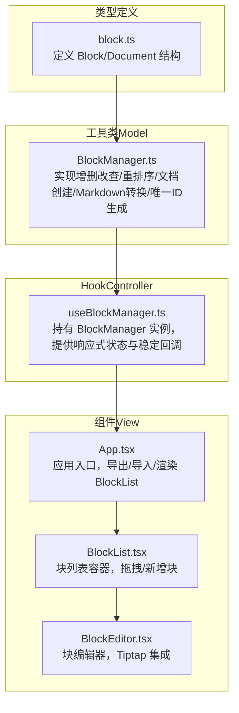
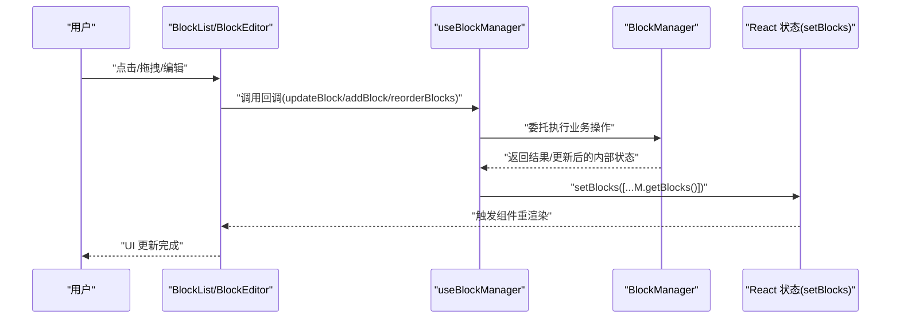
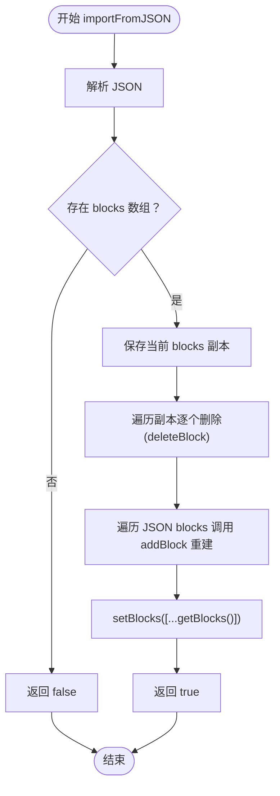
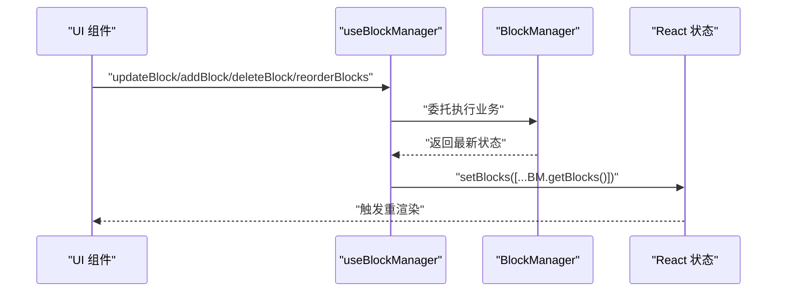
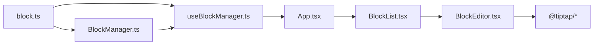

# 状态管理架构设计

<cite>
**本文引用的文件**
- [src/utils/BlockManager.ts](file://src/utils/BlockManager.ts)
- [src/hooks/useBlockManager.ts](file://src/hooks/useBlockManager.ts)
- [src/types/block.ts](file://src/types/block.ts)
- [src/components/BlockEditor.tsx](file://src/components/BlockEditor.tsx)
- [src/components/BlockList.tsx](file://src/components/BlockList.tsx)
- [src/App.tsx](file://src/App.tsx)
</cite>

## 目录
1. [引言](#引言)
2. [项目结构](#项目结构)
3. [核心组件](#核心组件)
4. [架构总览](#架构总览)
5. [详细组件分析](#详细组件分析)
6. [依赖关系分析](#依赖关系分析)
7. [性能考量](#性能考量)
8. [故障排查指南](#故障排查指南)
9. [结论](#结论)
10. [附录](#附录)

## 引言
本文件系统性解析本项目的“状态管理架构”，聚焦于以下目标：
- BlockManager 类作为 Model 层的核心职责与实现细节：增删改查、重排序、文档创建、与 Markdown 的相互转换、唯一块 ID 生成策略。
- useBlockManager Hook 作为 Controller 层的封装：如何持有 BlockManager 实例并通过 useState/useCallback 提供响应式状态与稳定回调；importFromJSON 中清空并重建块列表的实现逻辑。
- 用户操作到状态更新的数据流：从 UI 事件到 useBlockManager 调用，再到 BlockManager 处理，最终由 setBlocks 触发重渲染。
- 性能优化建议：针对大型文档的分页或虚拟滚动策略。

## 项目结构
本项目采用“类型定义 → 工具类（Model）→ Hook（Controller）→ 组件（View）”的分层组织方式，清晰分离职责边界：
- 类型定义：统一描述 Block 与 Document 的结构与约束。
- 工具类：封装业务模型与数据转换逻辑。
- Hook：封装状态与副作用，暴露稳定的 API。
- 组件：负责 UI 表现与交互，将用户事件映射为 Hook 暴露的方法调用。



图表来源
- [src/types/block.ts](file://src/types/block.ts#L1-L30)
- [src/utils/BlockManager.ts](file://src/utils/BlockManager.ts#L1-L227)
- [src/hooks/useBlockManager.ts](file://src/hooks/useBlockManager.ts#L1-L97)
- [src/App.tsx](file://src/App.tsx#L1-L156)
- [src/components/BlockList.tsx](file://src/components/BlockList.tsx#L1-L145)
- [src/components/BlockEditor.tsx](file://src/components/BlockEditor.tsx#L1-L116)

章节来源
- [src/types/block.ts](file://src/types/block.ts#L1-L30)
- [src/utils/BlockManager.ts](file://src/utils/BlockManager.ts#L1-L227)
- [src/hooks/useBlockManager.ts](file://src/hooks/useBlockManager.ts#L1-L97)
- [src/App.tsx](file://src/App.tsx#L1-L156)
- [src/components/BlockList.tsx](file://src/components/BlockList.tsx#L1-L145)
- [src/components/BlockEditor.tsx](file://src/components/BlockEditor.tsx#L1-L116)

## 核心组件
- BlockManager（Model）
  - 职责：维护内部 blocks 数组，提供 CRUD、重排序、文档创建、Markdown 转换、唯一 ID 生成。
  - 关键方法路径：
    - [getBlocks/getBlock](file://src/utils/BlockManager.ts#L12-L19)
    - [addBlock](file://src/utils/BlockManager.ts#L22-L37)
    - [updateBlock](file://src/utils/BlockManager.ts#L40-L55)
    - [deleteBlock](file://src/utils/BlockManager.ts#L58-L64)
    - [reorderBlocks](file://src/utils/BlockManager.ts#L67-L76)
    - [createDocument/getDocument](file://src/utils/BlockManager.ts#L79-L93)
    - [fromMarkdown](file://src/utils/BlockManager.ts#L101-L217)
    - [toMarkdown](file://src/utils/BlockManager.ts#L220-L222)
    - [generateId（私有）](file://src/utils/BlockManager.ts#L96-L98)

- useBlockManager（Controller）
  - 职责：持有 BlockManager 实例，通过 useState 暴露 blocks 响应式状态，通过 useCallback 提供稳定的操作方法，封装导入/导出逻辑。
  - 关键方法路径：
    - [初始化与 getBlocks 同步](file://src/hooks/useBlockManager.ts#L7-L16)
    - [updateBlock/addBlock/deleteBlock/reorderBlocks](file://src/hooks/useBlockManager.ts#L18-L46)
    - [getMarkdown/exportAsJSON/importFromJSON](file://src/hooks/useBlockManager.ts#L49-L83)
    - [依赖数组 [blockManager] 稳定回调](file://src/hooks/useBlockManager.ts#L18-L46)

- 类型定义（Types）
  - [Block/Document 接口](file://src/types/block.ts#L5-L26)

章节来源
- [src/utils/BlockManager.ts](file://src/utils/BlockManager.ts#L1-L227)
- [src/hooks/useBlockManager.ts](file://src/hooks/useBlockManager.ts#L1-L97)
- [src/types/block.ts](file://src/types/block.ts#L1-L30)

## 架构总览
整体采用“Model-Controller-View”分层：
- Model（BlockManager）专注业务与数据，不关心 UI。
- Controller（useBlockManager）协调 Model 与 View，提供稳定回调与状态同步。
- View（App/BlockList/BlockEditor）只负责交互与渲染，通过回调驱动状态变更。



图表来源
- [src/hooks/useBlockManager.ts](file://src/hooks/useBlockManager.ts#L18-L46)
- [src/utils/BlockManager.ts](file://src/utils/BlockManager.ts#L22-L76)
- [src/components/BlockList.tsx](file://src/components/BlockList.tsx#L1-L145)
- [src/components/BlockEditor.tsx](file://src/components/BlockEditor.tsx#L1-L116)

## 详细组件分析

### BlockManager 类（Model）
- 数据结构
  - 内部存储 blocks 数组与可选的 document 对象，均通过私有字段隔离外部直接修改。
  - 唯一 ID 生成策略：基于时间戳与随机字符串拼接，保证在单次进程内的唯一性。
- 核心能力
  - 增删改查：findIndex 定位，浅拷贝合并更新，splice 删除。
  - 重排序：边界校验后进行 splice 操作，保持数组一致性。
  - 文档创建：复制当前 blocks 并记录创建/修改时间。
  - Markdown 转换：fromMarkdown 将文本按标题/引用/列表/分割线/段落规则拆分为多个块；toMarkdown 将各块 content 拼接为 Markdown 文本。
- 复杂度与性能
  - 查找/更新/删除：O(n)（基于 id 的线性查找）。
  - 重排序：O(k)（k 为移动距离，splice 代价）。
  - fromMarkdown：O(m)（m 为行数），包含多次对象构造与数组 push。
- 错误处理
  - updateBlock/deleteBlock/reorderBlocks 在越界或未找到时返回失败状态，避免异常传播。
- 设计要点
  - 所有对外读取均返回副本，避免外部直接修改内部状态。
  - metadata 字段保留 created/modified 时间戳，便于后续扩展。

```mermaid
classDiagram
class BlockManager {
- blocks : Block[]
- document : Document?
+ constructor(initialBlocks)
+ getBlocks() : Block[]
+ getBlock(id) : Block?
+ addBlock(type, content) : Block
+ updateBlock(id, updates) : Block?
+ deleteBlock(id) : boolean
+ reorderBlocks(fromIndex, toIndex) : boolean
+ createDocument(title) : Document
+ getDocument() : Document?
+ fromMarkdown(markdown) : BlockManager
+ toMarkdown() : string
- generateId() : string
}
class Block {
+ id : string
+ type : BlockType
+ content : string
+ references? : string[]
+ referencedBy? : string[]
+ metadata? : { tags?, created?, modified? }
}
class Document {
+ id : string
+ title : string
+ blocks : Block[]
+ created : Date
+ modified : Date
}
BlockManager --> Block : "管理"
BlockManager --> Document : "创建/持有"
```

图表来源
- [src/utils/BlockManager.ts](file://src/utils/BlockManager.ts#L1-L227)
- [src/types/block.ts](file://src/types/block.ts#L5-L26)

章节来源
- [src/utils/BlockManager.ts](file://src/utils/BlockManager.ts#L1-L227)
- [src/types/block.ts](file://src/types/block.ts#L1-L30)

### useBlockManager Hook（Controller）
- 状态与实例
  - 通过 useState 初始化 BlockManager 实例，支持从 Markdown 快速构建。
  - 通过 useState 维护 blocks 响应式数组，与 BlockManager 内部状态保持同步。
- 回调稳定性
  - 所有操作方法均使用 useCallback 包裹，依赖数组为 [blockManager]，确保在组件生命周期内回调引用稳定，避免子组件不必要的重渲染。
- 方法一览
  - updateBlock：委托 BlockManager 更新并同步 setBlocks。
  - addBlock：委托 BlockManager 新增并同步 setBlocks。
  - deleteBlock：委托 BlockManager 删除并同步 setBlocks。
  - reorderBlocks：委托 BlockManager 重排并同步 setBlocks。
  - getMarkdown：委托 BlockManager 转换为 Markdown。
  - exportAsJSON：序列化 blocks 与 document。
  - importFromJSON：清空当前块并逐个重建，最后同步 setBlocks。
- importFromJSON 的实现逻辑
  - 解析 JSON，若存在 blocks 数组则执行“清空→重建”的流程：
    - 保存当前 blocks 副本，遍历逐一删除（基于 id）。
    - 遍历 JSON 中的 blocks，逐个调用 addBlock 重建。
    - 最后一次性 setBlocks 同步最新状态。
  - 异常捕获：try/catch 包裹，错误时返回 false 并打印日志。



图表来源
- [src/hooks/useBlockManager.ts](file://src/hooks/useBlockManager.ts#L61-L83)
- [src/utils/BlockManager.ts](file://src/utils/BlockManager.ts#L22-L64)

章节来源
- [src/hooks/useBlockManager.ts](file://src/hooks/useBlockManager.ts#L1-L97)
- [src/utils/BlockManager.ts](file://src/utils/BlockManager.ts#L1-L227)

### 数据流：从用户操作到状态更新
- UI 事件来源：BlockList 的拖拽、BlockEditor 的编辑更新、App 的导出/导入按钮。
- 控制器调用：App/BlockList/BlockEditor 将用户意图映射为 useBlockManager 暴露的方法调用。
- Model 处理：BlockManager 执行具体业务逻辑（增删改查/重排序/转换）。
- 状态同步：useBlockManager 调用 setBlocks([...blockManager.getBlocks()])，触发 React 重渲染。



图表来源
- [src/App.tsx](file://src/App.tsx#L144-L149)
- [src/components/BlockList.tsx](file://src/components/BlockList.tsx#L1-L145)
- [src/components/BlockEditor.tsx](file://src/components/BlockEditor.tsx#L1-L116)
- [src/hooks/useBlockManager.ts](file://src/hooks/useBlockManager.ts#L18-L46)
- [src/utils/BlockManager.ts](file://src/utils/BlockManager.ts#L22-L76)

## 依赖关系分析
- 文件间依赖
  - useBlockManager.ts 依赖 BlockManager.ts 与 block.ts。
  - BlockEditor.tsx/BlockList.tsx/BlockManager.ts 依赖 block.ts。
  - App.tsx 依赖 useBlockManager.ts 与 BlockList.tsx。
- 耦合与内聚
  - Model 与 Controller 通过接口清晰解耦；Controller 仅暴露方法签名，不暴露内部状态。
  - View 仅依赖 Controller 暴露的回调与状态，不直接访问 Model。
- 外部依赖
  - Tiptap 集成用于 BlockEditor 的富文本编辑体验。



图表来源
- [src/types/block.ts](file://src/types/block.ts#L1-L30)
- [src/utils/BlockManager.ts](file://src/utils/BlockManager.ts#L1-L227)
- [src/hooks/useBlockManager.ts](file://src/hooks/useBlockManager.ts#L1-L97)
- [src/App.tsx](file://src/App.tsx#L1-L156)
- [src/components/BlockList.tsx](file://src/components/BlockList.tsx#L1-L145)
- [src/components/BlockEditor.tsx](file://src/components/BlockEditor.tsx#L1-L116)

章节来源
- [src/types/block.ts](file://src/types/block.ts#L1-L30)
- [src/utils/BlockManager.ts](file://src/utils/BlockManager.ts#L1-L227)
- [src/hooks/useBlockManager.ts](file://src/hooks/useBlockManager.ts#L1-L97)
- [src/App.tsx](file://src/App.tsx#L1-L156)
- [src/components/BlockList.tsx](file://src/components/BlockList.tsx#L1-L145)
- [src/components/BlockEditor.tsx](file://src/components/BlockEditor.tsx#L1-L116)

## 性能考量
- 大型文档的渲染压力
  - 当前实现对 blocks 数组进行全量替换（setBlocks([...]))，在块数量较多时可能引发重渲染开销。
- 优化建议
  - 虚拟滚动：仅渲染可视区域内的块，减少 DOM 节点数量与重绘范围。
  - 分页加载：将文档按段落/章节切分为页面，按需加载与卸载。
  - 稳定回调与浅比较：继续沿用 useCallback 与 React.memo，避免子组件因引用变化而重渲染。
  - 局部更新：在 updateBlock 中仅替换被修改的块对象，而非全量 setBlocks，需要在 BlockManager 返回变更后的块并由 Hook 选择性更新。
  - 事件节流：对高频拖拽/编辑事件进行节流，降低 setBlocks 调用频率。
- 元数据与索引
  - 可考虑为 BlockManager 增加基于 id 的索引，将查找复杂度降至 O(1)，从而提升 updateBlock/deleteBlock 的性能。

[本节为通用性能建议，不直接分析具体文件，故无章节来源]

## 故障排查指南
- 导入 JSON 失败
  - 现象：importFromJSON 返回 false 并控制台输出错误信息。
  - 排查：确认 JSON 结构包含 blocks 数组且元素为合法 Block；检查 JSON 语法是否正确。
  - 参考路径：[importFromJSON](file://src/hooks/useBlockManager.ts#L61-L83)
- 块未更新或未删除
  - 现象：调用 updateBlock/addBlock/deleteBlock 后 UI 未变化。
  - 排查：确认回调引用稳定（useCallback 依赖 [blockManager]）；检查 id 是否正确；确认 setBlocks 已被调用。
  - 参考路径：[updateBlock/addBlock/deleteBlock](file://src/hooks/useBlockManager.ts#L18-L37)
- 重排序无效
  - 现象：拖拽后顺序不变。
  - 排查：确认 fromIndex/toIndex 在有效范围内；确认 BlockManager.reorderBlocks 返回 true。
  - 参考路径：[reorderBlocks](file://src/hooks/useBlockManager.ts#L40-L46), [BlockManager.reorderBlocks](file://src/utils/BlockManager.ts#L67-L76)
- Markdown 导出内容异常
  - 现象：toMarkdown 输出不符合预期。
  - 排查：确认各块 content 是否包含正确的 Markdown 片段；必要时在 BlockEditor 中检查 HTML/Markdown 的双向转换。
  - 参考路径：[toMarkdown](file://src/utils/BlockManager.ts#L220-L222), [BlockEditor](file://src/components/BlockEditor.tsx#L52-L62)

章节来源
- [src/hooks/useBlockManager.ts](file://src/hooks/useBlockManager.ts#L18-L83)
- [src/utils/BlockManager.ts](file://src/utils/BlockManager.ts#L67-L76)
- [src/components/BlockEditor.tsx](file://src/components/BlockEditor.tsx#L52-L62)

## 结论
本项目通过清晰的三层架构实现了稳定的状态管理：
- Model（BlockManager）专注于业务与数据，提供完整的 CRUD、重排序与 Markdown 转换能力。
- Controller（useBlockManager）以 Hook 形式封装状态与回调，确保回调稳定性与状态同步。
- View（App/BlockList/BlockEditor）以事件驱动的方式调用 Controller，形成简洁的数据流闭环。
针对大型文档，建议引入虚拟滚动、分页加载与局部更新策略，进一步提升性能与用户体验。

[本节为总结性内容，不直接分析具体文件，故无章节来源]

## 附录
- 关键 API 路径参考
  - [BlockManager.getBlocks](file://src/utils/BlockManager.ts#L12-L19)
  - [BlockManager.addBlock](file://src/utils/BlockManager.ts#L22-L37)
  - [BlockManager.updateBlock](file://src/utils/BlockManager.ts#L40-L55)
  - [BlockManager.deleteBlock](file://src/utils/BlockManager.ts#L58-L64)
  - [BlockManager.reorderBlocks](file://src/utils/BlockManager.ts#L67-L76)
  - [BlockManager.createDocument](file://src/utils/BlockManager.ts#L79-L88)
  - [BlockManager.fromMarkdown](file://src/utils/BlockManager.ts#L101-L217)
  - [BlockManager.toMarkdown](file://src/utils/BlockManager.ts#L220-L222)
  - [useBlockManager.updateBlock](file://src/hooks/useBlockManager.ts#L18-L21)
  - [useBlockManager.importFromJSON](file://src/hooks/useBlockManager.ts#L61-L83)

[本节为补充参考，不直接分析具体文件，故无章节来源]