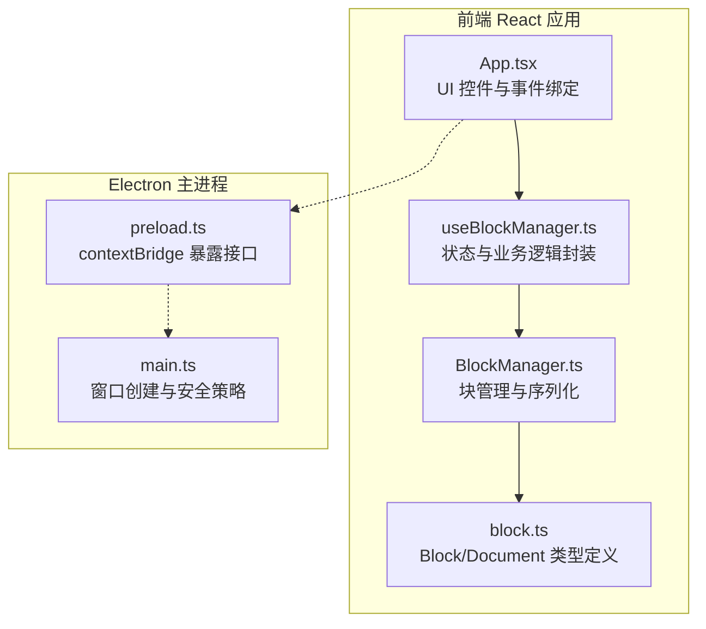
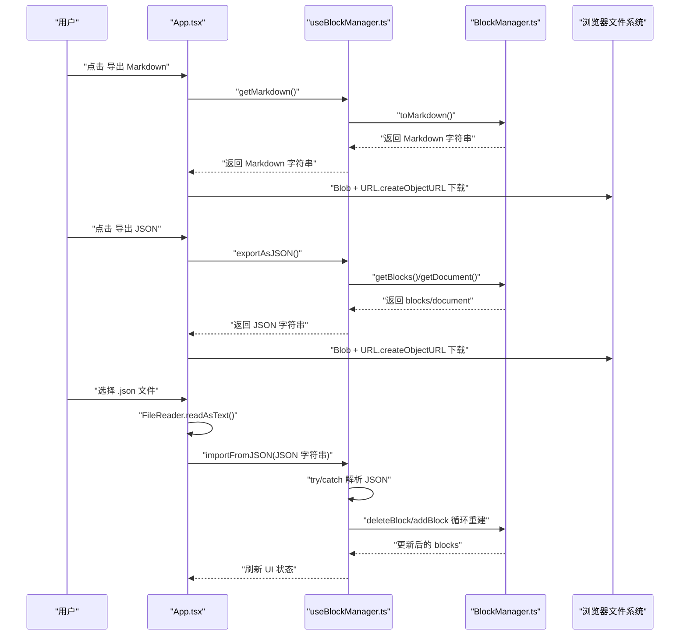
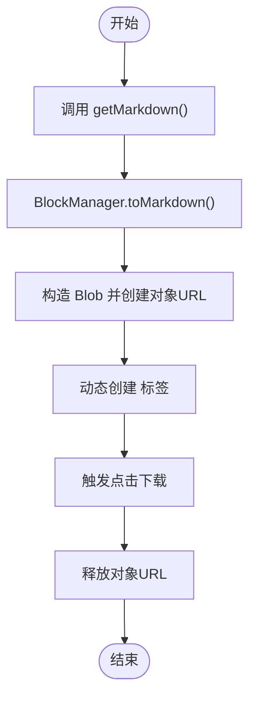
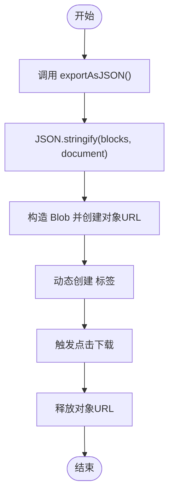
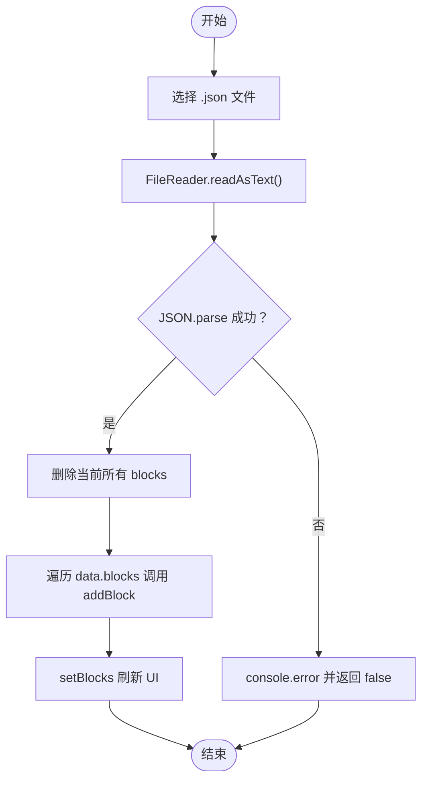
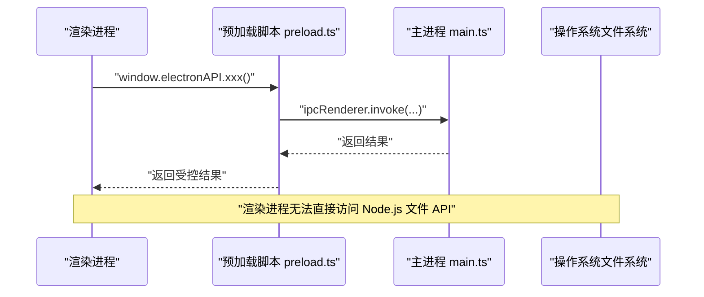
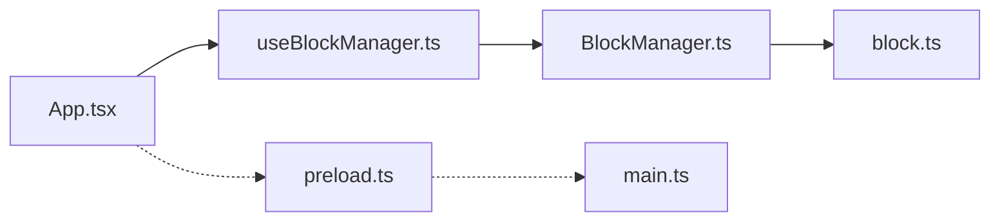
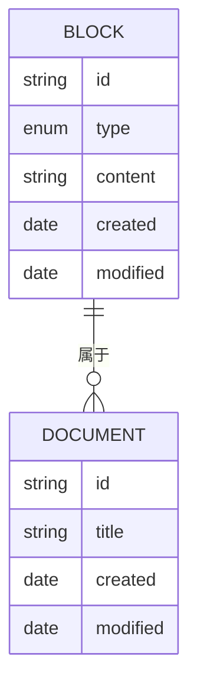

# 内容导入导出

<cite>
**本文引用的文件**
- [README.md](file://README.md)
- [App.tsx](file://src/App.tsx)
- [useBlockManager.ts](file://src/hooks/useBlockManager.ts)
- [BlockManager.ts](file://src/utils/BlockManager.ts)
- [block.ts](file://src/types/block.ts)
- [preload.ts](file://electron/preload.ts)
- [main.ts](file://electron/main.ts)
- [main.js](file://main.js)
</cite>

## 目录
1. [简介](#简介)
2. [项目结构](#项目结构)
3. [核心组件](#核心组件)
4. [架构总览](#架构总览)
5. [详细组件分析](#详细组件分析)
6. [依赖关系分析](#依赖关系分析)
7. [性能考虑](#性能考虑)
8. [故障排查指南](#故障排查指南)
9. [结论](#结论)
10. [附录](#附录)

## 简介
本文件围绕“内容导入导出”功能进行技术实现与工程实践说明，涵盖以下要点：
- 导出为 Markdown：遍历 blocks 调用 toMarkdown() 生成纯文本字符串，通过 Blob 和 URL.createObjectURL 触发浏览器下载。
- 导出为 JSON：序列化完整文档结构（含 id、type、content、metadata），保存为 .json 文件。
- 导入功能：通过 input[type=file] 选择 .json 文件，使用 FileReader 读取内容后调用 importFromJSON() 恢复 blocks 状态。
- Electron 环境下的文件系统访问安全限制及 preload.ts 中 contextBridge 暴露的安全接口。
- 文件编码、路径处理、异常捕获等实际开发注意事项。
- 大文件导入性能优化建议。

## 项目结构
本项目采用前端 React + Electron 的桌面应用架构，导入导出相关逻辑集中在前端层，Electron 主进程负责窗口与安全策略，preload 脚本提供受限的 IPC 接口给渲染进程。

图表来源
- [App.tsx](file://src/App.tsx#L57-L156)
- [useBlockManager.ts](file://src/hooks/useBlockManager.ts#L1-L97)
- [BlockManager.ts](file://src/utils/BlockManager.ts#L1-L227)
- [block.ts](file://src/types/block.ts#L1-L30)
- [main.ts](file://electron/main.ts#L1-L68)
- [preload.ts](file://electron/preload.ts#L1-L21)

章节来源
- [README.md](file://README.md#L56-L75)
- [main.ts](file://electron/main.ts#L1-L68)
- [preload.ts](file://electron/preload.ts#L1-L21)

## 核心组件
- 导出与导入入口：在 App.tsx 中定义导出 Markdown、导出 JSON、导入文件三个交互入口，并绑定事件处理函数。
- 业务逻辑封装：useBlockManager.ts 提供 getMarkdown、exportAsJSON、importFromJSON 等方法，内部委托 BlockManager 执行具体操作。
- 数据模型：block.ts 定义 Block 与 Document 的结构，包含 id、type、content、metadata 等字段。
- 块管理器：BlockManager.ts 实现 toMarkdown()、fromMarkdown()、addBlock/updateBlock/deleteBlock/reorderBlocks 等能力，并支持 createDocument/getDocument。

章节来源
- [App.tsx](file://src/App.tsx#L57-L156)
- [useBlockManager.ts](file://src/hooks/useBlockManager.ts#L1-L97)
- [BlockManager.ts](file://src/utils/BlockManager.ts#L1-L227)
- [block.ts](file://src/types/block.ts#L1-L30)

## 架构总览
下图展示了从用户触发到最终完成导入导出的端到端流程。

图表来源
- [App.tsx](file://src/App.tsx#L57-L156)
- [useBlockManager.ts](file://src/hooks/useBlockManager.ts#L48-L96)
- [BlockManager.ts](file://src/utils/BlockManager.ts#L1-L227)

## 详细组件分析

### 导出为 Markdown
- 流程要点
  - 调用 getMarkdown() 获取 Markdown 字符串。
  - 使用 Blob 包裹字符串并创建对象 URL。
  - 动态创建 a 标签并触发点击下载，随后释放对象 URL。
- 关键实现位置
  - 导出按钮事件与下载逻辑：[App.tsx](file://src/App.tsx#L57-L81)
  - getMarkdown 代理到 BlockManager.toMarkdown：[useBlockManager.ts](file://src/hooks/useBlockManager.ts#L48-L51)
  - toMarkdown 实现：将 blocks.content 按段落拼接：[BlockManager.ts](file://src/utils/BlockManager.ts#L219-L223)

图表来源
- [App.tsx](file://src/App.tsx#L57-L81)
- [useBlockManager.ts](file://src/hooks/useBlockManager.ts#L48-L51)
- [BlockManager.ts](file://src/utils/BlockManager.ts#L219-L223)

章节来源
- [App.tsx](file://src/App.tsx#L57-L81)
- [useBlockManager.ts](file://src/hooks/useBlockManager.ts#L48-L51)
- [BlockManager.ts](file://src/utils/BlockManager.ts#L219-L223)

### 导出为 JSON
- 流程要点
  - 调用 exportAsJSON() 返回序列化后的 JSON 字符串，包含 blocks 与 document。
  - 使用 Blob 包裹字符串并创建对象 URL，触发下载。
- 关键实现位置
  - 导出按钮事件与下载逻辑：[App.tsx](file://src/App.tsx#L70-L81)
  - exportAsJSON 实现：序列化 blocks 与 document：[useBlockManager.ts](file://src/hooks/useBlockManager.ts#L53-L59)
  - Block/Document 结构定义：[block.ts](file://src/types/block.ts#L1-L30)

图表来源
- [App.tsx](file://src/App.tsx#L70-L81)
- [useBlockManager.ts](file://src/hooks/useBlockManager.ts#L53-L59)
- [block.ts](file://src/types/block.ts#L1-L30)

章节来源
- [App.tsx](file://src/App.tsx#L70-L81)
- [useBlockManager.ts](file://src/hooks/useBlockManager.ts#L53-L59)
- [block.ts](file://src/types/block.ts#L1-L30)

### 导入功能（.json）
- 流程要点
  - 通过 input[type=file] 选择 .json 文件，使用 FileReader.readAsText 读取为文本。
  - 调用 importFromJSON() 解析 JSON，清空现有 blocks 后逐个重建。
  - 成功后刷新 UI 状态；解析失败时记录错误并返回 false。
- 关键实现位置
  - 导入事件与 FileReader：[App.tsx](file://src/App.tsx#L83-L98)
  - importFromJSON 实现与 try/catch：[useBlockManager.ts](file://src/hooks/useBlockManager.ts#L61-L83)
  - BlockManager.deleteBlock/addBlock：[BlockManager.ts](file://src/utils/BlockManager.ts#L57-L76)

图表来源
- [App.tsx](file://src/App.tsx#L83-L98)
- [useBlockManager.ts](file://src/hooks/useBlockManager.ts#L61-L83)
- [BlockManager.ts](file://src/utils/BlockManager.ts#L57-L76)

章节来源
- [App.tsx](file://src/App.tsx#L83-L98)
- [useBlockManager.ts](file://src/hooks/useBlockManager.ts#L61-L83)
- [BlockManager.ts](file://src/utils/BlockManager.ts#L57-L76)

### Electron 环境下的文件系统访问与安全
- 安全策略
  - 主进程配置启用 contextIsolation 并指定 preload 路径，禁止渲染进程直接访问 Node.js API。
  - 预加载脚本通过 contextBridge.exposeInMainWorld 暴露受控的 electronAPI，避免泄露完整 ipcRenderer。
- 关键实现位置
  - 主进程 webPreferences 配置与窗口创建：[main.ts](file://electron/main.ts#L8-L19)
  - 预加载脚本暴露 electronAPI 接口声明：[preload.ts](file://electron/preload.ts#L1-L21)
  - 旧版主进程入口 main.js 的对应配置（兼容性参考）：[main.js](file://main.js#L8-L19)

图表来源
- [main.ts](file://electron/main.ts#L8-L19)
- [preload.ts](file://electron/preload.ts#L1-L21)
- [main.js](file://main.js#L8-L19)

章节来源
- [main.ts](file://electron/main.ts#L8-L19)
- [preload.ts](file://electron/preload.ts#L1-L21)
- [main.js](file://main.js#L8-L19)

## 依赖关系分析
- 组件耦合
  - App.tsx 仅通过 useBlockManager.ts 的回调与状态进行交互，低耦合高内聚。
  - useBlockManager.ts 作为业务门面，聚合 BlockManager 的能力并向 UI 暴露。
  - BlockManager.ts 依赖 block.ts 的类型定义，不直接依赖 UI。
- 外部依赖
  - 浏览器 API：Blob、URL.createObjectURL、FileReader。
  - Electron：ipcRenderer 通过 contextBridge 暴露给渲染进程（当前未在渲染层使用）。

图表来源
- [App.tsx](file://src/App.tsx#L57-L156)
- [useBlockManager.ts](file://src/hooks/useBlockManager.ts#L1-L97)
- [BlockManager.ts](file://src/utils/BlockManager.ts#L1-L227)
- [block.ts](file://src/types/block.ts#L1-L30)
- [preload.ts](file://electron/preload.ts#L1-L21)
- [main.ts](file://electron/main.ts#L1-L68)

章节来源
- [App.tsx](file://src/App.tsx#L57-L156)
- [useBlockManager.ts](file://src/hooks/useBlockManager.ts#L1-L97)
- [BlockManager.ts](file://src/utils/BlockManager.ts#L1-L227)
- [block.ts](file://src/types/block.ts#L1-L30)
- [preload.ts](file://electron/preload.ts#L1-L21)
- [main.ts](file://electron/main.ts#L1-L68)

## 性能考虑
- 导出为 Markdown
  - toMarkdown() 对 blocks.content 直接拼接，时间复杂度 O(n)，n 为块数量。对大文档建议：
    - 分段导出：将 blocks 分批 toMarkdown() 拼接，减少单次内存峰值。
    - 使用流式写入：若目标为文件系统，可结合 Electron 的文件写入 API（需通过 preload 暴露）分块写入。
- 导出为 JSON
  - JSON.stringify 在大对象上可能造成内存压力。建议：
    - 分块序列化：先序列化 blocks，再序列化 document，分别写入临时文件，最后合并。
    - 压缩传输：在 Electron 场景下可考虑压缩后再写入磁盘。
- 导入 JSON
  - 当前实现会先删除全部现有块再重建，适合小到中等规模文档。对于大文档：
    - 差异重建：对比现有 blocks 与 JSON 中的 blocks，只增删改差异部分，减少 DOM 重排与状态刷新。
    - 批量更新：将 setBlocks 放在最后一次性执行，避免中间多次渲染。
    - 分页读取：对超大 JSON 文件，使用流式解析（需要 Electron 文件 API 支持）。
- 文件编码与路径
  - 导出统一使用 UTF-8（默认），导入时 FileReader 默认按 UTF-8 解码，确保跨平台一致性。
  - 路径处理：在 Electron 中应通过对话框选择文件，避免硬编码路径；若需持久化，建议使用受控目录（如 app.getPath('documents')）并通过 preload 暴露安全接口。
- 异常捕获
  - importFromJSON 已有 try/catch，建议在 UI 层提示用户并保留上次成功状态。
  - 导出失败时可降级为片段导出或提示用户清理内存后重试。

## 故障排查指南
- 导入失败
  - 现象：控制台打印导入 JSON 失败并返回 false。
  - 排查：确认 .json 文件格式是否包含 blocks 数组；检查 JSON 语法与字段完整性。
  - 修复：修正 JSON 结构或使用正确的导出文件。
- 导出空白或内容缺失
  - 现象：导出的 Markdown/JSON 不完整。
  - 排查：确认 BlockManager 是否正确持有 blocks；检查 toMarkdown() 的拼接逻辑。
  - 修复：在 UI 层确认 blocks 状态已更新后再导出。
- Electron 环境无法访问文件系统
  - 现象：渲染进程无法直接调用 Node.js 文件 API。
  - 排查：确认主进程 webPreferences.contextIsolation=true 且 preload 正确注入。
  - 修复：通过 window.electronAPI 暴露受控的文件读写接口（例如 saveFile/loadFile），并在主进程中实现安全校验与权限控制。

章节来源
- [useBlockManager.ts](file://src/hooks/useBlockManager.ts#L61-L83)
- [BlockManager.ts](file://src/utils/BlockManager.ts#L219-L223)
- [main.ts](file://electron/main.ts#L8-L19)
- [preload.ts](file://electron/preload.ts#L1-L21)

## 结论
本项目的导入导出功能以 React Hooks 与 BlockManager 为核心，实现了简洁高效的 Markdown 与 JSON 序列化/反序列化流程。在 Electron 环境下，通过 contextIsolation 与 contextBridge 暴露受控接口，保障了渲染进程的安全边界。针对大文件场景，建议采用差异重建、批量更新与分块处理等策略提升性能与稳定性。

## 附录
- 数据模型概览

图表来源
- [block.ts](file://src/types/block.ts#L1-L30)