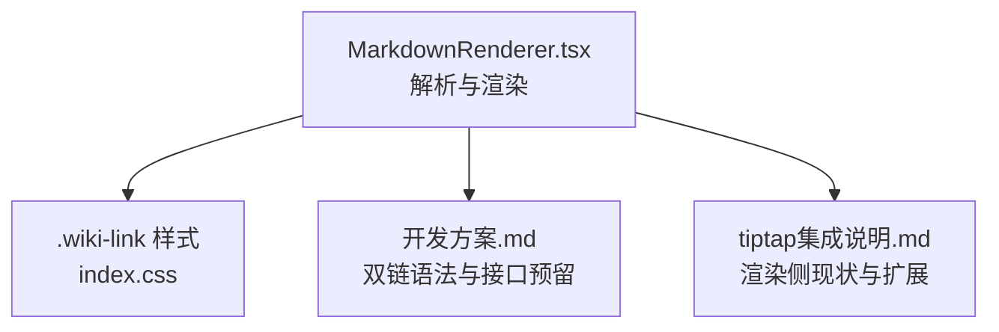
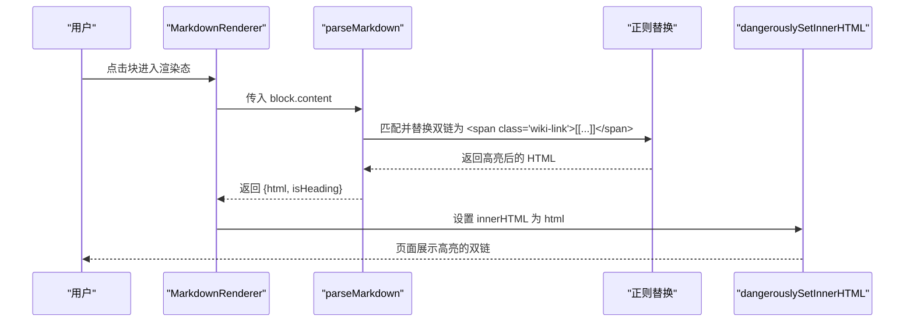
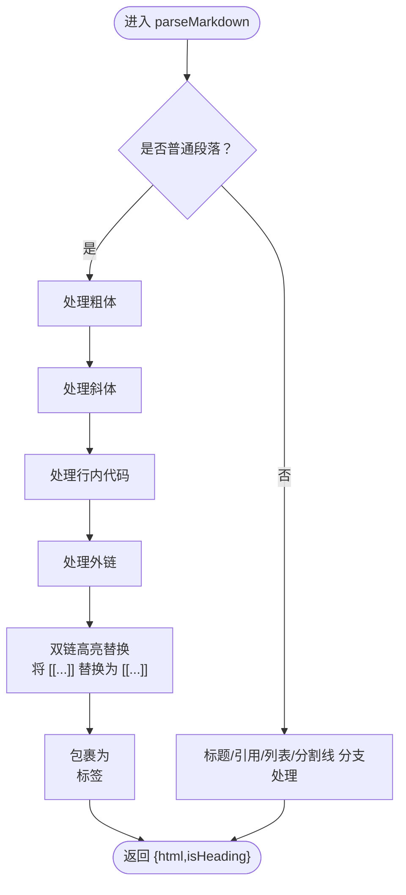
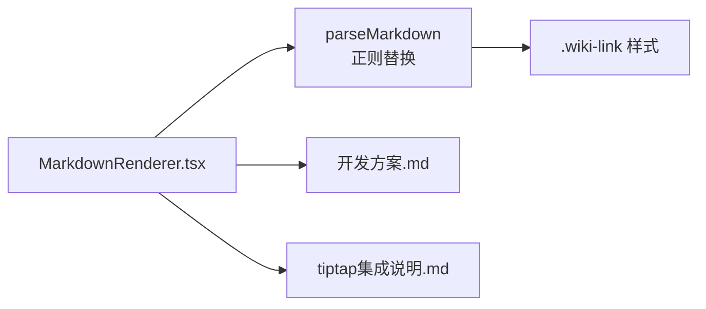

# 双链功能实现

<cite>
**本文引用的文件**
- [MarkdownRenderer.tsx](file://src/components/MarkdownRenderer.tsx)
- [开发方案.md](file://docs/开发方案.md)
- [tiptap集成说明.md](file://docs/tiptap集成说明.md)
- [index.css](file://src/index.css)
</cite>

## 目录
1. [简介](#简介)
2. [项目结构](#项目结构)
3. [核心组件](#核心组件)
4. [架构总览](#架构总览)
5. [详细组件分析](#详细组件分析)
6. [依赖关系分析](#依赖关系分析)
7. [性能考量](#性能考量)
8. [故障排查指南](#故障排查指南)
9. [结论](#结论)
10. [附录](#附录)

## 简介
本文件聚焦于“双链语法[[双链]]”在 Markdown 渲染中的识别与高亮机制。当前版本在 MarkdownRenderer 的 parseMarkdown 函数中通过正则表达式匹配双链语法，并将其替换为带有 wiki-link 样式的 span 标签，从而实现视觉高亮。文档同时说明：当前仅实现渲染高亮，尚未实现点击跳转或链接解析；但已在开发方案与组件注释中预留扩展接口。随后对正则的非贪婪模式选择进行解释，并给出嵌套与特殊字符等边界情况的处理策略建议。最后提出未来通过维护链接索引表实现跳转、以及集成 Yjs 支持协同编辑下的链接同步的方案，并补充样式定制、链接校验与安全过滤的增强建议。

## 项目结构
围绕双链功能的相关文件与职责如下：
- MarkdownRenderer.tsx：负责将块内容解析为 HTML，其中包含双链的识别与高亮替换逻辑。
- 开发方案.md：明确双链语法、渲染与跳转预期，以及预留的接口与数据结构。
- tiptap集成说明.md：确认当前渲染侧的实现现状与后续扩展方向。
- index.css：提供 wiki-link 的默认样式，便于高亮呈现。

图表来源
- [MarkdownRenderer.tsx](file://src/components/MarkdownRenderer.tsx#L9-L73)
- [index.css](file://src/index.css#L190-L196)
- [开发方案.md](file://docs/开发方案.md#L38-L42)
- [tiptap集成说明.md](file://docs/tiptap集成说明.md#L24-L28)

章节来源
- [MarkdownRenderer.tsx](file://src/components/MarkdownRenderer.tsx#L9-L73)
- [开发方案.md](file://docs/开发方案.md#L38-L42)
- [tiptap集成说明.md](file://docs/tiptap集成说明.md#L24-L28)
- [index.css](file://src/index.css#L190-L196)

## 核心组件
- MarkdownRenderer.parseMarkdown：负责将块内容解析为 HTML，其中包含双链的识别与高亮替换逻辑。
- MarkdownRenderer：将解析结果以 dangerouslySetInnerHTML 注入到容器中，并内联样式提供 wiki-link 高亮。
- index.css：提供 .wiki-link 默认样式，确保双链在渲染态下具备视觉高亮。

章节来源
- [MarkdownRenderer.tsx](file://src/components/MarkdownRenderer.tsx#L9-L73)
- [MarkdownRenderer.tsx](file://src/components/MarkdownRenderer.tsx#L76-L121)
- [index.css](file://src/index.css#L190-L196)

## 架构总览
双链在渲染态的处理流程如下：
- 输入：块内容字符串（可能包含 [[目标ID]]）。
- 处理：parseMarkdown 对内容进行一系列 Markdown 语法处理，最后执行双链高亮替换。
- 输出：HTML 字符串，其中双链被包裹为带 wiki-link 类名的 span 标签。
- 展示：MarkdownRenderer 通过 dangerouslySetInnerHTML 将 HTML 注入到页面，并由 index.css 提供高亮样式。

图表来源
- [MarkdownRenderer.tsx](file://src/components/MarkdownRenderer.tsx#L9-L73)
- [MarkdownRenderer.tsx](file://src/components/MarkdownRenderer.tsx#L76-L121)
- [index.css](file://src/index.css#L190-L196)

## 详细组件分析

### 双链识别与高亮机制
- 识别方式：在 parseMarkdown 的普通段落分支中，使用正则表达式匹配形如 [[...]] 的双链语法。
- 替换策略：将匹配到的双链替换为带 wiki-link 类名的 span 标签，保留原始文本以便高亮显示。
- 样式应用：index.css 中定义 .wiki-link，提供背景色、圆角与颜色等视觉高亮。

图表来源
- [MarkdownRenderer.tsx](file://src/components/MarkdownRenderer.tsx#L9-L73)
- [index.css](file://src/index.css#L190-L196)

章节来源
- [MarkdownRenderer.tsx](file://src/components/MarkdownRenderer.tsx#L56-L71)
- [MarkdownRenderer.tsx](file://src/components/MarkdownRenderer.tsx#L67-L68)
- [index.css](file://src/index.css#L190-L196)

### 正则匹配的贪婪与非贪婪模式选择
- 当前实现使用非贪婪分组 (.*?)，确保在存在多个双链时，每个双链被独立捕获与替换，避免一次性吞掉多个双链导致的误匹配。
- 选择非贪婪的原因：
  - 避免“贪婪吞噬”：若使用贪婪匹配，可能导致多个 [[...]] 被合并为一个整体，破坏双链的独立性。
  - 保证最小匹配：非贪婪模式能尽可能短地匹配到第一个闭合的 ]]]，从而正确处理连续出现的双链。
- 该选择与现有替换逻辑配合良好，使每个 [[...]] 都被单独高亮。

章节来源
- [MarkdownRenderer.tsx](file://src/components/MarkdownRenderer.tsx#L67-L68)

### 嵌套与特殊字符边界情况处理策略
- 嵌套双链：当前正则未考虑方括号嵌套，若内容中出现形如 [[a[[b]]c]] 的嵌套，非贪婪匹配会从外层开始匹配，可能无法完全覆盖内部嵌套。建议：
  - 在解析阶段先进行预处理，将内部双链临时占位，再进行正则替换，最后还原。
  - 或采用更严格的上下文感知解析器，逐字符扫描并维护栈来处理嵌套。
- 特殊字符与转义：当前实现未对特殊字符进行转义处理，若内容中包含反斜杠、星号、方括号等，可能影响正则匹配或 HTML 渲染。建议：
  - 在替换前对内容进行安全转义或使用 DOMPurify 过滤生成的 HTML，防止潜在的 XSS 与标签误解析。
  - 对方括号内的内容进行白名单校验，仅允许合法的块 ID 字符集。
- 行内代码与粗体/斜体干扰：由于替换顺序为先处理粗体/斜体/行内代码，再处理外链与双链，因此不会误伤这些语法；但若行内代码中包含 [[...]]，仍需注意顺序与转义。

章节来源
- [MarkdownRenderer.tsx](file://src/components/MarkdownRenderer.tsx#L59-L71)

### 当前实现与扩展接口
- 现状：仅实现渲染态高亮，未实现点击跳转或链接解析。
- 扩展接口（开发方案预留）：
  - LinkParser 接口：提供 parse、renderLinks、extractLinkTargets 等方法，便于将来接入 Lute 或自定义解析器。
  - BlockReferenceManager 接口：提供添加/移除/查询引用关系的方法，支撑正向与反向双链维护。
  - Block 数据结构预留：content、references、referencedBy 等字段，为后续跳转与引用面板提供数据基础。

章节来源
- [开发方案.md](file://docs/开发方案.md#L38-L42)
- [开发方案.md](file://docs/开发方案.md#L124-L163)

### 样式定制与安全增强建议
- 样式定制：
  - 通过 .wiki-link 类名在 index.css 中进行统一定制，或在组件内注入额外样式，满足不同主题需求。
  - 可考虑为不同类型的双链提供差异化样式（如未解析的目标、当前块自身等）。
- 链接校验与安全过滤：
  - 在替换前对双链内容进行合法性校验（如只允许字母数字与下划线等），避免注入非法 ID。
  - 使用 DOMPurify 过滤最终生成的 HTML，防止潜在的 XSS。
  - 对外链与双链的点击事件进行统一处理，避免直接在 dangerouslySetInnerHTML 中绑定事件，降低安全风险。

章节来源
- [MarkdownRenderer.tsx](file://src/components/MarkdownRenderer.tsx#L76-L121)
- [index.css](file://src/index.css#L190-L196)
- [开发方案.md](file://docs/开发方案.md#L117-L120)

## 依赖关系分析
- 组件依赖：
  - MarkdownRenderer 依赖 parseMarkdown 的正则替换能力。
  - 样式依赖 index.css 的 .wiki-link。
  - 开发方案与 tiptap 文档为扩展设计提供依据。
- 潜在耦合点：
  - 双链高亮与 Markdown 语法处理顺序紧密相关，需确保替换顺序合理。
  - 若未来引入点击跳转，需与 BlockReferenceManager 与 LinkParser 接口解耦，避免渲染层与业务层强耦合。

图表来源
- [MarkdownRenderer.tsx](file://src/components/MarkdownRenderer.tsx#L9-L73)
- [MarkdownRenderer.tsx](file://src/components/MarkdownRenderer.tsx#L76-L121)
- [index.css](file://src/index.css#L190-L196)
- [开发方案.md](file://docs/开发方案.md#L38-L42)
- [tiptap集成说明.md](file://docs/tiptap集成说明.md#L24-L28)

章节来源
- [MarkdownRenderer.tsx](file://src/components/MarkdownRenderer.tsx#L9-L73)
- [MarkdownRenderer.tsx](file://src/components/MarkdownRenderer.tsx#L76-L121)
- [index.css](file://src/index.css#L190-L196)
- [开发方案.md](file://docs/开发方案.md#L38-L42)
- [tiptap集成说明.md](file://docs/tiptap集成说明.md#L24-L28)

## 性能考量
- 当前实现为一次性正则替换，时间复杂度近似 O(n)，n 为内容长度。
- 大文档场景下，建议结合开发方案中提到的延迟解析策略（如 300ms），避免频繁输入导致的重绘与替换开销。
- 双链高亮与其它 Markdown 语法替换在同一轮次完成，顺序合理，避免重复扫描。

章节来源
- [开发方案.md](file://docs/开发方案.md#L117-L120)

## 故障排查指南
- 双链未高亮：
  - 检查是否处于普通段落分支，且未被更早的粗体/斜体/行内代码替换所影响。
  - 确认正则替换是否被执行（路径：parseMarkdown 段落分支）。
- 样式未生效：
  - 检查 .wiki-link 是否存在于 index.css。
  - 确认组件内联样式是否被覆盖或未加载。
- 嵌套或特殊字符异常：
  - 检查是否存在嵌套 [[...]] 或包含特殊字符，必要时进行预处理或转义。
- 点击跳转无效：
  - 当前版本未实现点击跳转，需按开发方案预留接口逐步实现 LinkParser 与 BlockReferenceManager。

章节来源
- [MarkdownRenderer.tsx](file://src/components/MarkdownRenderer.tsx#L56-L71)
- [MarkdownRenderer.tsx](file://src/components/MarkdownRenderer.tsx#L67-L68)
- [index.css](file://src/index.css#L190-L196)
- [开发方案.md](file://docs/开发方案.md#L38-L42)

## 结论
当前版本通过正则非贪婪匹配实现了双链的高亮渲染，遵循“仅渲染高亮”的设计原则，并在开发方案与组件注释中预留了后续跳转与解析的扩展接口。对于嵌套与特殊字符等边界情况，建议在解析阶段引入预处理与转义策略，并通过 DOMPurify 与白名单校验提升安全性。未来可借助 LinkParser 与 BlockReferenceManager 接口，结合索引表与 Yjs 协同，逐步完善双链的解析、跳转与同步能力。

## 附录
- 参考实现位置：
  - 双链高亮替换：[MarkdownRenderer.tsx](file://src/components/MarkdownRenderer.tsx#L67-L68)
  - 渲染入口与样式注入：[MarkdownRenderer.tsx](file://src/components/MarkdownRenderer.tsx#L76-L121)
  - 默认样式定义：[index.css](file://src/index.css#L190-L196)
  - 双链语法与接口预留（开发方案）：[开发方案.md](file://docs/开发方案.md#L38-L42), [开发方案.md](file://docs/开发方案.md#L124-L163)
  - 渲染侧现状与扩展说明（tiptap）：[tiptap集成说明.md](file://docs/tiptap集成说明.md#L24-L28), [tiptap集成说明.md](file://docs/tiptap集成说明.md#L73-L78)