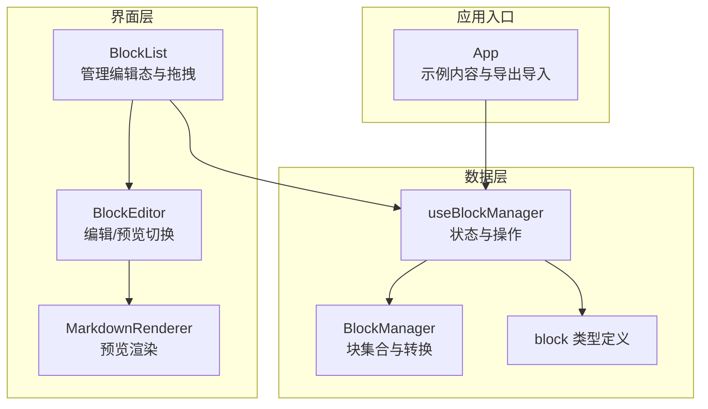
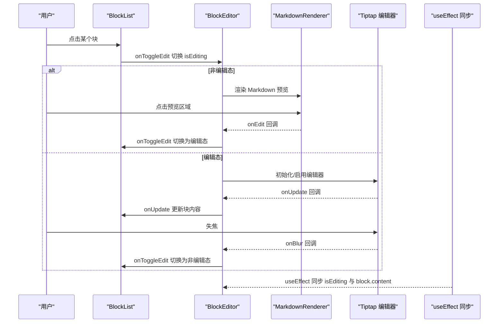
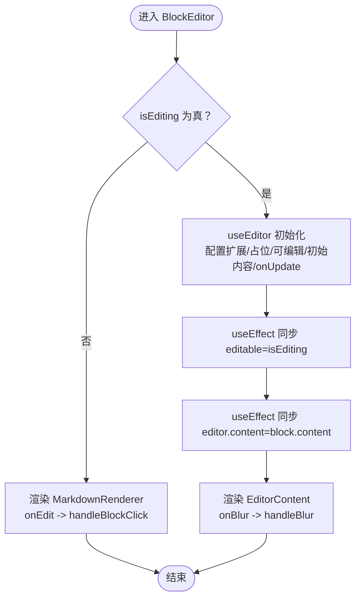
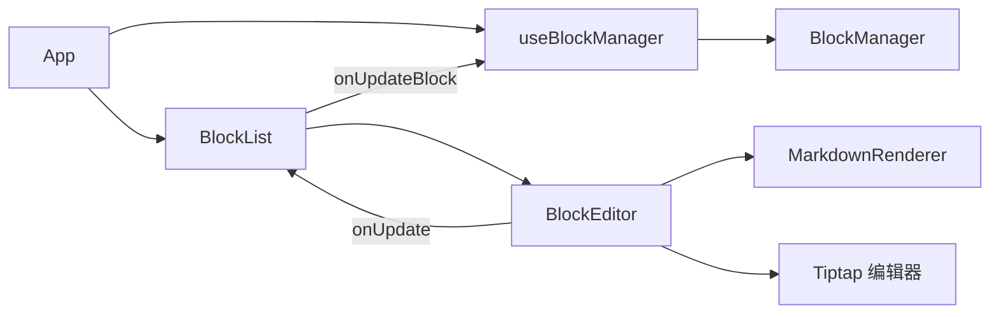

# 块编辑模式

<cite>
**本文引用的文件**
- [src/components/BlockEditor.tsx](file://src/components/BlockEditor.tsx)
- [src/components/MarkdownRenderer.tsx](file://src/components/MarkdownRenderer.tsx)
- [src/components/BlockList.tsx](file://src/components/BlockList.tsx)
- [src/types/block.ts](file://src/types/block.ts)
- [src/hooks/useBlockManager.ts](file://src/hooks/useBlockManager.ts)
- [src/utils/BlockManager.ts](file://src/utils/BlockManager.ts)
- [src/App.tsx](file://src/App.tsx)
</cite>

## 目录
1. [简介](#简介)
2. [项目结构](#项目结构)
3. [核心组件](#核心组件)
4. [架构总览](#架构总览)
5. [详细组件分析](#详细组件分析)
6. [依赖关系分析](#依赖关系分析)
7. [性能考量](#性能考量)
8. [故障排查指南](#故障排查指南)
9. [结论](#结论)

## 简介
本文件围绕“块编辑模式”的实现机制进行系统化说明，重点阐述以下流程：
- 用户点击块时，通过 onToggleEdit 触发编辑状态切换；
- BlockEditor 组件依据 isEditing 属性决定渲染 Tiptap 编辑器还是 MarkdownRenderer 预览；
- 在编辑状态下，Tiptap 的 onUpdate 回调实时捕获内容变更并调用 onUpdate 更新块对象；
- 失焦时触发 handleBlur 关闭编辑状态并保存内容；
- 结合 useEditor 初始化配置、React.useEffect 对 isEditing 和 block.content 的监听同步逻辑，以及 HTML5 事件处理流程；
- 解释编辑/预览状态分离的设计优势（性能优化与关注点分离），并提供状态切换时序图；
- 针对编辑器不响应、内容不同步等常见问题给出排查方案。

## 项目结构
该功能涉及的核心文件与职责如下：
- BlockEditor：块级编辑器，负责 Tiptap 编辑器初始化、状态同步、编辑/预览切换、事件处理；
- MarkdownRenderer：块级预览渲染器，将 Markdown 内容转换为 HTML 并提供点击进入编辑态的能力；
- BlockList：块列表容器，维护当前编辑中的块 ID、拖拽排序、新增块等交互；
- types/block：块类型与文档结构定义；
- hooks/useBlockManager：块管理 Hook，封装块的增删改查与导出导入；
- utils/BlockManager：块管理器类，负责块集合的持久化与转换；
- App：应用入口，提供示例内容与导出/导入能力。

图表来源
- [src/components/BlockList.tsx](file://src/components/BlockList.tsx#L1-L145)
- [src/components/BlockEditor.tsx](file://src/components/BlockEditor.tsx#L1-L116)
- [src/components/MarkdownRenderer.tsx](file://src/components/MarkdownRenderer.tsx#L1-L125)
- [src/hooks/useBlockManager.ts](file://src/hooks/useBlockManager.ts#L1-L97)
- [src/utils/BlockManager.ts](file://src/utils/BlockManager.ts#L1-L227)
- [src/types/block.ts](file://src/types/block.ts#L1-L30)
- [src/App.tsx](file://src/App.tsx#L1-L156)

章节来源
- [src/components/BlockEditor.tsx](file://src/components/BlockEditor.tsx#L1-L116)
- [src/components/MarkdownRenderer.tsx](file://src/components/MarkdownRenderer.tsx#L1-L125)
- [src/components/BlockList.tsx](file://src/components/BlockList.tsx#L1-L145)
- [src/hooks/useBlockManager.ts](file://src/hooks/useBlockManager.ts#L1-L97)
- [src/utils/BlockManager.ts](file://src/utils/BlockManager.ts#L1-L227)
- [src/types/block.ts](file://src/types/block.ts#L1-L30)
- [src/App.tsx](file://src/App.tsx#L1-L156)

## 核心组件
- BlockEditor
  - 使用 useEditor 初始化 Tiptap 编辑器，配置扩展、占位符、可编辑性、初始内容与 onUpdate 回调；
  - 通过 React.useEffect 同步 isEditing 与 block.content，确保编辑器状态与外部状态一致；
  - 提供 handleBlockClick 与 handleBlur，分别用于进入编辑态与失焦关闭编辑态；
  - 在非编辑态下渲染 MarkdownRenderer，点击进入编辑态。
- MarkdownRenderer
  - 将 Markdown 内容解析为 HTML 字符串并注入到容器中；
  - 提供点击回调 onEdit，触发父组件进入编辑态。
- BlockList
  - 维护 editingBlockId，控制当前处于编辑态的块；
  - 通过 onToggleEdit 切换编辑态；
  - 实现拖拽排序与新增块按钮。
- types/block
  - 定义 Block 与 Document 的结构，包含 id、type、content、metadata 等字段。
- hooks/useBlockManager 与 utils/BlockManager
  - 提供块集合的状态管理、增删改查、排序、导出导入与 Markdown 转换。

章节来源
- [src/components/BlockEditor.tsx](file://src/components/BlockEditor.tsx#L1-L116)
- [src/components/MarkdownRenderer.tsx](file://src/components/MarkdownRenderer.tsx#L1-L125)
- [src/components/BlockList.tsx](file://src/components/BlockList.tsx#L1-L145)
- [src/types/block.ts](file://src/types/block.ts#L1-L30)
- [src/hooks/useBlockManager.ts](file://src/hooks/useBlockManager.ts#L1-L97)
- [src/utils/BlockManager.ts](file://src/utils/BlockManager.ts#L1-L227)

## 架构总览
块编辑模式采用“编辑态-渲染态”分离设计：
- 渲染态仅负责展示，避免不必要的 DOM 与事件开销；
- 编辑态启用 Tiptap，提供富文本编辑体验；
- 通过 isEditing 与 block.content 的双向同步，保证状态一致性；
- 失焦即保存，降低复杂度并提升用户体验。

图表来源
- [src/components/BlockList.tsx](file://src/components/BlockList.tsx#L1-L145)
- [src/components/BlockEditor.tsx](file://src/components/BlockEditor.tsx#L1-L116)
- [src/components/MarkdownRenderer.tsx](file://src/components/MarkdownRenderer.tsx#L1-L125)

## 详细组件分析

### BlockEditor 组件
- useEditor 初始化配置要点
  - 扩展集：StarterKit、Placeholder、TaskList/TaskItem、Blockquote、Heading、BulletList、OrderedList、HorizontalRule、DragHandle；
  - content：初始内容来自 block.content；
  - editable：由 isEditing 控制；
  - onUpdate：从编辑器获取 HTML，调用 onUpdate 传入的回调以更新块对象，同时更新 metadata.modified。
- 状态同步逻辑
  - useEffect(依赖 isEditing, editor)：当 isEditing 变化时，设置编辑器可编辑性；
  - useEffect(依赖 block.content, editor)：当外部内容变化时，通过命令 setContent 同步到编辑器，避免编辑态内容与外部状态不一致。
- 事件处理
  - handleBlockClick：当未处于编辑态且存在 onToggleEdit 时，触发进入编辑态；
  - handleBlur：当处于编辑态且存在 onToggleEdit 时，触发失焦关闭编辑态；
  - EditorContent.onBlur：绑定 handleBlur，确保失焦即保存并退出编辑态。
- 渲染策略
  - 非编辑态：渲染 MarkdownRenderer，并将 handleBlockClick 作为 onEdit 回调；
  - 编辑态：渲染编辑器容器与拖拽手柄，内部包含 EditorContent。

图表来源
- [src/components/BlockEditor.tsx](file://src/components/BlockEditor.tsx#L1-L116)

章节来源
- [src/components/BlockEditor.tsx](file://src/components/BlockEditor.tsx#L1-L116)

### MarkdownRenderer 组件
- 功能概述
  - 将 Markdown 内容解析为 HTML 字符串；
  - 提供点击回调 onEdit，使父组件进入编辑态；
  - 内置基础样式，适配标题、引用、列表、分割线、行内格式等。
- 设计要点
  - 点击容器触发 onEdit，实现“点击即编辑”的交互；
  - 使用 dangerouslySetInnerHTML 注入 HTML，注意 XSS 风险控制（本项目为本地编辑场景）。

章节来源
- [src/components/MarkdownRenderer.tsx](file://src/components/MarkdownRenderer.tsx#L1-L125)

### BlockList 组件
- 功能概述
  - 维护 editingBlockId，控制当前编辑中的块；
  - 提供 handleToggleEdit，切换指定块的编辑态；
  - 实现拖拽排序：dragStart/dragOver/drop/leave/end，调用 onReorderBlocks；
  - 新增块按钮：调用 onAddBlock 添加不同类型块。
- 设计要点
  - 仅在当前编辑中的块允许拖拽，避免误操作；
  - 拖拽指示器通过 dragOverIndex 控制插入位置。

章节来源
- [src/components/BlockList.tsx](file://src/components/BlockList.tsx#L1-L145)

### 数据模型与管理
- Block 类型定义
  - 包含 id、type、content、references/referencedBy、metadata 等字段；
  - Document 包含 blocks、created/modified 等信息。
- useBlockManager Hook
  - 提供 blocks 状态与 updateBlock/addBlock/deleteBlock/reorderBlocks/getMarkdown/exportAsJSON/importFromJSON 等操作；
  - 内部委托 BlockManager 管理块集合。
- BlockManager 类
  - 提供 add/update/delete/reorder、fromMarkdown/toMarkdown 等能力；
  - 生成唯一 id，记录创建/修改时间。

章节来源
- [src/types/block.ts](file://src/types/block.ts#L1-L30)
- [src/hooks/useBlockManager.ts](file://src/hooks/useBlockManager.ts#L1-L97)
- [src/utils/BlockManager.ts](file://src/utils/BlockManager.ts#L1-L227)

## 依赖关系分析
- 组件间依赖
  - BlockList 依赖 BlockEditor，传递 isEditing 与 onUpdate；
  - BlockEditor 依赖 MarkdownRenderer（非编辑态）与 Tiptap（编辑态）；
  - App 通过 useBlockManager 管理块集合，向下传递给 BlockList。
- 数据流
  - 用户交互 -> BlockList -> BlockEditor -> onUpdate -> useBlockManager -> BlockManager -> 更新状态；
  - 外部状态变化 -> useEffect -> 同步编辑器内容。

图表来源
- [src/App.tsx](file://src/App.tsx#L1-L156)
- [src/hooks/useBlockManager.ts](file://src/hooks/useBlockManager.ts#L1-L97)
- [src/utils/BlockManager.ts](file://src/utils/BlockManager.ts#L1-L227)
- [src/components/BlockList.tsx](file://src/components/BlockList.tsx#L1-L145)
- [src/components/BlockEditor.tsx](file://src/components/BlockEditor.tsx#L1-L116)
- [src/components/MarkdownRenderer.tsx](file://src/components/MarkdownRenderer.tsx#L1-L125)

章节来源
- [src/App.tsx](file://src/App.tsx#L1-L156)
- [src/hooks/useBlockManager.ts](file://src/hooks/useBlockManager.ts#L1-L97)
- [src/utils/BlockManager.ts](file://src/utils/BlockManager.ts#L1-L227)
- [src/components/BlockList.tsx](file://src/components/BlockList.tsx#L1-L145)
- [src/components/BlockEditor.tsx](file://src/components/BlockEditor.tsx#L1-L116)
- [src/components/MarkdownRenderer.tsx](file://src/components/MarkdownRenderer.tsx#L1-L125)

## 性能考量
- 编辑/预览分离的优势
  - 渲染态仅负责静态内容展示，避免 Tiptap 的 DOM 与事件开销；
  - 编辑态才启用富文本编辑器，减少不必要的计算与内存占用；
  - 失焦即保存，避免长时驻留编辑态带来的资源消耗。
- 同步策略
  - 通过 useEffect 双向同步 isEditing 与 block.content，防止状态漂移；
  - onUpdate 仅在编辑态触发，避免频繁写入导致的抖动。
- 事件处理
  - onBlur 作为保存与退出编辑态的关键钩子，确保状态收敛；
  - HTML5 拖拽仅在编辑态生效，降低无关交互成本。

[本节为通用性能建议，无需列出具体文件来源]

## 故障排查指南
- 症状：编辑器不响应点击/键盘输入
  - 排查要点
    - 确认 isEditing 已为 true，且 editor 可编辑；
    - 检查 useEffect 是否正确设置 editor.setEditable；
    - 确认 EditorContent.onBlur 绑定有效。
  - 参考路径
    - [src/components/BlockEditor.tsx](file://src/components/BlockEditor.tsx#L60-L90)
- 症状：内容不同步（编辑态看不到最新内容或保存后未更新）
  - 排查要点
    - 确认 onUpdate 是否被触发并调用外部 onUpdate；
    - 检查 useEffect(依赖 block.content) 是否执行 setContent；
    - 确保 onUpdate 返回的 block.content 与编辑器 HTML 一致。
  - 参考路径
    - [src/components/BlockEditor.tsx](file://src/components/BlockEditor.tsx#L52-L77)
- 症状：点击预览无法进入编辑态
  - 排查要点
    - 确认 MarkdownRenderer.onEdit 回调已传入 BlockEditor.handleBlockClick；
    - 检查 BlockList.onToggleEdit 是否正确切换 editingBlockId。
  - 参考路径
    - [src/components/MarkdownRenderer.tsx](file://src/components/MarkdownRenderer.tsx#L76-L88)
    - [src/components/BlockList.tsx](file://src/components/BlockList.tsx#L22-L30)
- 症状：失焦不保存或状态未切换
  - 排查要点
    - 确认 EditorContent.onBlur 绑定 handleBlur；
    - 检查 handleBlur 是否调用 onToggleEdit；
    - 确认 BlockList.onToggleEdit 正确清空 editingBlockId。
  - 参考路径
    - [src/components/BlockEditor.tsx](file://src/components/BlockEditor.tsx#L85-L90)
    - [src/components/BlockList.tsx](file://src/components/BlockList.tsx#L22-L30)

章节来源
- [src/components/BlockEditor.tsx](file://src/components/BlockEditor.tsx#L52-L90)
- [src/components/MarkdownRenderer.tsx](file://src/components/MarkdownRenderer.tsx#L76-L88)
- [src/components/BlockList.tsx](file://src/components/BlockList.tsx#L22-L30)

## 结论
块编辑模式通过“编辑态-渲染态”分离实现了良好的性能与交互体验：渲染态轻量、编辑态富能；通过 isEditing 与 block.content 的双向同步，确保状态一致性；onUpdate 与 onBlur 的配合实现了即时保存与状态收敛。上述机制在 BlockEditor、MarkdownRenderer、BlockList 与数据管理模块之间形成清晰的职责边界，便于维护与扩展。