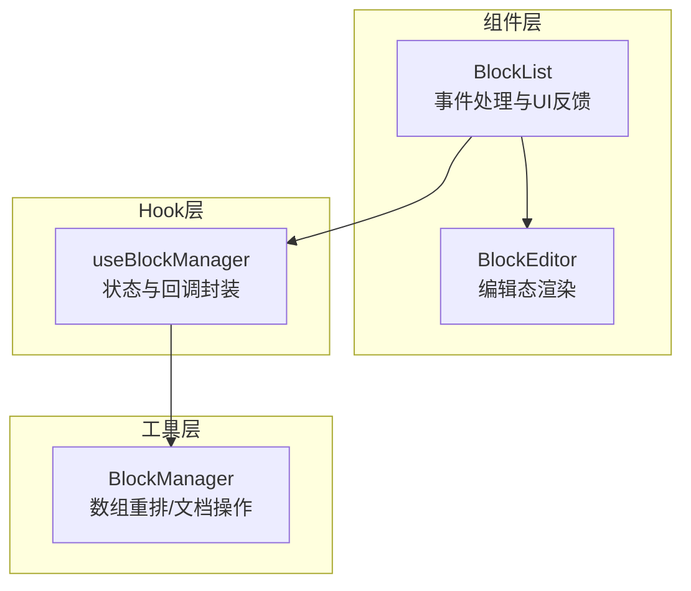
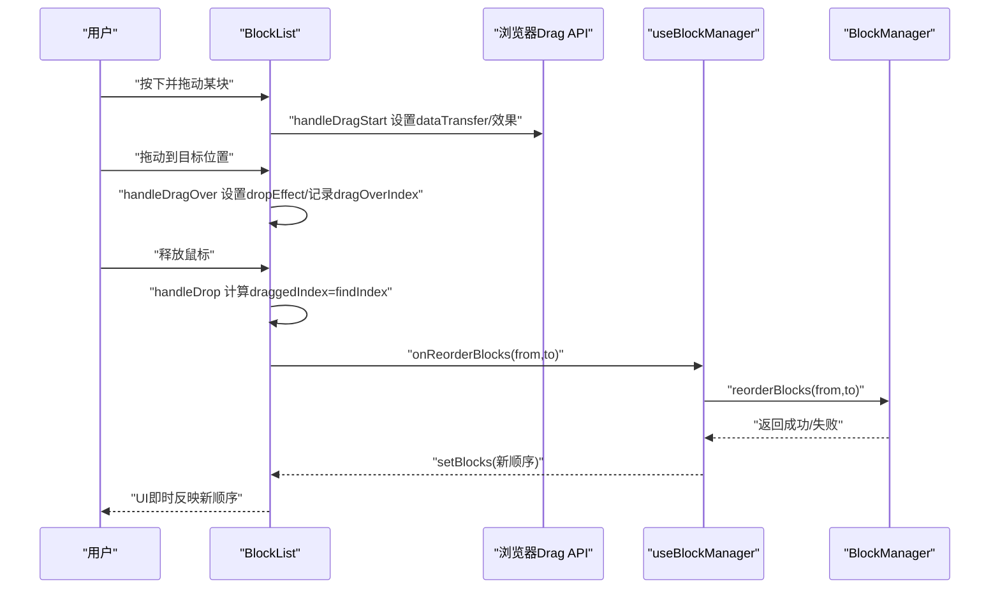
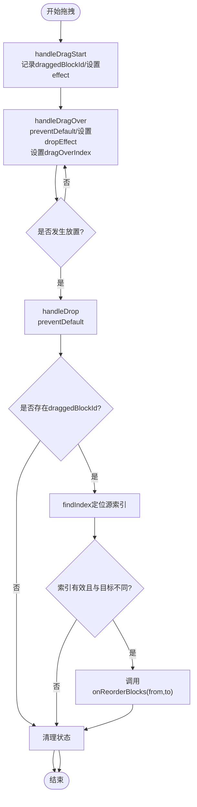
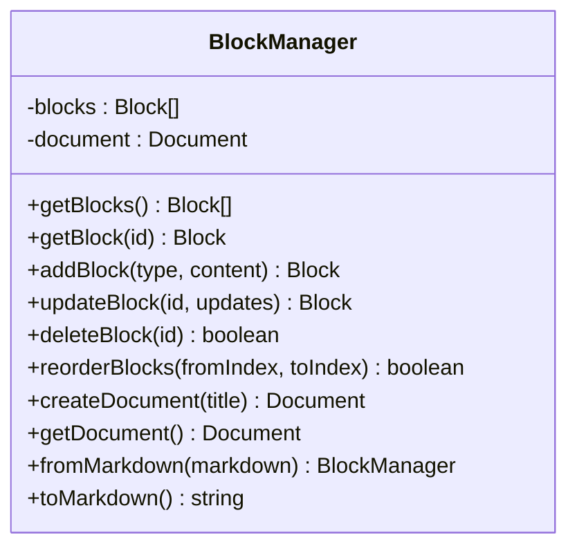
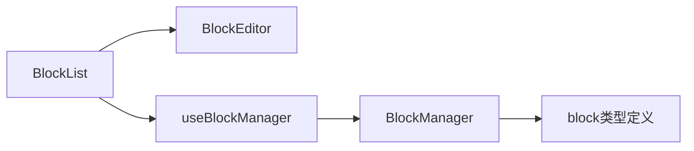

# 拖拽排序功能

<cite>
**本文引用的文件**
- [src/components/BlockList.tsx](file://src/components/BlockList.tsx)
- [src/utils/BlockManager.ts](file://src/utils/BlockManager.ts)
- [src/hooks/useBlockManager.ts](file://src/hooks/useBlockManager.ts)
- [src/types/block.ts](file://src/types/block.ts)
- [src/components/BlockEditor.tsx](file://src/components/BlockEditor.tsx)
</cite>

## 目录
1. [简介](#简介)
2. [项目结构](#项目结构)
3. [核心组件](#核心组件)
4. [架构总览](#架构总览)
5. [详细组件分析](#详细组件分析)
6. [依赖关系分析](#依赖关系分析)
7. [性能考量](#性能考量)
8. [故障排查指南](#故障排查指南)
9. [结论](#结论)
10. [附录](#附录)

## 简介
本文件围绕基于 HTML5 Drag API 的“块列表拖拽排序”实现进行系统化解析。重点覆盖：
- 编辑状态下每个块的拖拽启用逻辑
- 事件链路：handleDragStart 记录被拖拽块 ID 并设置 dataTransfer；handleDragOver 与 handleDrop 通过索引计算触发 onReorderBlocks 回调
- 使用 findIndex 定位拖拽源索引，并调用 BlockManager.reorderBlocks 完成数组重排
- dragOverIndex 控制拖拽指示器的 UI 反馈，draggedBlockId 控制透明度的视觉提示
- 事件冒泡处理与 preventDefault 的必要性
- 对比其他拖拽库的取舍考量
- 拖拽失效、索引错位等常见问题的调试方法
- 未来可扩展支持触摸设备拖拽的建议

## 项目结构
该功能涉及前端组件层与业务逻辑层的协作：
- 组件层负责事件绑定、UI 反馈与回调分发
- Hook 层封装对 BlockManager 的调用，统一状态更新
- BlockManager 提供底层数组重排与文档操作能力
- 类型定义确保块结构与文档结构的一致性

图表来源
- [src/components/BlockList.tsx](file://src/components/BlockList.tsx#L1-L145)
- [src/hooks/useBlockManager.ts](file://src/hooks/useBlockManager.ts#L1-L97)
- [src/utils/BlockManager.ts](file://src/utils/BlockManager.ts#L1-L227)

章节来源
- [src/components/BlockList.tsx](file://src/components/BlockList.tsx#L1-L145)
- [src/hooks/useBlockManager.ts](file://src/hooks/useBlockManager.ts#L1-L97)
- [src/utils/BlockManager.ts](file://src/utils/BlockManager.ts#L1-L227)
- [src/types/block.ts](file://src/types/block.ts#L1-L30)

## 核心组件
- BlockList：负责拖拽事件处理、拖拽指示器与透明度视觉反馈、将排序请求上抛给上层回调
- BlockManager：提供数组重排、块增删改查、文档创建与序列化
- useBlockManager：在 Hook 中桥接 BlockManager 与 React 状态，暴露统一的 API
- BlockEditor：编辑态渲染与非编辑态渲染切换，配合拖拽指示器使用

章节来源
- [src/components/BlockList.tsx](file://src/components/BlockList.tsx#L1-L145)
- [src/utils/BlockManager.ts](file://src/utils/BlockManager.ts#L1-L227)
- [src/hooks/useBlockManager.ts](file://src/hooks/useBlockManager.ts#L1-L97)
- [src/components/BlockEditor.tsx](file://src/components/BlockEditor.tsx#L1-L115)

## 架构总览
下图展示从用户拖拽到数据重排的完整流程。

图表来源
- [src/components/BlockList.tsx](file://src/components/BlockList.tsx#L1-L145)
- [src/hooks/useBlockManager.ts](file://src/hooks/useBlockManager.ts#L1-L97)
- [src/utils/BlockManager.ts](file://src/utils/BlockManager.ts#L1-L227)

## 详细组件分析

### BlockList：拖拽事件与UI反馈
- 拖拽启用条件：仅当某块处于编辑态时才允许拖拽
- 事件处理要点：
  - handleDragStart：记录被拖拽块 ID，设置 effectAllowed 与 dataTransfer，防止 Firefox 默认行为
  - handleDragOver：阻止默认行为以允许放置，设置 dropEffect，记录 dragOverIndex 用于指示器
  - handleDrop：阻止默认行为，若存在被拖拽块 ID，则通过 findIndex 计算源索引，调用 onReorderBlocks
  - handleDragEnd：清理拖拽状态
- UI 反馈：
  - 透明度：被拖拽块降低不透明度
  - 指示器：在目标位置上方显示一条蓝色条作为放置位置提示

图表来源
- [src/components/BlockList.tsx](file://src/components/BlockList.tsx#L1-L145)

章节来源
- [src/components/BlockList.tsx](file://src/components/BlockList.tsx#L1-L145)

### BlockManager：数组重排与文档操作
- reorderBlocks：校验边界后执行 splice 切片移动，保证 O(n) 时间复杂度
- 其他能力：块增删改查、文档创建与序列化、从 Markdown 快速构建块集合

图表来源
- [src/utils/BlockManager.ts](file://src/utils/BlockManager.ts#L1-L227)

章节来源
- [src/utils/BlockManager.ts](file://src/utils/BlockManager.ts#L1-L227)

### useBlockManager：状态与回调封装
- 将 BlockManager 的方法包装为 React 回调，统一更新本地 blocks 状态
- 暴露 add/update/delete/reorder/getMarkdown/export/import 等 API

章节来源
- [src/hooks/useBlockManager.ts](file://src/hooks/useBlockManager.ts#L1-L97)

### BlockEditor：编辑态与渲染态
- 编辑态：使用 Tiptap 渲染，支持占位符、任务列表、标题、列表、水平线等扩展
- 非编辑态：渲染 Markdown 结果，点击进入编辑态
- 与拖拽相关：编辑态下允许拖拽，非编辑态下禁用拖拽

章节来源
- [src/components/BlockEditor.tsx](file://src/components/BlockEditor.tsx#L1-L115)

## 依赖关系分析
- BlockList 依赖：
  - BlockEditor：渲染块内容
  - useBlockManager：提供 onReorderBlocks 等回调
- useBlockManager 依赖：
  - BlockManager：执行底层数组重排与文档操作
- BlockManager 依赖：
  - block 类型定义：确保块结构一致

图表来源
- [src/components/BlockList.tsx](file://src/components/BlockList.tsx#L1-L145)
- [src/hooks/useBlockManager.ts](file://src/hooks/useBlockManager.ts#L1-L97)
- [src/utils/BlockManager.ts](file://src/utils/BlockManager.ts#L1-L227)
- [src/types/block.ts](file://src/types/block.ts#L1-L30)

章节来源
- [src/components/BlockList.tsx](file://src/components/BlockList.tsx#L1-L145)
- [src/hooks/useBlockManager.ts](file://src/hooks/useBlockManager.ts#L1-L97)
- [src/utils/BlockManager.ts](file://src/utils/BlockManager.ts#L1-L227)
- [src/types/block.ts](file://src/types/block.ts#L1-L30)

## 性能考量
- 数组重排：splice 操作在最坏情况下为 O(n)，在频繁拖拽场景下仍具备良好性能
- 事件处理：仅在拖拽过程中维护少量状态（draggedBlockId、dragOverIndex），内存占用低
- UI 更新：通过 React 状态驱动，避免直接操作 DOM，减少不必要的重绘

[本节为通用性能讨论，无需列出具体文件来源]

## 故障排查指南
- 拖拽无效
  - 确认被拖拽块处于编辑态，draggable 条件为真
  - 检查 handleDragStart 是否正确设置 effectAllowed 与 dataTransfer
  - 确保 handleDragOver 与 handleDrop 中均调用了 preventDefault
- 索引错位或未触发回调
  - 在 handleDrop 中检查 draggedBlockId 是否为空
  - 使用 findIndex 定位源索引，确认 blocks 中存在对应 id
  - 避免源索引与目标索引相同，否则不会触发 onReorderBlocks
- 指示器不显示或闪烁
  - 确认 handleDragOver 正确设置 dragOverIndex
  - 检查 handleDragLeave 是否在离开容器时清空 dragOverIndex
- 视觉反馈异常
  - 被拖拽块透明度未生效：确认 draggedBlockId 与当前块 id 匹配
- 浏览器兼容性
  - Firefox 默认行为：已在 handleDragStart 中通过 setData 防止默认行为

章节来源
- [src/components/BlockList.tsx](file://src/components/BlockList.tsx#L1-L145)

## 结论
本实现采用原生 HTML5 Drag API，以最小依赖实现块级拖拽排序。通过事件链路与状态管理的清晰分工，既保证了交互体验，又维持了良好的可维护性。BlockManager 的数组重排逻辑简洁高效，useBlockManager 将业务与 UI 解耦，便于后续扩展。

[本节为总结性内容，无需列出具体文件来源]

## 附录

### 与其他拖拽库的取舍考量
- 优势
  - 无需引入额外依赖，减少包体积与运行时开销
  - 事件模型简单直观，易于调试与定制
- 劣势
  - 无法自动处理跨元素/跨窗口拖放
  - 触摸设备支持有限，需要额外适配
- 建议
  - 若需跨平台触摸支持，可在现有基础上增加触摸事件映射
  - 若需更复杂的拖放语义（如多选、嵌套、拖放策略），可考虑引入专业库并在关键路径保持兼容

[本节为概念性建议，无需列出具体文件来源]

### 未来可扩展：触摸设备拖拽
- 方案思路
  - 在移动端监听 touchstart/touchmove/touchend，模拟 dragenter/dragover/drop 行为
  - 通过 dragOverIndex 与指示器保持一致的视觉反馈
  - 在 handleDrop 中区分鼠标与触摸来源，避免重复触发
- 注意事项
  - 需要处理滚动与手势冲突
  - 适当增加防抖与节流，避免高频事件导致卡顿

[本节为概念性建议，无需列出具体文件来源]