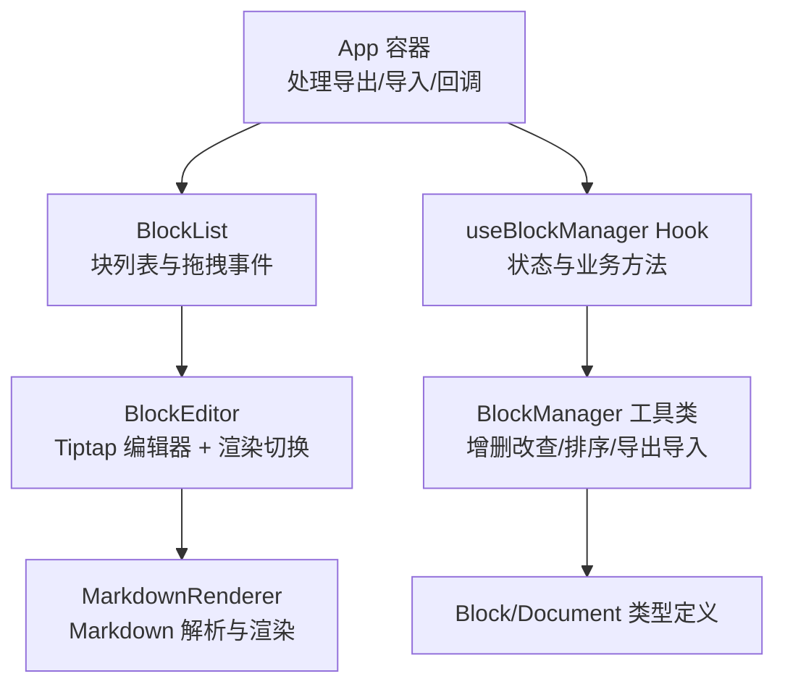
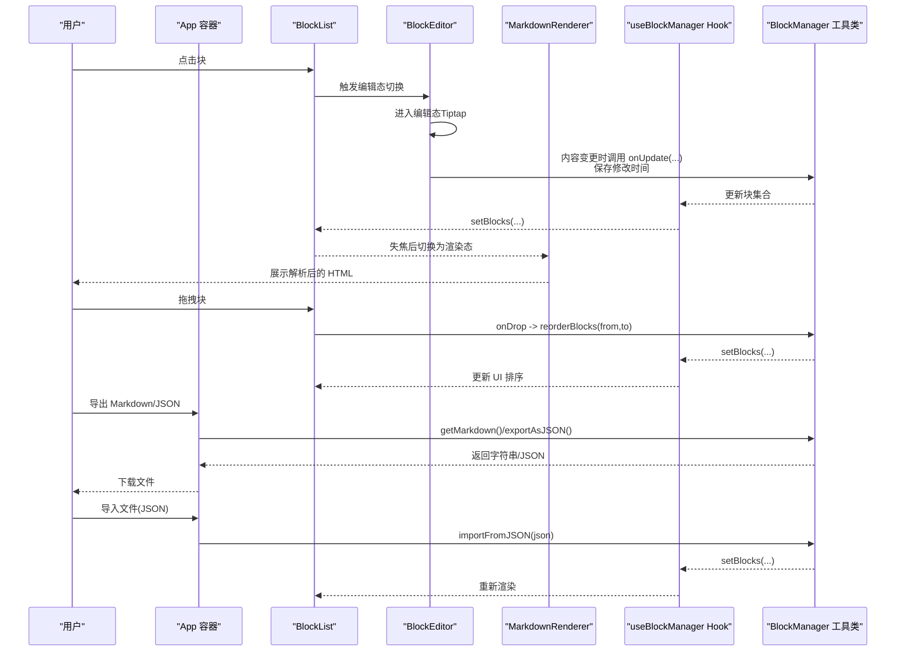
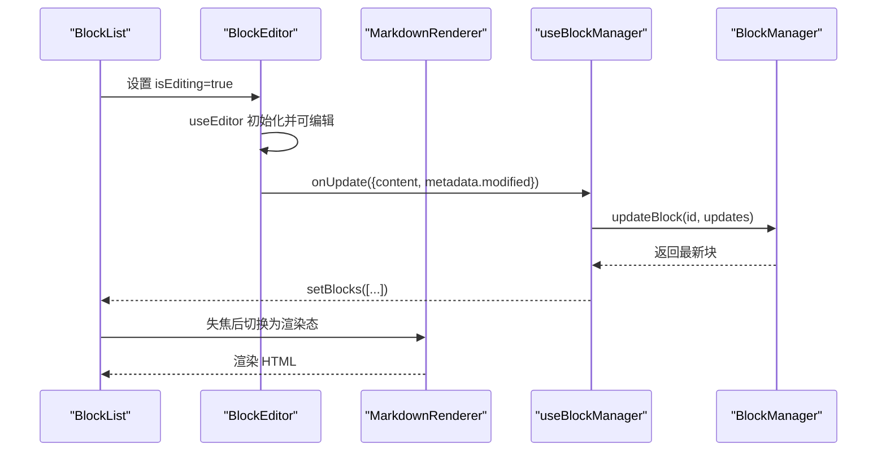
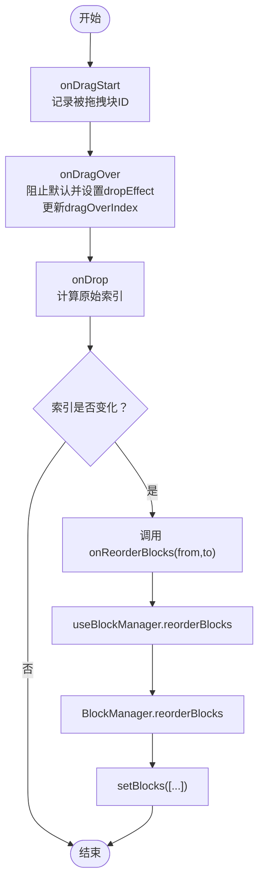
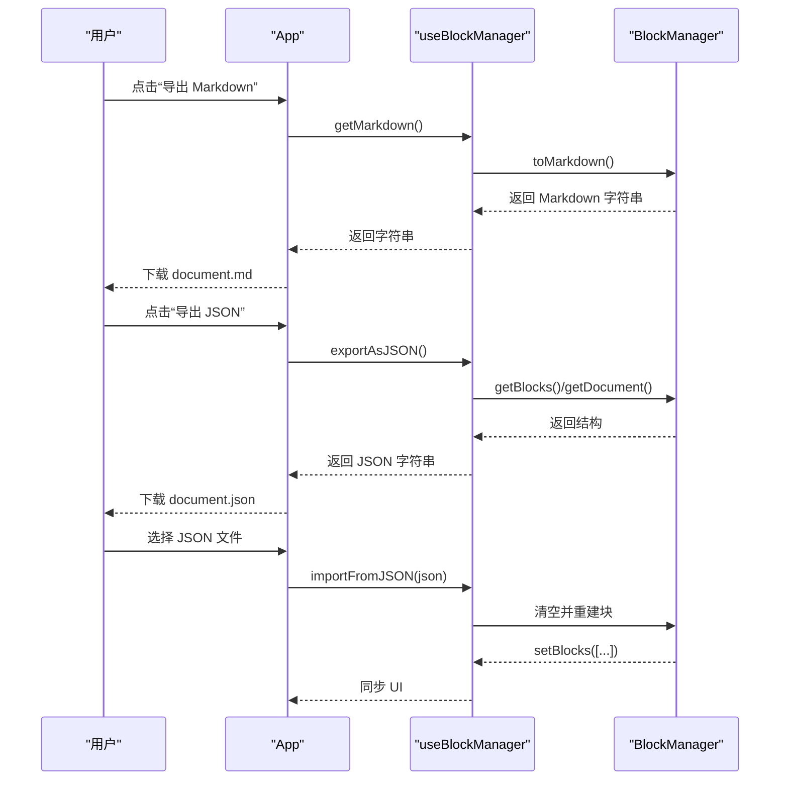
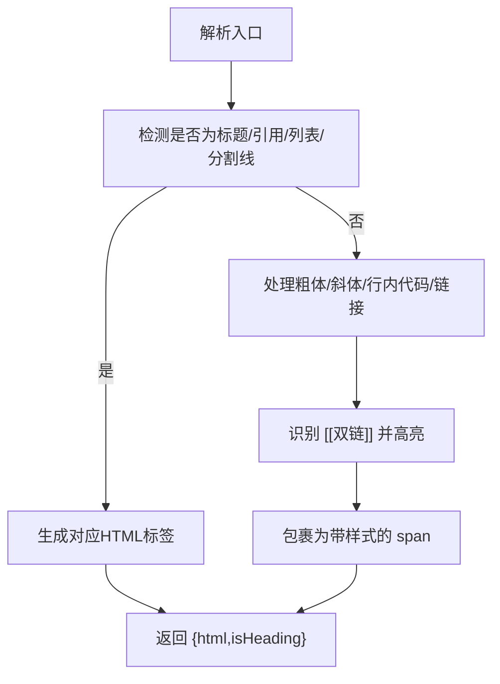
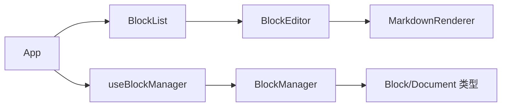

# 核心功能详解

<cite>
**本文引用的文件**
- [App.tsx](file://src/App.tsx)
- [BlockList.tsx](file://src/components/BlockList.tsx)
- [BlockEditor.tsx](file://src/components/BlockEditor.tsx)
- [MarkdownRenderer.tsx](file://src/components/MarkdownRenderer.tsx)
- [useBlockManager.ts](file://src/hooks/useBlockManager.ts)
- [BlockManager.ts](file://src/utils/BlockManager.ts)
- [block.ts](file://src/types/block.ts)
</cite>

## 目录
1. [引言](#引言)
2. [项目结构](#项目结构)
3. [核心组件](#核心组件)
4. [架构总览](#架构总览)
5. [详细组件分析](#详细组件分析)
6. [依赖分析](#依赖分析)
7. [性能考虑](#性能考虑)
8. [故障排查指南](#故障排查指南)
9. [结论](#结论)

## 引言
本文件围绕项目的“块编辑模式”“拖拽排序”“内容导入导出”“双链功能”等核心能力进行深入解析。重点说明：
- 点击进入 Tiptap 编辑器，失焦后自动保存并切换至 MarkdownRenderer 渲染视图的机制；
- HTML5 Drag API 与 BlockManager.reorderBlocks 协同完成拖拽排序；
- 导出为 Markdown 时调用 getMarkdown() 生成纯文本，导出为 JSON 时序列化完整文档结构；导入通过 FileReader 读取 JSON 并调用 importFromJSON() 恢复状态；
- 在 MarkdownRenderer 中识别 [[双链]] 语法并高亮显示，为后续链接跳转提供基础。

## 项目结构
项目采用“页面容器 + 组件层 + Hook 层 + 工具层 + 类型定义”的分层组织方式：
- 页面容器负责初始化、导出/导入、传递回调给子组件；
- 组件层包含 BlockList、BlockEditor、MarkdownRenderer；
- Hook 层 useBlockManager 提供状态与业务方法；
- 工具层 BlockManager 实现块增删改查、排序、Markdown 导入导出；
- 类型定义 block.ts 描述块与文档的数据结构。

图表来源
- [App.tsx](file://src/App.tsx#L47-L155)
- [BlockList.tsx](file://src/components/BlockList.tsx#L1-L145)
- [BlockEditor.tsx](file://src/components/BlockEditor.tsx#L1-L116)
- [MarkdownRenderer.tsx](file://src/components/MarkdownRenderer.tsx#L1-L125)
- [useBlockManager.ts](file://src/hooks/useBlockManager.ts#L1-L97)
- [BlockManager.ts](file://src/utils/BlockManager.ts#L1-L227)
- [block.ts](file://src/types/block.ts#L1-L30)

章节来源
- [App.tsx](file://src/App.tsx#L47-L155)
- [BlockList.tsx](file://src/components/BlockList.tsx#L1-L145)
- [BlockEditor.tsx](file://src/components/BlockEditor.tsx#L1-L116)
- [MarkdownRenderer.tsx](file://src/components/MarkdownRenderer.tsx#L1-L125)
- [useBlockManager.ts](file://src/hooks/useBlockManager.ts#L1-L97)
- [BlockManager.ts](file://src/utils/BlockManager.ts#L1-L227)
- [block.ts](file://src/types/block.ts#L1-L30)

## 核心组件
- App 容器：提供导出 Markdown、导出 JSON、导入文件的入口，并将块列表与回调注入 BlockList。
- BlockList：承载块列表，处理拖拽事件，协调编辑态切换与新增块。
- BlockEditor：封装 Tiptap 编辑器，实现编辑态与渲染态切换、内容变更保存。
- MarkdownRenderer：将块内容解析为 HTML 并渲染，内置对标题、引用、列表、分割线、粗体、斜体、行内代码、链接、以及双链的识别与高亮。
- useBlockManager Hook：封装 BlockManager，暴露 updateBlock/addBlock/deleteBlock/reorderBlocks/getMarkdown/exportAsJSON/importFromJSON 等方法。
- BlockManager：实现块集合的增删改查、排序、从 Markdown 初始化、导出为 Markdown、导出为 JSON、从 JSON 恢复状态。
- Block/Document 类型：定义块与文档的数据结构，含块 ID、类型、内容、元数据、双向链路字段等。

章节来源
- [App.tsx](file://src/App.tsx#L47-L155)
- [BlockList.tsx](file://src/components/BlockList.tsx#L1-L145)
- [BlockEditor.tsx](file://src/components/BlockEditor.tsx#L1-L116)
- [MarkdownRenderer.tsx](file://src/components/MarkdownRenderer.tsx#L1-L125)
- [useBlockManager.ts](file://src/hooks/useBlockManager.ts#L1-L97)
- [BlockManager.ts](file://src/utils/BlockManager.ts#L1-L227)
- [block.ts](file://src/types/block.ts#L1-L30)

## 架构总览
下图展示了从用户交互到状态持久化的整体流程，包括编辑态切换、拖拽排序、导入导出等关键路径。

图表来源
- [App.tsx](file://src/App.tsx#L57-L98)
- [BlockList.tsx](file://src/components/BlockList.tsx#L22-L57)
- [BlockEditor.tsx](file://src/components/BlockEditor.tsx#L79-L112)
- [MarkdownRenderer.tsx](file://src/components/MarkdownRenderer.tsx#L76-L121)
- [useBlockManager.ts](file://src/hooks/useBlockManager.ts#L18-L93)
- [BlockManager.ts](file://src/utils/BlockManager.ts#L66-L76)

## 详细组件分析

### 块编辑模式：编辑态-渲染态切换
- 进入编辑态：BlockList 根据当前点击块设置编辑态标识，BlockEditor 初始化 Tiptap 编辑器并设置为可编辑。
- 内容保存：Tiptap 的 onUpdate 回调将 HTML 内容回传给上层，由 useBlockManager.updateBlock 调用 BlockManager.updateBlock，同时更新修改时间。
- 失焦切换：BlockEditor 在 onBlur 时触发 onToggleEdit，BlockList 清除编辑态，BlockEditor 渲染为 MarkdownRenderer。
- 渲染态：MarkdownRenderer 对块内容进行解析，支持标题、引用、列表、分割线、粗体、斜体、行内代码、链接、以及双链高亮。

图表来源
- [BlockList.tsx](file://src/components/BlockList.tsx#L18-L24)
- [BlockEditor.tsx](file://src/components/BlockEditor.tsx#L29-L63)
- [MarkdownRenderer.tsx](file://src/components/MarkdownRenderer.tsx#L76-L121)
- [useBlockManager.ts](file://src/hooks/useBlockManager.ts#L18-L21)
- [BlockManager.ts](file://src/utils/BlockManager.ts#L40-L55)

章节来源
- [BlockList.tsx](file://src/components/BlockList.tsx#L18-L24)
- [BlockEditor.tsx](file://src/components/BlockEditor.tsx#L29-L63)
- [MarkdownRenderer.tsx](file://src/components/MarkdownRenderer.tsx#L76-L121)
- [useBlockManager.ts](file://src/hooks/useBlockManager.ts#L18-L21)
- [BlockManager.ts](file://src/utils/BlockManager.ts#L40-L55)

### 拖拽排序：HTML5 Drag API 与 BlockManager.reorderBlocks
- 拖拽触发：BlockList 为当前编辑中的块开启 draggable，记录被拖拽块 ID 与目标索引。
- 拖拽过程：onDragOver 设置 dropEffect，维护 dragOverIndex 以显示拖拽指示器。
- 拖拽结束：onDrop 计算被拖拽块的原始索引，若与目标索引不同，则调用 onReorderBlocks(from,to)。
- 排序执行：useBlockManager.reorderBlocks 调用 BlockManager.reorderBlocks，内部通过 splice 实现数组重排，随后 setBlocks 同步 UI。

图表来源
- [BlockList.tsx](file://src/components/BlockList.tsx#L26-L57)
- [useBlockManager.ts](file://src/hooks/useBlockManager.ts#L39-L46)
- [BlockManager.ts](file://src/utils/BlockManager.ts#L66-L76)

章节来源
- [BlockList.tsx](file://src/components/BlockList.tsx#L26-L57)
- [useBlockManager.ts](file://src/hooks/useBlockManager.ts#L39-L46)
- [BlockManager.ts](file://src/utils/BlockManager.ts#L66-L76)

### 内容导入导出：Markdown 与 JSON
- 导出 Markdown：App.handleExport 调用 useBlockManager.getMarkdown，后者委托 BlockManager.toMarkdown，返回拼接后的 Markdown 文本，再通过 Blob 与 a 标签下载。
- 导出 JSON：App.handleExportJSON 调用 useBlockManager.exportAsJSON，序列化 blocks 与 document，下载为 JSON 文件。
- 导入 JSON：App.handleImport 使用 FileReader 读取文件文本，判断文件名后缀，调用 useBlockManager.importFromJSON，内部解析 JSON，清空当前块并逐个重建，最后 setBlocks 同步 UI。

图表来源
- [App.tsx](file://src/App.tsx#L57-L98)
- [useBlockManager.ts](file://src/hooks/useBlockManager.ts#L49-L60)
- [BlockManager.ts](file://src/utils/BlockManager.ts#L219-L223)

章节来源
- [App.tsx](file://src/App.tsx#L57-L98)
- [useBlockManager.ts](file://src/hooks/useBlockManager.ts#L49-L60)
- [BlockManager.ts](file://src/utils/BlockManager.ts#L219-L223)

### 双链功能：识别与高亮
- 识别与高亮：MarkdownRenderer 的解析函数对形如 [[双链]] 的语法进行识别，并包裹为带样式的 span，便于后续扩展为可点击链接。
- 扩展方向：可在该 span 上绑定点击事件，跳转到对应块或打开侧边面板，实现双向链路导航。

图表来源
- [MarkdownRenderer.tsx](file://src/components/MarkdownRenderer.tsx#L9-L74)

章节来源
- [MarkdownRenderer.tsx](file://src/components/MarkdownRenderer.tsx#L9-L74)

## 依赖分析
- 组件耦合与职责
  - App 仅负责导出/导入与回调注入，不直接操作块集合，保持高层控制。
  - BlockList 负责拖拽事件与编辑态切换，向下传递回调。
  - BlockEditor 负责编辑器生命周期与渲染态切换，向上汇报内容变更。
  - MarkdownRenderer 专注解析与渲染，不参与状态管理。
  - useBlockManager 作为状态与业务的桥接层，统一对外暴露方法。
  - BlockManager 作为纯工具类，提供数据结构与算法实现。
- 关键依赖链
  - App → BlockList → BlockEditor → MarkdownRenderer
  - App → useBlockManager → BlockManager
  - BlockList → useBlockManager → BlockManager
  - BlockEditor → useBlockManager → BlockManager
  - MarkdownRenderer → Block 类型定义

图表来源
- [App.tsx](file://src/App.tsx#L47-L155)
- [BlockList.tsx](file://src/components/BlockList.tsx#L1-L145)
- [BlockEditor.tsx](file://src/components/BlockEditor.tsx#L1-L116)
- [MarkdownRenderer.tsx](file://src/components/MarkdownRenderer.tsx#L1-L125)
- [useBlockManager.ts](file://src/hooks/useBlockManager.ts#L1-L97)
- [BlockManager.ts](file://src/utils/BlockManager.ts#L1-L227)
- [block.ts](file://src/types/block.ts#L1-L30)

章节来源
- [App.tsx](file://src/App.tsx#L47-L155)
- [BlockList.tsx](file://src/components/BlockList.tsx#L1-L145)
- [BlockEditor.tsx](file://src/components/BlockEditor.tsx#L1-L116)
- [MarkdownRenderer.tsx](file://src/components/MarkdownRenderer.tsx#L1-L125)
- [useBlockManager.ts](file://src/hooks/useBlockManager.ts#L1-L97)
- [BlockManager.ts](file://src/utils/BlockManager.ts#L1-L227)
- [block.ts](file://src/types/block.ts#L1-L30)

## 性能考虑
- 编辑态切换
  - 仅在失焦时切换渲染态，避免频繁重渲染；Tiptap 的 onUpdate 仅在内容变化时触发，减少不必要的 setBlocks 调用。
- 拖拽排序
  - 仅在目标索引变化时调用 reorderBlocks，BlockManager.reorderBlocks 通过 splice 原地重排，时间复杂度 O(n)。
- 导入导出
  - 导出为 Markdown 时直接拼接块内容，toMarkdown 为 O(n)；导出 JSON 为浅序列化，开销较小。
  - 导入 JSON 时先清空再重建，适合一次性批量恢复，避免中间状态导致的 UI 抖动。
- 渲染解析
  - MarkdownRenderer 的解析为线性扫描与有限次正则替换，对常见块类型友好；建议在大型文档中引入更高效的解析库以提升性能。

## 故障排查指南
- 导入失败
  - 现象：导入 JSON 后未生效。
  - 排查：检查 JSON 结构是否包含 blocks 数组；确认 importFromJSON 的 try/catch 是否抛错；查看控制台错误信息。
  - 参考路径
    - [App.tsx](file://src/App.tsx#L83-L98)
    - [useBlockManager.ts](file://src/hooks/useBlockManager.ts#L62-L83)
- 拖拽无效
  - 现象：拖拽无反应或排序不生效。
  - 排查：确认当前块处于编辑态（draggable 条件）；检查 onDrop 中 draggedIndex 与 targetIndex 是否正确；确保 onReorderBlocks 正常调用。
  - 参考路径
    - [BlockList.tsx](file://src/components/BlockList.tsx#L72-L73)
    - [BlockList.tsx](file://src/components/BlockList.tsx#L42-L57)
    - [useBlockManager.ts](file://src/hooks/useBlockManager.ts#L39-L46)
- 编辑态无法切换
  - 现象：点击块不进入编辑态或失焦后不切换渲染态。
  - 排查：确认 BlockList 的 handleToggleEdit 是否被调用；检查 BlockEditor 的 isEditing 与 onBlur 逻辑；确认 MarkdownRenderer 的 onClick 是否触发 onEdit。
  - 参考路径
    - [BlockList.tsx](file://src/components/BlockList.tsx#L22-L24)
    - [BlockEditor.tsx](file://src/components/BlockEditor.tsx#L79-L112)
    - [MarkdownRenderer.tsx](file://src/components/MarkdownRenderer.tsx#L76-L88)

章节来源
- [App.tsx](file://src/App.tsx#L83-L98)
- [useBlockManager.ts](file://src/hooks/useBlockManager.ts#L39-L46)
- [BlockList.tsx](file://src/components/BlockList.tsx#L22-L24)
- [BlockEditor.tsx](file://src/components/BlockEditor.tsx#L79-L112)
- [MarkdownRenderer.tsx](file://src/components/MarkdownRenderer.tsx#L76-L88)

## 结论
本项目通过清晰的分层设计与明确的职责划分，实现了块编辑、拖拽排序、导入导出与双链高亮等核心功能。编辑态-渲染态切换保证了良好的交互体验；HTML5 Drag API 与 BlockManager.reorderBlocks 的配合使排序直观可靠；导入导出流程简洁稳定；双链高亮为未来的链接跳转提供了良好基础。建议在后续迭代中：
- 引入更完善的 Markdown 解析库以提升渲染性能与兼容性；
- 为双链提供点击跳转与可视化提示；
- 优化拖拽指示器与动画，增强拖拽反馈；
- 在导入时支持增量更新，减少重建成本。