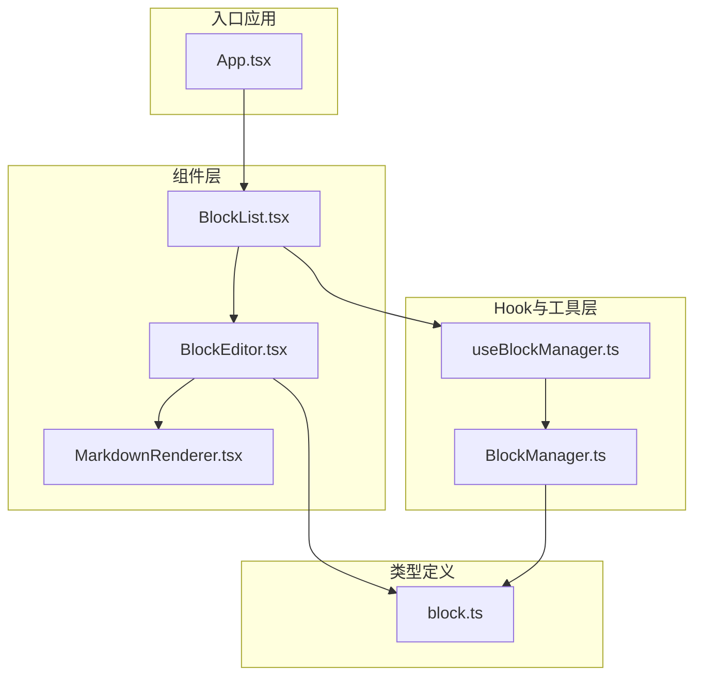
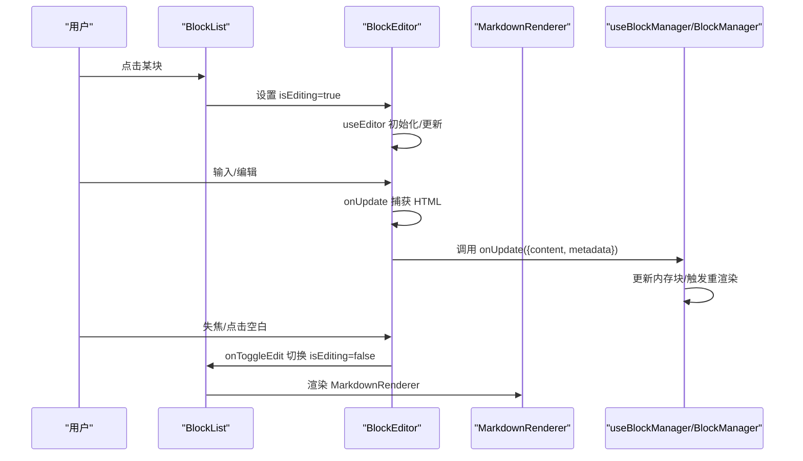
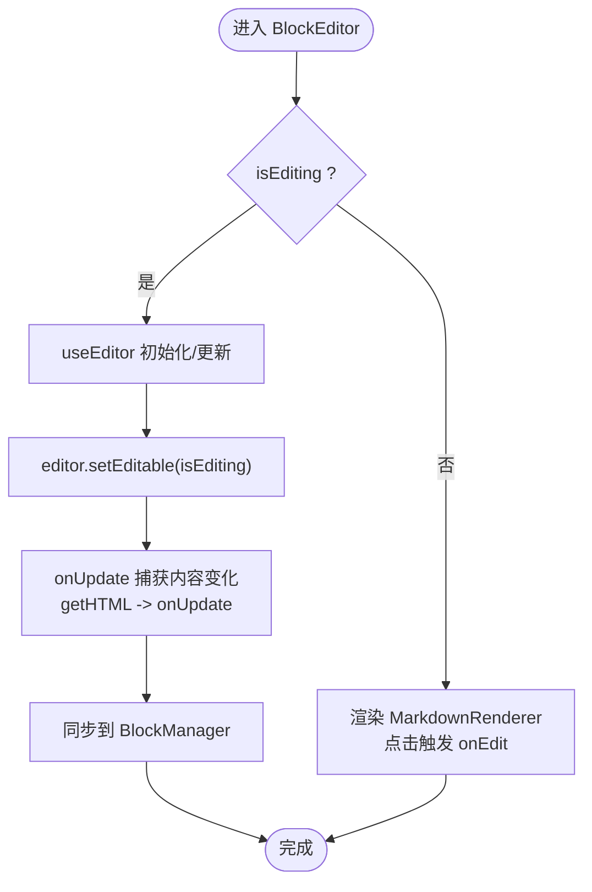
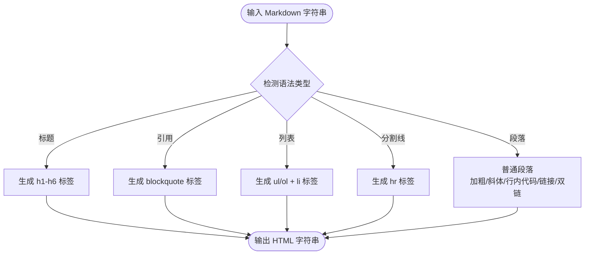
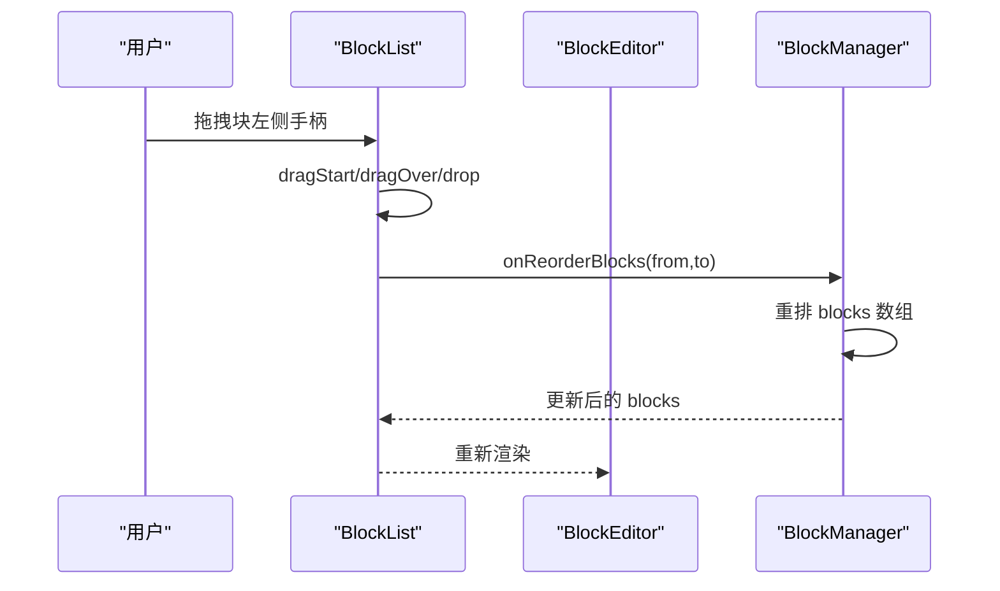
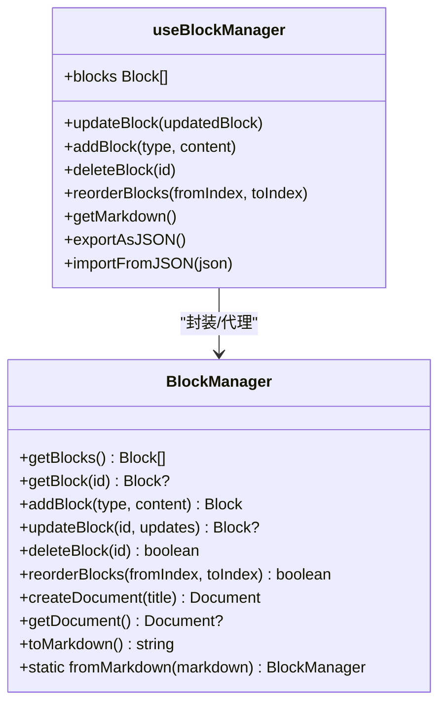
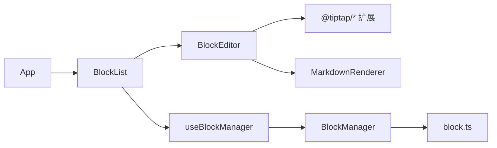

# BlockEditor组件实现

<cite>
**本文引用的文件**
- [BlockEditor.tsx](file://src/components/BlockEditor.tsx)
- [MarkdownRenderer.tsx](file://src/components/MarkdownRenderer.tsx)
- [BlockList.tsx](file://src/components/BlockList.tsx)
- [useBlockManager.ts](file://src/hooks/useBlockManager.ts)
- [BlockManager.ts](file://src/utils/BlockManager.ts)
- [block.ts](file://src/types/block.ts)
- [App.tsx](file://src/App.tsx)
- [tiptap集成说明.md](file://docs/tiptap集成说明.md)
</cite>

## 目录
1. [简介](#简介)
2. [项目结构](#项目结构)
3. [核心组件](#核心组件)
4. [架构总览](#架构总览)
5. [详细组件分析](#详细组件分析)
6. [依赖关系分析](#依赖关系分析)
7. [性能考量](#性能考量)
8. [故障排查指南](#故障排查指南)
9. [结论](#结论)
10. [附录](#附录)

## 简介
本文件围绕 BlockEditor 组件展开，系统讲解其基于 Tiptap（底层为 ProseMirror）构建富文本编辑能力的实现细节，包括：
- useEditor 初始化配置：StarterKit、TaskList、Heading、DragHandle 等扩展的用途与关键配置
- 编辑态与预览态切换逻辑：isEditing 控制、编辑态渲染 EditorContent、非编辑态委托 MarkdownRenderer
- 内容变更捕获：onUpdate 回调将 HTML 同步至 BlockManager
- 状态同步：useEffect 对 isEditing 与 block.content 的响应
- 拖拽手柄 UI 与 HTML5 拖拽 API 的集成
- dangerouslySetInnerHTML 的安全风险与简易渲染器局限性，并给出未来替换为 marked.js 或 Lute 的优化建议

## 项目结构
该仓库采用“按功能分层”的组织方式，BlockEditor 作为核心编辑组件位于 components 目录；与之配套的 MarkdownRenderer、BlockList、BlockManager、useBlockManager 等分别承担渲染、列表管理、数据模型与状态管理职责。

图表来源
- [BlockEditor.tsx](file://src/components/BlockEditor.tsx#L1-L116)
- [MarkdownRenderer.tsx](file://src/components/MarkdownRenderer.tsx#L1-L125)
- [BlockList.tsx](file://src/components/BlockList.tsx#L1-L145)
- [useBlockManager.ts](file://src/hooks/useBlockManager.ts#L1-L97)
- [BlockManager.ts](file://src/utils/BlockManager.ts#L1-L227)
- [block.ts](file://src/types/block.ts#L1-L30)
- [App.tsx](file://src/App.tsx#L1-L156)

章节来源
- [BlockEditor.tsx](file://src/components/BlockEditor.tsx#L1-L116)
- [BlockList.tsx](file://src/components/BlockList.tsx#L1-L145)
- [useBlockManager.ts](file://src/hooks/useBlockManager.ts#L1-L97)
- [BlockManager.ts](file://src/utils/BlockManager.ts#L1-L227)
- [block.ts](file://src/types/block.ts#L1-L30)
- [App.tsx](file://src/App.tsx#L1-L156)

## 核心组件
- BlockEditor：负责单个块的编辑与渲染，基于 Tiptap 提供富文本能力，支持编辑态与预览态切换、内容变更同步、拖拽手柄交互。
- MarkdownRenderer：在非编辑态下对块内容进行简单 Markdown 解析并渲染为 HTML，使用 dangerouslySetInnerHTML 输出。
- BlockList：维护块列表状态，处理编辑态切换、拖拽排序、新增块等交互，并将事件向上透传给 BlockManager。
- useBlockManager：封装 BlockManager 的状态与操作，提供增删改查、排序、导入导出等接口。
- BlockManager：文档级数据模型，负责块的生命周期管理与 Markdown/JSON 的导入导出。
- 类型定义 block.ts：统一块类型与文档结构，保证跨组件的数据契约一致。

章节来源
- [BlockEditor.tsx](file://src/components/BlockEditor.tsx#L1-L116)
- [MarkdownRenderer.tsx](file://src/components/MarkdownRenderer.tsx#L1-L125)
- [BlockList.tsx](file://src/components/BlockList.tsx#L1-L145)
- [useBlockManager.ts](file://src/hooks/useBlockManager.ts#L1-L97)
- [BlockManager.ts](file://src/utils/BlockManager.ts#L1-L227)
- [block.ts](file://src/types/block.ts#L1-L30)

## 架构总览
BlockEditor 通过 useEditor 初始化 Tiptap 编辑器实例，挂载 StarterKit、Heading、TaskList、DragHandle 等扩展，结合 MarkdownRenderer 在非编辑态渲染内容。BlockList 负责状态协调与交互，useBlockManager/BlockManager 负责数据持久化与同步。

图表来源
- [BlockList.tsx](file://src/components/BlockList.tsx#L1-L145)
- [BlockEditor.tsx](file://src/components/BlockEditor.tsx#L1-L116)
- [MarkdownRenderer.tsx](file://src/components/MarkdownRenderer.tsx#L1-L125)
- [useBlockManager.ts](file://src/hooks/useBlockManager.ts#L1-L97)
- [BlockManager.ts](file://src/utils/BlockManager.ts#L1-L227)

## 详细组件分析

### BlockEditor 组件：Tiptap 编辑器与状态同步
- useEditor 初始化配置要点
  - 扩展集合：StarterKit、Placeholder、TaskList、TaskItem（nested）、Blockquote、Heading（levels）、BulletList、OrderedList、HorizontalRule、DragHandle
  - content：初始内容来自 block.content
  - editable：由 isEditing 控制是否可编辑
  - onUpdate：当编辑器内容变化时，读取 editor.getHTML() 并调用父级 onUpdate，同时更新 metadata.modified
- 状态同步
  - useEffect(监听 isEditing)：动态设置 editor.setEditable
  - useEffect(监听 block.content)：当外部内容变化时，通过 editor.commands.setContent 同步
- 交互
  - 非编辑态：返回 MarkdownRenderer，点击渲染区域触发 onEdit
  - 编辑态：渲染 EditorContent，并在 onBlur 触发 onToggleEdit
  - 左侧拖拽手柄：提供视觉提示，配合 BlockList 的 HTML5 拖拽 API 实现块排序

图表来源
- [BlockEditor.tsx](file://src/components/BlockEditor.tsx#L1-L116)

章节来源
- [BlockEditor.tsx](file://src/components/BlockEditor.tsx#L1-L116)

### MarkdownRenderer：简易 Markdown 渲染与安全风险
- 渲染策略
  - 标题：匹配 # 至 ######，生成对应 h1-h6
  - 引用：以 > 开头的行转为 blockquote
  - 列表：支持无序（- 或 *）与有序（数字前缀），支持嵌套
  - 分割线：--- 或 ***
  - 段落：普通文本，支持加粗、斜体、行内代码、链接、双链占位
- 安全风险
  - 使用 dangerouslySetInnerHTML 直接注入 HTML，存在 XSS 风险
  - 建议：在生产环境替换为 marked.js 或 Lute 等成熟解析库，严格过滤/白名单输出
- 局限性
  - 语法覆盖有限，不支持表格、脚注、数学公式等高级 Markdown 特性
  - 双链渲染仅做占位，未实现双向链接跳转

图表来源
- [MarkdownRenderer.tsx](file://src/components/MarkdownRenderer.tsx#L1-L125)

章节来源
- [MarkdownRenderer.tsx](file://src/components/MarkdownRenderer.tsx#L1-L125)

### BlockList：拖拽排序与编辑态管理
- 编辑态切换
  - 通过 editingBlockId 记录当前编辑块，传递给 BlockEditor 的 isEditing
- 拖拽排序
  - 使用 HTML5 拖拽 API：dragStart/dragOver/drop/dragEnd
  - 通过 setDraggedBlockId、setDragOverIndex 管理拖拽状态与视觉反馈
  - onDrop 中计算拖拽索引并调用 onReorderBlocks，最终由 BlockManager 执行重排
- 新增块
  - 提供多种类型按钮，调用 onAddBlock 创建新块

图表来源
- [BlockList.tsx](file://src/components/BlockList.tsx#L1-L145)
- [BlockManager.ts](file://src/utils/BlockManager.ts#L1-L227)

章节来源
- [BlockList.tsx](file://src/components/BlockList.tsx#L1-L145)
- [BlockManager.ts](file://src/utils/BlockManager.ts#L1-L227)

### useBlockManager 与 BlockManager：数据流与持久化
- useBlockManager
  - 初始化 BlockManager，暴露 blocks 状态与 update/add/delete/reorder/getMarkdown/export/import 等方法
  - updateBlock 调用 BlockManager.updateBlock 并刷新本地状态
- BlockManager
  - 提供块的增删改查、重排、文档创建、从 Markdown 导入、导出为 Markdown/JSON
  - fromMarkdown 简单按行切分并识别标题/引用/列表/分割线等，生成块数组

图表来源
- [useBlockManager.ts](file://src/hooks/useBlockManager.ts#L1-L97)
- [BlockManager.ts](file://src/utils/BlockManager.ts#L1-L227)

章节来源
- [useBlockManager.ts](file://src/hooks/useBlockManager.ts#L1-L97)
- [BlockManager.ts](file://src/utils/BlockManager.ts#L1-L227)

### 类型系统：Block 与 Document
- Block：包含 id、type、content、references/referencedBy、metadata（created/modified）
- Document：包含 id、title、blocks、created/modified
- 作用：统一块与文档的数据结构，确保 BlockEditor、BlockList、useBlockManager、BlockManager 之间的数据契约一致

章节来源
- [block.ts](file://src/types/block.ts#L1-L30)

## 依赖关系分析
- BlockEditor 依赖 Tiptap 扩展（StarterKit、Heading、TaskList、DragHandle 等），并通过 onUpdate 将 HTML 同步到上层 BlockManager
- BlockList 作为容器，协调编辑态与拖拽排序，并将操作透传给 useBlockManager/BlockManager
- MarkdownRenderer 依赖 block.content，在非编辑态渲染 HTML，使用 dangerouslySetInnerHTML 注入
- App.tsx 作为入口，提供示例内容与导入导出功能，驱动整个编辑流程

图表来源
- [BlockEditor.tsx](file://src/components/BlockEditor.tsx#L1-L116)
- [MarkdownRenderer.tsx](file://src/components/MarkdownRenderer.tsx#L1-L125)
- [BlockList.tsx](file://src/components/BlockList.tsx#L1-L145)
- [useBlockManager.ts](file://src/hooks/useBlockManager.ts#L1-L97)
- [BlockManager.ts](file://src/utils/BlockManager.ts#L1-L227)
- [block.ts](file://src/types/block.ts#L1-L30)
- [App.tsx](file://src/App.tsx#L1-L156)

章节来源
- [BlockEditor.tsx](file://src/components/BlockEditor.tsx#L1-L116)
- [MarkdownRenderer.tsx](file://src/components/MarkdownRenderer.tsx#L1-L125)
- [BlockList.tsx](file://src/components/BlockList.tsx#L1-L145)
- [useBlockManager.ts](file://src/hooks/useBlockManager.ts#L1-L97)
- [BlockManager.ts](file://src/utils/BlockManager.ts#L1-L227)
- [block.ts](file://src/types/block.ts#L1-L30)
- [App.tsx](file://src/App.tsx#L1-L156)

## 性能考量
- 编辑态渲染：仅在 isEditing 为真时渲染 EditorContent，避免不必要的 DOM 生成
- 内容同步：useEffect 仅在必要时 setContent，减少不必要的命令执行
- 渲染器：MarkdownRenderer 为轻量解析，适合预览态；复杂场景建议引入 marked.js/Lute，提升解析效率与稳定性
- 拖拽排序：BlockList 使用 HTML5 拖拽 API，性能良好；注意在大量块时避免频繁重排导致的重绘

## 故障排查指南
- 编辑态无法切换
  - 检查 BlockList 的 editingBlockId 是否正确更新
  - 确认 BlockEditor 的 isEditing 与 onToggleEdit 传递路径
- 内容未同步
  - 确认 onUpdate 是否被触发（编辑器内容变化）
  - 检查 useBlockManager.updateBlock 是否被调用并刷新状态
- 拖拽无效
  - 确认拖拽手柄元素存在且可拖拽
  - 检查 onDragStart/onDragOver/onDrop 事件绑定与索引计算
- 预览态渲染异常
  - 检查 MarkdownRenderer 的 parseMarkdown 逻辑与 dangerouslySetInnerHTML 的输出
  - 如出现 XSS 风险，需替换为安全的解析库并启用白名单

章节来源
- [BlockList.tsx](file://src/components/BlockList.tsx#L1-L145)
- [BlockEditor.tsx](file://src/components/BlockEditor.tsx#L1-L116)
- [MarkdownRenderer.tsx](file://src/components/MarkdownRenderer.tsx#L1-L125)
- [useBlockManager.ts](file://src/hooks/useBlockManager.ts#L1-L97)
- [BlockManager.ts](file://src/utils/BlockManager.ts#L1-L227)

## 结论
BlockEditor 通过 Tiptap 提供了强大的富文本编辑能力，并与 MarkdownRenderer、BlockList、BlockManager 协同工作，实现了块级编辑、预览渲染、拖拽排序与数据持久化的完整闭环。当前预览渲染采用简单解析器，具备易用性但存在安全与兼容性限制；建议在生产环境中引入 marked.js 或 Lute 等专业解析库，进一步提升安全性与功能完备性。

## 附录
- 技术选型参考：tiptap 集成说明文档概述了从 Slate.js 迁移到 tiptap 的背景与实现要点，便于理解整体设计思路与扩展边界。

章节来源
- [tiptap集成说明.md](file://docs/tiptap集成说明.md#L1-L62)