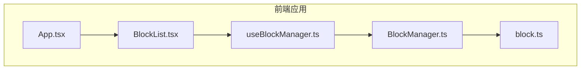
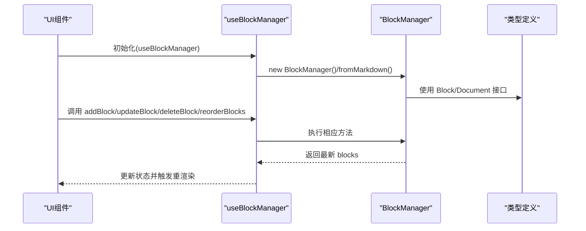
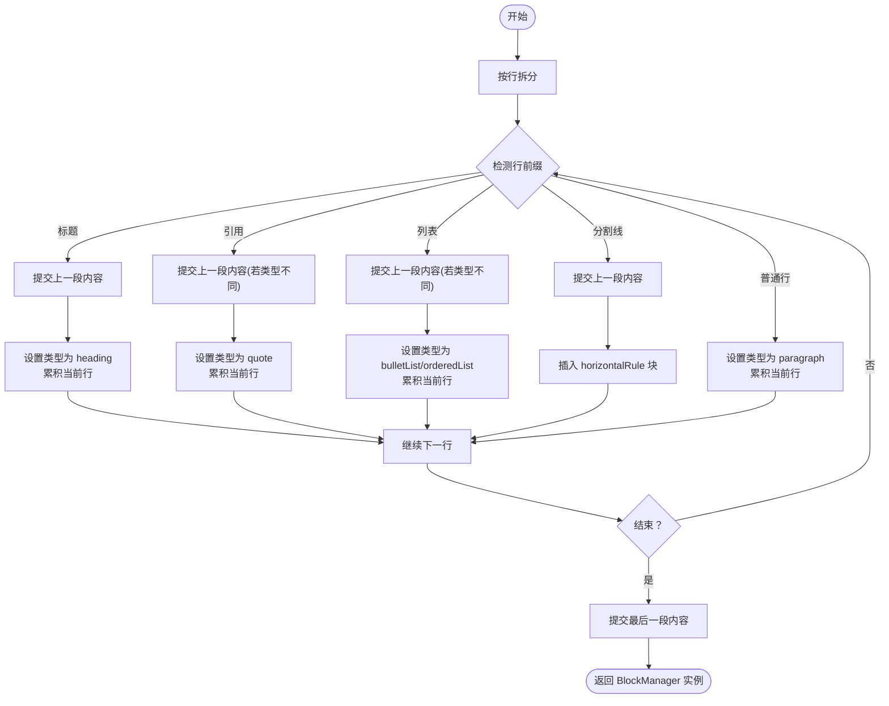
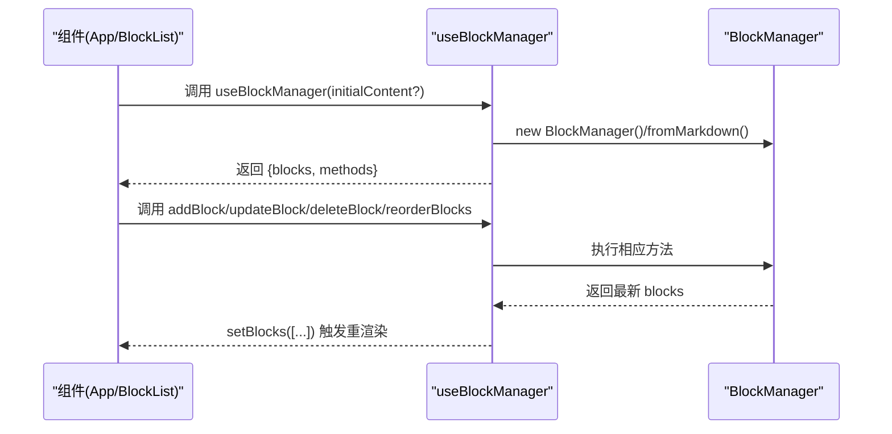
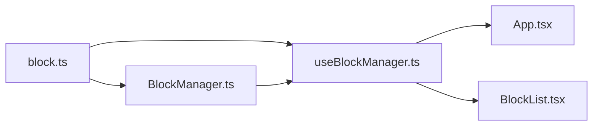
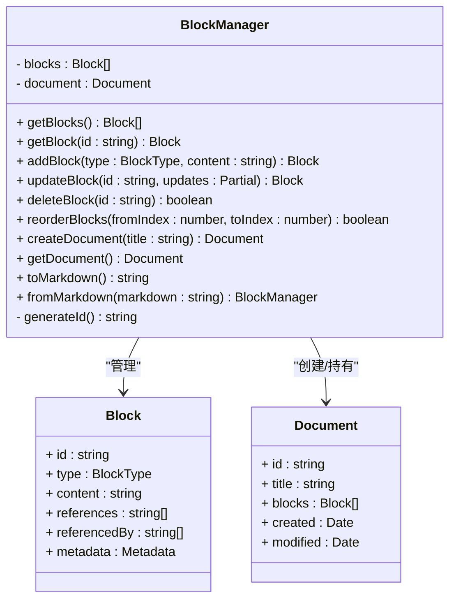

# BlockManager类详解

<cite>
**本文引用的文件**
- [src/utils/BlockManager.ts](file://src/utils/BlockManager.ts)
- [src/types/block.ts](file://src/types/block.ts)
- [src/hooks/useBlockManager.ts](file://src/hooks/useBlockManager.ts)
- [src/App.tsx](file://src/App.tsx)
- [src/components/BlockList.tsx](file://src/components/BlockList.tsx)
- [docs/开发方案.md](file://docs/开发方案.md)
</cite>

## 目录
1. [引言](#引言)
2. [项目结构](#项目结构)
3. [核心组件](#核心组件)
4. [架构总览](#架构总览)
5. [详细组件分析](#详细组件分析)
6. [依赖关系分析](#依赖关系分析)
7. [性能考量](#性能考量)
8. [故障排查指南](#故障排查指南)
9. [结论](#结论)
10. [附录](#附录)

## 引言
本文围绕 BlockManager 类进行深入剖析，系统阐述其作为核心业务逻辑层的角色与实现细节。BlockManager 负责内容块的增删改查、排序、序列化与反序列化；同时，它还维护内部的 blocks 数组与 document 对象，支撑编辑器的块级数据模型。本文将逐项解析 addBlock、deleteBlock、updateBlock、reorderBlocks、getBlocks、getBlock、createDocument、toMarkdown、fromMarkdown 等公共方法的实现逻辑与边界条件处理，并重点说明 fromMarkdown 静态方法如何将 Markdown 文本解析为结构化块序列，以及 toMarkdown 方法如何还原为标准 Markdown 格式。最后，本文将结合代码示例说明 BlockManager 在数据流中的位置：如何被 useBlockManager 实例化并驱动 UI 更新；并指出其当前仅在内存中管理状态，尚未持久化到文件系统，建议未来可扩展支持 Yjs 实现实时协作。

## 项目结构
该仓库采用“前端 + Electron”架构，核心业务逻辑集中在 utils/BlockManager.ts，类型定义位于 types/block.ts，UI 层通过 hooks/useBlockManager.ts 与组件交互，App.tsx 作为入口协调导出/导入与 UI 控件。

图表来源
- [src/App.tsx](file://src/App.tsx#L1-L156)
- [src/components/BlockList.tsx](file://src/components/BlockList.tsx#L1-L145)
- [src/hooks/useBlockManager.ts](file://src/hooks/useBlockManager.ts#L1-L97)
- [src/utils/BlockManager.ts](file://src/utils/BlockManager.ts#L1-L227)
- [src/types/block.ts](file://src/types/block.ts#L1-L30)

章节来源
- [src/App.tsx](file://src/App.tsx#L1-L156)
- [src/components/BlockList.tsx](file://src/components/BlockList.tsx#L1-L145)
- [src/hooks/useBlockManager.ts](file://src/hooks/useBlockManager.ts#L1-L97)
- [src/utils/BlockManager.ts](file://src/utils/BlockManager.ts#L1-L227)
- [src/types/block.ts](file://src/types/block.ts#L1-L30)

## 核心组件
- BlockManager：负责块集合与文档的管理，提供 CRUD、排序、序列化/反序列化能力。
- Block 与 Document 类型：定义块与文档的数据结构，包含 id、type、content、references、referencedBy、metadata 等字段。
- useBlockManager Hook：在 React 中实例化 BlockManager，暴露块列表与操作方法，驱动 UI 更新。
- App 与 BlockList：UI 层负责调用 useBlockManager 返回的方法，完成编辑、排序、导出/导入等交互。

章节来源
- [src/utils/BlockManager.ts](file://src/utils/BlockManager.ts#L1-L227)
- [src/types/block.ts](file://src/types/block.ts#L1-L30)
- [src/hooks/useBlockManager.ts](file://src/hooks/useBlockManager.ts#L1-L97)
- [src/App.tsx](file://src/App.tsx#L1-L156)
- [src/components/BlockList.tsx](file://src/components/BlockList.tsx#L1-L145)

## 架构总览
BlockManager 位于数据层，向上为 React Hooks 与组件提供统一的块操作接口；向下依赖类型定义与工具方法。整体数据流为：UI 通过 useBlockManager 调用 BlockManager 的方法，BlockManager 内部维护 blocks 与 document，最终由 UI 读取 blocks 并渲染。

图表来源
- [src/hooks/useBlockManager.ts](file://src/hooks/useBlockManager.ts#L1-L97)
- [src/utils/BlockManager.ts](file://src/utils/BlockManager.ts#L1-L227)
- [src/types/block.ts](file://src/types/block.ts#L1-L30)

## 详细组件分析

### BlockManager 类设计与职责
- 数据结构
  - blocks：Block[]，存储当前文档的所有块。
  - document：Document|null，当前文档的元信息与块集合快照。
- 关键职责
  - 块生命周期管理：addBlock、updateBlock、deleteBlock、getBlocks、getBlock。
  - 排序：reorderBlocks。
  - 文档管理：createDocument、getDocument。
  - 序列化与反序列化：toMarkdown、fromMarkdown。
  - 唯一 ID 生成：generateId。

章节来源
- [src/utils/BlockManager.ts](file://src/utils/BlockManager.ts#L1-L227)
- [src/types/block.ts](file://src/types/block.ts#L1-L30)

### Block 与 Document 数据结构
- Block 字段
  - id：块唯一标识（用于双链关联）
  - type：块类型，支持 heading、paragraph、quote、bulletList、orderedList、taskList、horizontalRule
  - content：存储 Markdown 源码（如 "# 标题" 或 "正文 [[链接]]"）
  - references：引用的其他块 ID（正向双链）
  - referencedBy：被引用的块 ID（反向双链）
  - metadata：元数据，包含 created、modified 等
- Document 字段
  - id、title、blocks、created、modified

章节来源
- [src/types/block.ts](file://src/types/block.ts#L1-L30)

### 方法实现与边界条件

#### getBlocks
- 行为：返回 blocks 的浅拷贝，避免外部直接修改内部状态。
- 边界：无参数，返回空数组时不会抛错。

章节来源
- [src/utils/BlockManager.ts](file://src/utils/BlockManager.ts#L12-L14)

#### getBlock
- 行为：根据 id 查找块，未找到返回 undefined。
- 边界：id 不存在时返回 undefined。

章节来源
- [src/utils/BlockManager.ts](file://src/utils/BlockManager.ts#L16-L19)

#### addBlock
- 行为：生成唯一 id，填充 type、content、references、referencedBy、metadata，追加到 blocks。
- 边界：content 默认为空字符串；references、referencedBy 默认为空数组；metadata.created/modified 设置为当前时间。

章节来源
- [src/utils/BlockManager.ts](file://src/utils/BlockManager.ts#L22-L37)

#### updateBlock
- 行为：查找匹配 id 的块，合并 updates，更新 metadata.modified。
- 边界：找不到 id 返回 null；updates 为空时仅返回原块但更新 modified 时间。

章节来源
- [src/utils/BlockManager.ts](file://src/utils/BlockManager.ts#L40-L55)

#### deleteBlock
- 行为：根据 id 删除块。
- 边界：id 不存在返回 false；删除成功返回 true。

章节来源
- [src/utils/BlockManager.ts](file://src/utils/BlockManager.ts#L58-L64)

#### reorderBlocks
- 行为：在 blocks 中移动块位置。
- 边界：fromIndex/toIndex 越界返回 false；否则执行 splice 操作并返回 true。

章节来源
- [src/utils/BlockManager.ts](file://src/utils/BlockManager.ts#L66-L76)

#### createDocument / getDocument
- 行为：createDocument 生成 Document 快照；getDocument 返回当前 document。
- 边界：createDocument 会复制当前 blocks 作为快照；getDocument 可能返回 null。

章节来源
- [src/utils/BlockManager.ts](file://src/utils/BlockManager.ts#L78-L93)

#### generateId
- 行为：生成形如 block_{timestamp}_{随机串} 的唯一 id。
- 边界：无显式长度限制，理论上冲突概率极低。

章节来源
- [src/utils/BlockManager.ts](file://src/utils/BlockManager.ts#L96-L98)

#### fromMarkdown（静态方法）
- 行为：将 Markdown 文本解析为块序列，识别标题、引用、列表、分割线与段落，分别生成对应类型的块。
- 解析流程要点
  - 按行扫描，检测行首标记决定当前块类型与内容拼接方式。
  - 遇到标题：先提交上一段内容，再切换类型为 heading。
  - 遇到引用：连续累积，类型为 quote。
  - 遇到列表：区分无序与有序，连续累积。
  - 遇到分割线：提交上一段内容，插入 horizontalRule 块。
  - 其他普通行：类型为 paragraph，累积内容。
  - 结束时提交最后一段内容。
- 边界与注意
  - 仅识别常见 Markdown 语法，不包含复杂表格、代码块等。
  - 引用与列表的连续性通过当前类型判断保证块的完整性。
  - 生成的块 content 仍为原始 Markdown 源码，便于后续渲染与导出。

图表来源
- [src/utils/BlockManager.ts](file://src/utils/BlockManager.ts#L101-L217)

章节来源
- [src/utils/BlockManager.ts](file://src/utils/BlockManager.ts#L101-L217)

#### toMarkdown
- 行为：将 blocks 的 content 按双换行连接为 Markdown 文本。
- 边界：对空 blocks 返回空字符串；对每条块 content 保持原样，不做额外格式化。

章节来源
- [src/utils/BlockManager.ts](file://src/utils/BlockManager.ts#L219-L223)

### 数据流与 UI 集成

#### useBlockManager 的实例化与状态驱动
- 初始化
  - 若传入 initialContent，则通过 BlockManager.fromMarkdown(initialContent) 构造初始块集合。
  - 否则构造空 BlockManager。
- 状态绑定
  - 将 blockManager.getBlocks() 作为初始状态，每次 BlockManager 的变更后通过 setBlocks([...blockManager.getBlocks()]) 触发 UI 重渲染。
- 暴露方法
  - updateBlock、addBlock、deleteBlock、reorderBlocks、getMarkdown、exportAsJSON、importFromJSON、blockManager。

图表来源
- [src/hooks/useBlockManager.ts](file://src/hooks/useBlockManager.ts#L1-L97)
- [src/utils/BlockManager.ts](file://src/utils/BlockManager.ts#L1-L227)

章节来源
- [src/hooks/useBlockManager.ts](file://src/hooks/useBlockManager.ts#L1-L97)
- [src/App.tsx](file://src/App.tsx#L1-L156)
- [src/components/BlockList.tsx](file://src/components/BlockList.tsx#L1-L145)

## 依赖关系分析
- BlockManager 依赖 Block、BlockType、Document 类型定义。
- useBlockManager 依赖 BlockManager 与 Block、BlockType 类型。
- App 与 BlockList 依赖 useBlockManager 的返回值，间接依赖 BlockManager。

图表来源
- [src/types/block.ts](file://src/types/block.ts#L1-L30)
- [src/utils/BlockManager.ts](file://src/utils/BlockManager.ts#L1-L227)
- [src/hooks/useBlockManager.ts](file://src/hooks/useBlockManager.ts#L1-L97)
- [src/App.tsx](file://src/App.tsx#L1-L156)
- [src/components/BlockList.tsx](file://src/components/BlockList.tsx#L1-L145)

章节来源
- [src/types/block.ts](file://src/types/block.ts#L1-L30)
- [src/utils/BlockManager.ts](file://src/utils/BlockManager.ts#L1-L227)
- [src/hooks/useBlockManager.ts](file://src/hooks/useBlockManager.ts#L1-L97)
- [src/App.tsx](file://src/App.tsx#L1-L156)
- [src/components/BlockList.tsx](file://src/components/BlockList.tsx#L1-L145)

## 性能考量
- fromMarkdown 解析为线性扫描，时间复杂度 O(n)，其中 n 为行数；空间复杂度 O(m)，m 为块数量。
- toMarkdown 为线性拼接，时间复杂度 O(m)。
- reorderBlocks 为数组 splice 操作，时间复杂度 O(k)，k 为移动距离。
- updateBlock 为对象合并与时间戳更新，时间复杂度 O(1)。
- getBlocks 返回浅拷贝，避免深拷贝开销。

[本节为通用性能讨论，无需列出具体文件来源]

## 故障排查指南
- 无法更新块
  - 检查 id 是否存在；updateBlock 在 id 不存在时返回 null。
  - 确认调用方是否正确使用 setBlocks([...blockManager.getBlocks()]) 触发重渲染。
- 删除失败
  - deleteBlock 在 id 不存在时返回 false；确认传入的 id 是否正确。
- 排序无效
  - reorderBlocks 在索引越界时返回 false；确认 fromIndex/toIndex 在合法范围内。
- 导入/导出异常
  - importFromJSON 会尝试解析 JSON 并清空现有块后重建；若 JSON 不符合预期结构，将返回 false。
  - exportAsJSON 输出包含 blocks 与 document；确保 BlockManager 已创建 document。

章节来源
- [src/utils/BlockManager.ts](file://src/utils/BlockManager.ts#L40-L55)
- [src/utils/BlockManager.ts](file://src/utils/BlockManager.ts#L58-L64)
- [src/utils/BlockManager.ts](file://src/utils/BlockManager.ts#L66-L76)
- [src/hooks/useBlockManager.ts](file://src/hooks/useBlockManager.ts#L61-L83)

## 结论
BlockManager 以简洁的数据结构与清晰的方法划分，承担了块编辑器的核心数据管理职责。其 fromMarkdown 与 toMarkdown 方法实现了与 Markdown 的良好互操作，配合 useBlockManager 在 React 中提供了稳定的 UI 驱动机制。当前实现为内存态管理，适合快速迭代与原型验证；未来可扩展支持本地持久化与实时协作（如 Yjs），以满足更复杂的工作流与多人协作需求。

[本节为总结性内容，无需列出具体文件来源]

## 附录

### BlockManager 类图

图表来源
- [src/utils/BlockManager.ts](file://src/utils/BlockManager.ts#L1-L227)
- [src/types/block.ts](file://src/types/block.ts#L1-L30)

### 开发方案中的双链预留
- 开发方案文档中预留了 references 与 referencedBy 字段，以及 BlockReferenceManager 接口，为后续双链功能提供扩展空间。

章节来源
- [docs/开发方案.md](file://docs/开发方案.md#L124-L163)