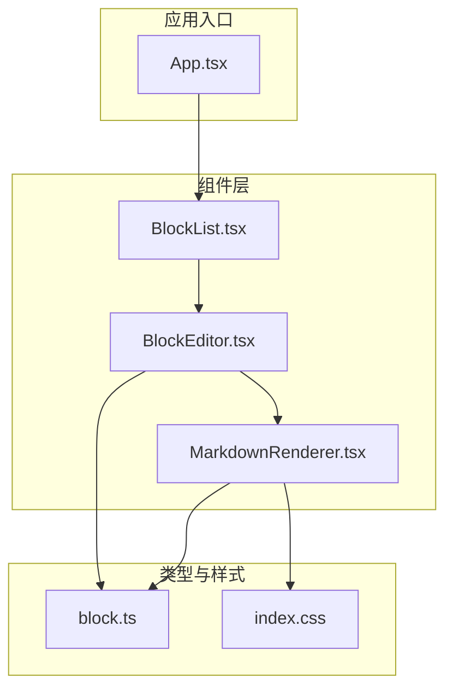
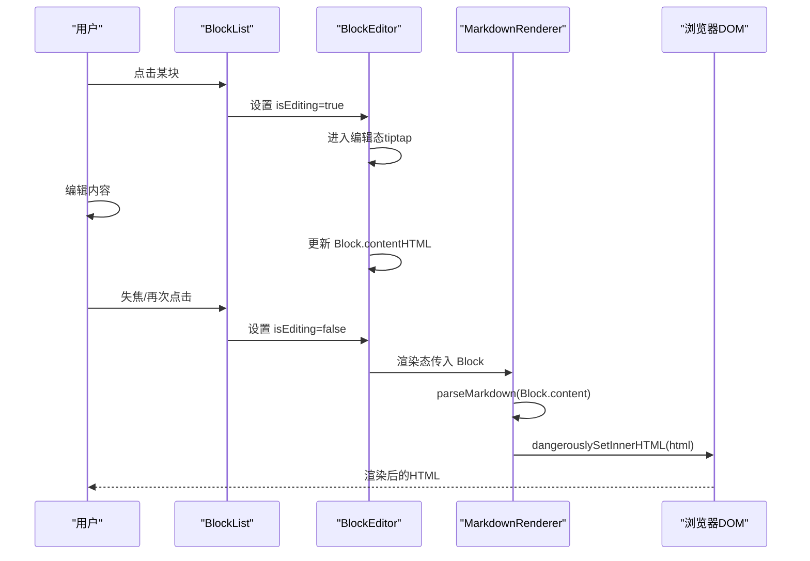
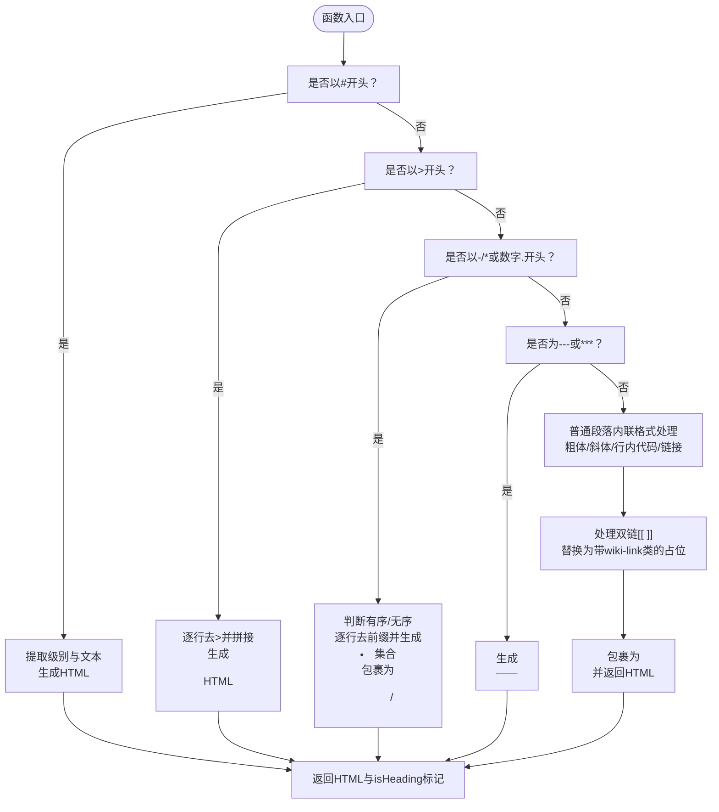
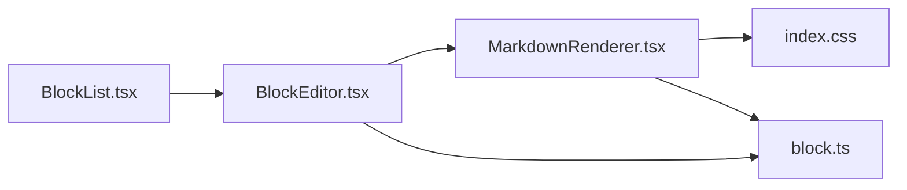

# MarkdownRenderer组件解析

<cite>
**本文引用的文件**
- [MarkdownRenderer.tsx](file://src/components/MarkdownRenderer.tsx)
- [BlockEditor.tsx](file://src/components/BlockEditor.tsx)
- [BlockList.tsx](file://src/components/BlockList.tsx)
- [block.ts](file://src/types/block.ts)
- [index.css](file://src/index.css)
- [App.tsx](file://src/App.tsx)
</cite>

## 目录
1. [简介](#简介)
2. [项目结构](#项目结构)
3. [核心组件](#核心组件)
4. [架构总览](#架构总览)
5. [详细组件分析](#详细组件分析)
6. [依赖关系分析](#依赖关系分析)
7. [性能考量](#性能考量)
8. [故障排查指南](#故障排查指南)
9. [结论](#结论)
10. [附录](#附录)

## 简介
本文件围绕 MarkdownRenderer 组件展开，系统性阐述其作为“预览层”的核心职责：将存储在 Block.content 中的 Markdown 源码安全地转换为 HTML 并渲染展示；解析 parseMarkdown 函数如何识别标题、引用、列表、分割线等元素并生成对应 HTML 字符串；重点说明双链语法 [[ ]] 的处理机制（通过正则匹配与替换为带 wiki-link 样式的可点击占位元素）；解释内联 style 标签如何定义预览样式以保证与编辑器视觉一致；讨论 dangerouslySetInnerHTML 的使用场景与潜在 XSS 风险，并提出引入 DOMPurify 等库进行 HTML 净化的建议；最后逐条说明关键 CSS 规则的作用，如 blockquote 左侧边框、列表缩进等，确保渲染效果符合 Markdown 规范。

## 项目结构
MarkdownRenderer 所在的模块位于 src/components 下，配合 BlockEditor、BlockList、Block 类型定义以及全局样式 index.css 协同工作。整体采用“编辑态-渲染态”双态切换：编辑态由 tiptap 提供富文本能力，渲染态由 MarkdownRenderer 负责将 Markdown 源码转为 HTML 展示。

图表来源
- [BlockList.tsx](file://src/components/BlockList.tsx#L64-L93)
- [BlockEditor.tsx](file://src/components/BlockEditor.tsx#L23-L113)
- [MarkdownRenderer.tsx](file://src/components/MarkdownRenderer.tsx#L76-L122)
- [block.ts](file://src/types/block.ts#L1-L18)
- [index.css](file://src/index.css#L120-L196)

章节来源
- [BlockList.tsx](file://src/components/BlockList.tsx#L64-L93)
- [BlockEditor.tsx](file://src/components/BlockEditor.tsx#L23-L113)
- [MarkdownRenderer.tsx](file://src/components/MarkdownRenderer.tsx#L76-L122)
- [block.ts](file://src/types/block.ts#L1-L18)
- [index.css](file://src/index.css#L120-L196)

## 核心组件
- MarkdownRenderer：负责将 Block.content 中的 Markdown 源码解析为 HTML，并通过 dangerouslySetInnerHTML 渲染到页面；同时内置内联样式以保证与编辑器一致的视觉表现。
- BlockEditor：在编辑态使用 tiptap 编辑器，渲染态委托给 MarkdownRenderer；通过 isEditing 状态控制编辑/渲染切换。
- BlockList：维护块列表的拖拽排序与交互，内部持有编辑态块 ID，驱动 BlockEditor 的渲染与切换。
- Block 类型：统一描述块的 id、type、content、references 等字段，content 存储 Markdown 源码。

章节来源
- [MarkdownRenderer.tsx](file://src/components/MarkdownRenderer.tsx#L76-L122)
- [BlockEditor.tsx](file://src/components/BlockEditor.tsx#L23-L113)
- [BlockList.tsx](file://src/components/BlockList.tsx#L12-L21)
- [block.ts](file://src/types/block.ts#L1-L18)

## 架构总览
MarkdownRenderer 在渲染态承担“从 Markdown 到 HTML”的转换职责，其调用链如下：

图表来源
- [BlockList.tsx](file://src/components/BlockList.tsx#L18-L24)
- [BlockEditor.tsx](file://src/components/BlockEditor.tsx#L23-L113)
- [MarkdownRenderer.tsx](file://src/components/MarkdownRenderer.tsx#L76-L122)

## 详细组件分析

### MarkdownRenderer 组件职责与实现
- 输入：Block 对象，包含 id、type、content、references 等字段；其中 content 存储 Markdown 源码。
- 输出：渲染态下的 HTML 字符串，通过 dangerouslySetInnerHTML 注入到 .markdown-content 容器。
- 样式：组件内联 style 定义了标题、段落、引用、列表、分割线、代码、链接、wiki-link 等规则，确保与编辑器一致的视觉体验。
- 交互：外层容器支持点击触发 onEdit 回调，实现编辑态切换。

章节来源
- [MarkdownRenderer.tsx](file://src/components/MarkdownRenderer.tsx#L76-L122)
- [block.ts](file://src/types/block.ts#L1-L18)

### parseMarkdown 函数解析逻辑
该函数根据首字符或正则匹配判断 Markdown 结构，分别处理标题、引用、列表、分割线与普通段落。对于普通段落，进一步执行内联格式处理（粗体、斜体、行内代码、链接），并对双链语法 [[ ]] 进行替换，最终包裹为段落标签返回。

图表来源
- [MarkdownRenderer.tsx](file://src/components/MarkdownRenderer.tsx#L9-L74)

章节来源
- [MarkdownRenderer.tsx](file://src/components/MarkdownRenderer.tsx#L9-L74)

### 双链语法 [[ ]] 的处理机制
- 匹配策略：使用正则对形如 [[文本]] 的片段进行全局匹配。
- 替换策略：将匹配到的内容替换为带 wiki-link 类名的 span 元素，保留原始文本以便后续点击跳转或高亮。
- 样式策略：通过内联 style 与全局 index.css 中的 .wiki-link 规则，赋予双链背景色、圆角、颜色等视觉提示。
- 注意事项：当前实现仅做占位替换，未生成可点击链接；若需实现点击跳转，可在上层组件或路由层绑定点击事件并解析 wiki-link 内容。

章节来源
- [MarkdownRenderer.tsx](file://src/components/MarkdownRenderer.tsx#L66-L71)
- [MarkdownRenderer.tsx](file://src/components/MarkdownRenderer.tsx#L112-L119)
- [index.css](file://src/index.css#L191-L196)

### 内联 style 标签与预览样式一致性
- 目标：确保渲染态与编辑态在字体大小、间距、边框、缩进等方面保持一致。
- 关键规则：
  - 标题层级：h1~h6 的字号与外边距与编辑器一致。
  - 段落：p 的上下边距统一。
  - 引用：blockquote 左侧 4px 实线边框、左侧内边距、颜色灰度。
  - 列表：ul/ol 的外边距与左侧内边距，li 的上下边距。
  - 分割线：hr 的顶部边框与上下边距。
  - 代码：code 的背景、内边距、圆角、等宽字体。
  - 链接：a 的颜色与悬停下划线。
  - 双链：.wiki-link 的背景、内边距、圆角、颜色。
- 位置：MarkdownRenderer 内联 style 与全局 index.css 同时覆盖，优先级由 CSS 选择器决定。

章节来源
- [MarkdownRenderer.tsx](file://src/components/MarkdownRenderer.tsx#L88-L119)
- [index.css](file://src/index.css#L120-L196)

### dangerouslySetInnerHTML 的使用场景与风险
- 使用场景：将 parseMarkdown 生成的 HTML 字符串直接注入到 DOM，避免手动拼接节点带来的复杂性与错误。
- 潜在风险：若 content 来自不受信任来源，可能包含恶意脚本，导致 XSS 攻击。
- 风险缓解建议：
  - 引入 DOMPurify 等库对 HTML 进行净化，移除危险标签与属性后再注入。
  - 在服务端或导入阶段对 Markdown 源码进行白名单校验与清理。
  - 限制可执行脚本的来源与协议，严格遵守 CSP 策略。

章节来源
- [MarkdownRenderer.tsx](file://src/components/MarkdownRenderer.tsx#L84-L87)

### 与 BlockEditor/BlockList 的协作
- BlockList 维护编辑态块 ID，控制 BlockEditor 的渲染与切换。
- BlockEditor 在编辑态使用 tiptap，渲染态委托 MarkdownRenderer。
- MarkdownRenderer 仅消费 Block.content，不关心编辑器内部实现细节。

章节来源
- [BlockList.tsx](file://src/components/BlockList.tsx#L18-L24)
- [BlockEditor.tsx](file://src/components/BlockEditor.tsx#L23-L113)
- [MarkdownRenderer.tsx](file://src/components/MarkdownRenderer.tsx#L76-L87)

## 依赖关系分析
- 组件依赖
  - MarkdownRenderer 依赖 Block 类型定义，读取 content 字段。
  - MarkdownRenderer 依赖全局样式 index.css 中的通用规则与 .wiki-link。
  - BlockEditor 依赖 MarkdownRenderer 进行渲染态展示。
  - BlockList 依赖 BlockEditor 控制编辑/渲染切换。
- 数据流
  - BlockList -> BlockEditor：传递 block、isEditing、onToggleEdit。
  - BlockEditor -> MarkdownRenderer：传递 block、onEdit。
  - MarkdownRenderer -> DOM：通过 dangerouslySetInnerHTML 注入 HTML。

图表来源
- [BlockList.tsx](file://src/components/BlockList.tsx#L64-L93)
- [BlockEditor.tsx](file://src/components/BlockEditor.tsx#L23-L113)
- [MarkdownRenderer.tsx](file://src/components/MarkdownRenderer.tsx#L76-L122)
- [block.ts](file://src/types/block.ts#L1-L18)
- [index.css](file://src/index.css#L120-L196)

章节来源
- [BlockList.tsx](file://src/components/BlockList.tsx#L64-L93)
- [BlockEditor.tsx](file://src/components/BlockEditor.tsx#L23-L113)
- [MarkdownRenderer.tsx](file://src/components/MarkdownRenderer.tsx#L76-L122)
- [block.ts](file://src/types/block.ts#L1-L18)
- [index.css](file://src/index.css#L120-L196)

## 性能考量
- 正则替换成本：parseMarkdown 对普通段落执行多次 replace 操作，建议在高频场景下：
  - 合并正则或使用一次遍历完成多格式处理。
  - 对超长内容分段处理，避免一次性大字符串操作。
- HTML 注入成本：dangerouslySetInnerHTML 会触发浏览器重排/重绘，建议：
  - 仅在 content 变化时更新，避免不必要的重复渲染。
  - 对长文档采用虚拟滚动或分页策略减少一次性渲染量。
- 样式计算：内联 style 会在每次渲染时插入样式节点，建议：
  - 将常用样式迁移到全局 CSS，减少内联 style 的注入频率。
  - 使用 CSS Modules 或原子化样式框架降低样式冲突与重算。

## 故障排查指南
- 渲染空白或异常
  - 检查 Block.content 是否为空或包含不可见字符。
  - 确认 parseMarkdown 返回的 HTML 是否为空字符串。
- 样式错乱
  - 检查全局 index.css 与内联 style 的优先级与覆盖关系。
  - 确认 .markdown-content 选择器是否正确匹配。
- 双链不可点击
  - 当前实现仅占位替换，需在上层组件绑定点击事件解析 wiki-link 内容。
- XSS 风险
  - 若 content 来自外部输入，务必引入 DOMPurify 进行净化后再注入。
- 编辑态与渲染态切换异常
  - 检查 BlockList 的 editingBlockId 状态与 BlockEditor 的 isEditing 传递是否一致。

章节来源
- [MarkdownRenderer.tsx](file://src/components/MarkdownRenderer.tsx#L76-L122)
- [BlockEditor.tsx](file://src/components/BlockEditor.tsx#L23-L113)
- [BlockList.tsx](file://src/components/BlockList.tsx#L18-L24)
- [index.css](file://src/index.css#L120-L196)

## 结论
MarkdownRenderer 作为预览层的核心组件，承担着将 Markdown 源码转换为 HTML 的关键职责。其通过 parseMarkdown 函数实现了标题、引用、列表、分割线与内联格式的识别与转换，并以内联 style 与全局样式保证渲染一致性。双链语法 [[ ]] 当前以占位形式呈现，具备扩展为可点击链接的基础。dangerouslySetInnerHTML 的使用提升了灵活性，但也引入了 XSS 风险，建议引入 DOMPurify 等净化库。整体架构清晰，编辑态与渲染态分离良好，便于后续扩展与优化。

## 附录
- 关键 CSS 规则说明（节选）
  - 标题：h1~h6 的字号与外边距与编辑器一致，确保层级感。
  - 引用：blockquote 左侧 4px 实线边框、左侧内边距与颜色，突出引用语义。
  - 列表：ul/ol 的外边距与左侧内边距，li 的上下边距，形成清晰的层次。
  - 分割线：hr 的顶部边框与上下边距，用于段落间分隔。
  - 代码：code 的背景、内边距、圆角与等宽字体，强调行内代码。
  - 链接：a 的颜色与悬停下划线，提升可点击性。
  - 双链：.wiki-link 的背景、内边距、圆角与颜色，增强可识别性。

章节来源
- [MarkdownRenderer.tsx](file://src/components/MarkdownRenderer.tsx#L88-L119)
- [index.css](file://src/index.css#L120-L196)