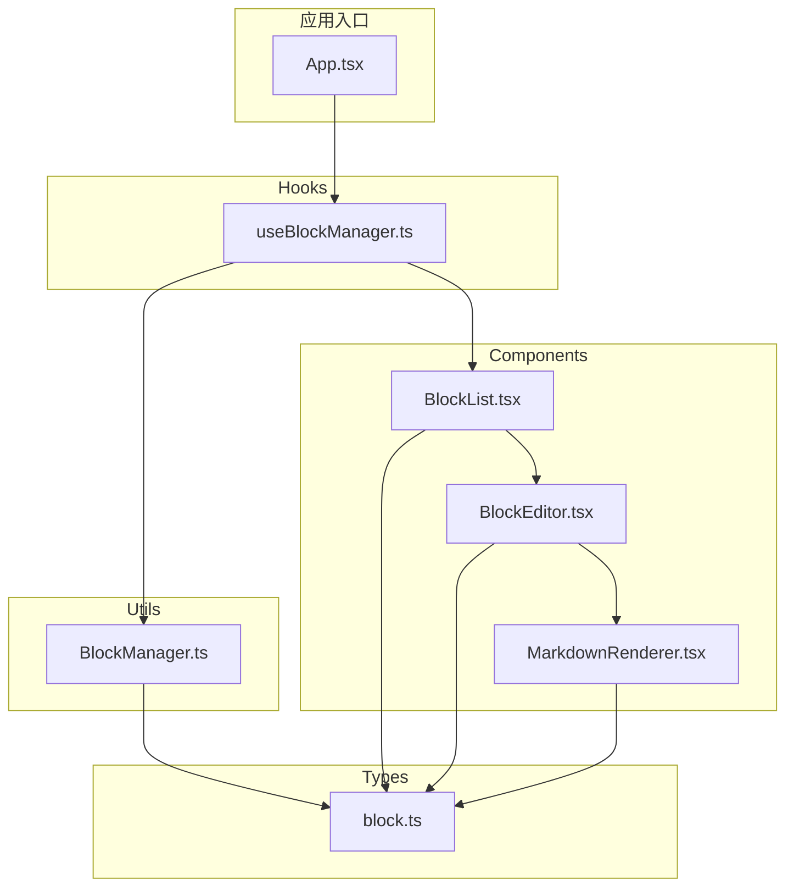
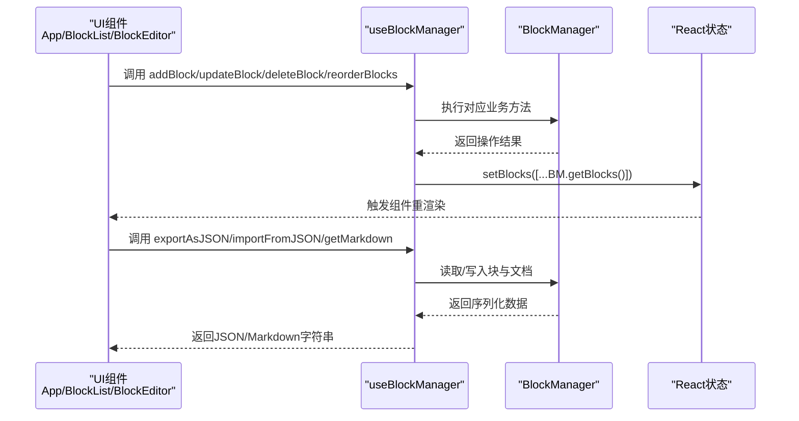
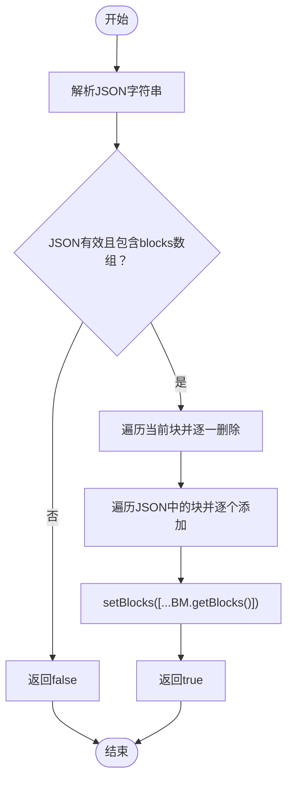
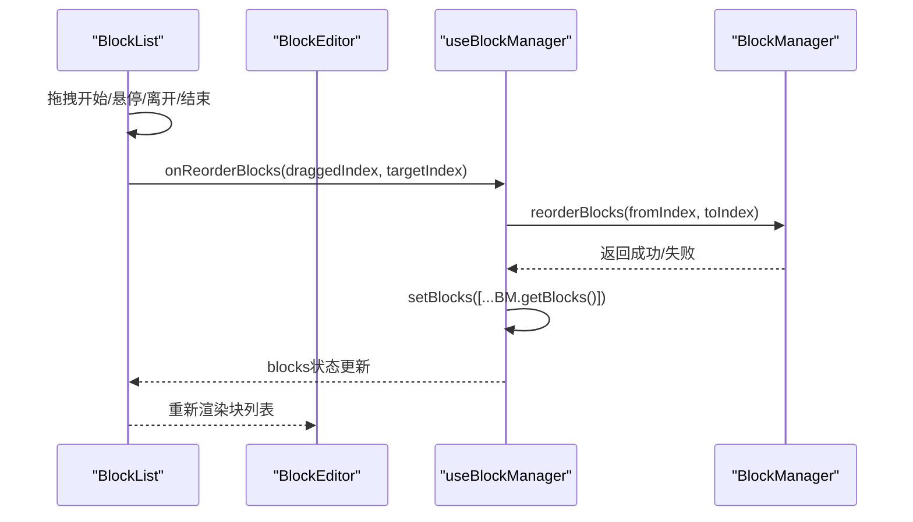
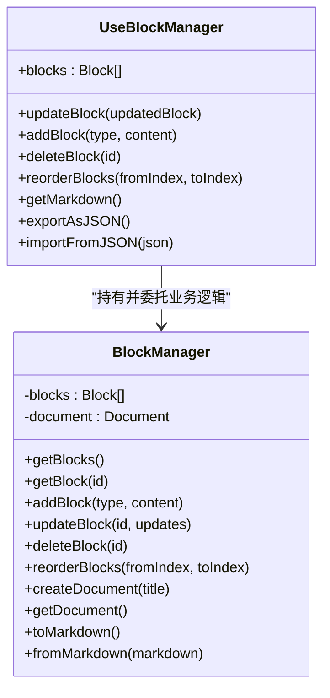
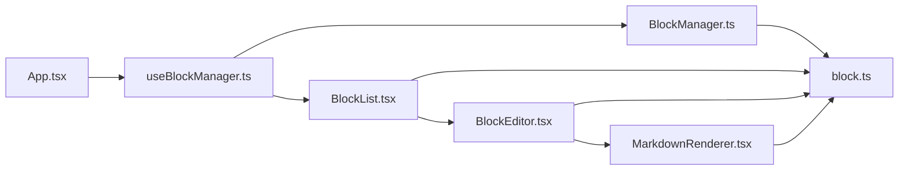

# useBlockManager Hook设计

<cite>
**本文引用的文件**
- [useBlockManager.ts](file://src/hooks/useBlockManager.ts)
- [BlockManager.ts](file://src/utils/BlockManager.ts)
- [App.tsx](file://src/App.tsx)
- [BlockList.tsx](file://src/components/BlockList.tsx)
- [BlockEditor.tsx](file://src/components/BlockEditor.tsx)
- [MarkdownRenderer.tsx](file://src/components/MarkdownRenderer.tsx)
- [block.ts](file://src/types/block.ts)
</cite>

## 目录
1. [引言](#引言)
2. [项目结构](#项目结构)
3. [核心组件](#核心组件)
4. [架构总览](#架构总览)
5. [详细组件分析](#详细组件分析)
6. [依赖关系分析](#依赖关系分析)
7. [性能考量](#性能考量)
8. [故障排查指南](#故障排查指南)
9. [结论](#结论)
10. [附录](#附录)

## 引言
本文件围绕 useBlockManager 自定义 Hook 的架构作用与实现细节展开，重点阐释其作为“UI 组件与底层 BlockManager 业务逻辑之间的桥梁”职责。该 Hook 通过 useState 初始化 BlockManager 实例，借助 useCallback 保证 updateBlock、addBlock、deleteBlock、reorderBlocks 等回调函数的引用稳定性，从而避免不必要的组件重渲染；同时，它将 blocks 状态暴露给 BlockList 组件驱动渲染，并提供 exportAsJSON 与 importFromJSON 方法实现数据的序列化与恢复。本文还分析依赖数组 [blockManager] 的必要性，确保回调始终引用最新实例；并给出 App 组件的实际消费示例，强调该 Hook 如何封装复杂业务逻辑，使 UI 组件保持简洁与可测试。

## 项目结构
本项目采用“功能分层 + 类型定义”的组织方式：
- hooks 层：集中存放自定义 Hook，useBlockManager 即位于此处
- utils 层：存放业务实体类，BlockManager 位于此处
- components 层：UI 组件，包括 BlockList、BlockEditor、MarkdownRenderer
- types 层：类型定义，block.ts 提供 Block 与 Document 的接口
- 应用入口：App.tsx 消费 useBlockManager 并向下传递状态与操作方法

图表来源
- [App.tsx](file://src/App.tsx#L1-L156)
- [useBlockManager.ts](file://src/hooks/useBlockManager.ts#L1-L97)
- [BlockManager.ts](file://src/utils/BlockManager.ts#L1-L227)
- [BlockList.tsx](file://src/components/BlockList.tsx#L1-L145)
- [BlockEditor.tsx](file://src/components/BlockEditor.tsx#L1-L116)
- [MarkdownRenderer.tsx](file://src/components/MarkdownRenderer.tsx#L1-L125)
- [block.ts](file://src/types/block.ts#L1-L30)

章节来源
- [App.tsx](file://src/App.tsx#L1-L156)
- [useBlockManager.ts](file://src/hooks/useBlockManager.ts#L1-L97)
- [BlockManager.ts](file://src/utils/BlockManager.ts#L1-L227)
- [BlockList.tsx](file://src/components/BlockList.tsx#L1-L145)
- [BlockEditor.tsx](file://src/components/BlockEditor.tsx#L1-L116)
- [MarkdownRenderer.tsx](file://src/components/MarkdownRenderer.tsx#L1-L125)
- [block.ts](file://src/types/block.ts#L1-L30)

## 核心组件
- useBlockManager：负责初始化 BlockManager、维护 blocks 状态、提供 CRUD 与排序操作、导出/导入能力，并通过 useCallback 保证回调引用稳定
- BlockManager：封装块集合的增删改查、重新排序、从 Markdown 解析、转 Markdown 等核心业务逻辑
- BlockList：接收 blocks 与回调，负责渲染块列表、处理拖拽排序、触发新增块
- BlockEditor：基于 tiptap 的编辑器，负责编辑态与渲染态切换、内容变更回传
- MarkdownRenderer：在非编辑态下对块内容进行 Markdown 到 HTML 的简单渲染
- Block/Document 类型：定义块与文档的数据结构

章节来源
- [useBlockManager.ts](file://src/hooks/useBlockManager.ts#L1-L97)
- [BlockManager.ts](file://src/utils/BlockManager.ts#L1-L227)
- [BlockList.tsx](file://src/components/BlockList.tsx#L1-L145)
- [BlockEditor.tsx](file://src/components/BlockEditor.tsx#L1-L116)
- [MarkdownRenderer.tsx](file://src/components/MarkdownRenderer.tsx#L1-L125)
- [block.ts](file://src/types/block.ts#L1-L30)

## 架构总览
useBlockManager 将 UI 与业务解耦的关键在于：
- 状态与逻辑分离：blocks 仅作为视图状态，业务逻辑集中在 BlockManager
- 回调引用稳定：通过 useCallback 包裹操作函数，依赖数组固定为 [blockManager]，确保每次回调都引用最新实例
- 数据流单向：UI 通过回调触发业务逻辑，业务逻辑更新 BlockManager，再由 Hook 同步到 blocks 状态，最终驱动渲染

图表来源
- [useBlockManager.ts](file://src/hooks/useBlockManager.ts#L1-L97)
- [BlockManager.ts](file://src/utils/BlockManager.ts#L1-L227)
- [BlockList.tsx](file://src/components/BlockList.tsx#L1-L145)
- [BlockEditor.tsx](file://src/components/BlockEditor.tsx#L1-L116)
- [App.tsx](file://src/App.tsx#L1-L156)

## 详细组件分析

### useBlockManager Hook 设计要点
- 初始化策略
  - 通过 useState 惰性初始化 BlockManager 实例，支持从 Markdown 字符串直接构建初始块集合
  - 同时初始化本地 blocks 状态，来源于 blockManager.getBlocks()
- 回调函数稳定性
  - 所有操作函数均通过 useCallback 包裹，依赖数组为 [blockManager]，确保回调引用随实例变化而更新，避免闭包捕获旧实例导致的逻辑错误
- 状态同步机制
  - 每次业务操作后，通过 setBlocks([...blockManager.getBlocks()]) 将最新块集合同步到 React 状态，驱动 UI 重渲染
- 数据导出与导入
  - exportAsJSON：将当前块集合与文档信息序列化为 JSON 字符串
  - importFromJSON：解析 JSON，清空现有块并逐个重建，最后同步到 blocks 状态；包含错误处理与返回值
- 返回值设计
  - 返回 blocks 与全部操作方法，便于上层组件直接消费

章节来源
- [useBlockManager.ts](file://src/hooks/useBlockManager.ts#L1-L97)

### BlockManager 业务逻辑
- 块集合管理
  - addBlock：生成唯一 ID，填充元数据，追加到集合
  - updateBlock：根据 id 查找并合并更新，更新修改时间
  - deleteBlock：根据 id 删除，返回布尔结果
  - getBlocks/getBlock：提供只读副本与按 id 查询
- 排序与文档
  - reorderBlocks：边界校验后执行移动
  - createDocument/getDocument：文档对象的创建与查询
- Markdown 解析与导出
  - fromMarkdown：按行解析标题、引用、列表、分割线等，生成块集合
  - toMarkdown：将块内容拼接为 Markdown 文本

章节来源
- [BlockManager.ts](file://src/utils/BlockManager.ts#L1-L227)

### BlockList 与 BlockEditor 的协作
- BlockList
  - 接收 blocks 与回调，负责渲染块列表、处理拖拽事件、触发新增块
  - 通过 props 将 onUpdateBlock、onAddBlock、onReorderBlocks 传递给子组件
- BlockEditor
  - 基于 tiptap，根据 isEditing 控制编辑器可编辑性
  - 在编辑态通过 editor.getHTML() 获取内容，调用 onUpdate 将变更回传给父级
  - 非编辑态使用 MarkdownRenderer 渲染块内容，并提供点击进入编辑态的交互

章节来源
- [BlockList.tsx](file://src/components/BlockList.tsx#L1-L145)
- [BlockEditor.tsx](file://src/components/BlockEditor.tsx#L1-L116)
- [MarkdownRenderer.tsx](file://src/components/MarkdownRenderer.tsx#L1-L125)

### 数据模型与类型约束
- Block：包含 id、type、content、references、referencedBy、metadata 等字段
- Document：包含 id、title、blocks、created、modified 等字段
- BlockType：枚举多种块类型，用于统一约束

章节来源
- [block.ts](file://src/types/block.ts#L1-L30)

### 关键流程图：importFromJSON 的实现

图表来源
- [useBlockManager.ts](file://src/hooks/useBlockManager.ts#L61-L83)

### 关键流程图：拖拽排序在 UI 中的流转

图表来源
- [BlockList.tsx](file://src/components/BlockList.tsx#L1-L145)
- [useBlockManager.ts](file://src/hooks/useBlockManager.ts#L39-L46)
- [BlockManager.ts](file://src/utils/BlockManager.ts#L66-L76)

### 关键类图：useBlockManager 与 BlockManager 的关系

图表来源
- [useBlockManager.ts](file://src/hooks/useBlockManager.ts#L1-L97)
- [BlockManager.ts](file://src/utils/BlockManager.ts#L1-L227)

## 依赖关系分析
- 组件耦合
  - App 通过 useBlockManager 获取状态与操作方法，向下传递给 BlockList
  - BlockList 仅依赖 props，不直接访问 BlockManager，降低耦合度
  - BlockEditor 仅依赖 Block 与回调，不感知业务层
- 外部依赖
  - tiptap 生态用于富文本编辑
  - React Hooks 用于状态与副作用管理
- 循环依赖
  - 未发现循环依赖：Hook -> Utils -> Components -> Types 的单向依赖链

图表来源
- [App.tsx](file://src/App.tsx#L1-L156)
- [useBlockManager.ts](file://src/hooks/useBlockManager.ts#L1-L97)
- [BlockManager.ts](file://src/utils/BlockManager.ts#L1-L227)
- [BlockList.tsx](file://src/components/BlockList.tsx#L1-L145)
- [BlockEditor.tsx](file://src/components/BlockEditor.tsx#L1-L116)
- [MarkdownRenderer.tsx](file://src/components/MarkdownRenderer.tsx#L1-L125)
- [block.ts](file://src/types/block.ts#L1-L30)

章节来源
- [App.tsx](file://src/App.tsx#L1-L156)
- [useBlockManager.ts](file://src/hooks/useBlockManager.ts#L1-L97)
- [BlockManager.ts](file://src/utils/BlockManager.ts#L1-L227)
- [BlockList.tsx](file://src/components/BlockList.tsx#L1-L145)
- [BlockEditor.tsx](file://src/components/BlockEditor.tsx#L1-L116)
- [MarkdownRenderer.tsx](file://src/components/MarkdownRenderer.tsx#L1-L125)
- [block.ts](file://src/types/block.ts#L1-L30)

## 性能考量
- useCallback 的必要性
  - 依赖数组固定为 [blockManager]，确保回调始终引用最新实例，避免因闭包捕获旧实例导致的状态不一致
  - 对频繁触发的交互（如拖拽、编辑）尤为关键，减少不必要的重渲染
- 状态同步策略
  - setBlocks([...BM.getBlocks()]) 通过浅拷贝创建新数组，触发 React 比较，仅在引用变化时重渲染
- 业务计算位置
  - 所有业务逻辑集中在 BlockManager，避免在 UI 层重复计算，提升可维护性与性能

章节来源
- [useBlockManager.ts](file://src/hooks/useBlockManager.ts#L1-L97)
- [BlockManager.ts](file://src/utils/BlockManager.ts#L1-L227)

## 故障排查指南
- 导入 JSON 失败
  - 现象：importFromJSON 返回 false，控制台打印错误日志
  - 排查：确认 JSON 结构包含 blocks 数组；检查 JSON 语法是否正确；查看异常堆栈
- 拖拽排序无效
  - 现象：拖拽后 blocks 未变化
  - 排查：确认 onReorderBlocks 已正确传递至 BlockList；检查 fromIndex/toIndex 是否越界；确认 block.id 唯一
- 编辑态无法切换
  - 现象：点击块无法进入编辑态或失焦后不回退
  - 排查：确认 BlockEditor 的 isEditing 与 onToggleEdit 传递正确；检查 tiptap 编辑器初始化与命令调用

章节来源
- [useBlockManager.ts](file://src/hooks/useBlockManager.ts#L61-L83)
- [BlockList.tsx](file://src/components/BlockList.tsx#L1-L145)
- [BlockEditor.tsx](file://src/components/BlockEditor.tsx#L1-L116)

## 结论
useBlockManager 通过“状态与逻辑分离 + 回调引用稳定 + 明确的数据流”实现了 UI 与业务的高内聚低耦合。它将复杂业务封装在 BlockManager 中，使 UI 组件（App、BlockList、BlockEditor）保持简洁、可测试与可演进。依赖数组 [blockManager] 的设计确保了回调函数始终指向最新实例，避免了闭包陷阱带来的潜在问题。exportAsJSON 与 importFromJSON 为数据持久化与迁移提供了基础能力，配合 App 的导出/导入按钮，形成完整的数据生命周期闭环。

## 附录

### 实际调用示例：App 组件如何消费 useBlockManager
- 初始化与状态消费
  - App 将 initialContent 传入 useBlockManager，获得 blocks 与操作方法
  - 将 blocks 与回调传递给 BlockList，实现双向绑定
- 导出/导入
  - 导出 Markdown：调用 getMarkdown，生成 Blob 并触发下载
  - 导出 JSON：调用 exportAsJSON，生成 Blob 并触发下载
  - 导入文件：FileReader 读取文件内容，根据扩展名选择 importFromJSON 或刷新页面重新初始化

章节来源
- [App.tsx](file://src/App.tsx#L1-L156)
- [useBlockManager.ts](file://src/hooks/useBlockManager.ts#L1-L97)