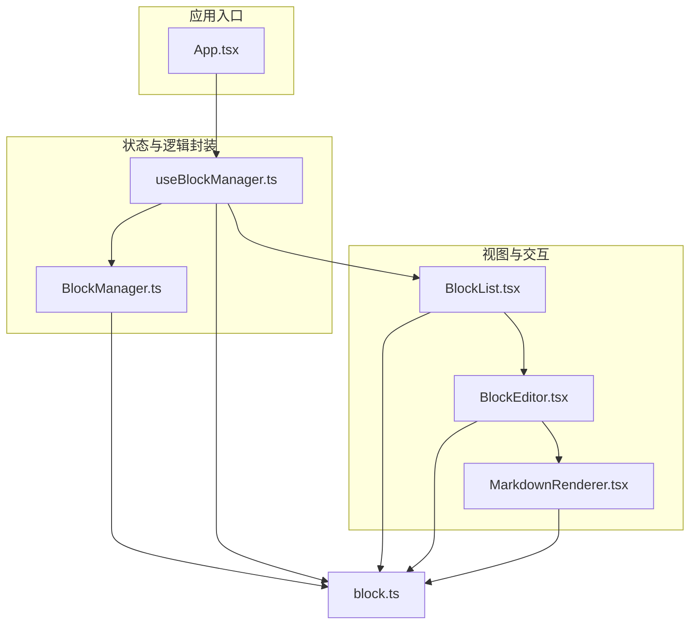
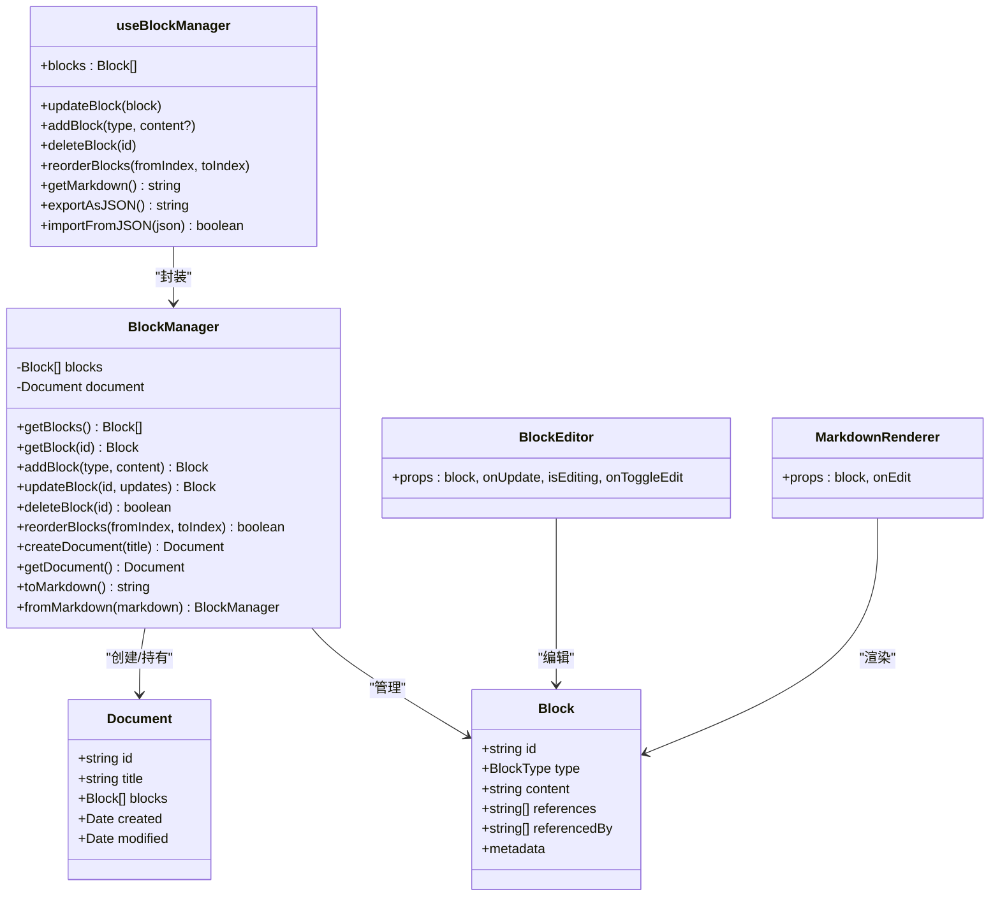
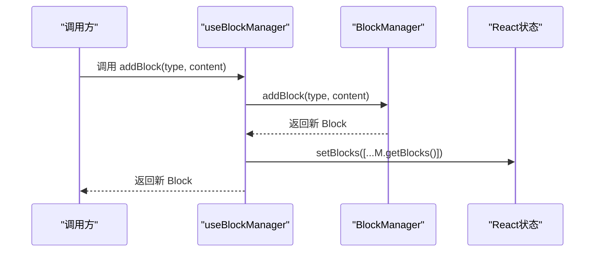
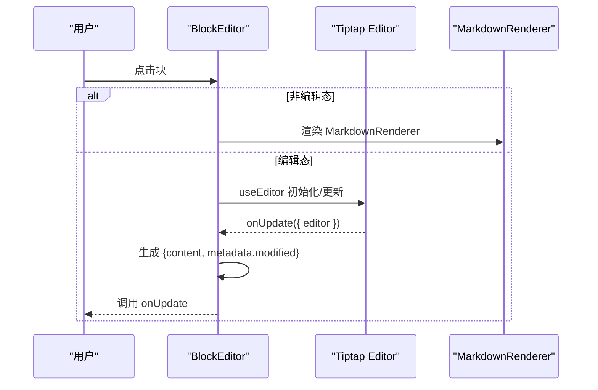
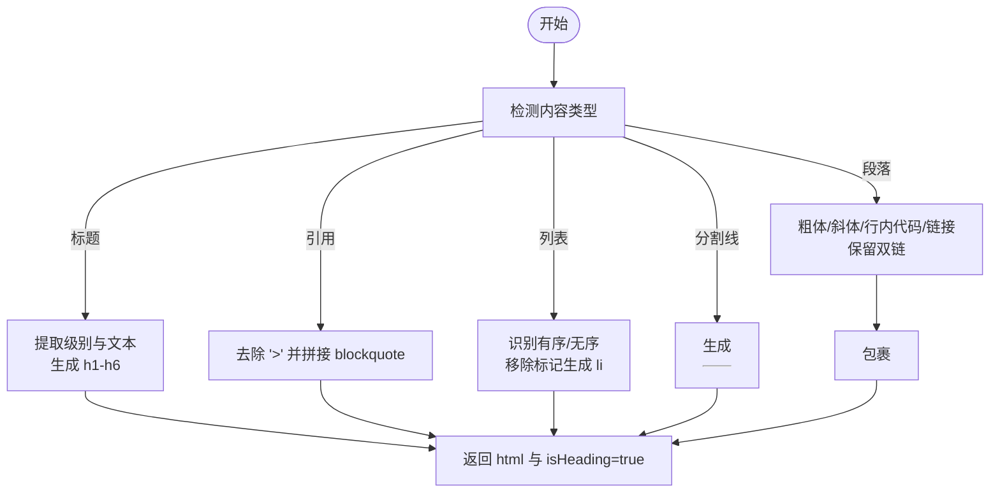
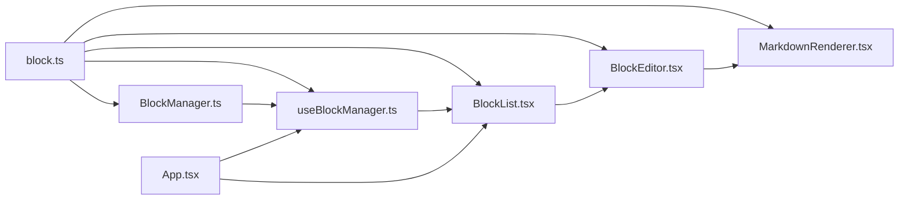

# 核心模块技术设计

<cite>
**本文引用的文件**
- [src/utils/BlockManager.ts](file://src/utils/BlockManager.ts)
- [src/hooks/useBlockManager.ts](file://src/hooks/useBlockManager.ts)
- [src/types/block.ts](file://src/types/block.ts)
- [src/components/BlockEditor.tsx](file://src/components/BlockEditor.tsx)
- [src/components/MarkdownRenderer.tsx](file://src/components/MarkdownRenderer.tsx)
- [src/components/BlockList.tsx](file://src/components/BlockList.tsx)
- [src/App.tsx](file://src/App.tsx)
</cite>

## 目录
1. [引言](#引言)
2. [项目结构](#项目结构)
3. [核心组件](#核心组件)
4. [架构总览](#架构总览)
5. [详细组件分析](#详细组件分析)
6. [依赖关系分析](#依赖关系分析)
7. [性能考量](#性能考量)
8. [故障排查指南](#故障排查指南)
9. [结论](#结论)

## 引言
本文件聚焦项目中最关键的几个代码模块，系统性剖析以下要点：
- BlockManager 类：封装的数据模型（Block 接口字段如 id、type、content 等），提供的公共方法（addBlock、deleteBlock、updateBlock、reorderBlocks、exportAsJSON、importFromJSON）及内部实现逻辑。
- useBlockManager Hook：如何使用 useState 和 useCallback 封装 BlockManager 实例，并对外暴露状态与操作函数，实现逻辑复用。
- BlockEditor 组件：如何集成 Tiptap 编辑器，配置 StarterKit 扩展，并处理编辑状态的生命周期。
- MarkdownRenderer：如何实现简易的 Markdown 到 HTML 转换，特别是对双链语法的正则匹配与替换。
- 强调这些模块之间的依赖关系与协作方式。

## 项目结构
围绕“块编辑器”的核心路径如下：
- 数据模型与业务逻辑：src/types/block.ts、src/utils/BlockManager.ts
- 逻辑封装与状态暴露：src/hooks/useBlockManager.ts
- 视图与交互：src/components/BlockEditor.tsx、src/components/MarkdownRenderer.tsx、src/components/BlockList.tsx
- 应用入口与导出导入：src/App.tsx

图表来源
- [src/App.tsx](file://src/App.tsx#L1-L156)
- [src/hooks/useBlockManager.ts](file://src/hooks/useBlockManager.ts#L1-L96)
- [src/utils/BlockManager.ts](file://src/utils/BlockManager.ts#L1-L227)
- [src/components/BlockList.tsx](file://src/components/BlockList.tsx#L1-L145)
- [src/components/BlockEditor.tsx](file://src/components/BlockEditor.tsx#L1-L116)
- [src/components/MarkdownRenderer.tsx](file://src/components/MarkdownRenderer.tsx#L1-L125)
- [src/types/block.ts](file://src/types/block.ts#L1-L30)

章节来源
- [src/App.tsx](file://src/App.tsx#L1-L156)
- [src/hooks/useBlockManager.ts](file://src/hooks/useBlockManager.ts#L1-L96)
- [src/utils/BlockManager.ts](file://src/utils/BlockManager.ts#L1-L227)
- [src/components/BlockList.tsx](file://src/components/BlockList.tsx#L1-L145)
- [src/components/BlockEditor.tsx](file://src/components/BlockEditor.tsx#L1-L116)
- [src/components/MarkdownRenderer.tsx](file://src/components/MarkdownRenderer.tsx#L1-L125)
- [src/types/block.ts](file://src/types/block.ts#L1-L30)

## 核心组件
本节对四个关键模块进行深入分析：BlockManager、useBlockManager、BlockEditor、MarkdownRenderer。

章节来源
- [src/utils/BlockManager.ts](file://src/utils/BlockManager.ts#L1-L227)
- [src/hooks/useBlockManager.ts](file://src/hooks/useBlockManager.ts#L1-L96)
- [src/components/BlockEditor.tsx](file://src/components/BlockEditor.tsx#L1-L116)
- [src/components/MarkdownRenderer.tsx](file://src/components/MarkdownRenderer.tsx#L1-L125)
- [src/types/block.ts](file://src/types/block.ts#L1-L30)

## 架构总览
整体采用“数据模型 + 业务逻辑 + Hook 封装 + 视图组件”的分层设计：
- 数据模型：Block、Document 定义块与文档的结构。
- 业务逻辑：BlockManager 提供增删改查、排序、文档创建、序列化等能力。
- Hook 封装：useBlockManager 将 BlockManager 与 React 状态绑定，提供稳定的回调与导出导入能力。
- 视图组件：BlockList 负责块列表与拖拽；BlockEditor 集成 Tiptap；MarkdownRenderer 负责渲染。

图表来源
- [src/types/block.ts](file://src/types/block.ts#L1-L30)
- [src/utils/BlockManager.ts](file://src/utils/BlockManager.ts#L1-L227)
- [src/hooks/useBlockManager.ts](file://src/hooks/useBlockManager.ts#L1-L96)
- [src/components/BlockEditor.tsx](file://src/components/BlockEditor.tsx#L1-L116)
- [src/components/MarkdownRenderer.tsx](file://src/components/MarkdownRenderer.tsx#L1-L125)

## 详细组件分析

### BlockManager 类
- 数据模型
  - Block 字段：id、type、content、references、referencedBy、metadata（created、modified 等）。
  - Document 字段：id、title、blocks、created、modified。
- 公共方法
  - getBlocks/getBlock：读取块集合与指定块。
  - addBlock：生成唯一 id，填充 metadata.created/modified，追加到数组。
  - updateBlock：根据 id 查找并合并更新，保留旧 metadata 并更新 modified。
  - deleteBlock：根据 id 删除，返回布尔值。
  - reorderBlocks：在数组范围内移动元素，返回布尔值。
  - createDocument/getDocument：构建/获取文档对象。
  - fromMarkdown：将 Markdown 文本拆分为多行，识别标题、引用、列表、分割线等，生成对应 Block 列表。
  - toMarkdown：将块内容拼接为 Markdown 文本。
- 内部实现要点
  - generateId：基于时间戳与随机字符串生成唯一 id。
  - fromMarkdown：逐行扫描，维护 currentContent 与 currentType，遇到分隔符或类型变化时落盘当前块，最后收尾。
  - updateBlock：深拷贝合并，确保 metadata 合并策略正确。
  - reorderBlocks：边界校验，splice 移动，保证索引合法性。
- 复杂度与性能
  - getBlocks/getBlock：O(n)。
  - updateBlock/deleteBlock：O(n)（查找 + 修改/删除）。
  - reorderBlocks：O(n)（数组移动）。
  - fromMarkdown：O(m)，m 为行数。
  - toMarkdown：O(S)，S 为块内容总长度。

章节来源
- [src/types/block.ts](file://src/types/block.ts#L1-L30)
- [src/utils/BlockManager.ts](file://src/utils/BlockManager.ts#L1-L227)

### useBlockManager Hook
- 初始化
  - 若传入 initialContent，则通过 BlockManager.fromMarkdown 初始化 BlockManager；否则构造空实例。
  - 以 useState 惰性初始化 blockManager，避免重复创建。
  - blocks 状态由 blockManager.getBlocks() 初始化。
- 操作函数
  - updateBlock：调用 blockManager.updateBlock，随后 setBlocks([...blockManager.getBlocks()])。
  - addBlock：调用 blockManager.addBlock，setBlocks。
  - deleteBlock：调用 blockManager.deleteBlock，成功则 setBlocks。
  - reorderBlocks：调用 blockManager.reorderBlocks，成功则 setBlocks。
  - getMarkdown：委托 blockManager.toMarkdown。
  - exportAsJSON：序列化 blocks 与 document。
  - importFromJSON：解析 JSON，清空现有块并逐一 addBlock，最后 setBlocks。
- 性能与稳定性
  - 所有回调均通过 useCallback 包裹，依赖 blockManager，避免子组件不必要的重渲染。
  - setBlocks 仅在成功变更后触发，保持状态一致性。
- 错误处理
  - importFromJSON 使用 try/catch，失败时返回 false 并打印错误日志。

图表来源
- [src/hooks/useBlockManager.ts](file://src/hooks/useBlockManager.ts#L1-L96)
- [src/utils/BlockManager.ts](file://src/utils/BlockManager.ts#L1-L227)

章节来源
- [src/hooks/useBlockManager.ts](file://src/hooks/useBlockManager.ts#L1-L96)
- [src/utils/BlockManager.ts](file://src/utils/BlockManager.ts#L1-L227)

### BlockEditor 组件（Tiptap 集成）
- 集成与扩展
  - 使用 @tiptap/react 的 useEditor，启用 StarterKit、Placeholder、TaskList/TaskItem、Blockquote、Heading、BulletList、OrderedList、HorizontalRule、DragHandle。
  - content 来自 block.content，editable 由 isEditing 控制。
- 生命周期与状态同步
  - onUpdate 回调中，从 editor.getHTML() 获取最新 HTML，合并 block 与 metadata.modified，调用 onUpdate。
  - useEffect 监听 isEditing，动态设置 editor.setEditable。
  - useEffect 监听 block.content，若与 editor 内容不一致，执行 editor.commands.setContent。
- 渲染与交互
  - 非编辑态渲染 MarkdownRenderer；编辑态渲染 EditorContent，并提供拖拽手柄。
  - 点击非编辑态触发 onEdit；blur 时触发 onToggleEdit。

图表来源
- [src/components/BlockEditor.tsx](file://src/components/BlockEditor.tsx#L1-L116)
- [src/components/MarkdownRenderer.tsx](file://src/components/MarkdownRenderer.tsx#L1-L125)

章节来源
- [src/components/BlockEditor.tsx](file://src/components/BlockEditor.tsx#L1-L116)
- [src/components/MarkdownRenderer.tsx](file://src/components/MarkdownRenderer.tsx#L1-L125)

### MarkdownRenderer（简易 Markdown 到 HTML）
- 功能概述
  - 解析 block.content，输出 { html, isHeading }。
  - 支持标题、引用、列表（有序/无序）、分割线、段落（含粗体、斜体、行内代码、链接）。
  - 对双链语法 [[...]] 进行包裹，便于后续双链解析与跳转。
- 实现要点
  - 标题：匹配前缀 #，提取级别与文本。
  - 引用：去除每行 > 前缀，拼接为 blockquote。
  - 列表：识别有序/无序，移除标记，生成 li。
  - 分割线：识别 --- 或 ***。
  - 段落：先做内联格式（粗体、斜体、行内代码、链接），再包裹 p；双链保留为 span。
- 注意事项
  - 该实现为简化版本，复杂场景建议引入专业 Markdown 解析库（如 Lute）。

图表来源
- [src/components/MarkdownRenderer.tsx](file://src/components/MarkdownRenderer.tsx#L1-L125)

章节来源
- [src/components/MarkdownRenderer.tsx](file://src/components/MarkdownRenderer.tsx#L1-L125)

## 依赖关系分析
- 模块耦合
  - BlockManager 依赖 Block/Document 类型定义。
  - useBlockManager 依赖 BlockManager 与 Block 类型。
  - BlockEditor 依赖 Block 类型与 MarkdownRenderer。
  - BlockList 依赖 Block 类型与 BlockEditor。
  - App 依赖 useBlockManager、BlockList。
- 数据流
  - App 通过 useBlockManager 获取 blocks 与操作函数，传递给 BlockList。
  - BlockList 将块映射为 BlockEditor，编辑态由 BlockEditor 驱动 Tiptap，渲染态由 MarkdownRenderer 驱动。
  - BlockManager 作为单一事实来源，统一管理块集合与文档元信息。
- 循环依赖
  - 未发现循环依赖：各模块单向依赖，类型定义集中于 types。

图表来源
- [src/types/block.ts](file://src/types/block.ts#L1-L30)
- [src/utils/BlockManager.ts](file://src/utils/BlockManager.ts#L1-L227)
- [src/hooks/useBlockManager.ts](file://src/hooks/useBlockManager.ts#L1-L96)
- [src/components/BlockList.tsx](file://src/components/BlockList.tsx#L1-L145)
- [src/components/BlockEditor.tsx](file://src/components/BlockEditor.tsx#L1-L116)
- [src/components/MarkdownRenderer.tsx](file://src/components/MarkdownRenderer.tsx#L1-L125)
- [src/App.tsx](file://src/App.tsx#L1-L156)

章节来源
- [src/types/block.ts](file://src/types/block.ts#L1-L30)
- [src/utils/BlockManager.ts](file://src/utils/BlockManager.ts#L1-L227)
- [src/hooks/useBlockManager.ts](file://src/hooks/useBlockManager.ts#L1-L96)
- [src/components/BlockList.tsx](file://src/components/BlockList.tsx#L1-L145)
- [src/components/BlockEditor.tsx](file://src/components/BlockEditor.tsx#L1-L116)
- [src/components/MarkdownRenderer.tsx](file://src/components/MarkdownRenderer.tsx#L1-L125)
- [src/App.tsx](file://src/App.tsx#L1-L156)

## 性能考量
- 状态更新
  - useBlockManager 中所有回调使用 useCallback，减少子组件重渲染。
  - setBlocks 在成功变更后才触发，避免无效更新。
- 数组操作
  - reorderBlocks 为 O(n)，在大文档中可能成为瓶颈；可考虑使用更高效的数据结构（如双向链表）或批量更新策略。
- 渲染
  - MarkdownRenderer 为纯前端正则替换，复杂度近似 O(S)；双链仅包裹 span，不会影响 DOM 结构。
  - BlockEditor 使用 Tiptap，HTML 输出由编辑器控制，避免直接 dangerouslySetInnerHTML 的风险。
- 导入导出
  - exportAsJSON 与 importFromJSON 为 O(B)（B 为块数量），建议在大文档时异步处理或分批导入。

[本节为通用指导，无需列出具体文件来源]

## 故障排查指南
- 导入 JSON 失败
  - 现象：importFromJSON 返回 false 并打印错误日志。
  - 排查：确认 JSON 结构包含 blocks 数组且元素具备 type/content 字段；检查浏览器控制台错误。
- 编辑态无法切换
  - 现象：点击块未进入编辑态或失焦后未退出。
  - 排查：确认 isEditing 与 onToggleEdit 在 BlockList 与 BlockEditor 之间正确传递；检查 useEffect 是否生效。
- 拖拽排序无效
  - 现象：拖拽手柄无反应或排序不生效。
  - 排查：确认 onReorderBlocks 已正确传入 BlockList；reorderBlocks 返回值为 true 时才会 setBlocks。
- Markdown 渲染异常
  - 现象：标题、列表、链接等格式未正确渲染。
  - 排查：检查 MarkdownRenderer 的正则匹配是否被意外覆盖；确认 content 未被外部修改导致格式不匹配。

章节来源
- [src/hooks/useBlockManager.ts](file://src/hooks/useBlockManager.ts#L61-L83)
- [src/components/BlockEditor.tsx](file://src/components/BlockEditor.tsx#L65-L77)
- [src/components/BlockList.tsx](file://src/components/BlockList.tsx#L26-L57)
- [src/components/MarkdownRenderer.tsx](file://src/components/MarkdownRenderer.tsx#L1-L125)

## 结论
本项目通过清晰的分层设计实现了“块编辑器”的核心能力：
- BlockManager 提供稳定的数据模型与操作接口；
- useBlockManager 将业务逻辑与 React 状态解耦，提升可复用性；
- BlockEditor 与 MarkdownRenderer 分别承担编辑态与渲染态职责，配合 BlockList 实现拖拽排序与新增块；
- 导入导出与文档元信息完善了工作流闭环。
未来可在以下方面优化：
- 引入更完善的 Markdown 解析库，增强复杂场景支持；
- 对大文档的数组操作进行性能优化；
- 补齐双链引用管理器，完善双向链接与导航。

[本节为总结性内容，无需列出具体文件来源]