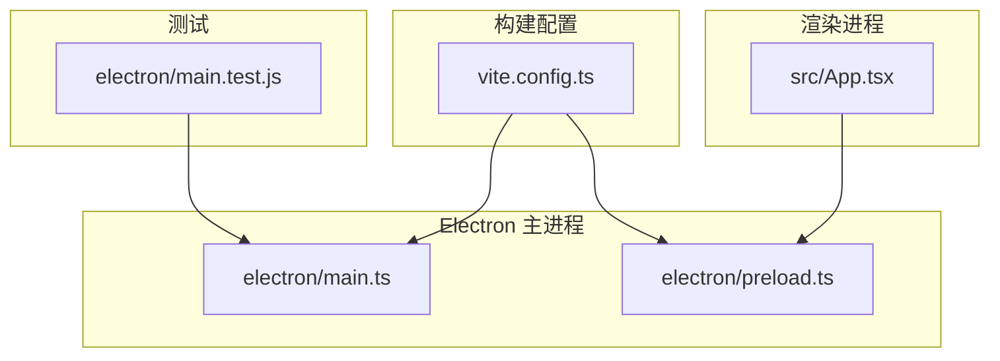
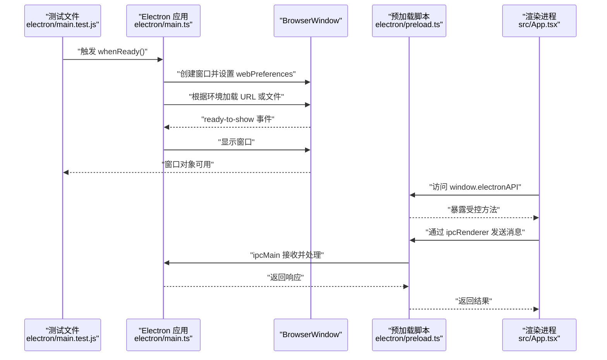
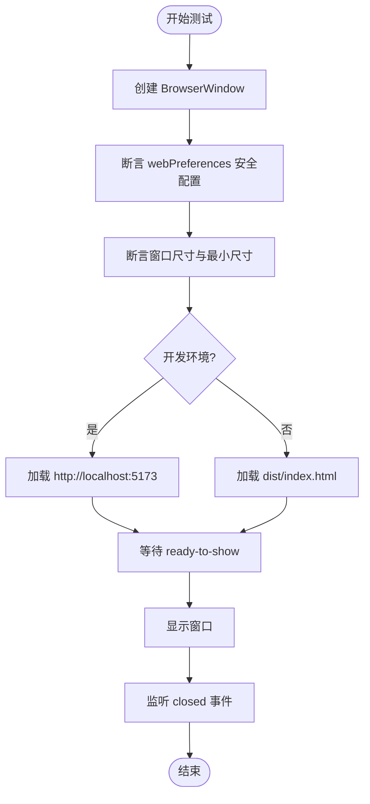
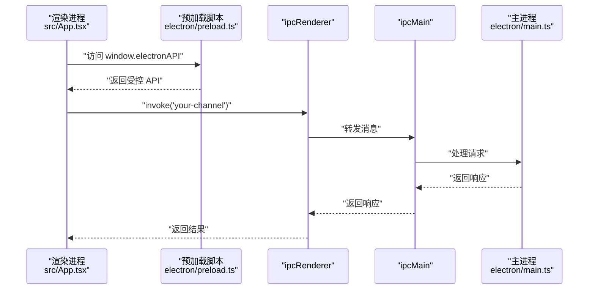
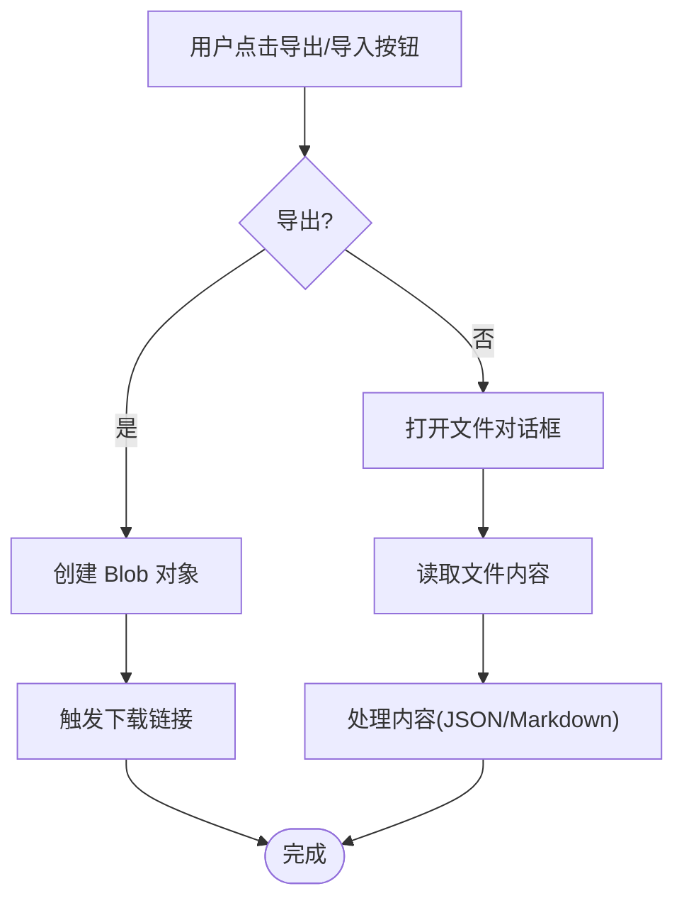
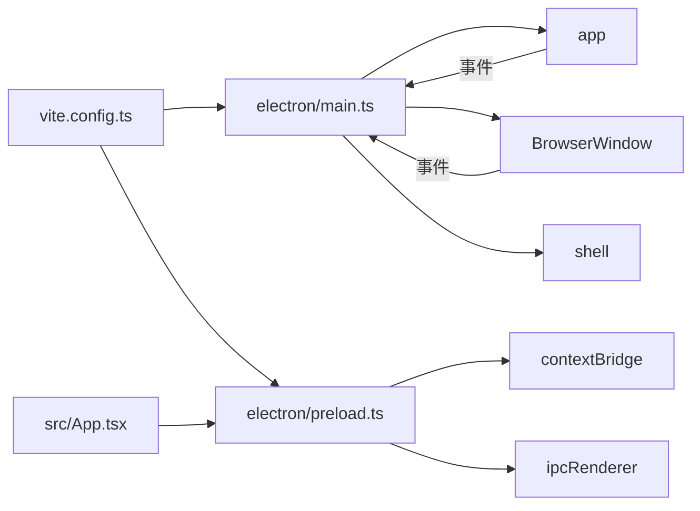

# 主进程测试

<cite>
**本文引用的文件**
- [electron/main.test.js](file://electron/main.test.js)
- [electron/main.ts](file://electron/main.ts)
- [electron/preload.ts](file://electron/preload.ts)
- [vite.config.ts](file://vite.config.ts)
- [package.json](file://package.json)
- [src/App.tsx](file://src/App.tsx)
</cite>

## 目录
1. [引言](#引言)
2. [项目结构](#项目结构)
3. [核心组件](#核心组件)
4. [架构总览](#架构总览)
5. [详细组件分析](#详细组件分析)
6. [依赖关系分析](#依赖关系分析)
7. [性能考量](#性能考量)
8. [故障排查指南](#故障排查指南)
9. [结论](#结论)
10. [附录](#附录)

## 引言
本文件围绕 Electron 主进程的测试方案展开，目标是基于现有测试文件与主进程实现，系统性地评估当前测试覆盖度，并补充缺失的测试场景，包括：
- 对主进程关键行为（窗口创建、生命周期、安全策略）的断言
- 对预加载脚本与渲染进程之间 IPC 通信的安全通道验证
- 对文件系统交互（导入/导出）在主进程侧的触发与控制逻辑的验证
- 使用隔离测试策略，避免真实环境依赖

当前仓库中存在一个基础的测试文件，但尚未包含对主进程核心功能的断言与模拟；本文将据此提出完善的测试策略与补充用例。

## 项目结构
- Electron 主进程入口位于 electron/main.ts，负责窗口创建、生命周期事件与安全策略
- 预加载脚本 electron/preload.ts 通过 contextBridge 暴露受控 API 至渲染进程
- 测试文件 electron/main.test.js 当前仅演示了窗口创建与加载页面的基本流程，缺少断言与隔离
- 构建配置 vite.config.ts 指定主进程与预加载脚本的打包入口与外部化依赖
- package.json 提供 Electron 版本与开发依赖声明

图表来源
- [vite.config.ts](file://vite.config.ts#L1-L61)
- [electron/main.ts](file://electron/main.ts#L1-L68)
- [electron/preload.ts](file://electron/preload.ts#L1-L21)
- [electron/main.test.js](file://electron/main.test.js#L1-L38)
- [src/App.tsx](file://src/App.tsx#L57-L156)

章节来源
- [vite.config.ts](file://vite.config.ts#L1-L61)
- [electron/main.ts](file://electron/main.ts#L1-L68)
- [electron/preload.ts](file://electron/preload.ts#L1-L21)
- [electron/main.test.js](file://electron/main.test.js#L1-L38)
- [src/App.tsx](file://src/App.tsx#L57-L156)

## 核心组件
- 主进程入口：负责窗口创建、开发/生产环境加载、ready-to-show 显示策略、窗口关闭处理、macOS 激活逻辑、新窗口打开拦截与外部浏览器打开
- 预加载脚本：通过 contextBridge 暴露受控 API，为渲染进程提供安全的 IPC 能力
- 测试文件：当前为演示型测试，未包含断言与隔离

章节来源
- [electron/main.ts](file://electron/main.ts#L1-L68)
- [electron/preload.ts](file://electron/preload.ts#L1-L21)
- [electron/main.test.js](file://electron/main.test.js#L1-L38)

## 架构总览
下图展示了主进程、预加载脚本与渲染进程之间的交互关系，以及关键事件流。

图表来源
- [electron/main.ts](file://electron/main.ts#L1-L68)
- [electron/preload.ts](file://electron/preload.ts#L1-L21)
- [electron/main.test.js](file://electron/main.test.js#L1-L38)
- [src/App.tsx](file://src/App.tsx#L57-L156)

## 详细组件分析

### 主进程窗口创建与生命周期测试
当前测试文件展示了窗口创建与加载页面的基本流程，但缺少断言与隔离。建议补充以下断言：
- 窗口尺寸与最小尺寸约束
- webPreferences 的安全配置（禁用 nodeIntegration、启用 contextIsolation）
- ready-to-show 事件触发后才显示窗口
- 窗口关闭事件的处理
- macOS 平台激活逻辑
- 新窗口打开拦截策略

图表来源
- [electron/main.ts](file://electron/main.ts#L1-L68)
- [electron/main.test.js](file://electron/main.test.js#L1-L38)

章节来源
- [electron/main.ts](file://electron/main.ts#L1-L68)
- [electron/main.test.js](file://electron/main.test.js#L1-L38)

### 预加载脚本与 IPC 通信测试
预加载脚本通过 contextBridge 暴露受控 API，渲染进程通过 window.electronAPI 使用 ipcRenderer 进行异步调用。建议补充：
- 验证 contextBridge.exposeInMainWorld 是否成功暴露 API
- 验证 window.electronAPI 类型声明是否正确
- 验证渲染进程能否通过 ipcRenderer.invoke 与主进程通信
- 验证主进程 ipcMain 对应处理函数是否正确响应

图表来源
- [electron/preload.ts](file://electron/preload.ts#L1-L21)
- [electron/main.ts](file://electron/main.ts#L1-L68)
- [src/App.tsx](file://src/App.tsx#L57-L156)

章节来源
- [electron/preload.ts](file://electron/preload.ts#L1-L21)
- [electron/main.ts](file://electron/main.ts#L1-L68)
- [src/App.tsx](file://src/App.tsx#L57-L156)

### 文件系统交互测试（导入/导出）
渲染进程提供了导入/导出功能，涉及文件对话框与下载操作。建议补充：
- 验证渲染进程导出按钮触发下载逻辑
- 验证渲染进程导入文件时读取文件内容并触发相应处理
- 在主进程中验证与文件对话框相关的菜单/快捷键触发（若存在）

图表来源
- [src/App.tsx](file://src/App.tsx#L57-L156)

章节来源
- [src/App.tsx](file://src/App.tsx#L57-L156)

### 测试隔离与环境准备
当前测试文件直接依赖真实 Electron 环境。为实现有效隔离，建议：
- 使用 jest-electron 或类似工具在内存中模拟 Electron API
- 使用 mock-electron 对 app、BrowserWindow、ipcMain 等模块进行模拟
- 在测试前清理 app 状态，避免跨用例污染
- 使用临时 HTML 文件或内联内容进行加载测试

章节来源
- [electron/main.test.js](file://electron/main.test.js#L1-L38)
- [package.json](file://package.json#L1-L69)

## 依赖关系分析
- 构建配置将 electron/main.ts 与 electron/preload.ts 分别作为独立入口，主进程外部化 electron，预加载脚本同样外部化 electron
- 主进程依赖 app、BrowserWindow、Menu、shell 等模块
- 预加载脚本依赖 contextBridge、ipcRenderer
- 渲染进程通过 window.electronAPI 使用预加载脚本暴露的方法

图表来源
- [vite.config.ts](file://vite.config.ts#L1-L61)
- [electron/main.ts](file://electron/main.ts#L1-L68)
- [electron/preload.ts](file://electron/preload.ts#L1-L21)
- [src/App.tsx](file://src/App.tsx#L57-L156)

章节来源
- [vite.config.ts](file://vite.config.ts#L1-L61)
- [electron/main.ts](file://electron/main.ts#L1-L68)
- [electron/preload.ts](file://electron/preload.ts#L1-L21)
- [src/App.tsx](file://src/App.tsx#L57-L156)

## 性能考量
- 窗口 ready-to-show 后再显示，可减少视觉闪烁，提升用户体验
- 预加载脚本与主进程通信采用 invoke/return 模式，避免阻塞 UI 线程
- 外部化 electron 依赖，减小打包体积并加速构建

章节来源
- [electron/main.ts](file://electron/main.ts#L1-L68)
- [vite.config.ts](file://vite.config.ts#L1-L61)

## 故障排查指南
- 窗口未显示：确认 ready-to-show 事件是否触发后再显示
- 导航到外部浏览器：检查 web-contents-created 的拦截策略是否生效
- 导入/导出异常：核对渲染进程的文件读取与下载逻辑
- 测试失败：检查 jest-electron/mock-electron 的模拟配置是否完整

章节来源
- [electron/main.ts](file://electron/main.ts#L1-L68)
- [src/App.tsx](file://src/App.tsx#L57-L156)

## 结论
当前测试文件仅演示了基本窗口创建与加载流程，缺乏对主进程关键行为与安全配置的断言。建议引入隔离测试工具，补充对窗口创建选项、IPC 通信、文件系统交互与安全策略的全面验证，以确保主进程在不同平台与环境下的一致性与安全性。

## 附录
- 建议新增测试场景清单
  - 断言窗口尺寸与最小尺寸
  - 断言 webPreferences 安全配置
  - 断言 ready-to-show 显示时机
  - 断言窗口关闭事件处理
  - 断言 macOS 激活逻辑
  - 断言新窗口拦截与外部浏览器打开
  - 断言预加载脚本 API 暴露与类型声明
  - 断言渲染进程通过 window.electronAPI 的 IPC 调用
  - 断言主进程 ipcMain 对应处理函数
  - 断言导入/导出按钮触发的下载与读取逻辑

章节来源
- [electron/main.ts](file://electron/main.ts#L1-L68)
- [electron/preload.ts](file://electron/preload.ts#L1-L21)
- [electron/main.test.js](file://electron/main.test.js#L1-L38)
- [src/App.tsx](file://src/App.tsx#L57-L156)