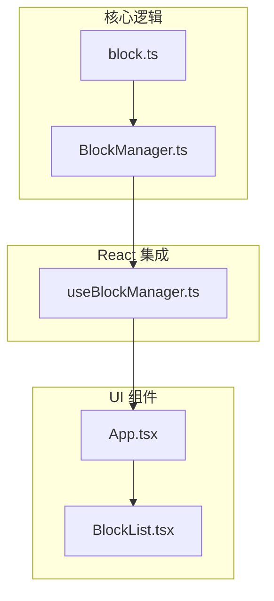
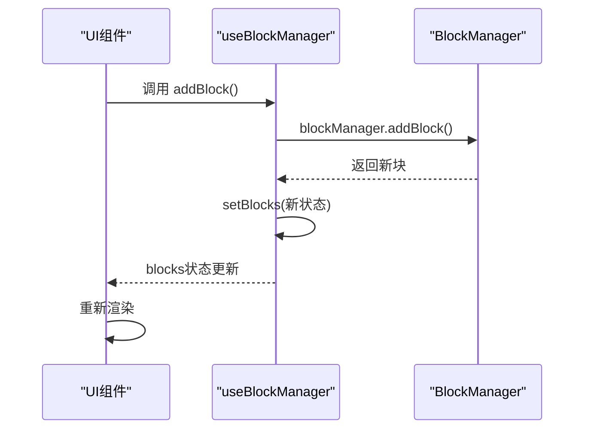
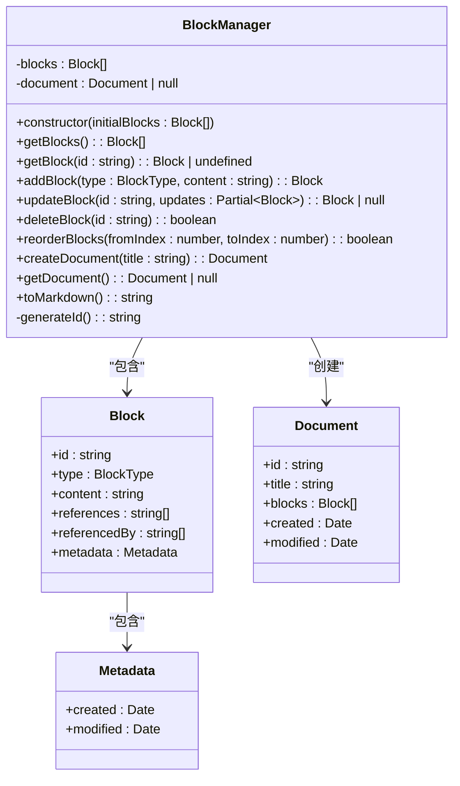
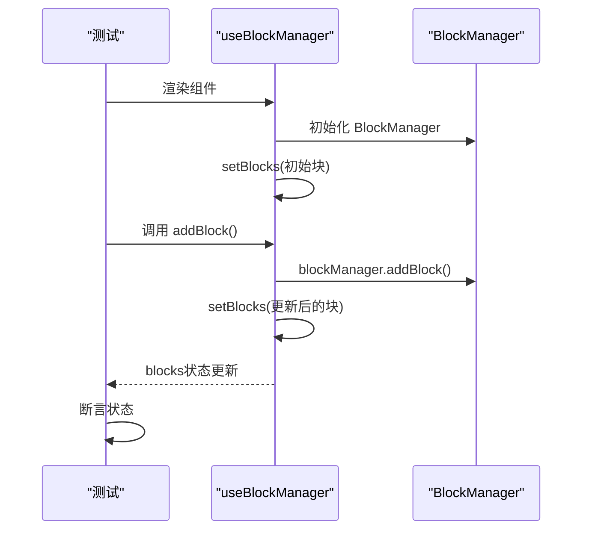

# 单元测试

<cite>
**本文档中引用的文件**   
- [BlockManager.ts](file://src/utils/BlockManager.ts)
- [useBlockManager.ts](file://src/hooks/useBlockManager.ts)
- [block.ts](file://src/types/block.ts)
</cite>

## 目录
1. [简介](#简介)
2. [项目结构](#项目结构)
3. [核心组件](#核心组件)
4. [架构概述](#架构概述)
5. [详细组件分析](#详细组件分析)
6. [依赖分析](#依赖分析)
7. [性能考虑](#性能考虑)
8. [故障排除指南](#故障排除指南)
9. [结论](#结论)
10. [附录](#附录)（如有必要）

## 简介
本文档旨在为 `BlockManager` 类和 `useBlockManager` 自定义 Hook 制定全面的单元测试策略。使用 Jest 作为测试框架，结合 React Testing Library 对 React Hook 进行测试。重点验证 `addBlock`、`deleteBlock`、`updateBlock` 和 `reorderBlocks` 等核心方法的正确性，确保数据状态变更符合预期。同时，将说明如何通过 `jest.mock` 隔离依赖，以实现高测试覆盖率。

**Section sources**
- [BlockManager.ts](file://src/utils/BlockManager.ts#L3-L227)
- [useBlockManager.ts](file://src/hooks/useBlockManager.ts#L5-L96)

## 项目结构
项目采用分层结构，核心逻辑分离清晰。`BlockManager` 类位于 `src/utils/BlockManager.ts`，负责管理块数据的核心业务逻辑。`useBlockManager` Hook 位于 `src/hooks/useBlockManager.ts`，作为 React 组件与 `BlockManager` 之间的桥梁，提供状态管理和操作方法。类型定义在 `src/types/block.ts` 中统一管理。这种结构有利于进行单元测试，可以独立测试业务逻辑与 UI 逻辑。



**Diagram sources **
- [BlockManager.ts](file://src/utils/BlockManager.ts#L3-L227)
- [useBlockManager.ts](file://src/hooks/useBlockManager.ts#L5-L96)
- [block.ts](file://src/types/block.ts#L1-L30)

**Section sources**
- [BlockManager.ts](file://src/utils/BlockManager.ts#L3-L227)
- [useBlockManager.ts](file://src/hooks/useBlockManager.ts#L5-L96)
- [block.ts](file://src/types/block.ts#L1-L30)

## 核心组件
核心组件包括 `BlockManager` 类和 `useBlockManager` Hook。`BlockManager` 是一个无状态的工具类，封装了所有对块数据的增删改查和排序操作。`useBlockManager` 是一个 React Hook，它初始化 `BlockManager` 实例，并通过 React 的 `useState` 和 `useCallback` 来同步内部状态，向组件提供可调用的函数。

**Section sources**
- [BlockManager.ts](file://src/utils/BlockManager.ts#L3-L227)
- [useBlockManager.ts](file://src/hooks/useBlockManager.ts#L5-L96)

## 架构概述
系统的数据流遵循单向数据流原则。`useBlockManager` Hook 创建并持有 `BlockManager` 实例。当组件调用 Hook 返回的方法（如 `addBlock`）时，该方法会调用 `BlockManager` 的对应方法修改其内部状态，然后通过 `setBlocks` 更新 React 状态，触发 UI 重新渲染。这种设计使得 `BlockManager` 可以被独立测试，而 `useBlockManager` 的测试则侧重于验证其是否正确地与 `BlockManager` 交互并更新了 React 状态。



**Diagram sources **
- [useBlockManager.ts](file://src/hooks/useBlockManager.ts#L24-L28)
- [BlockManager.ts](file://src/utils/BlockManager.ts#L22-L37)

## 详细组件分析

### BlockManager 类分析
`BlockManager` 类是数据管理的核心。它通过私有数组 `blocks` 存储所有块，并提供一系列公共方法来操作这些数据。每个方法都应被测试其输入、输出和副作用。

#### 核心方法类图


**Diagram sources **
- [BlockManager.ts](file://src/utils/BlockManager.ts#L3-L227)
- [block.ts](file://src/types/block.ts#L5-L30)

#### 测试策略与代码示例
为 `BlockManager` 编写测试时，应覆盖正常流程、边界条件和错误处理。

```typescript
// 示例：BlockManager 测试用例 (blockManager.test.ts)
describe('BlockManager', () => {
  let manager: BlockManager;
  const mockBlocks = [
    { id: '1', type: 'paragraph', content: 'First', metadata: { created: new Date(), modified: new Date() } },
    { id: '2', type: 'heading', content: 'Second', metadata: { created: new Date(), modified: new Date() } },
  ];

  beforeEach(() => {
    manager = new BlockManager(mockBlocks);
  });

  test('addBlock 应正确添加新块并返回', () => {
    const newBlock = manager.addBlock('quote', 'New quote');
    expect(manager.getBlocks().length).toBe(3);
    expect(newBlock.type).toBe('quote');
    expect(newBlock.content).toBe('New quote');
  });

  test('deleteBlock 应成功删除存在的块并返回 true', () => {
    const success = manager.deleteBlock('1');
    expect(success).toBe(true);
    expect(manager.getBlocks().length).toBe(1);
    expect(manager.getBlocks()[0].id).toBe('2');
  });

  test('deleteBlock 应对不存在的块 ID 返回 false', () => {
    const success = manager.deleteBlock('non-existent-id');
    expect(success).toBe(false);
    expect(manager.getBlocks().length).toBe(2); // 状态未变
  });

  test('updateBlock 应正确更新块内容并更新 modified 时间', () => {
    const originalModified = manager.getBlocks()[0].metadata.modified;
    const updatedBlock = manager.updateBlock('1', { content: 'Updated content' });
    expect(updatedBlock?.content).toBe('Updated content');
    expect(updatedBlock?.metadata.modified.getTime()).toBeGreaterThan(originalModified.getTime());
  });

  test('reorderBlocks 应正确移动块的位置', () => {
    manager.reorderBlocks(0, 1);
    const blocks = manager.getBlocks();
    expect(blocks[0].id).toBe('2');
    expect(blocks[1].id).toBe('1');
  });

  test('reorderBlocks 应对无效索引返回 false', () => {
    const success = manager.reorderBlocks(10, 0);
    expect(success).toBe(false);
    // 状态应保持不变
  });
});
```

**Section sources**
- [BlockManager.ts](file://src/utils/BlockManager.ts#L22-L76)

### useBlockManager Hook 分析
`useBlockManager` Hook 封装了 `BlockManager` 的实例化和状态同步逻辑。测试的重点是验证其返回的函数是否正确调用了 `BlockManager` 的方法，并且 `blocks` 状态是否得到了正确的更新。

#### Hook 测试序列图


**Diagram sources **
- [useBlockManager.ts](file://src/hooks/useBlockManager.ts#L24-L28)

#### 测试策略与代码示例
使用 React Testing Library 来测试 Hook，需要创建一个测试组件来使用该 Hook。

```typescript
// 示例：useBlockManager 测试用例 (useBlockManager.test.ts)
import { renderHook, act } from '@testing-library/react';
import { useBlockManager } from './useBlockManager';

describe('useBlockManager', () => {
  test('应正确初始化并返回 blocks 和操作函数', () => {
    const { result } = renderHook(() => useBlockManager());
    expect(result.current.blocks).toEqual([]);
    expect(typeof result.current.addBlock).toBe('function');
    expect(typeof result.current.deleteBlock).toBe('function');
  });

  test('addBlock 应添加新块并更新 blocks 状态', () => {
    const { result } = renderHook(() => useBlockManager());
    act(() => {
      result.current.addBlock('paragraph', 'Hello');
    });
    expect(result.current.blocks.length).toBe(1);
    expect(result.current.blocks[0].content).toBe('Hello');
  });

  test('deleteBlock 应删除块并更新 blocks 状态', () => {
    const { result } = renderHook(() => useBlockManager());
    let blockId = '';
    act(() => {
      const newBlock = result.current.addBlock('paragraph', 'To be deleted');
      blockId = newBlock.id;
    });
    act(() => {
      result.current.deleteBlock(blockId);
    });
    expect(result.current.blocks.length).toBe(0);
  });

  test('应能从 Markdown 初始化', () => {
    const markdown = '# Title\n\nParagraph';
    const { result } = renderHook(() => useBlockManager(markdown));
    expect(result.current.blocks.length).toBe(2);
    expect(result.current.blocks[0].type).toBe('heading');
  });
});
```

**Section sources**
- [useBlockManager.ts](file://src/hooks/useBlockManager.ts#L5-L96)

## 依赖分析
`BlockManager` 类本身不依赖外部模块，仅依赖项目内的 `block.ts` 类型定义，这使得它非常容易进行单元测试，无需模拟。`useBlockManager` Hook 依赖于 React 的 `useState` 和 `useCallback`，这些是 React 的核心 API，在测试时由 React Testing Library 提供。`BlockManager` 的 `fromMarkdown` 静态方法虽然有复杂的逻辑，但其行为是确定性的，可以通过提供不同的 Markdown 字符串来进行测试。

**Diagram sources **
- [package.json](file://package.json#L47-L65)

**Section sources**
- [BlockManager.ts](file://src/utils/BlockManager.ts#L1-L227)
- [useBlockManager.ts](file://src/hooks/useBlockManager.ts#L1-L97)

## 性能考虑
`BlockManager` 的方法大多是 O(n) 时间复杂度（如 `findIndex`），对于大型文档可能成为瓶颈。测试应包括对中等规模数据集（例如 1000 个块）的操作，以确保性能可接受。`reorderBlocks` 方法使用 `splice`，在数组很大时可能较慢，未来可考虑优化。

## 故障排除指南
- **测试失败：状态未更新**：确保在调用 `addBlock`、`deleteBlock` 等方法时使用了 `act()` 包裹，以正确处理 React 状态更新。
- **测试失败：ID 不匹配**：`generateId` 方法依赖 `Date.now()`，在测试中可能导致不可预测性。可以使用 `jest.spyOn(Date, 'now').mockReturnValue(123)` 来模拟时间，确保 ID 可预测。
- **测试失败：方法未被调用**：如果需要验证 `BlockManager` 的方法是否被调用，可以使用 `jest.mock('../utils/BlockManager')` 来模拟整个类，并使用 `jest.fn()` 来创建间谍函数。

**Section sources**
- [useBlockManager.ts](file://src/hooks/useBlockManager.ts#L19-L20)
- [BlockManager.ts](file://src/utils/BlockManager.ts#L96-L98)

## 结论
通过为 `BlockManager` 类和 `useBlockManager` Hook 制定详尽的单元测试策略，可以确保核心数据管理逻辑的健壮性和可靠性。使用 Jest 和 React Testing Library 的组合，能够有效地隔离测试业务逻辑和 UI 逻辑。遵循本文档中的测试用例示例和策略，可以实现高代码覆盖率，为项目的长期维护和功能扩展提供坚实的基础。