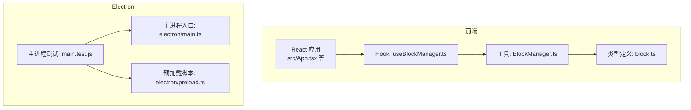
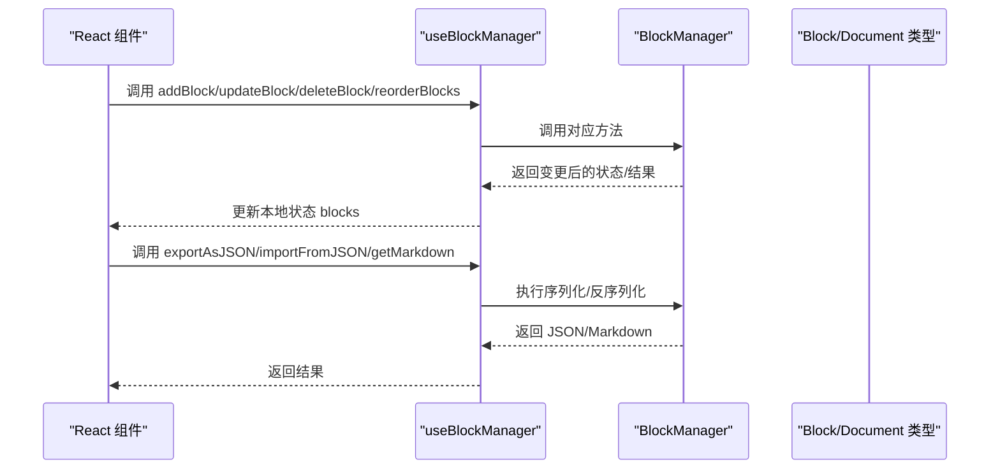
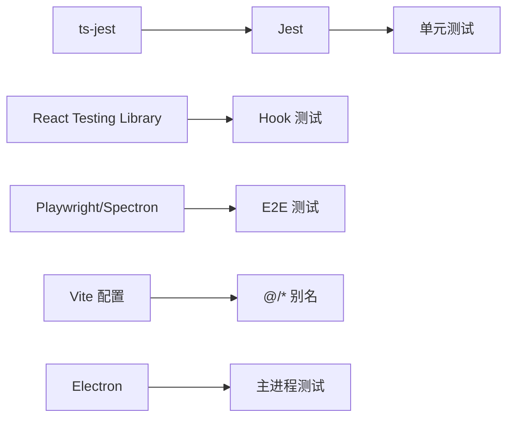

# 测试策略

<cite>
**本文引用的文件**
- [BlockManager.ts](file://src/utils/BlockManager.ts)
- [useBlockManager.ts](file://src/hooks/useBlockManager.ts)
- [block.ts](file://src/types/block.ts)
- [main.test.js](file://electron/main.test.js)
- [package.json](file://package.json)
- [vite.config.ts](file://vite.config.ts)
- [README.md](file://README.md)
</cite>

## 目录
1. [引言](#引言)
2. [项目结构](#项目结构)
3. [核心组件](#核心组件)
4. [架构总览](#架构总览)
5. [详细组件分析](#详细组件分析)
6. [依赖分析](#依赖分析)
7. [性能考虑](#性能考虑)
8. [故障排查指南](#故障排查指南)
9. [结论](#结论)
10. [附录](#附录)

## 引言
本测试策略旨在确保代码质量与稳定性，围绕以下目标展开：
- 对 BlockManager 类进行单元测试，覆盖 addBlock、deleteBlock、reorderBlocks 等关键方法。
- 对 useBlockManager Hook 进行测试，验证其初始化 BlockManager 实例、返回状态与方法的正确性。
- 提出 E2E 测试方案，结合 Playwright 或 Spectron 测试 Electron 应用的整体行为（窗口启动、文件导入导出、拖拽排序等）。
- 分析现有 main.test.js 的覆盖范围，并建议补充更多测试用例。

## 项目结构
该项目采用 React + Electron + Vite 的技术栈，核心逻辑集中在 src/utils/BlockManager.ts 与 src/hooks/useBlockManager.ts；Electron 主进程测试位于 electron/main.test.js。整体目录组织清晰，便于分层测试。

图表来源
- [useBlockManager.ts](file://src/hooks/useBlockManager.ts#L1-L97)
- [BlockManager.ts](file://src/utils/BlockManager.ts#L1-L227)
- [block.ts](file://src/types/block.ts#L1-L30)
- [main.test.js](file://electron/main.test.js#L1-L38)
- [vite.config.ts](file://vite.config.ts#L1-L61)

章节来源
- [README.md](file://README.md#L1-L90)
- [vite.config.ts](file://vite.config.ts#L1-L61)

## 核心组件
- BlockManager：负责块集合的增删改查、重排、文档创建与序列化（fromMarkdown、toMarkdown），以及唯一 ID 生成。
- useBlockManager：在 React 中封装 BlockManager，提供更新块、添加块、删除块、重排块、导出/导入 JSON 等能力，并维护本地状态 blocks。

章节来源
- [BlockManager.ts](file://src/utils/BlockManager.ts#L1-L227)
- [useBlockManager.ts](file://src/hooks/useBlockManager.ts#L1-L97)
- [block.ts](file://src/types/block.ts#L1-L30)

## 架构总览
下图展示了前端 Hook 与 BlockManager 的交互关系，以及 Electron 主进程测试的入口位置。

图表来源
- [useBlockManager.ts](file://src/hooks/useBlockManager.ts#L1-L97)
- [BlockManager.ts](file://src/utils/BlockManager.ts#L1-L227)
- [block.ts](file://src/types/block.ts#L1-L30)

## 详细组件分析

### BlockManager 单元测试策略
目标：验证 BlockManager 的核心方法在各种输入与边界条件下行为正确。

- addBlock
  - 输入：类型与内容（可选）
  - 断言：返回值包含唯一 ID、类型、内容、元数据；内部 blocks 数量增加 1
  - 边界：空内容、多种 BlockType、重复调用生成不同 ID
- updateBlock
  - 输入：存在/不存在的 id、部分更新字段
  - 断言：存在 id 返回更新后的块；不存在 id 返回 null；元数据 modified 更新
- deleteBlock
  - 输入：存在/不存在的 id
  - 断言：存在 id 返回 true 并减少数量；不存在 id 返回 false
- reorderBlocks
  - 输入：合法/非法索引（越界）
  - 断言：合法索引返回 true 并调整顺序；非法索引返回 false
- createDocument/getDocument
  - 输入：标题
  - 断言：创建后可获取文档对象，包含 blocks、时间戳
- fromMarkdown/toMarkdown
  - 输入：不同格式的 Markdown 片段（标题、引用、列表、水平线、段落）
  - 断言：解析后块类型与内容匹配；序列化输出为合并的块内容
- generateId
  - 断言：生成的 ID 具有时间戳前缀与随机字符串，保证唯一性

建议的测试文件命名与位置
- 在 src/utils 下新增 BlockManager.test.ts，集中测试上述方法
- 使用 Jest 作为测试框架，配合 @types/jest 与 ts-jest

章节来源
- [BlockManager.ts](file://src/utils/BlockManager.ts#L1-L227)

### useBlockManager Hook 测试策略
目标：验证 Hook 正确初始化 BlockManager、返回状态与方法，并在交互中保持一致性。

- 初始化
  - 输入：无初始内容或传入 Markdown
  - 断言：内部 BlockManager 实例创建成功；getBlocks 返回初始块列表
- updateBlock
  - 行为：调用 BlockManager.updateBlock 后，本地 blocks 状态同步更新
- addBlock
  - 行为：调用 BlockManager.addBlock 后，本地 blocks 状态同步更新
- deleteBlock
  - 行为：成功删除时本地 blocks 同步更新；失败时不更新
- reorderBlocks
  - 行为：成功重排时本地 blocks 同步更新；失败时不更新
- 导出/导入
  - exportAsJSON：返回包含 blocks 与 document 的 JSON 字符串
  - importFromJSON：成功时清空旧块并添加新块，本地 blocks 同步更新；失败时返回 false 并记录错误
- getMarkdown
  - 行为：返回 BlockManager.toMarkdown 的结果

建议的测试文件命名与位置
- 在 src/hooks 下新增 useBlockManager.test.ts，使用 React Testing Library 或自定义测试工具模拟 React 环境

章节来源
- [useBlockManager.ts](file://src/hooks/useBlockManager.ts#L1-L97)
- [BlockManager.ts](file://src/utils/BlockManager.ts#L1-L227)
- [block.ts](file://src/types/block.ts#L1-L30)

### Electron 主进程测试分析与扩展
现状：electron/main.test.js 通过 app.whenReady 创建 BrowserWindow，加载 index.html，打开 DevTools，并监听窗口关闭事件。

- 当前覆盖点
  - Electron 应用准备完成
  - 主窗口创建与加载
  - DevTools 打开
  - 窗口关闭事件处理
- 建议补充
  - 窗口尺寸与 webPreferences 校验
  - 多窗口场景（如二次窗口创建）
  - 关闭策略（平台差异：Darwin 与其他平台）
  - 与 preload 脚本交互的断言（通过 IPC 或 DOM 注入检测）
  - 加载本地 HTML 与资源路径校验
  - 应用生命周期钩子（ready、window-all-closed）的断言

建议的测试文件命名与位置
- 在 electron 下新增 main.test.ts（或保留 main.test.js），使用 Jest + Electron 测试工具链

章节来源
- [main.test.js](file://electron/main.test.js#L1-L38)
- [vite.config.ts](file://vite.config.ts#L1-L61)

## 依赖分析
- 测试框架与工具
  - Jest：单元测试与模拟
  - React Testing Library：React 组件与 Hook 测试
  - Playwright/Spectron：E2E 测试 Electron 应用
  - ts-jest：TypeScript 支持
- 项目依赖与脚本
  - package.json 中包含 Electron、Vite、React、TypeScript 等依赖
  - vite.config.ts 配置了 Electron 插件与别名，便于测试时定位模块

图表来源
- [package.json](file://package.json#L1-L69)
- [vite.config.ts](file://vite.config.ts#L1-L61)

章节来源
- [package.json](file://package.json#L1-L69)
- [vite.config.ts](file://vite.config.ts#L1-L61)

## 性能考虑
- 单元测试
  - 使用快照测试记录复杂状态变化，避免过度断言导致维护成本上升
  - 对 fromMarkdown/toMarkdown 等 IO 密集方法，使用小规模数据集进行基准测试
- Hook 测试
  - 使用 act 包裹状态更新，避免异步副作用影响断言
  - 对频繁触发的方法（如拖拽排序）进行节流/防抖测试
- E2E 测试
  - 使用 headless 模式与最小化窗口提升执行效率
  - 将耗时操作（如文件导入导出）拆分为独立用例，避免串行阻塞

## 故障排查指南
- Electron 主进程测试常见问题
  - 窗口未创建：检查 app.whenReady 是否触发、webPreferences 配置是否允许 Node 集成
  - 资源路径错误：确认 index.html 路径与 Vite 输出目录一致
  - DevTools 打开导致不稳定：在 CI 环境禁用 DevTools
- BlockManager 方法异常
  - reorderBlocks 越界：确认索引边界条件
  - updateBlock 未更新时间戳：检查 metadata 修改逻辑
  - fromMarkdown 解析不完整：逐行断言块类型与内容
- useBlockManager 状态不一致
  - 导入 JSON 失败：捕获异常并断言返回 false
  - 本地状态未更新：确认 setState 回调中的状态同步

章节来源
- [main.test.js](file://electron/main.test.js#L1-L38)
- [BlockManager.ts](file://src/utils/BlockManager.ts#L1-L227)
- [useBlockManager.ts](file://src/hooks/useBlockManager.ts#L1-L97)

## 结论
通过分层测试策略（单元测试、Hook 测试、E2E 测试），可以系统性地保障 BlockManager 与 useBlockManager 的正确性与稳定性。建议优先补齐 Electron 主进程测试覆盖，并在 CI 中引入 Playwright/Spectron 进行端到端验证，以确保窗口启动、文件导入导出与拖拽排序等关键流程稳定可靠。

## 附录
- 测试文件命名建议
  - BlockManager.test.ts
  - useBlockManager.test.ts
  - main.test.ts（Electron 主进程）
- 推荐的测试命令
  - 单元测试：jest
  - E2E 测试：playwright test 或 spectron
  - 类型检查：yarn type-check
- 参考实现路径
  - BlockManager 方法实现路径：[BlockManager.ts](file://src/utils/BlockManager.ts#L1-L227)
  - useBlockManager Hook 实现路径：[useBlockManager.ts](file://src/hooks/useBlockManager.ts#L1-L97)
  - Electron 主进程测试入口：[main.test.js](file://electron/main.test.js#L1-L38)