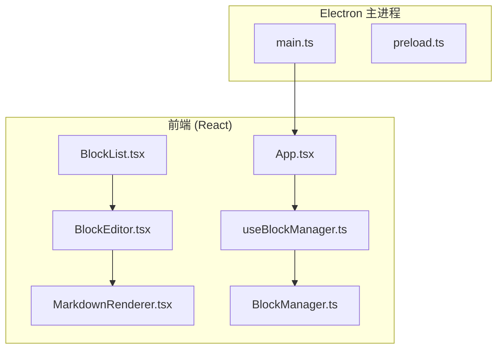
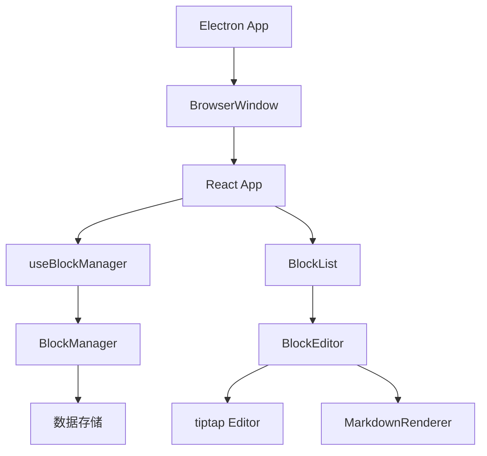
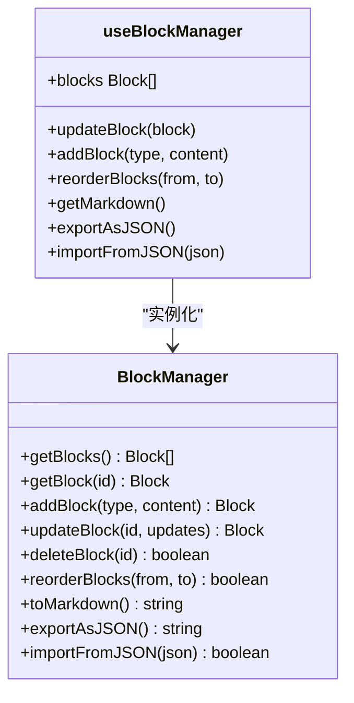
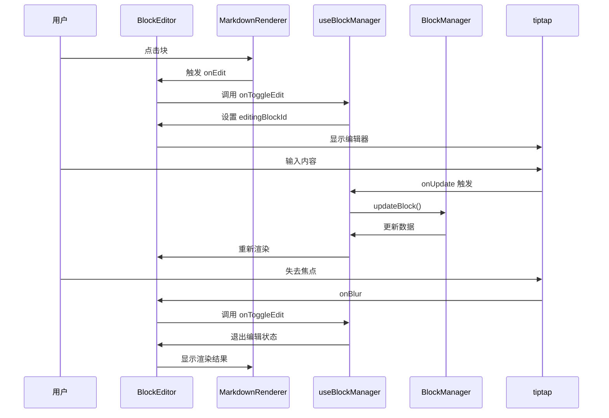
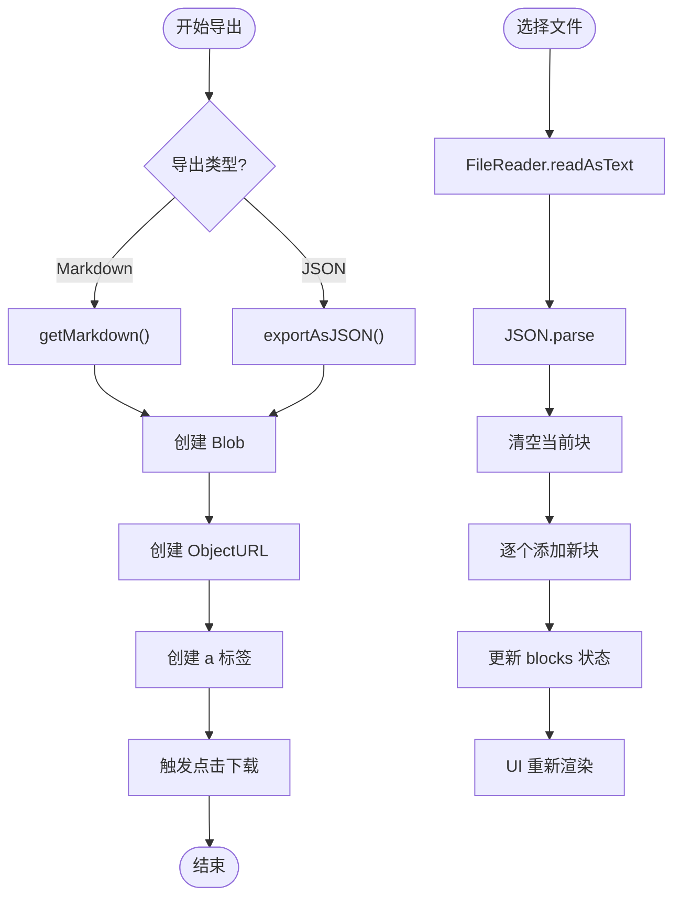

# 端到端测试

<cite>
**本文档中引用的文件**  
- [main.test.js](file://electron/main.test.js)
- [main.ts](file://electron/main.ts)
- [App.tsx](file://src/App.tsx)
- [BlockList.tsx](file://src/components/BlockList.tsx)
- [BlockEditor.tsx](file://src/components/BlockEditor.tsx)
- [MarkdownRenderer.tsx](file://src/components/MarkdownRenderer.tsx)
- [useBlockManager.ts](file://src/hooks/useBlockManager.ts)
- [BlockManager.ts](file://src/utils/BlockManager.ts)
- [package.json](file://package.json)
</cite>

## 目录
1. [引言](#引言)
2. [项目结构](#项目结构)
3. [核心组件](#核心组件)
4. [架构概述](#架构概述)
5. [详细组件分析](#详细组件分析)
6. [依赖分析](#依赖分析)
7. [性能考虑](#性能考虑)
8. [故障排除指南](#故障排除指南)
9. [结论](#结论)

## 引言
本文档旨在为“未知叙事”小说块编辑器设计并实施一套完整的端到端（E2E）测试方案。该应用基于 Electron 构建，结合 React 与 tiptap 编辑器，支持 Markdown 语法、块编辑和双链功能。目标是通过 Playwright 或 Spectron 工具，覆盖关键用户工作流的自动化测试，确保应用在每次提交后保持稳定性和数据一致性。

## 项目结构
本项目采用典型的 Electron + React 架构，前端代码位于 `src/` 目录，Electron 主进程代码位于 `electron/` 目录。整体结构清晰，模块化程度高，便于测试脚本的编写与维护。



**Diagram sources**
- [main.ts](file://electron/main.ts#L6-L68)
- [App.tsx](file://src/App.tsx#L1-L156)

**Section sources**
- [main.ts](file://electron/main.ts#L1-L68)
- [App.tsx](file://src/App.tsx#L1-L156)

## 核心组件
核心功能由 `BlockManager` 类驱动，负责管理所有内容块的增删改查与排序。`useBlockManager` Hook 将其封装为 React 状态管理接口，供 UI 组件调用。UI 层通过 `BlockList`、`BlockEditor` 和 `MarkdownRenderer` 实现块的展示、编辑与交互。

**Section sources**
- [BlockManager.ts](file://src/utils/BlockManager.ts#L1-L227)
- [useBlockManager.ts](file://src/hooks/useBlockManager.ts#L1-L97)
- [BlockList.tsx](file://src/components/BlockList.tsx#L1-L145)

## 架构概述
应用采用分层架构：Electron 主进程负责窗口创建与生命周期管理；渲染进程运行 React 应用，通过预加载脚本安全访问 Electron API；业务逻辑由 `BlockManager` 统一处理，确保数据一致性。



**Diagram sources**
- [main.ts](file://electron/main.ts#L6-L68)
- [App.tsx](file://src/App.tsx#L47-L55)
- [BlockManager.ts](file://src/utils/BlockManager.ts#L3-L227)

## 详细组件分析

### 块管理与状态控制分析
`useBlockManager` 是整个应用的状态中枢，它初始化 `BlockManager` 实例，并暴露 `updateBlock`、`addBlock`、`reorderBlocks`、`exportAsJSON`、`importFromJSON` 等方法，实现对块数据的全面控制。



**Diagram sources**
- [BlockManager.ts](file://src/utils/BlockManager.ts#L3-L227)
- [useBlockManager.ts](file://src/hooks/useBlockManager.ts#L5-L97)

### 用户交互流程分析
用户通过点击块进入编辑模式，失焦后自动保存并返回预览。拖拽手柄可调整块顺序，导出/导入功能支持 Markdown 与 JSON 格式。



**Diagram sources**
- [BlockEditor.tsx](file://src/components/BlockEditor.tsx#L79-L89)
- [MarkdownRenderer.tsx](file://src/components/MarkdownRenderer.tsx#L76-L125)
- [useBlockManager.ts](file://src/hooks/useBlockManager.ts#L18-L21)

### 导出与导入功能分析
导出功能将当前文档转换为 Markdown 或 JSON 字符串，并触发浏览器下载。导入功能通过文件输入控件读取 JSON 文件，调用 `importFromJSON` 恢复文档状态。



**Diagram sources**
- [App.tsx](file://src/App.tsx#L57-L98)
- [useBlockManager.ts](file://src/hooks/useBlockManager.ts#L53-L83)

## 依赖分析
项目依赖清晰，前端使用 React + tiptap 实现富文本编辑，Electron 提供桌面应用能力。测试工具建议选用 Playwright，因其对 Electron 支持良好，API 简洁，且社区活跃。

```mermaid
graph TD
A[unknown-diegesis] --> B[React]
A --> C[tiptap]
A --> D[Electron]
A --> E[Playwright]:::test
A --> F[Vite]
A --> G[Tailwind CSS]
B --> H[React DOM]
C --> I[@tiptap/starter-kit]
C --> J[@tiptap/extension-*]
D --> K[Node.js]
E --> L[Chromium]
class E,L,test
```

**Diagram sources**
- [package.json](file://package.json#L47-L65)
- [vite.config.ts](file://vite.config.ts)

**Section sources**
- [package.json](file://package.json#L1-L69)

## 性能考虑
- `BlockManager` 使用不可变更新策略，避免直接修改状态。
- `useCallback` 优化了事件处理函数，防止不必要的重渲染。
- 拖拽排序通过索引操作实现，时间复杂度为 O(n)，性能良好。
- 导出/导入操作为同步执行，大数据量时可考虑异步化以避免界面卡顿。

## 故障排除指南
- **窗口未启动**：检查 `main.ts` 中 `createWindow` 是否被正确调用，确认 `index.html` 路径正确。
- **编辑器无响应**：确保 `tiptap` 扩展正确加载，`editable` 状态同步。
- **拖拽失效**：检查 `draggable` 属性与 `drag` 事件绑定是否正确。
- **导入失败**：验证 JSON 格式是否符合预期结构，检查 `importFromJSON` 错误处理。
- **导出无反应**：确认 `Blob` 和 `ObjectURL` 创建成功，`a` 标签点击事件被正确触发。

**Section sources**
- [main.ts](file://electron/main.ts#L6-L68)
- [BlockEditor.tsx](file://src/components/BlockEditor.tsx#L29-L77)
- [BlockList.tsx](file://src/components/BlockList.tsx#L26-L57)
- [App.tsx](file://src/App.tsx#L57-L81)

## 结论
本文档详细分析了“未知叙事”应用的架构与核心组件，为实施端到端测试提供了坚实基础。建议使用 Playwright 编写测试脚本，覆盖启动、编辑、保存、拖拽、导出、导入等关键流程，并集成到 CI/CD 流水线中，确保每次代码提交都能自动验证应用稳定性。