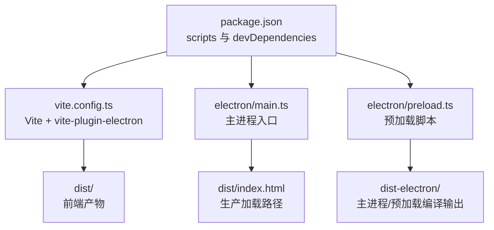
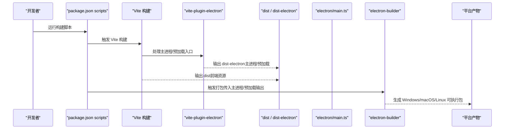
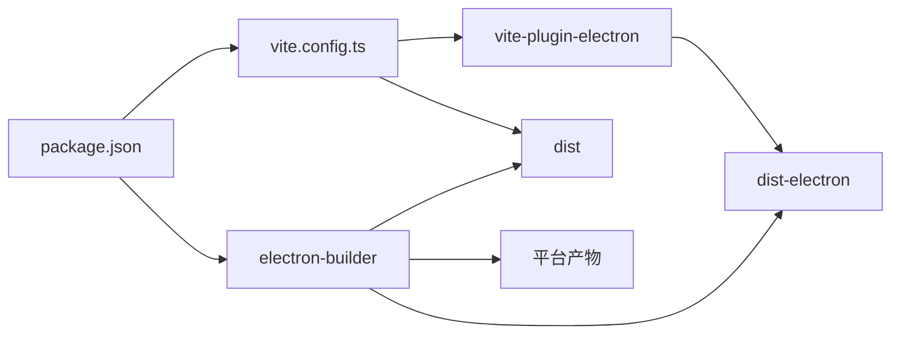

# 部署与打包

<cite>
**本文引用的文件**
- [package.json](file://package.json)
- [vite.config.ts](file://vite.config.ts)
- [electron/main.ts](file://electron/main.ts)
- [electron/preload.ts](file://electron/preload.ts)
- [tsconfig.electron.json](file://tsconfig.electron.json)
- [README.md](file://README.md)
- [yarn.lock](file://yarn.lock)
</cite>

## 目录
1. [简介](#简介)
2. [项目结构](#项目结构)
3. [核心组件](#核心组件)
4. [架构总览](#架构总览)
5. [详细组件分析](#详细组件分析)
6. [依赖关系分析](#依赖关系分析)
7. [性能考量](#性能考量)
8. [故障排查指南](#故障排查指南)
9. [结论](#结论)
10. [附录：打包与发布流程](#附录打包与发布流程)

## 简介
本章节面向希望将应用构建为可分发桌面程序的开发者，系统讲解如何结合 Vite 与 electron-builder 实现跨平台（Windows、macOS、Linux）的打包与发布。内容覆盖：
- 如何通过 package.json 的 scripts 触发 Vite 构建前端资源，并由 electron-builder 打包为各平台可执行文件
- 在 package.json 中定义 build 配置的方式与最佳实践
- 多平台构建的关键注意事项（依赖兼容性、签名与公证）
- 自动更新机制的集成思路（electron-updater）

## 项目结构
仓库采用“前端 React/Vite + Electron 主进程”的典型布局，关键目录与文件如下：
- electron/：包含主进程入口与预加载脚本
- src/：React 前端源码
- vite.config.ts：Vite 与 Vite 插件配置（含 vite-plugin-electron）
- package.json：脚本与依赖声明，包含 electron-builder 与相关插件
- tsconfig.electron.json：主进程/预加载脚本的 TypeScript 编译配置

图表来源
- [package.json](file://package.json#L1-L69)
- [vite.config.ts](file://vite.config.ts#L1-L61)
- [electron/main.ts](file://electron/main.ts#L1-L68)
- [electron/preload.ts](file://electron/preload.ts#L1-L21)

章节来源
- [package.json](file://package.json#L1-L69)
- [vite.config.ts](file://vite.config.ts#L1-L61)
- [electron/main.ts](file://electron/main.ts#L1-L68)
- [electron/preload.ts](file://electron/preload.ts#L1-L21)
- [tsconfig.electron.json](file://tsconfig.electron.json#L1-L21)
- [README.md](file://README.md#L1-L90)

## 核心组件
- Vite 构建管线
  - 使用 vite-plugin-electron 将 Electron 主进程与预加载脚本纳入 Vite 构建，分别输出到 dist-electron
  - 前端资源输出到 dist，供 Electron 生产环境加载
- Electron 主进程
  - 开发模式加载本地 Vite 服务；生产模式加载 dist/index.html
  - 通过 preload 注入安全的 IPC 接口
- 打包与发布
  - 使用 electron-builder 进行跨平台打包，生成 Windows（.exe）、macOS（.dmg/.app）、Linux（.AppImage/.deb/.rpm）等产物

章节来源
- [vite.config.ts](file://vite.config.ts#L1-L61)
- [electron/main.ts](file://electron/main.ts#L1-L68)
- [electron/preload.ts](file://electron/preload.ts#L1-L21)
- [package.json](file://package.json#L1-L69)

## 架构总览
下图展示从开发到打包的端到端流程，以及各模块之间的交互关系。

图表来源
- [package.json](file://package.json#L1-L69)
- [vite.config.ts](file://vite.config.ts#L1-L61)
- [electron/main.ts](file://electron/main.ts#L1-L68)

## 详细组件分析

### Vite 构建与 vite-plugin-electron
- 主进程与预加载脚本
  - 通过 vite-plugin-electron 的 entry 指定主进程入口与预加载入口
  - 各自独立的 vite 配置与 outDir，确保主进程/预加载产物与前端资源分离
  - Rollup external 选项排除 electron，避免将 Electron 运行时打包进主进程
- 前端资源
  - 前端构建输出至 dist，base 设置为相对路径，适配打包后资源访问
  - 别名配置提升开发体验

章节来源
- [vite.config.ts](file://vite.config.ts#L1-L61)

### Electron 主进程与预加载
- 主进程
  - 开发模式加载本地 Vite 服务地址；生产模式加载 dist/index.html
  - 窗口创建与生命周期处理，窗口关闭策略遵循 macOS 行为
  - 安全策略：禁用 Node 集成，启用上下文隔离，通过 preload 暴露受控 IPC API
- 预加载
  - 使用 contextBridge 暴露有限的 API 至渲染进程，避免直接暴露 ipcRenderer

章节来源
- [electron/main.ts](file://electron/main.ts#L1-L68)
- [electron/preload.ts](file://electron/preload.ts#L1-L21)

### TypeScript 编译配置（主进程/预加载）
- tsconfig.electron.json
  - 针对 electron/**/* 的编译目标与输出目录
  - 排除 src、dist、dist-electron、node_modules，避免交叉污染

章节来源
- [tsconfig.electron.json](file://tsconfig.electron.json#L1-L21)

### 打包配置（electron-builder）
- 在 package.json 中定义 build 字段
  - 指定主进程与预加载输出目录（dist-electron），确保打包时包含
  - 配置通用元信息（名称、版本、版权、图标等）
  - 平台特定配置（Windows/macOS/Linux）
- 产物类型
  - Windows：默认生成 .exe 安装包
  - macOS：默认生成 .app 与 .dmg
  - Linux：默认生成 .AppImage，也可配置 .deb/.rpm
- 关键字段建议
  - extraResources：用于复制额外二进制或数据文件
  - extraFiles：用于复制静态文件
  - files：控制打包时包含/排除的文件集合
  - win、mac、linux：平台特定字段（如图标、权限、签名、公证等）

章节来源
- [package.json](file://package.json#L1-L69)

### 多平台构建注意事项
- 依赖兼容性
  - 主进程/预加载需以 CommonJS 方式编译，避免 Node/Electron 环境差异导致的运行时错误
  - 对于原生模块，需确保与目标平台 Electron 版本匹配
- 签名与公证（macOS）
  - 需要有效的 Apple Developer 证书与团队信息
  - 使用 electron-builder 的 macOS 代码签名与公证流程
- 签名（Windows）
  - 需要有效的 Windows 代码签名证书
  - electron-builder 支持自动签名流程
- Linux 打包
  - AppImage 默认可用；若需 .deb/.rpm，需安装对应打包工具
  - 注意 AppImage 的沙箱与权限限制

章节来源
- [package.json](file://package.json#L1-L69)
- [yarn.lock](file://yarn.lock#L1402-L1439)

### 自动更新机制（electron-updater）
- 工作原理
  - 应用启动后，electron-updater 会检查指定更新源（GitHub Releases、自建服务器等）
  - 下载新版本后，按平台策略进行安装（Windows：静默替换；macOS/Linux：重启后生效）
- 集成步骤
  - 在主进程中初始化 updater，并监听下载进度与完成事件
  - 在 package.json 的 build 配置中提供更新源信息
  - 发布新版本时，确保更新源可访问且校验信息正确
- 注意事项
  - macOS 需要签名与公证，否则可能被系统拦截
  - Windows 需要有效签名证书
  - 更新源需支持断点续传与完整性校验

章节来源
- [package.json](file://package.json#L1-L69)

## 依赖关系分析
- 构建链路
  - package.json scripts -> Vite -> vite-plugin-electron -> dist / dist-electron
  - electron-builder -> 读取 dist-electron 与 dist -> 生成平台产物
- 关键依赖
  - electron-builder：跨平台打包核心
  - vite-plugin-electron：将 Electron 主进程/预加载纳入 Vite 构建
  - electron：主进程运行时

图表来源
- [package.json](file://package.json#L1-L69)
- [vite.config.ts](file://vite.config.ts#L1-L61)

章节来源
- [package.json](file://package.json#L1-L69)
- [vite.config.ts](file://vite.config.ts#L1-L61)
- [yarn.lock](file://yarn.lock#L1402-L1439)

## 性能考量
- 构建性能
  - 将主进程/预加载与前端资源分离构建，减少重复编译
  - 使用外部化 Electron 运行时，避免打包体积膨胀
- 打包体积
  - 控制 files/include/exclude，避免将 node_modules 或临时文件打包
  - 对于原生模块，尽量使用预编译二进制，减少构建时间
- 运行时性能
  - 预加载仅暴露必要 API，降低 IPC 成本
  - 生产模式关闭 DevTools，避免调试开销

## 故障排查指南
- 构建失败
  - 检查 vite.config.ts 中主进程/预加载的 entry 与 outDir 是否正确
  - 确认 tsconfig.electron.json 的 include/exclude 未误排除
- 无法加载前端资源
  - 确认 dist/index.html 在生产模式下可被 Electron 正确加载
  - 检查 base 与静态资源路径
- 打包产物缺失
  - 确认 electron-builder 的 files/include/exclude 配置包含 dist 与 dist-electron
  - 检查 extraResources/extraFiles 是否正确复制了必要的二进制或数据文件
- 签名与公证问题（macOS）
  - 确认已配置正确的证书与团队信息
  - 若为 PR 构建，注意 CSC_FOR_PULL_REQUEST 的影响
- Windows 签名失败
  - 确认签名证书有效且与平台匹配
  - 检查构建环境网络可达性（下载签名工具）

章节来源
- [vite.config.ts](file://vite.config.ts#L1-L61)
- [electron/main.ts](file://electron/main.ts#L1-L68)
- [package.json](file://package.json#L1-L69)

## 结论
本项目已具备将 React/Vite 前端与 Electron 主进程整合并使用 electron-builder 进行跨平台打包的基础能力。通过在 package.json 中完善 build 配置、关注多平台签名与公证、以及按需引入 electron-updater，即可实现稳定可靠的分发流程。建议在 CI/CD 中固化构建与签名流程，确保每次发布的一致性与安全性。

## 附录：打包与发布流程
- 本地构建
  - 使用 yarn build 触发 Vite 构建，生成 dist 与 dist-electron
- 本地打包
  - 使用 electron-builder 进行本地打包，验证产物
- 发布准备
  - 准备平台签名证书与公证信息
  - 配置更新源（GitHub Releases 或自建服务器）
- 自动更新
  - 在主进程中初始化 electron-updater，监听更新事件
  - 发布新版本后，用户端自动检测并安装

章节来源
- [README.md](file://README.md#L1-L90)
- [package.json](file://package.json#L1-L69)