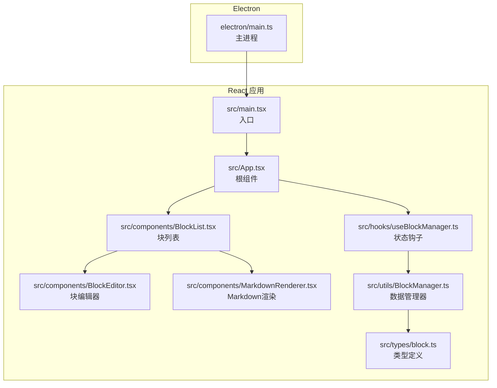
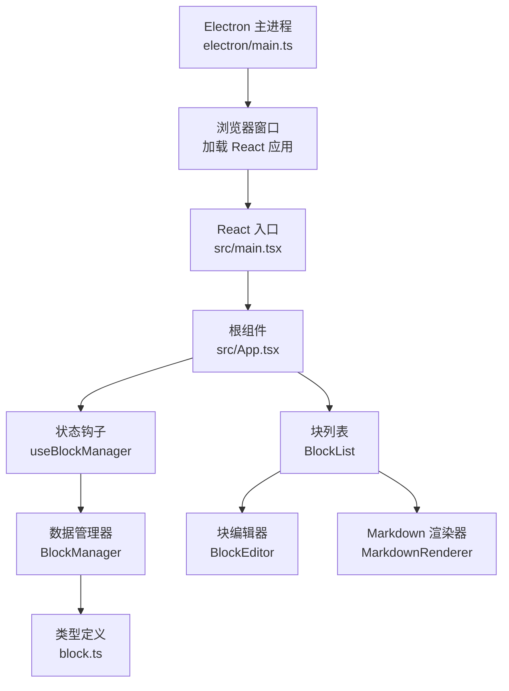
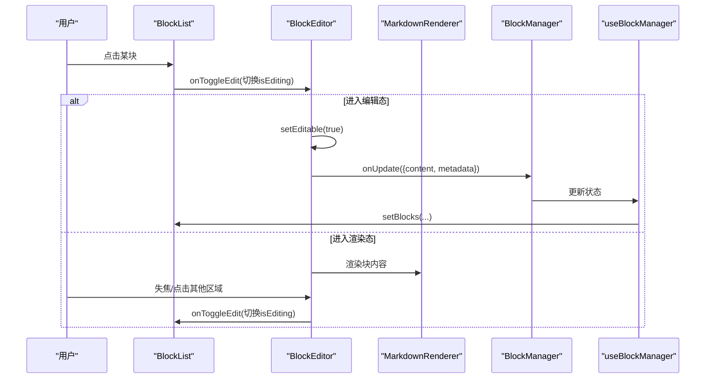
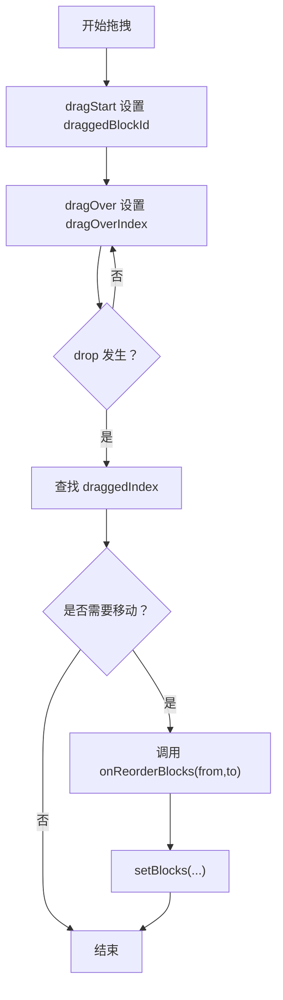
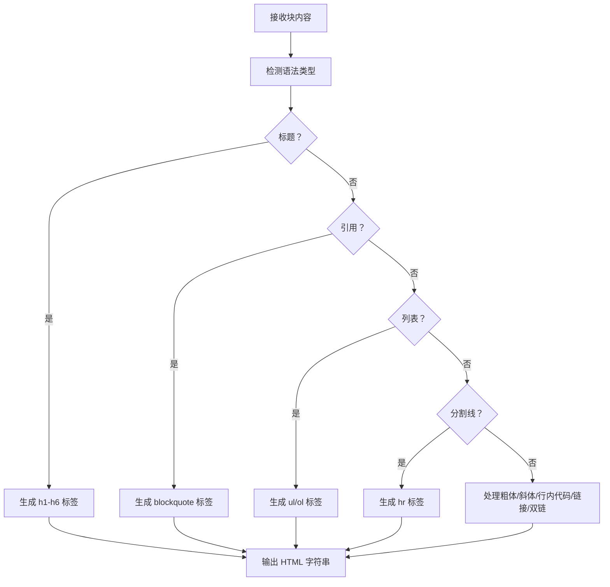
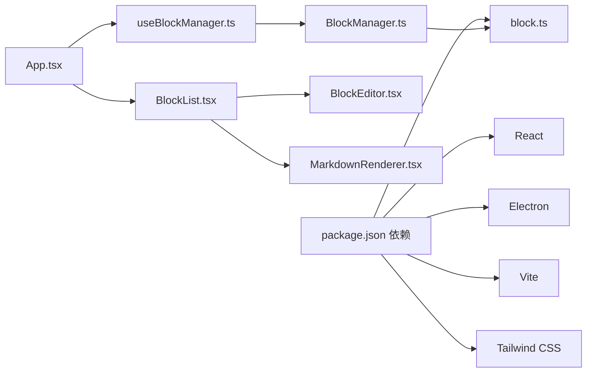

# 项目概述

<cite>
**本文引用的文件**
- [README.md](file://README.md)
- [package.json](file://package.json)
- [electron/main.ts](file://electron/main.ts)
- [src/main.tsx](file://src/main.tsx)
- [src/App.tsx](file://src/App.tsx)
- [src/components/BlockList.tsx](file://src/components/BlockList.tsx)
- [src/components/BlockEditor.tsx](file://src/components/BlockEditor.tsx)
- [src/components/MarkdownRenderer.tsx](file://src/components/MarkdownRenderer.tsx)
- [src/hooks/useBlockManager.ts](file://src/hooks/useBlockManager.ts)
- [src/utils/BlockManager.ts](file://src/utils/BlockManager.ts)
- [src/types/block.ts](file://src/types/block.ts)
- [docs/tiptap集成说明.md](file://docs/tiptap集成说明.md)
- [docs/开发方案.md](file://docs/开发方案.md)
</cite>

## 目录
1. [引言](#引言)
2. [项目结构](#项目结构)
3. [核心组件](#核心组件)
4. [架构总览](#架构总览)
5. [详细组件分析](#详细组件分析)
6. [依赖关系分析](#依赖关系分析)
7. [性能考量](#性能考量)
8. [故障排查指南](#故障排查指南)
9. [结论](#结论)
10. [附录](#附录)

## 引言
“未知叙事 - 小说块编辑器”旨在为小说作者与内容创作者提供一个基于块结构、支持 Markdown 语法与双链功能的桌面端写作工具。项目以 React + TypeScript + Tiptap + Electron 技术栈为核心，围绕“块编辑模式、拖拽排序、编辑/预览切换、内容导入导出（Markdown/JSON）以及双链语法解析”的目标进行实现，并通过 Electron 将 Web 应用打包为桌面应用。

项目愿景与目标：
- 以块为单位组织内容，提升结构化写作效率；
- 提供所见即所得的 Markdown 渲染体验与原生编辑器一致的交互；
- 支持块间双向链接（双链），便于知识管理与故事世界构建；
- 通过 JSON/Markdown 导入导出，保证内容可移植与可协作；
- 以桌面端应用形态，提供稳定、安全、可扩展的本地优先工作流。

目标用户与场景：
- 小说作者：构建章节、场景、人物与地点的块结构，利用双链串联剧情线索；
- 知识管理者：以块为单元整理笔记、概念与关系图谱；
- 内容创作者：在桌面端进行高效写作与结构化编辑，兼顾预览与导出。

## 项目结构
项目采用“Electron 主进程 + React 前端应用”的分层结构，核心目录与职责如下：
- electron/：Electron 主进程与预加载脚本，负责窗口生命周期、安全策略与开发/生产加载流程；
- src/：React 应用代码，包含根组件、块编辑器组件、状态钩子、数据管理器与类型定义；
- docs/：项目文档，包含 tiptap 集成说明与开发方案总结，体现从方案到实现的演进；
- 根目录配置文件：package.json、vite.config.ts、tsconfig.json 等，支撑构建与类型检查。

图表来源
- [electron/main.ts](file://electron/main.ts#L1-L68)
- [src/main.tsx](file://src/main.tsx#L1-L10)
- [src/App.tsx](file://src/App.tsx#L1-L156)
- [src/components/BlockList.tsx](file://src/components/BlockList.tsx#L1-L145)
- [src/components/BlockEditor.tsx](file://src/components/BlockEditor.tsx#L1-L116)
- [src/components/MarkdownRenderer.tsx](file://src/components/MarkdownRenderer.tsx#L1-L125)
- [src/hooks/useBlockManager.ts](file://src/hooks/useBlockManager.ts#L1-L97)
- [src/utils/BlockManager.ts](file://src/utils/BlockManager.ts#L1-L227)
- [src/types/block.ts](file://src/types/block.ts#L1-L30)

章节来源
- [README.md](file://README.md#L56-L75)
- [package.json](file://package.json#L1-L69)

## 核心组件
- 块编辑器（BlockEditor）：基于 Tiptap 的块级编辑器，支持编辑态/渲染态切换、拖拽手柄、Markdown 扩展（标题、列表、引用、任务列表、水平分割线等）。
- 块列表（BlockList）：管理块集合，支持拖拽排序、添加新块、编辑态切换与拖拽指示器。
- Markdown 渲染器（MarkdownRenderer）：将块内容解析为 HTML，支持标题、引用、列表、分割线与基础 Markdown 语法；为双链语法预留渲染占位。
- 块管理器（BlockManager）：封装块的增删改查、重新排序、从 Markdown 导入、导出为 Markdown/JSON、文档对象创建与持久化。
- 状态钩子（useBlockManager）：将 BlockManager 与 React 状态绑定，提供导出/导入、Markdown 获取、块操作等方法。
- 类型定义（block.ts）：定义块类型、块结构与文档结构，包含双链字段（references/referencedBy）与元数据字段。

章节来源
- [src/components/BlockEditor.tsx](file://src/components/BlockEditor.tsx#L1-L116)
- [src/components/BlockList.tsx](file://src/components/BlockList.tsx#L1-L145)
- [src/components/MarkdownRenderer.tsx](file://src/components/MarkdownRenderer.tsx#L1-L125)
- [src/utils/BlockManager.ts](file://src/utils/BlockManager.ts#L1-L227)
- [src/hooks/useBlockManager.ts](file://src/hooks/useBlockManager.ts#L1-L97)
- [src/types/block.ts](file://src/types/block.ts#L1-L30)

## 架构总览
系统采用“桌面应用 + 块编辑器 + Markdown 渲染 + 数据管理”的分层架构：
- Electron 主进程负责窗口创建、加载开发/生产页面、安全策略与关闭行为；
- React 应用通过 Vite 开发服务器或打包产物运行；
- Tiptap 提供块编辑能力与扩展生态；
- BlockManager 负责块数据模型与导入导出；
- MarkdownRenderer 提供基础渲染与双链占位；
- useBlockManager 将数据与 UI 状态解耦，便于测试与复用。

图表来源
- [electron/main.ts](file://electron/main.ts#L1-L68)
- [src/main.tsx](file://src/main.tsx#L1-L10)
- [src/App.tsx](file://src/App.tsx#L1-L156)
- [src/hooks/useBlockManager.ts](file://src/hooks/useBlockManager.ts#L1-L97)
- [src/utils/BlockManager.ts](file://src/utils/BlockManager.ts#L1-L227)
- [src/components/BlockList.tsx](file://src/components/BlockList.tsx#L1-L145)
- [src/components/BlockEditor.tsx](file://src/components/BlockEditor.tsx#L1-L116)
- [src/components/MarkdownRenderer.tsx](file://src/components/MarkdownRenderer.tsx#L1-L125)
- [src/types/block.ts](file://src/types/block.ts#L1-L30)

## 详细组件分析

### 块编辑器（BlockEditor）
- 功能要点
  - 基于 Tiptap 的编辑器实例，启用 Placeholder、Heading、BulletList、OrderedList、Blockquote、HorizontalRule、TaskList/TaskItem、DragHandle 等扩展；
  - 通过 isEditing 控制编辑态/渲染态切换，失焦时自动切换回渲染态；
  - 监听编辑器内容变化，将 HTML 内容写回块的 content 字段并更新修改时间；
  - 渲染态使用 MarkdownRenderer 渲染块内容，点击进入编辑态。
- 关键流程（编辑态切换）

图表来源
- [src/components/BlockList.tsx](file://src/components/BlockList.tsx#L1-L145)
- [src/components/BlockEditor.tsx](file://src/components/BlockEditor.tsx#L1-L116)
- [src/components/MarkdownRenderer.tsx](file://src/components/MarkdownRenderer.tsx#L1-L125)
- [src/hooks/useBlockManager.ts](file://src/hooks/useBlockManager.ts#L1-L97)
- [src/utils/BlockManager.ts](file://src/utils/BlockManager.ts#L1-L227)

章节来源
- [src/components/BlockEditor.tsx](file://src/components/BlockEditor.tsx#L1-L116)
- [src/components/MarkdownRenderer.tsx](file://src/components/MarkdownRenderer.tsx#L1-L125)

### 块列表（BlockList）
- 功能要点
  - 维护编辑态块 ID、拖拽块 ID、拖拽悬停索引；
  - 处理拖拽事件：dragStart/dragOver/drop/dragEnd，调用 onReorderBlocks 实现块顺序调整；
  - 提供添加块按钮，支持段落、标题、引用、无序/有序列表、任务列表、分割线等类型；
  - 为每个块渲染 BlockEditor，并根据 isEditing 控制拖拽可用性与视觉反馈。
- 关键流程（拖拽排序）

图表来源
- [src/components/BlockList.tsx](file://src/components/BlockList.tsx#L1-L145)

章节来源
- [src/components/BlockList.tsx](file://src/components/BlockList.tsx#L1-L145)

### Markdown 渲染器（MarkdownRenderer）
- 功能要点
  - 对标题、引用、列表、分割线进行基础解析与渲染；
  - 对粗体、斜体、行内代码、链接进行基础渲染；
  - 为双链语法预留占位（如包裹为 wiki-link 样式），便于后续扩展；
  - 通过 dangerouslySetInnerHTML 注入样式，确保渲染一致性。
- 关键流程（渲染逻辑）

图表来源
- [src/components/MarkdownRenderer.tsx](file://src/components/MarkdownRenderer.tsx#L1-L125)

章节来源
- [src/components/MarkdownRenderer.tsx](file://src/components/MarkdownRenderer.tsx#L1-L125)

### 块管理器（BlockManager）与状态钩子（useBlockManager）
- BlockManager
  - 提供块的增删改查、重新排序、从 Markdown 导入、导出为 Markdown/JSON、文档对象创建与读取；
  - fromMarkdown 将 Markdown 源码拆分为块，识别标题、引用、列表、分割线等类型；
  - toMarkdown 将块内容拼接为 Markdown 文本。
- useBlockManager
  - 将 BlockManager 与 React 状态绑定，暴露 updateBlock/addBlock/deleteBlock/reorderBlocks/getMarkdown/exportAsJSON/importFromJSON 等方法；
  - 在导入 JSON 时清空当前块并重建，确保数据一致性。

章节来源
- [src/utils/BlockManager.ts](file://src/utils/BlockManager.ts#L1-L227)
- [src/hooks/useBlockManager.ts](file://src/hooks/useBlockManager.ts#L1-L97)

### 类型定义（block.ts）
- BlockType：块类型枚举（heading/paragraph/quote/bulletList/orderedList/taskList/horizontalRule）；
- Block：块结构，包含 id、type、content、references/referencedBy（双链）、metadata（tags/created/modified）；
- Document：文档结构，包含 id、title、blocks、created/modified。

章节来源
- [src/types/block.ts](file://src/types/block.ts#L1-L30)

### 导入导出与示例内容
- App.tsx 提供导出 Markdown/JSON 与导入文件的能力：
  - 导出 Markdown：将 getMarkdown 结果写入 Blob 并触发下载；
  - 导出 JSON：将 blocks 与 document 序列化为 JSON；
  - 导入 JSON：解析 JSON 并重建块列表；
  - 导入 Markdown：当前实现为简单重载以重新初始化（预留后续完善）；
- 示例内容：初始页面包含示例 Markdown，展示块编辑、Markdown 语法与操作说明。

章节来源
- [src/App.tsx](file://src/App.tsx#L1-L156)

## 依赖关系分析
- 技术栈与依赖
  - 前端框架：React 18 + TypeScript；
  - 桌面应用：Electron；
  - 构建工具：Vite；
  - 样式框架：Tailwind CSS；
  - 包管理：Yarn；
  - 编辑器与扩展：@tiptap/react、@tiptap/starter-kit、@tiptap/extension-* 等；
  - 依赖安装与脚本：dev/build/preview/lint/type-check。
- 组件耦合与职责
  - App.tsx 作为根容器，聚合 BlockList 与导出/导入功能；
  - BlockList 与 BlockEditor 通过 props 传递块数据与回调；
  - useBlockManager 作为状态中枢，隔离 BlockManager 与 UI；
  - BlockManager 与类型定义解耦，便于扩展与测试。

图表来源
- [package.json](file://package.json#L1-L69)
- [src/App.tsx](file://src/App.tsx#L1-L156)
- [src/components/BlockList.tsx](file://src/components/BlockList.tsx#L1-L145)
- [src/components/BlockEditor.tsx](file://src/components/BlockEditor.tsx#L1-L116)
- [src/components/MarkdownRenderer.tsx](file://src/components/MarkdownRenderer.tsx#L1-L125)
- [src/hooks/useBlockManager.ts](file://src/hooks/useBlockManager.ts#L1-L97)
- [src/utils/BlockManager.ts](file://src/utils/BlockManager.ts#L1-L227)
- [src/types/block.ts](file://src/types/block.ts#L1-L30)

章节来源
- [package.json](file://package.json#L1-L69)

## 性能考量
- 编辑态切换与渲染
  - 通过 isEditing 控制编辑器可编辑性，减少不必要的渲染；
  - 渲染态使用 MarkdownRenderer，避免复杂 DOM 重排。
- 拖拽排序
  - 仅在 drop 时调用 onReorderBlocks，降低频繁 setState 的开销；
  - 拖拽过程中通过视觉指示器提示，避免无效操作。
- 导入导出
  - 导出使用 Blob 与 URL.createObjectURL，避免阻塞主线程；
  - 导入 JSON 时一次性重建块列表，减少中间状态。
- Markdown 解析
  - MarkdownRenderer 为轻量解析，适合小到中型文档；
  - 若文档较大，建议延迟解析或分段渲染（当前实现未内置节流，可按需扩展）。

[本节为通用性能建议，不直接分析具体文件]

## 故障排查指南
- 开发/构建问题
  - 确认 Node.js 与 Yarn 版本满足要求；
  - 使用 yarn dev 启动开发服务器，yarn build 构建生产包；
  - 使用 yarn lint 与 yarn type-check 排查代码与类型问题。
- Electron 窗口无法打开或白屏
  - 检查 electron/main.ts 中的开发/生产加载路径与 ready-to-show 显示逻辑；
  - 确保预加载脚本路径正确且上下文隔离开启。
- Markdown 导入异常
  - 导入 JSON 成功后会重建块列表，请确认 JSON 结构包含 blocks 字段；
  - 导入 Markdown 当前为重载初始化，若需保留状态，可在后续完善导入逻辑。
- 双链功能未生效
  - MarkdownRenderer 已为双链语法预留占位样式，但解析与跳转逻辑尚未实现，属于后续扩展范畴；
  - 可参考开发方案中的双链预留字段与接口设计，逐步实现解析与导航。

章节来源
- [README.md](file://README.md#L13-L55)
- [electron/main.ts](file://electron/main.ts#L1-L68)
- [src/App.tsx](file://src/App.tsx#L1-L156)
- [src/components/MarkdownRenderer.tsx](file://src/components/MarkdownRenderer.tsx#L1-L125)
- [docs/开发方案.md](file://docs/开发方案.md#L124-L163)

## 结论
“未知叙事 - 小说块编辑器”通过 React + TypeScript + Tiptap + Electron 的组合，实现了块编辑、Markdown 渲染、拖拽排序与导入导出等核心能力，并在类型定义与数据管理器层面为双链功能预留了扩展空间。项目结构清晰、职责明确，具备良好的可扩展性与可维护性。建议后续重点推进：
- 双链解析与导航：实现 [[目标块ID]] 的解析、跳转与引用面板；
- 本地存储：集成 IndexedDB/LocalForage 实现持久化；
- 协同编辑：基于 yjs 与 @tiptap/y-tiptap 实现多人协作；
- 导入导出增强：完善 Markdown 导入、支持更多格式与增量导入。

[本节为总结性内容，不直接分析具体文件]

## 附录
- 开发方案与 tiptap 集成说明
  - 开发方案文档明确了块数据结构、编辑态/渲染态切换、双链预留字段与扩展性设计；
  - tiptap 集成说明记录了从 Slate.js 替换为 tiptap 的实现过程与成果。
- 项目路线图
  - 已完成基础框架搭建；
  - 后续计划包括：Slate.js 集成、Markdown 解析与渲染、本地数据存储、双链功能、UI/UX 优化、性能优化、导出功能等。

章节来源
- [docs/开发方案.md](file://docs/开发方案.md#L1-L123)
- [docs/tiptap集成说明.md](file://docs/tiptap集成说明.md#L1-L92)
- [README.md](file://README.md#L77-L87)