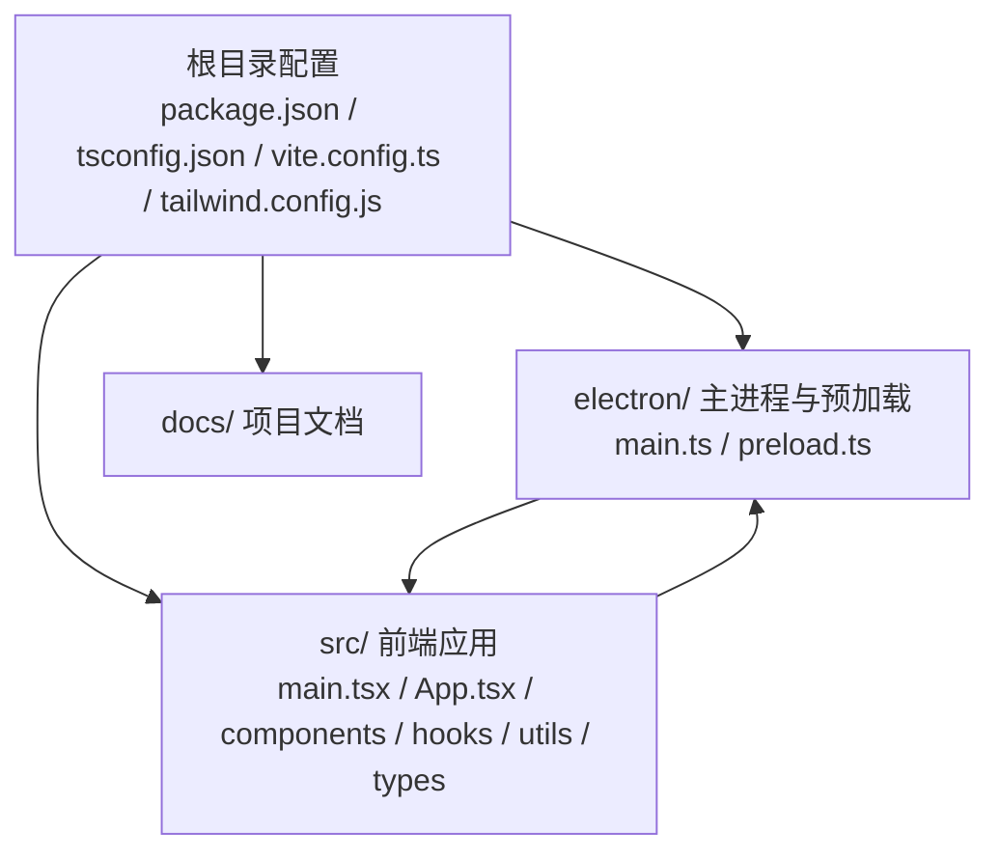
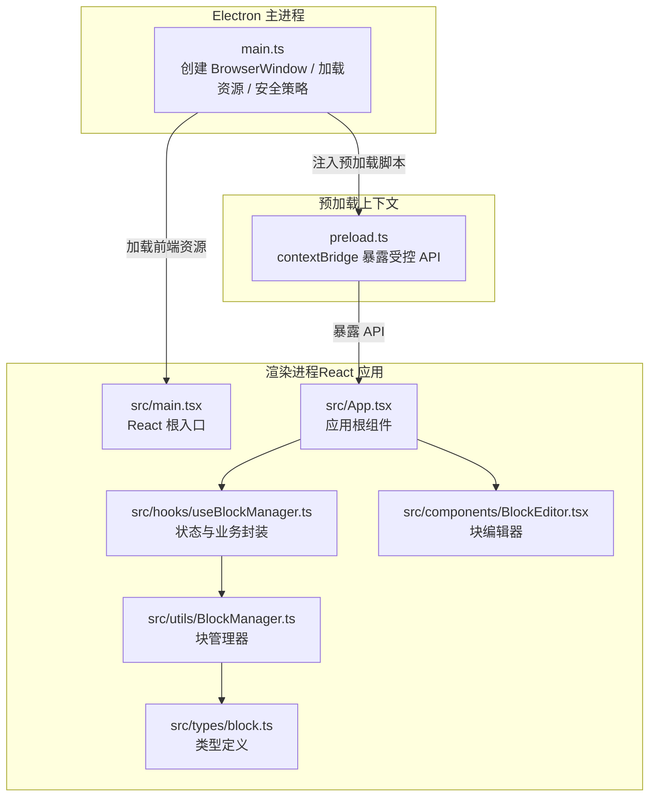
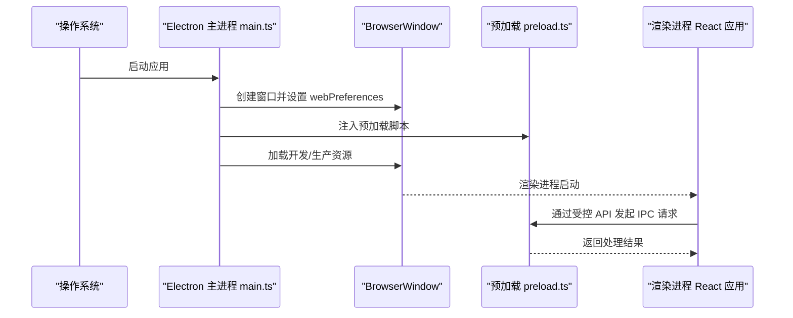
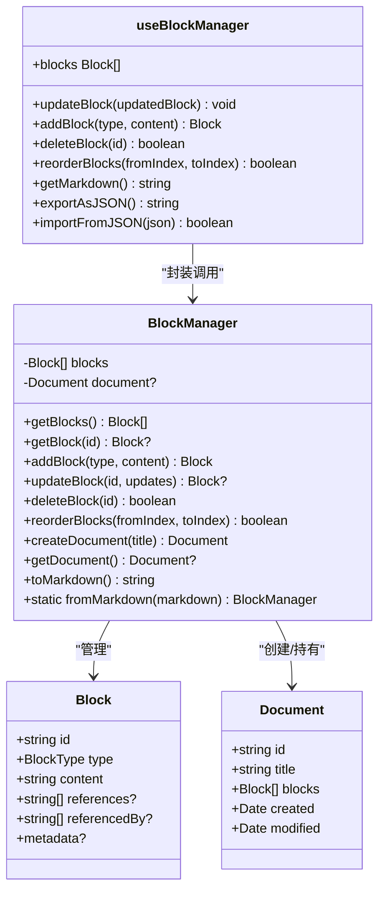
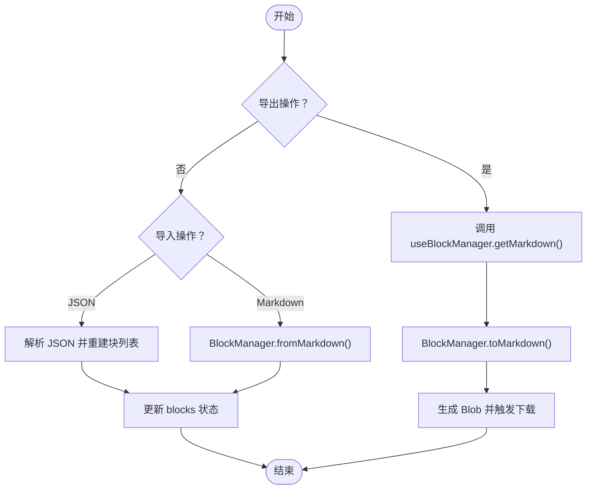
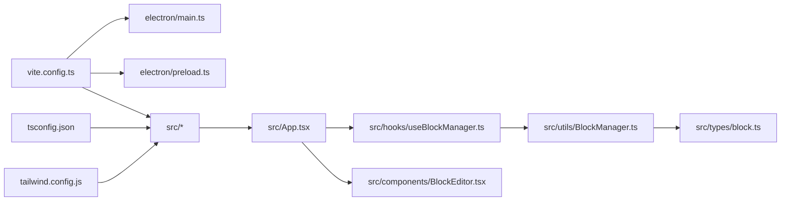

# 项目目录结构

<cite>
**本文引用的文件**
- [README.md](file://README.md)
- [package.json](file://package.json)
- [tsconfig.json](file://tsconfig.json)
- [vite.config.ts](file://vite.config.ts)
- [tailwind.config.js](file://tailwind.config.js)
- [electron/main.ts](file://electron/main.ts)
- [electron/preload.ts](file://electron/preload.ts)
- [src/main.tsx](file://src/main.tsx)
- [src/App.tsx](file://src/App.tsx)
- [src/components/BlockEditor.tsx](file://src/components/BlockEditor.tsx)
- [src/hooks/useBlockManager.ts](file://src/hooks/useBlockManager.ts)
- [src/utils/BlockManager.ts](file://src/utils/BlockManager.ts)
- [src/types/block.ts](file://src/types/block.ts)
</cite>

## 目录
1. [引言](#引言)
2. [项目结构](#项目结构)
3. [核心组件](#核心组件)
4. [架构总览](#架构总览)
5. [详细组件分析](#详细组件分析)
6. [依赖关系分析](#依赖关系分析)
7. [性能考虑](#性能考虑)
8. [故障排查指南](#故障排查指南)
9. [结论](#结论)
10. [附录](#附录)

## 引言
本文件系统性梳理项目的文件组织结构与职责划分，面向开发者提供清晰的“从根到源码”的路径指引，并结合 README 中的项目结构图，帮助快速定位功能代码。同时，对关键配置文件（package.json、tsconfig.json、vite.config.ts、tailwind.config.js）与 Electron 主进程、预加载脚本进行职责说明，最后对 src/ 下的模块化组织（components、hooks、utils、types）进行分层解读。

## 项目结构
项目采用“根配置 + Electron 主进程 + React 前端 + 文档”的清晰分层：
- 根目录配置：package.json（元信息与脚本）、tsconfig.json（TypeScript 编译）、vite.config.ts（构建与 Electron 集成）、tailwind.config.js（样式定制）
- electron/：Electron 主进程入口 main.ts 与预加载脚本 preload.ts
- src/：React 应用代码，包含入口 main.tsx、根组件 App.tsx、UI 组件 components、自定义 Hook hooks、业务逻辑 utils、类型定义 types
- docs/：项目文档（如开发方案、集成说明等）

图表来源
- [README.md](file://README.md#L56-L75)
- [package.json](file://package.json#L1-L69)
- [tsconfig.json](file://tsconfig.json#L1-L37)
- [vite.config.ts](file://vite.config.ts#L1-L61)
- [tailwind.config.js](file://tailwind.config.js#L1-L38)
- [electron/main.ts](file://electron/main.ts#L1-L68)
- [electron/preload.ts](file://electron/preload.ts#L1-L21)
- [src/main.tsx](file://src/main.tsx#L1-L10)
- [src/App.tsx](file://src/App.tsx#L1-L156)

章节来源
- [README.md](file://README.md#L56-L75)

## 核心组件
本节聚焦根目录关键配置文件与 Electron 主进程、预加载脚本的职责边界与协作方式。

- package.json：定义项目元信息、主入口（Electron 打包产物）、开发脚本（dev/build/preview/lint/type-check），并声明依赖与开发依赖（React、TypeScript、Tailwind、Vite、Electron 等）
- tsconfig.json：启用严格模式、Bundler 模式解析、路径别名映射（@/*、@/components/*、@/utils/*、@/types/*、@/hooks/*、@/services/*、@/core/*），并引用 node 编译配置
- vite.config.ts：集成 React 插件与 Vite Electron 插件，分别打包主进程与预加载脚本，输出 dist-electron；同时配置前端构建输出 dist、路径别名与开发服务器端口
- tailwind.config.js：指定内容扫描范围、扩展主题色板与字体族，支撑前端样式体系
- electron/main.ts：Electron 主进程入口，负责创建 BrowserWindow、加载开发/生产资源、窗口生命周期管理、安全策略（禁用 nodeIntegration、限制新窗口打开）
- electron/preload.ts：通过 contextBridge 在渲染上下文暴露受控 API（ipcRenderer 包装），实现安全的渲染进程与主进程通信桥接

章节来源
- [package.json](file://package.json#L1-L69)
- [tsconfig.json](file://tsconfig.json#L1-L37)
- [vite.config.ts](file://vite.config.ts#L1-L61)
- [tailwind.config.js](file://tailwind.config.js#L1-L38)
- [electron/main.ts](file://electron/main.ts#L1-L68)
- [electron/preload.ts](file://electron/preload.ts#L1-L21)

## 架构总览
下图展示了 Electron 应用的启动与通信路径：主进程创建窗口并加载前端资源；预加载脚本在渲染进程建立受控 API；前端通过 Hook/组件与业务逻辑交互，最终由构建工具统一产出。

图表来源
- [electron/main.ts](file://electron/main.ts#L1-L68)
- [electron/preload.ts](file://electron/preload.ts#L1-L21)
- [src/main.tsx](file://src/main.tsx#L1-L10)
- [src/App.tsx](file://src/App.tsx#L1-L156)
- [src/hooks/useBlockManager.ts](file://src/hooks/useBlockManager.ts#L1-L97)
- [src/utils/BlockManager.ts](file://src/utils/BlockManager.ts#L1-L227)
- [src/types/block.ts](file://src/types/block.ts#L1-L30)
- [src/components/BlockEditor.tsx](file://src/components/BlockEditor.tsx#L1-L116)

## 详细组件分析

### 根目录配置文件职责
- package.json：定义主入口（打包产物）、脚本命令（dev/build/preview/lint/type-check），声明依赖与开发依赖，确保构建与运行环境一致
- tsconfig.json：启用严格模式、Bundler 解析、路径别名，提升开发体验与模块解析一致性
- vite.config.ts：集成 React 与 Electron 插件，分别打包主进程与预加载脚本，输出 dist-electron；同时配置前端构建、路径别名与开发服务器
- tailwind.config.js：定义内容扫描范围与主题扩展，保证样式按需构建与一致的主题风格

章节来源
- [package.json](file://package.json#L1-L69)
- [tsconfig.json](file://tsconfig.json#L1-L37)
- [vite.config.ts](file://vite.config.ts#L1-L61)
- [tailwind.config.js](file://tailwind.config.js#L1-L38)

### Electron 主进程与预加载脚本
- main.ts：创建 BrowserWindow、设置 webPreferences（禁用 nodeIntegration、启用 contextIsolation 并绑定预加载脚本）、开发/生产资源加载、窗口生命周期与安全策略（禁止新建窗口，统一外部打开）
- preload.ts：通过 contextBridge.exposeInMainWorld 暴露受控 API，仅暴露必要方法，避免直接暴露整个 ipcRenderer，降低安全风险

图表来源
- [electron/main.ts](file://electron/main.ts#L1-L68)
- [electron/preload.ts](file://electron/preload.ts#L1-L21)

章节来源
- [electron/main.ts](file://electron/main.ts#L1-L68)
- [electron/preload.ts](file://electron/preload.ts#L1-L21)

### src/ 目录模块划分与职责
- src/main.tsx：React 根入口，挂载 App 根组件与全局样式
- src/App.tsx：应用根组件，负责导出/导入、块列表展示与交互
- src/components/BlockEditor.tsx：基于 tiptap 的块编辑器，支持占位符、任务列表、引用、标题、列表、水平线与拖拽句柄，支持编辑态/渲染态切换
- src/hooks/useBlockManager.ts：封装块管理器的增删改查、排序、导出/导入、Markdown 转换等业务逻辑，返回稳定回调函数与状态
- src/utils/BlockManager.ts：核心业务类，负责块的增删改、排序、文档创建、从 Markdown 解析为块集合、转回 Markdown
- src/types/block.ts：定义块类型与文档结构，预留元数据字段与双向链接字段

图表来源
- [src/types/block.ts](file://src/types/block.ts#L1-L30)
- [src/utils/BlockManager.ts](file://src/utils/BlockManager.ts#L1-L227)
- [src/hooks/useBlockManager.ts](file://src/hooks/useBlockManager.ts#L1-L97)

章节来源
- [src/main.tsx](file://src/main.tsx#L1-L10)
- [src/App.tsx](file://src/App.tsx#L1-L156)
- [src/components/BlockEditor.tsx](file://src/components/BlockEditor.tsx#L1-L116)
- [src/hooks/useBlockManager.ts](file://src/hooks/useBlockManager.ts#L1-L97)
- [src/utils/BlockManager.ts](file://src/utils/BlockManager.ts#L1-L227)
- [src/types/block.ts](file://src/types/block.ts#L1-L30)

### 数据流与处理逻辑（以 Markdown 导入/导出为例）
- 导出：App 触发导出，调用 useBlockManager.getMarkdown，BlockManager.toMarkdown 汇总块内容，生成 Markdown 字符串并触发下载
- 导入：App 读取文件，根据文件类型选择 JSON 或 Markdown 流程；JSON 通过 BlockManager 重建块列表；Markdown 通过 BlockManager.fromMarkdown 解析为块集合

图表来源
- [src/App.tsx](file://src/App.tsx#L57-L98)
- [src/hooks/useBlockManager.ts](file://src/hooks/useBlockManager.ts#L48-L93)
- [src/utils/BlockManager.ts](file://src/utils/BlockManager.ts#L101-L223)

## 依赖关系分析
- 构建与运行：Vite 作为构建工具，配合 React 插件与 Electron 插件；TypeScript 通过 tsconfig.json 提供路径别名与严格类型检查；Tailwind CSS 通过 tailwind.config.js 控制样式范围与主题
- Electron 集成：vite.config.ts 配置主进程与预加载脚本的打包输出与外部依赖排除；main.ts 设置 webPreferences 并加载前端资源；preload.ts 通过 contextBridge 暴露受控 API
- 前端模块：App 依赖 hooks/useBlockManager.ts；hooks 封装 BlockManager；BlockEditor 依赖 tiptap 扩展与 MarkdownRenderer；types 定义 Block/Document 结构

图表来源
- [vite.config.ts](file://vite.config.ts#L1-L61)
- [tsconfig.json](file://tsconfig.json#L1-L37)
- [tailwind.config.js](file://tailwind.config.js#L1-L38)
- [electron/main.ts](file://electron/main.ts#L1-L68)
- [electron/preload.ts](file://electron/preload.ts#L1-L21)
- [src/App.tsx](file://src/App.tsx#L1-L156)
- [src/hooks/useBlockManager.ts](file://src/hooks/useBlockManager.ts#L1-L97)
- [src/utils/BlockManager.ts](file://src/utils/BlockManager.ts#L1-L227)
- [src/types/block.ts](file://src/types/block.ts#L1-L30)
- [src/components/BlockEditor.tsx](file://src/components/BlockEditor.tsx#L1-L116)

## 性能考虑
- 构建阶段：启用严格类型检查与路径别名，减少模块解析开销；Vite Electron 插件将主进程与预加载脚本单独打包，避免渲染进程引入不必要的依赖
- 渲染阶段：BlockEditor 使用 tiptap 扩展，建议在编辑态与渲染态之间切换时避免不必要的重渲染；useBlockManager 返回稳定回调，有助于子组件 memo 化
- 样式阶段：Tailwind 通过 content 范围控制按需生成，避免无关样式进入产物

## 故障排查指南
- 开发服务器无法访问：确认 vite.config.ts 的开发服务器端口与严格端口设置；检查 package.json 中 dev 脚本是否正确
- Electron 预加载脚本未生效：确认 main.ts 的 webPreferences.preload 路径与输出目录一致；确保 preload.ts 已被正确打包到 dist-electron
- 渲染进程无法调用主进程 API：检查 preload.ts 是否通过 contextBridge.exposeInMainWorld 暴露了所需方法；在渲染进程中通过 window.electronAPI 调用
- Markdown 导入失败：检查 JSON 结构是否包含 blocks 数组；异常时会返回 false 并记录错误日志

章节来源
- [vite.config.ts](file://vite.config.ts#L1-L61)
- [electron/main.ts](file://electron/main.ts#L1-L68)
- [electron/preload.ts](file://electron/preload.ts#L1-L21)
- [src/hooks/useBlockManager.ts](file://src/hooks/useBlockManager.ts#L62-L83)

## 结论
本项目通过清晰的根配置与 Electron 主进程/预加载脚本分工，实现了安全可控的桌面应用启动与渲染进程通信；src/ 目录采用“组件/自定义 Hook/业务逻辑/类型”分层，配合 TypeScript 路径别名与 Vite/Tailwind 构建体系，形成高内聚、低耦合的前端架构。开发者可依据本文档快速定位功能代码并理解各模块职责。

## 附录
- 项目结构图参考：README.md 中的“项目结构”小节，展示了 electron/、src/、docs/ 与根配置文件的组织关系

章节来源
- [README.md](file://README.md#L56-L75)